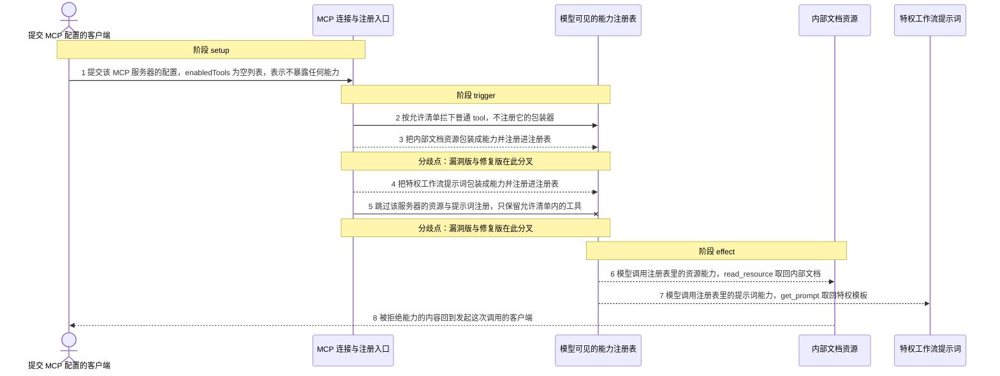
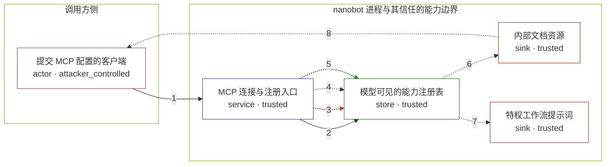

# 3de5f50d167a878f7530f57ed018d508 / CVE-2026-19244

状态：草稿，未完成环境和复现。这个目录由模板生成，不构成漏洞确认。

图解的唯一来源是 `diagram.toml`：编辑后运行 `python3 -m runner diagram 3de5f50d167a878f7530f57ed018d508/CVE-2026-19244` 重新生成下方的图解区块。图解必须覆盖漏洞涉及的每个主体，并标出漏洞版/修复版的分歧步骤。

<!-- diagram:begin (generated from diagram.toml by `python3 -m runner diagram`; edit diagram.toml, not this block) -->
## 漏洞图解 — 3de5f50d167a878f7530f57ed018d508 / CVE-2026-19244 漏洞图解

nanobot 的 MCP 连接入口 connect_mcp_servers 把配置项 enabledTools 当作工具名过滤器实现：该列表只在包装普通 tool 时参与判断，resource 与 prompt 两类能力不做任何检查就被包装注册。因此把 enabledTools 设为空列表（或任意具名子集）本意是拒绝该服务器的全部能力，实际只挡住了普通 tool，MCP resource 与 prompt 包装器仍然进入模型可见的工具集合，模型调用它们时真的执行 read_resource / get_prompt，把本不允许暴露的内部文档与特权提示词取回。修复版把 resource 与 prompt 两段注册整体放到 enabledTools 是否等于 ["*"] 的判断之后，非 allow-all 时两类能力都不再注册。

### 涉及主体

| 主体 | 类型 | 信任级别 | 在漏洞里的作用 | 来源 |
| --- | --- | --- | --- | --- |
| 提交 MCP 配置的客户端 (`client`) | `actor` | `attacker_controlled` | 决定这次连接使用哪个 MCP 服务器、以及 enabledTools 允许清单的内容。它只能控制配置与调用参数，不能决定服务器侧暴露什么资源、也不能直接读服务器内部数据。 | — |
| MCP 连接与注册入口 (`nanobot`) | `service` | `trusted` | 上游 nanobot 的 connect_mcp_servers()：连接 MCP 服务器后按 enabledTools 决定注册哪些能力。缺陷是它只对普通 tool 做允许清单判断，resource 与 prompt 的注册不受该列表约束。 | — |
| 模型可见的能力注册表 (`registry`) | `store` | `trusted` | ToolRegistry，保存本次连接注册的全部能力包装器；这里的条目会原样进入面向模型的工具列表。 | — |
| 内部文档资源 (`resource`) | `sink` | `trusted` | MCP resource canary://internal/secret，属于允许清单本应拦住的内部数据。漏洞版注册的 resource 包装器执行时经 read_resource 取回其内容。 | — |
| 特权工作流提示词 (`prompt`) | `sink` | `trusted` | MCP prompt privileged_workflow，属于允许清单本应拦住的特权模板。漏洞版注册的 prompt 包装器执行时经 get_prompt 取回其内容。 | — |

**信任边界**

- **调用方侧** (`caller_side`)：成员 `client`。客户端只能提供 MCP 服务器配置与调用参数；它能选择允许清单的内容，但取不到服务器侧的 resource 与 prompt 内容。
- **nanobot 进程与其信任的能力边界** (`product`)：成员 `nanobot`、`registry`、`resource`、`prompt`。这道边界由 enabledTools 表达：非 allow-all 时该服务器的能力都不应被注册。漏洞让它只对普通 tool 生效，resource 与 prompt 仍然被注册并真实执行。

### 触发过程

### 主体与信任边界

箭头上的数字是上面的步骤编号；方框只标主体和信任级别，具体动作见「触发过程」。

**分歧点**：第 3 步（`vulnerable_only`）把内部文档资源包装成能力并注册进注册表。
**分歧点**：第 5 步（`patched_only`）跳过该服务器的资源与提示词注册，只保留允许清单内的工具。
<!-- diagram:end -->

## 公告与机制

TODO：官方公告、漏洞根因、Agent 信任边界、受影响范围和修复来源。

## 前提

TODO：认证要求、用户交互、已有批准、工具权限、攻击者能控制的内容。

## 版本与启动

TODO：补全 metadata、Dockerfile/镜像 digest 和 Compose，再写出精确启动命令。

Compose 中 `vulnerable` 与 `patched` profiles 分开使用；未指定 profile 不启动服务。镜像变量未配置时 Compose 会明确报错。此模板不暴露宿主端口，也不挂载主机数据。

## 机制复现

TODO：实现 `reproduce.py`，固定输入并执行真实漏洞路径，注明运行位置、参数和超时。

完成实现后使用 `python3 -m runner reproduce 3de5f50d167a878f7530f57ed018d508/CVE-2026-19244 --build --rounds 3`。
两脚本统一接受 `--context <context.json> --output <目录>`，详细字段见仓库 `docs/environment-contract.md`。
PoC 输出 `facts.json` 和效果文件；验证器只读证据，输出含 `target_ready` 及对应效果断言的 `verdict.json`。
镜像必须包含 Python 3 和 `/lab/` 下的脚本、fixtures；`runtime.mode` 选择 `oneshot` 或有 healthcheck 的 `service`。

## 端到端复现

TODO：实现 `end_to_end.py`；若不需要模型，明确写出不适用原因。真实模型的结果与机制复现分开统计。

## 验证与修复对照

TODO：实现 `verify.py`。记录漏洞版无害效果、修复版阻断和正常任务成功的证据，不能把服务启动失败当成阻断。

## 清理

默认运行器按每个测试的唯一 Compose project 清理容器、网络和 volume。
`--keep-on-failure` 保留失败项目，项目标识和 Compose 配置在结果目录中；仅清理该项目，不能使用全局 prune。

## 失败诊断

TODO：为本漏洞写出预期效果缺失、修复版仍有越界效果、正常任务失败及前提不满足时的具体排查路径。
启动失败、健康检查失败和超时都不能当作修复阻断。报告中应能定位到阶段、预期、实际和受控证据。

## 构建与输入

TODO：填写两版源码 archive、完整 commit，记录 `build.inputs` 中每个下载的 SHA-256；依赖安装必须支持禁网构建。
固定攻击和正常输入放入 `fixtures/` 并登记到 `fixtures/manifest.toml`。固定 seed、环境变量，说明无害效果与真实影响的关系。

## 隔离例外

默认无例外。确需例外时同时填写 `runtime.exceptions`、理由及最小范围，晋升由两位维护者审阅。

## 来源与许可

TODO：列出引用代码、fixtures 和镜像的来源及许可。
