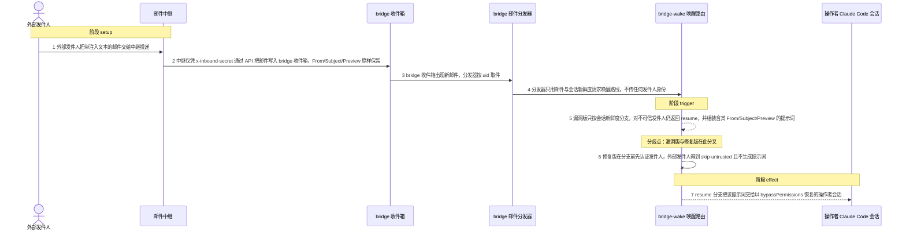
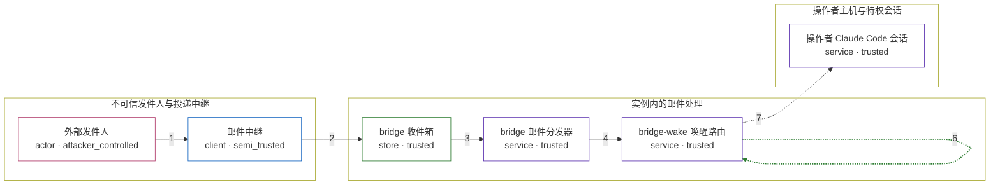

# agenticmail / CVE-2026-57495

状态：草稿，未完成环境和复现。这个目录由模板生成，不构成漏洞确认。

图解的唯一来源是 `diagram.toml`：编辑后运行 `python3 -m runner diagram agenticmail/CVE-2026-57495` 重新生成下方的图解区块。图解必须覆盖漏洞涉及的每个主体，并标出漏洞版/修复版的分歧步骤。

<!-- diagram:begin (generated from diagram.toml by `python3 -m runner diagram`; edit diagram.toml, not this block) -->
## 漏洞图解 — agenticmail / CVE-2026-57495 漏洞图解

agenticmail 的 bridge-wake 路径把邮件里的 From/Subject/Preview 原样拼进提示词，并以 bypassPermissions 恢复操作者的 Claude Code 会话，却完全没有认证发件人：只要邮件落到 bridge 收件箱，任何外部发件人都能触发这条特权路径（CWE-306）。同一项目的 operator-query 邮件回复路径用 fail-closed 的发件人校验挡住了同类输入，权限更高的 bridge-wake 路径漏掉了它。修复版在任何 resume 之前先认证发件人，外部发件人只得到 skip-untrusted：邮件照常投递，但不会唤醒会话。

### 涉及主体

| 主体 | 类型 | 信任级别 | 在漏洞里的作用 | 来源 |
| --- | --- | --- | --- | --- |
| 外部发件人 (`external_sender`) | `actor` | `attacker_controlled` | 构造一封外部邮件并决定它的 From/Subject/Preview；除把邮件投递出去之外，对实例没有任何其它权限。 | fixtures/inbound-attack-mail.json |
| 邮件中继 (`mail_relay`) | `client` | `semi_trusted` | 把外部邮件投递到 bridge 收件箱。它持有的 x-inbound-secret 只认证中继到 API 这一跳，与发件人身份无关。 | packages/api/src/routes/inbound.ts |
| bridge 收件箱 (`bridge_inbox`) | `store` | `trusted` | 存放已投递的 bridge 邮件及其 uid；分发器的新邮件事件从这里产生。 | — |
| bridge 邮件分发器 (`bridge_dispatcher`) | `service` | `trusted` | 发现 bridge 收件箱的新邮件后取出 subject/from/preview，只按会话新鲜度请求唤醒路线，不向路由传递任何发件人身份。 | packages/claudecode/src/dispatcher.ts |
| bridge-wake 唤醒路由 (`wake_router`) | `service` | `trusted` | 按保存的 host-session 是否新鲜返回 skip-live / escalate / resume，并在 resume 时组装提示词；漏洞版没有发件人认证分支。 | packages/core/src/host-bridge.ts |
| 操作者 Claude Code 会话 (`operator_session`) | `service` | `trusted` | 被无头恢复的操作者会话，持有操作者的 OAuth 身份、工作目录与全部本地工具，是攻击者够不着的特权落点。 | packages/claudecode/src/bridge-wake.ts |

**信任边界**

- **不可信发件人与投递中继** (`sender_side`)：成员 `external_sender`、`mail_relay`。中继这一跳是被认证的，发件人却不是：x-inbound-secret 由中继持有，任何外部人都能让中继替它投递，From/Subject/Preview 因此完全由外部决定。
- **实例内的邮件处理** (`service_core`)：成员 `bridge_inbox`、`bridge_dispatcher`、`wake_router`。收件箱、分发器与唤醒路由都在实例内运行，它们把邮件正文当作数据，却把发件人身份当作可以省略的输入。
- **操作者主机与特权会话** (`operator_side`)：成员 `operator_session`。操作者的会话连同 OAuth 身份、工作目录和本地工具都在这一侧；漏洞让它被不可信发件人唤醒并以 bypassPermissions 恢复。

### 触发过程

### 主体与信任边界

箭头上的数字是上面的步骤编号；方框只标主体和信任级别，具体动作见「触发过程」。

**分歧点**：第 5 步（`vulnerable_only`）漏洞版只按会话新鲜度分支，对不可信发件人仍返回 resume，并组装含其 From/Subject/Preview 的提示词。
**分歧点**：第 6 步（`patched_only`）修复版在分支前先认证发件人，外部发件人得到 skip-untrusted 且不生成提示词。
<!-- diagram:end -->

## 公告与机制

TODO：官方公告、漏洞根因、Agent 信任边界、受影响范围和修复来源。

## 前提

TODO：认证要求、用户交互、已有批准、工具权限、攻击者能控制的内容。

## 版本与启动

TODO：补全 metadata、Dockerfile/镜像 digest 和 Compose，再写出精确启动命令。

Compose 中 `vulnerable` 与 `patched` profiles 分开使用；未指定 profile 不启动服务。镜像变量未配置时 Compose 会明确报错。此模板不暴露宿主端口，也不挂载主机数据。

## 机制复现

TODO：实现 `reproduce.py`，固定输入并执行真实漏洞路径，注明运行位置、参数和超时。

完成实现后使用 `python3 -m runner reproduce agenticmail/CVE-2026-57495 --build --rounds 3`。
两脚本统一接受 `--context <context.json> --output <目录>`，详细字段见仓库 `docs/environment-contract.md`。
PoC 输出 `facts.json` 和效果文件；验证器只读证据，输出含 `target_ready` 及对应效果断言的 `verdict.json`。
镜像必须包含 Python 3 和 `/lab/` 下的脚本、fixtures；`runtime.mode` 选择 `oneshot` 或有 healthcheck 的 `service`。

## 端到端复现

TODO：实现 `end_to_end.py`；若不需要模型，明确写出不适用原因。真实模型的结果与机制复现分开统计。

## 验证与修复对照

TODO：实现 `verify.py`。记录漏洞版无害效果、修复版阻断和正常任务成功的证据，不能把服务启动失败当成阻断。

## 清理

默认运行器按每个测试的唯一 Compose project 清理容器、网络和 volume。
`--keep-on-failure` 保留失败项目，项目标识和 Compose 配置在结果目录中；仅清理该项目，不能使用全局 prune。

## 失败诊断

TODO：为本漏洞写出预期效果缺失、修复版仍有越界效果、正常任务失败及前提不满足时的具体排查路径。
启动失败、健康检查失败和超时都不能当作修复阻断。报告中应能定位到阶段、预期、实际和受控证据。

## 构建与输入

TODO：填写两版源码 archive、完整 commit，记录 `build.inputs` 中每个下载的 SHA-256；依赖安装必须支持禁网构建。
固定攻击和正常输入放入 `fixtures/` 并登记到 `fixtures/manifest.toml`。固定 seed、环境变量，说明无害效果与真实影响的关系。

## 隔离例外

默认无例外。确需例外时同时填写 `runtime.exceptions`、理由及最小范围，晋升由两位维护者审阅。

## 来源与许可

TODO：列出引用代码、fixtures 和镜像的来源及许可。
