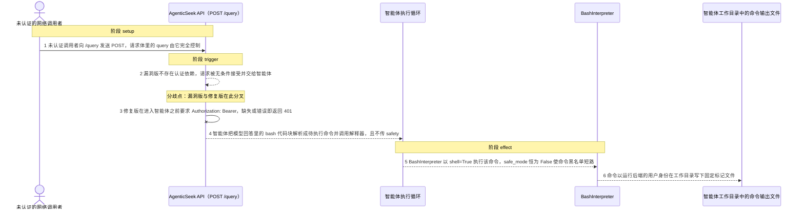
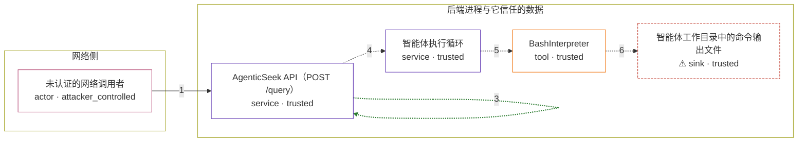

# agenticseek / CVE-2026-72776

状态：草稿，未完成环境和复现。这个目录由模板生成，不构成漏洞确认。

图解的唯一来源是 `diagram.toml`：编辑后运行 `python3 -m runner diagram agenticseek/CVE-2026-72776` 重新生成下方的图解区块。图解必须覆盖漏洞涉及的每个主体，并标出漏洞版/修复版的分歧步骤。

<!-- diagram:begin (generated from diagram.toml by `python3 -m runner diagram`; edit diagram.toml, not this block) -->
## 漏洞图解 — agenticseek / CVE-2026-72776 漏洞图解

AgenticSeek 的 POST /query 路由在 fc242c7 上没有任何认证依赖，后端又默认绑定 0.0.0.0 且 CORS 为 *，任何能访问该端口的调用者都可以直接驱动智能体。智能体把模型回答里的 bash 代码块交给 BashInterpreter，而该解释器以 shell=True 执行命令，且 safe_mode 在整条 API 路径上恒为 False，命令黑名单从不生效。修复版为 /query 加上 require_api_token 依赖：设置 AGENTICSEEK_API_TOKEN 后，缺少或错误的 Authorization 头在进入智能体之前就返回 401。

### 涉及主体

| 主体 | 类型 | 信任级别 | 在漏洞里的作用 | 来源 |
| --- | --- | --- | --- | --- |
| 未认证的网络调用者 (`attacker`) | `actor` | `attacker_controlled` | 能访问后端端口的任何人。它控制请求体里的 query 文本，但不能提供任何凭据，也无法直接调用主机 shell；它想要的是让智能体代它执行命令。 | — |
| AgenticSeek API（POST /query） (`service`) | `service` | `trusted` | FastAPI 应用对象。漏洞版的路由装饰器没有认证依赖，请求直接进入智能体；修复版在该路由上挂 require_api_token，未设置令牌时仍放行，设置后要求 Authorization: Bearer 匹配。 | api.py |
| 智能体执行循环 (`agent`) | `service` | `trusted` | Interaction.think 选中持有 bash 工具的 CoderAgent，agent.execute_modules 用 tool.load_exec_block 从模型回答里取出 ```bash 代码块，再调用 tool.execute([block])，全程不传 safety 参数。 | sources/agents/agent.py |
| BashInterpreter (`interpreter`) | `tool` | `trusted` | 被调用的工具本体。execute 的 safety 默认 False，因此不会出现交互确认；命令被拼成 cd work_dir && command 后交给 subprocess.Popen(shell=True)。拦截条件 self.safe_mode and is_any_unsafe(...) 因为 safe_mode 恒为 False 而短路。 | sources/tools/BashInterpreter.py |
| ⚠ 智能体工作目录中的命令输出文件 (`workspace`) | `sink` | `trusted` | 命令以运行后端的用户身份在工作目录里写下的文件。它承载漏洞的最终效果：一个本不该由未认证调用者写入的名字与内容固定、可离线核对的无害标记。 | fixtures/config.ini |

**信任边界**

- **网络侧** (`network`)：成员 `attacker`。调用者在这里只能发出 HTTP 请求，无法提供任何凭据，也无法直接访问主机 shell。
- **后端进程与它信任的数据** (`host`)：成员 `service`、`agent`、`interpreter`、`workspace`。这道边界本来应该只让已认证的调用者驱动智能体。漏洞版没有任何认证检查，于是网络输入一路穿过路由、智能体循环和解释器，直到 subprocess.Popen(shell=True)。

标 ⚠ 的主体是本仓库合成的替身或无害效果载体，不代表真实外部目标。

### 触发过程



### 主体与信任边界

箭头上的数字是上面的步骤编号；方框只标主体和信任级别，具体动作见「触发过程」。



**分歧点**：第 2 步（`vulnerable_only`）漏洞版不存在认证依赖，请求被无条件接受并交给智能体。
**分歧点**：第 3 步（`patched_only`）修复版在进入智能体之前要求 Authorization: Bearer，缺失或错误即返回 401。
<!-- diagram:end -->

## 公告与机制

TODO：官方公告、漏洞根因、Agent 信任边界、受影响范围和修复来源。

## 前提

TODO：认证要求、用户交互、已有批准、工具权限、攻击者能控制的内容。

## 版本与启动

TODO：补全 metadata、Dockerfile/镜像 digest 和 Compose，再写出精确启动命令。

Compose 中 `vulnerable` 与 `patched` profiles 分开使用；未指定 profile 不启动服务。镜像变量未配置时 Compose 会明确报错。此模板不暴露宿主端口，也不挂载主机数据。

## 机制复现

TODO：实现 `reproduce.py`，固定输入并执行真实漏洞路径，注明运行位置、参数和超时。

完成实现后使用 `python3 -m runner reproduce agenticseek/CVE-2026-72776 --build --rounds 3`。
两脚本统一接受 `--context <context.json> --output <目录>`，详细字段见仓库 `docs/environment-contract.md`。
PoC 输出 `facts.json` 和效果文件；验证器只读证据，输出含 `target_ready` 及对应效果断言的 `verdict.json`。
镜像必须包含 Python 3 和 `/lab/` 下的脚本、fixtures；`runtime.mode` 选择 `oneshot` 或有 healthcheck 的 `service`。

## 端到端复现

TODO：实现 `end_to_end.py`；若不需要模型，明确写出不适用原因。真实模型的结果与机制复现分开统计。

## 验证与修复对照

TODO：实现 `verify.py`。记录漏洞版无害效果、修复版阻断和正常任务成功的证据，不能把服务启动失败当成阻断。

## 清理

默认运行器按每个测试的唯一 Compose project 清理容器、网络和 volume。
`--keep-on-failure` 保留失败项目，项目标识和 Compose 配置在结果目录中；仅清理该项目，不能使用全局 prune。

## 失败诊断

TODO：为本漏洞写出预期效果缺失、修复版仍有越界效果、正常任务失败及前提不满足时的具体排查路径。
启动失败、健康检查失败和超时都不能当作修复阻断。报告中应能定位到阶段、预期、实际和受控证据。

## 构建与输入

TODO：填写两版源码 archive、完整 commit，记录 `build.inputs` 中每个下载的 SHA-256；依赖安装必须支持禁网构建。
固定攻击和正常输入放入 `fixtures/` 并登记到 `fixtures/manifest.toml`。固定 seed、环境变量，说明无害效果与真实影响的关系。

## 隔离例外

默认无例外。确需例外时同时填写 `runtime.exceptions`、理由及最小范围，晋升由两位维护者审阅。

## 来源与许可

TODO：列出引用代码、fixtures 和镜像的来源及许可。
