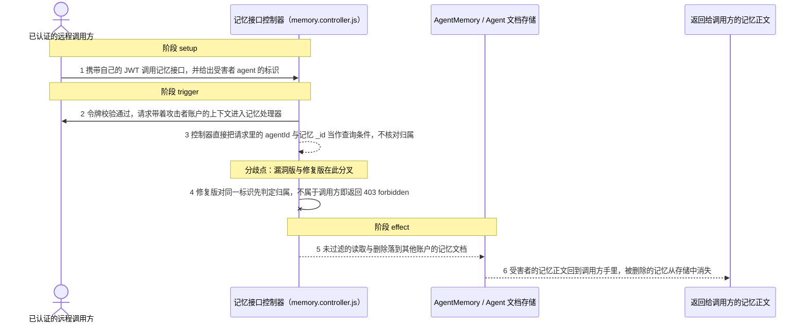
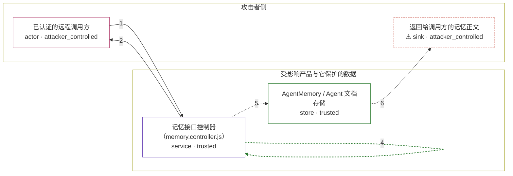

# ai-agent-automation / CVE-2026-54519

状态：草稿，未完成环境和复现。这个目录由模板生成，不构成漏洞确认。

图解的唯一来源是 `diagram.toml`：编辑后运行 `python3 -m runner diagram ai-agent-automation/CVE-2026-54519` 重新生成下方的图解区块。图解必须覆盖漏洞涉及的每个主体，并标出漏洞版/修复版的分歧步骤。

<!-- diagram:begin (generated from diagram.toml by `python3 -m runner diagram`; edit diagram.toml, not this block) -->
## 漏洞图解 — ai-agent-automation / CVE-2026-54519 记忆 API 越权读写

ai-agent-automation 0.9.1 之前的记忆接口只校验 JWT 证明调用方已登录，从不核对被访问记录是否属于该账户：控制器把调用方给出的 agent 标识直接当作查询条件，而不经 Agent.userId 反查归属。任何持有合法账户的远程调用方因此可以枚举任意账户的 agent、读出其记忆正文，并按标识删除单条记忆或清空整个 agent 的记忆。修复版在同一入口对每个标识先做归属判定，不属于调用方的请求以 403 forbidden 拒绝。

### 涉及主体

| 主体 | 类型 | 信任级别 | 在漏洞里的作用 | 来源 |
| --- | --- | --- | --- | --- |
| 已认证的远程调用方 (`attacker`) | `actor` | `attacker_controlled` | 持有一个自己注册的合法账户与 JWT，构造指向其他账户 agent 的记忆接口请求；除请求内容以外不掌握任何服务端权限。 | — |
| 记忆接口控制器（memory.controller.js） (`memory_api`) | `service` | `trusted` | 上游 Express 后端的 /api/memory 处理器。auth 中间件只证明调用方是谁，控制器却把请求里的 agentId 与记忆 _id 直接当查询条件，从不通过 Agent.userId 核对归属，这是缺失授权的根因。 | — |
| AgentMemory / Agent 文档存储 (`memory_store`) | `store` | `trusted` | 保存各账户 agent 与其记忆正文、向量和元数据的集合。记忆文档没有所有者字段，归属只能经 agentId 关联到 Agent.userId 推导，因此控制器一旦不反查就无从限制范围。 | — |
| ⚠ 返回给调用方的记忆正文 (`response_body`) | `sink` | `attacker_controlled` | 漏洞触发的落点：被读出的记忆正文与向量进入调用方收到的响应体，被删除的文档从存储中消失。这里的标记是合成文本，不代表任何真实用户数据。 | — |

**信任边界**

- **攻击者侧** (`attacker_side`)：成员 `attacker`、`response_body`。调用方只能控制自己的账户、请求路径与令牌，以及最终收到响应的位置；受害者账户、其 agent 与记忆正文都在这一侧之外。
- **受影响产品与它保护的数据** (`product`)：成员 `memory_api`、`memory_store`。这道边界本应让调用方只触达自己账户的数据：凭据证明身份，授权检查证明归属。控制器省略了归属判定，边界因此对任何已登录调用方失效。

标 ⚠ 的主体是本仓库合成的替身或无害效果载体，不代表真实外部目标。

### 触发过程

### 主体与信任边界

箭头上的数字是上面的步骤编号；方框只标主体和信任级别，具体动作见「触发过程」。

**分歧点**：第 3 步（`vulnerable_only`）控制器直接把请求里的 agentId 与记忆 _id 当作查询条件，不核对归属。
**分歧点**：第 4 步（`patched_only`）修复版对同一标识先判定归属，不属于调用方即返回 403 forbidden。
<!-- diagram:end -->

## 公告与机制

TODO：官方公告、漏洞根因、Agent 信任边界、受影响范围和修复来源。

## 前提

TODO：认证要求、用户交互、已有批准、工具权限、攻击者能控制的内容。

## 版本与启动

TODO：补全 metadata、Dockerfile/镜像 digest 和 Compose，再写出精确启动命令。

Compose 中 `vulnerable` 与 `patched` profiles 分开使用；未指定 profile 不启动服务。镜像变量未配置时 Compose 会明确报错。此模板不暴露宿主端口，也不挂载主机数据。

## 机制复现

TODO：实现 `reproduce.py`，固定输入并执行真实漏洞路径，注明运行位置、参数和超时。

完成实现后使用 `python3 -m runner reproduce ai-agent-automation/CVE-2026-54519 --build --rounds 3`。
两脚本统一接受 `--context <context.json> --output <目录>`，详细字段见仓库 `docs/environment-contract.md`。
PoC 输出 `facts.json` 和效果文件；验证器只读证据，输出含 `target_ready` 及对应效果断言的 `verdict.json`。
镜像必须包含 Python 3 和 `/lab/` 下的脚本、fixtures；`runtime.mode` 选择 `oneshot` 或有 healthcheck 的 `service`。

## 端到端复现

TODO：实现 `end_to_end.py`；若不需要模型，明确写出不适用原因。真实模型的结果与机制复现分开统计。

## 验证与修复对照

TODO：实现 `verify.py`。记录漏洞版无害效果、修复版阻断和正常任务成功的证据，不能把服务启动失败当成阻断。

## 清理

默认运行器按每个测试的唯一 Compose project 清理容器、网络和 volume。
`--keep-on-failure` 保留失败项目，项目标识和 Compose 配置在结果目录中；仅清理该项目，不能使用全局 prune。

## 失败诊断

TODO：为本漏洞写出预期效果缺失、修复版仍有越界效果、正常任务失败及前提不满足时的具体排查路径。
启动失败、健康检查失败和超时都不能当作修复阻断。报告中应能定位到阶段、预期、实际和受控证据。

## 构建与输入

TODO：填写两版源码 archive、完整 commit，记录 `build.inputs` 中每个下载的 SHA-256；依赖安装必须支持禁网构建。
固定攻击和正常输入放入 `fixtures/` 并登记到 `fixtures/manifest.toml`。固定 seed、环境变量，说明无害效果与真实影响的关系。

## 隔离例外

默认无例外。确需例外时同时填写 `runtime.exceptions`、理由及最小范围，晋升由两位维护者审阅。

## 来源与许可

TODO：列出引用代码、fixtures 和镜像的来源及许可。
