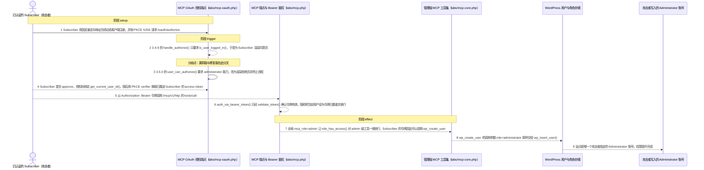
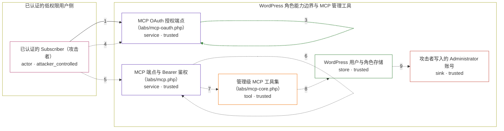

# ai-engine-the-chatbot / CVE-2026-8719

状态：草稿，未完成环境和复现。这个目录由模板生成，不构成漏洞确认。

图解的唯一来源是 `diagram.toml`：编辑后运行 `python3 -m runner diagram ai-engine-the-chatbot/CVE-2026-8719` 重新生成下方的图解区块。图解必须覆盖漏洞涉及的每个主体，并标出漏洞版/修复版的分歧步骤。

<!-- diagram:begin (generated from diagram.toml by `python3 -m runner diagram`; edit diagram.toml, not this block) -->
## 漏洞图解 — ai-engine-the-chatbot / CVE-2026-8719 漏洞图解

AI Engine 3.4.9 的 MCP OAuth 授权端点只要求用户已登录，不校验任何 WordPress capability，因此 Subscriber 也能为自己签发 OAuth 令牌；而 MCP 层按全局选项 mcp_role=admin 而不是令牌归属者的 capability 放行工具。攻击者据此拿到 accessLevel=admin 的完整工具集，调用 wp_create_user 并指定 role=administrator，在站点内新增一个由自己控制的 Administrator 账号，越过 WordPress 的角色/能力边界。

### 涉及主体

| 主体 | 类型 | 信任级别 | 在漏洞里的作用 | 来源 |
| --- | --- | --- | --- | --- |
| 已认证的 Subscriber（攻击者） (`attacker`) | `actor` | `attacker_controlled` | 持有一个 Subscriber 账号的登录态，能构造动态客户端注册、/oauth/authorize 请求和带 Bearer 令牌的 MCP 工具调用参数。它不能直接调用 wp_insert_user，也不能自行设置管理员角色。 | fixtures/attack.json |
| MCP OAuth 授权端点（labs/mcp-oauth.php） (`oauth_endpoint`) | `service` | `trusted` | handle_authorize() 与 handle_authorize_submit() 只检查 is_user_logged_in() 就把授权码绑定到当前用户；validate_token() 只确认令牌存在、未撤销、未过期。这三处都不看用户 capability。 | — |
| MCP 端点与 Bearer 鉴权（labs/mcp.php） (`mcp_endpoint`) | `service` | `trusted` | auth_via_bearer_token() 接受任何通过 validate_token() 的令牌并把当前用户切换为令牌归属者；role_has_access() 在全局 mcp_role=admin 时对所有 accessLevel 一律返回 true。 | — |
| 管理级 MCP 工具集（labs/mcp-core.php） (`mcp_core_tools`) | `tool` | `trusted` | 注册 accessLevel=admin 的 WordPress 管理工具；wp_create_user 处理器把调用参数里的 role 原样交给 wp_insert_user()。 | — |
| WordPress 用户与角色存储 (`wp_users`) | `store` | `trusted` | 保存站点用户及其角色，是权限提升效果最终写入的位置。 | fixtures/prerequisites.json |
| 攻击者写入的 Administrator 账号 (`new_admin`) | `sink` | `trusted` | 漏洞触发后出现在站点内的管理员账号，凭据与角色由攻击者的工具调用参数决定。 | — |

**信任边界**

- **已认证的低权限用户侧** (`subscriber_side`)：成员 `attacker`。攻击者只持有 Subscriber 会话和一个自建 OAuth 客户端，够不到 wp_insert_user，也无法给自己授予管理员能力。
- **WordPress 角色能力边界与 MCP 管理工具** (`wordpress_privilege`)：成员 `oauth_endpoint`、`mcp_endpoint`、`mcp_core_tools`、`wp_users`、`new_admin`。这道边界本应让 Subscriber 拿不到管理员能力：OAuth 授权只看登录态、MCP 又按全局角色而不是令牌归属者的 capability 放行，于是边界被完全架空。

### 触发过程

### 主体与信任边界

箭头上的数字是上面的步骤编号；方框只标主体和信任级别，具体动作见「触发过程」。

**分歧点**：第 2 步（`vulnerable_only`）3.4.9 的 handle_authorize() 只要求 is_user_logged_in()，于是为 Subscriber 渲染同意页。
**分歧点**：第 3 步（`patched_only`）3.5.0 的 user_can_authorize() 要求 administrator 能力，改为渲染拒绝页并终止流程。
<!-- diagram:end -->

## 公告与机制

TODO：官方公告、漏洞根因、Agent 信任边界、受影响范围和修复来源。

## 前提

TODO：认证要求、用户交互、已有批准、工具权限、攻击者能控制的内容。

## 版本与启动

TODO：补全 metadata、Dockerfile/镜像 digest 和 Compose，再写出精确启动命令。

Compose 中 `vulnerable` 与 `patched` profiles 分开使用；未指定 profile 不启动服务。镜像变量未配置时 Compose 会明确报错。此模板不暴露宿主端口，也不挂载主机数据。

## 机制复现

TODO：实现 `reproduce.py`，固定输入并执行真实漏洞路径，注明运行位置、参数和超时。

完成实现后使用 `python3 -m runner reproduce ai-engine-the-chatbot/CVE-2026-8719 --build --rounds 3`。
两脚本统一接受 `--context <context.json> --output <目录>`，详细字段见仓库 `docs/environment-contract.md`。
PoC 输出 `facts.json` 和效果文件；验证器只读证据，输出含 `target_ready` 及对应效果断言的 `verdict.json`。
镜像必须包含 Python 3 和 `/lab/` 下的脚本、fixtures；`runtime.mode` 选择 `oneshot` 或有 healthcheck 的 `service`。

## 端到端复现

TODO：实现 `end_to_end.py`；若不需要模型，明确写出不适用原因。真实模型的结果与机制复现分开统计。

## 验证与修复对照

TODO：实现 `verify.py`。记录漏洞版无害效果、修复版阻断和正常任务成功的证据，不能把服务启动失败当成阻断。

## 清理

默认运行器按每个测试的唯一 Compose project 清理容器、网络和 volume。
`--keep-on-failure` 保留失败项目，项目标识和 Compose 配置在结果目录中；仅清理该项目，不能使用全局 prune。

## 失败诊断

TODO：为本漏洞写出预期效果缺失、修复版仍有越界效果、正常任务失败及前提不满足时的具体排查路径。
启动失败、健康检查失败和超时都不能当作修复阻断。报告中应能定位到阶段、预期、实际和受控证据。

## 构建与输入

TODO：填写两版源码 archive、完整 commit，记录 `build.inputs` 中每个下载的 SHA-256；依赖安装必须支持禁网构建。
固定攻击和正常输入放入 `fixtures/` 并登记到 `fixtures/manifest.toml`。固定 seed、环境变量，说明无害效果与真实影响的关系。

## 隔离例外

默认无例外。确需例外时同时填写 `runtime.exceptions`、理由及最小范围，晋升由两位维护者审阅。

## 来源与许可

TODO：列出引用代码、fixtures 和镜像的来源及许可。
