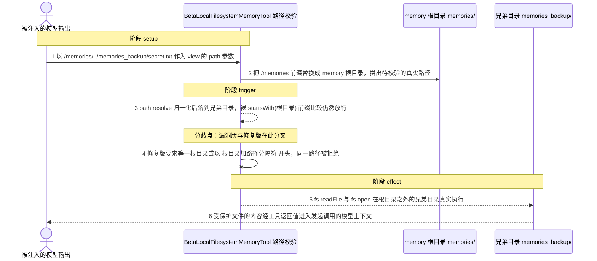
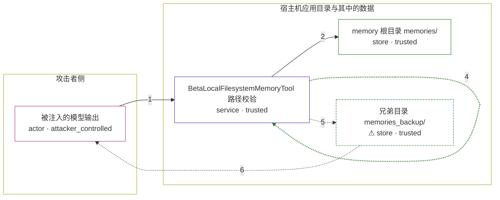

# anthropic-sdk-typescript / CVE-2026-34451

状态：草稿，未完成环境和复现。这个目录由模板生成，不构成漏洞确认。

图解的唯一来源是 `diagram.toml`：编辑后运行 `python3 -m runner diagram anthropic-sdk-typescript/CVE-2026-34451` 重新生成下方的图解区块。图解必须覆盖漏洞涉及的每个主体，并标出漏洞版/修复版的分歧步骤。

<!-- diagram:begin (generated from diagram.toml by `python3 -m runner diagram`; edit diagram.toml, not this block) -->
## 漏洞图解 — anthropic-sdk-typescript / CVE-2026-34451 记忆工具路径前缀绕过

memory 工具把模型给出的 /memories 虚拟路径解析到 memory 根目录下，却只用裸字符串 startsWith(根目录) 判断路径是否越界，没有追加路径分隔符。名字以根目录名为前缀的兄弟目录 memories_backup/ 因此被当成根内路径，越权的读、写、删在根目录之外真实执行。符号链接检查 validateNoSymlinkEscape 用了同样的裸前缀比较，指向兄弟目录的符号链接同样能绕过。

### 涉及主体

| 主体 | 类型 | 信任级别 | 在漏洞里的作用 | 来源 |
| --- | --- | --- | --- | --- |
| 被注入的模型输出 (`attacker`) | `actor` | `attacker_controlled` | 通过提示注入决定这次 memory 工具调用的 path 字符串；除此之外拿不到宿主机文件系统权限，根目录之外的文件只能靠路径校验缺陷读到。 | fixtures/attack.json |
| BetaLocalFilesystemMemoryTool 路径校验 (`memory_tool`) | `service` | `trusted` | 把 /memories 虚拟路径映射为 memory 根目录下的真实路径，并用前缀比较决定放行还是拒绝；validatePath 与 validateNoSymlinkEscape 两处都只做裸 startsWith(根目录)，同前缀的兄弟目录因此冒充根内路径。 | src/tools/memory/node.ts |
| memory 根目录 memories/ (`memory_root`) | `store` | `trusted` | 工具允许读写的目录，所有 /memories 虚拟路径本应落在它里面。 | — |
| ⚠ 兄弟目录 memories_backup/ (`sibling_store`) | `store` | `trusted` | 与 memory 根目录同级、名字以根目录名为前缀的目录，存放根目录之外的受保护文件；其中的内容用无害标记代替真实机密。 | fixtures/sandbox.json |

**信任边界**

- **攻击者侧** (`attacker_side`)：成员 `attacker`。攻击者只能决定这一次工具调用的 path 参数，够不着根目录之外的任何文件；要读到受保护文件，必须让工具的路径校验失效。
- **宿主机应用目录与其中的数据** (`host_data`)：成员 `memory_tool`、`memory_root`、`sibling_store`。工具本应只允许访问 memories/ 子树。裸前缀比较把同级的 memories_backup/ 也算成根内路径，这道目录边界因此失效。

标 ⚠ 的主体是本仓库合成的替身或无害效果载体，不代表真实外部目标。

### 触发过程

### 主体与信任边界

箭头上的数字是上面的步骤编号；方框只标主体和信任级别，具体动作见「触发过程」。

**分歧点**：第 3 步（`vulnerable_only`）path.resolve 归一化后落到兄弟目录，裸 startsWith(根目录) 前缀比较仍然放行。
**分歧点**：第 4 步（`patched_only`）修复版要求等于根目录或以 根目录加路径分隔符 开头，同一路径被拒绝。
<!-- diagram:end -->

## 公告与机制

TODO：官方公告、漏洞根因、Agent 信任边界、受影响范围和修复来源。

## 前提

TODO：认证要求、用户交互、已有批准、工具权限、攻击者能控制的内容。

## 版本与启动

TODO：补全 metadata、Dockerfile/镜像 digest 和 Compose，再写出精确启动命令。

Compose 中 `vulnerable` 与 `patched` profiles 分开使用；未指定 profile 不启动服务。镜像变量未配置时 Compose 会明确报错。此模板不暴露宿主端口，也不挂载主机数据。

## 机制复现

TODO：实现 `reproduce.py`，固定输入并执行真实漏洞路径，注明运行位置、参数和超时。

完成实现后使用 `python3 -m runner reproduce anthropic-sdk-typescript/CVE-2026-34451 --build --rounds 3`。
两脚本统一接受 `--context <context.json> --output <目录>`，详细字段见仓库 `docs/environment-contract.md`。
PoC 输出 `facts.json` 和效果文件；验证器只读证据，输出含 `target_ready` 及对应效果断言的 `verdict.json`。
镜像必须包含 Python 3 和 `/lab/` 下的脚本、fixtures；`runtime.mode` 选择 `oneshot` 或有 healthcheck 的 `service`。

## 端到端复现

TODO：实现 `end_to_end.py`；若不需要模型，明确写出不适用原因。真实模型的结果与机制复现分开统计。

## 验证与修复对照

TODO：实现 `verify.py`。记录漏洞版无害效果、修复版阻断和正常任务成功的证据，不能把服务启动失败当成阻断。

## 清理

默认运行器按每个测试的唯一 Compose project 清理容器、网络和 volume。
`--keep-on-failure` 保留失败项目，项目标识和 Compose 配置在结果目录中；仅清理该项目，不能使用全局 prune。

## 失败诊断

TODO：为本漏洞写出预期效果缺失、修复版仍有越界效果、正常任务失败及前提不满足时的具体排查路径。
启动失败、健康检查失败和超时都不能当作修复阻断。报告中应能定位到阶段、预期、实际和受控证据。

## 构建与输入

TODO：填写两版源码 archive、完整 commit，记录 `build.inputs` 中每个下载的 SHA-256；依赖安装必须支持禁网构建。
固定攻击和正常输入放入 `fixtures/` 并登记到 `fixtures/manifest.toml`。固定 seed、环境变量，说明无害效果与真实影响的关系。

## 隔离例外

默认无例外。确需例外时同时填写 `runtime.exceptions`、理由及最小范围，晋升由两位维护者审阅。

## 来源与许可

TODO：列出引用代码、fixtures 和镜像的来源及许可。
