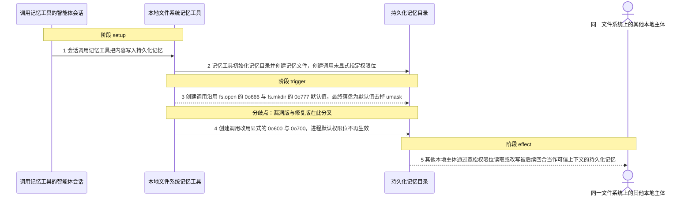
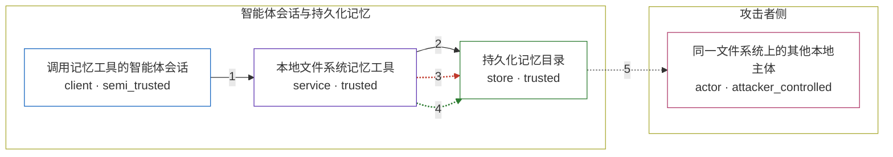

# anthropic-sdk-typescript / CVE-2026-41686

状态：草稿，未完成环境和复现。这个目录由模板生成，不构成漏洞确认。

图解的唯一来源是 `diagram.toml`：编辑后运行 `python3 -m runner diagram anthropic-sdk-typescript/CVE-2026-41686` 重新生成下方的图解区块。图解必须覆盖漏洞涉及的每个主体，并标出漏洞版/修复版的分歧步骤。

<!-- diagram:begin (generated from diagram.toml by `python3 -m runner diagram`; edit diagram.toml, not this block) -->
## 漏洞图解 — anthropic-sdk-typescript / CVE-2026-41686 漏洞图解

BetaLocalFilesystemMemoryTool 在初始化记忆目录以及创建、改写记忆文件时都不显式指定权限位，于是沿用 fs.open 的 0o666 与 fs.mkdir 的 0o777 默认值，最终落盘为默认值去掉 umask。宽松 umask 的部署里，记忆文件与目录因此对其他本地主体可读甚至可写，绕过了“持久化记忆只属于该智能体进程”的信任边界。后续回合会把记忆内容当作可信上下文读取，本地主体只要读或改写这些文件，就能窥探甚至投毒这条上下文。0.91.1 用 0o600 与 0o700 覆盖全部五处创建调用，默认权限位不再生效。

### 涉及主体

| 主体 | 类型 | 信任级别 | 在漏洞里的作用 | 来源 |
| --- | --- | --- | --- | --- |
| 调用记忆工具的智能体会话 (`agent`) | `client` | `semi_trusted` | 在会话中调用记忆工具把内容写入持久化记忆；这些内容在后续回合被当作可信上下文读取。 | — |
| 本地文件系统记忆工具 (`memory_tool`) | `service` | `trusted` | 受影响的上游组件。它负责创建记忆目录与记忆文件，但创建调用没有指定权限位，边界因此由进程默认权限决定，漏洞就在这里。 | anthropics/anthropic-sdk-typescript src/tools/memory/node.ts（sdk-v0.91.0 与 sdk-v0.91.1） |
| 持久化记忆目录 (`memory_store`) | `store` | `trusted` | 被保护的持久化智能体状态：本应只有该智能体进程可读写，宽松的默认权限位让它对其他本地主体开放。 | — |
| 同一文件系统上的其他本地主体 (`local_attacker`) | `actor` | `attacker_controlled` | 与智能体共享文件系统的第二个本地主体；它不参与这次工具调用，只是利用落盘后的宽松权限位读取或改写记忆。 | — |

**信任边界**

- **攻击者侧** (`attacker_side`)：成员 `local_attacker`。攻击者只能依赖自己已在同一文件系统上这一前提，它无法改变工具调用的内容，也拿不到权限位之外的数据。
- **智能体会话与持久化记忆** (`memory_side`)：成员 `agent`、`memory_tool`、`memory_store`。这道边界本应让持久化记忆只对智能体进程可读写；漏洞让创建出的文件与目录带上 group/other 权限位，边界因此失效。

### 触发过程

### 主体与信任边界

箭头上的数字是上面的步骤编号；方框只标主体和信任级别，具体动作见「触发过程」。

**分歧点**：第 3 步（`vulnerable_only`）创建调用沿用 fs.open 的 0o666 与 fs.mkdir 的 0o777 默认值，最终落盘为默认值去掉 umask。
**分歧点**：第 4 步（`patched_only`）创建调用改用显式的 0o600 与 0o700，进程默认权限位不再生效。
<!-- diagram:end -->

## 公告与机制

TODO：官方公告、漏洞根因、Agent 信任边界、受影响范围和修复来源。

## 前提

TODO：认证要求、用户交互、已有批准、工具权限、攻击者能控制的内容。

## 版本与启动

TODO：补全 metadata、Dockerfile/镜像 digest 和 Compose，再写出精确启动命令。

Compose 中 `vulnerable` 与 `patched` profiles 分开使用；未指定 profile 不启动服务。镜像变量未配置时 Compose 会明确报错。此模板不暴露宿主端口，也不挂载主机数据。

## 机制复现

TODO：实现 `reproduce.py`，固定输入并执行真实漏洞路径，注明运行位置、参数和超时。

完成实现后使用 `python3 -m runner reproduce anthropic-sdk-typescript/CVE-2026-41686 --build --rounds 3`。
两脚本统一接受 `--context <context.json> --output <目录>`，详细字段见仓库 `docs/environment-contract.md`。
PoC 输出 `facts.json` 和效果文件；验证器只读证据，输出含 `target_ready` 及对应效果断言的 `verdict.json`。
镜像必须包含 Python 3 和 `/lab/` 下的脚本、fixtures；`runtime.mode` 选择 `oneshot` 或有 healthcheck 的 `service`。

## 端到端复现

TODO：实现 `end_to_end.py`；若不需要模型，明确写出不适用原因。真实模型的结果与机制复现分开统计。

## 验证与修复对照

TODO：实现 `verify.py`。记录漏洞版无害效果、修复版阻断和正常任务成功的证据，不能把服务启动失败当成阻断。

## 清理

默认运行器按每个测试的唯一 Compose project 清理容器、网络和 volume。
`--keep-on-failure` 保留失败项目，项目标识和 Compose 配置在结果目录中；仅清理该项目，不能使用全局 prune。

## 失败诊断

TODO：为本漏洞写出预期效果缺失、修复版仍有越界效果、正常任务失败及前提不满足时的具体排查路径。
启动失败、健康检查失败和超时都不能当作修复阻断。报告中应能定位到阶段、预期、实际和受控证据。

## 构建与输入

TODO：填写两版源码 archive、完整 commit，记录 `build.inputs` 中每个下载的 SHA-256；依赖安装必须支持禁网构建。
固定攻击和正常输入放入 `fixtures/` 并登记到 `fixtures/manifest.toml`。固定 seed、环境变量，说明无害效果与真实影响的关系。

## 隔离例外

默认无例外。确需例外时同时填写 `runtime.exceptions`、理由及最小范围，晋升由两位维护者审阅。

## 来源与许可

TODO：列出引用代码、fixtures 和镜像的来源及许可。
