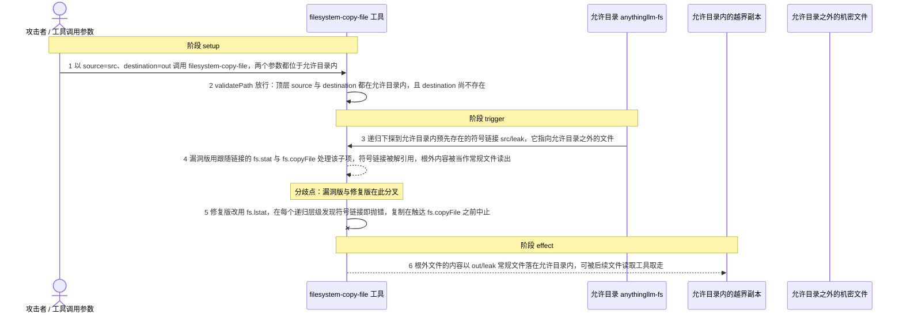
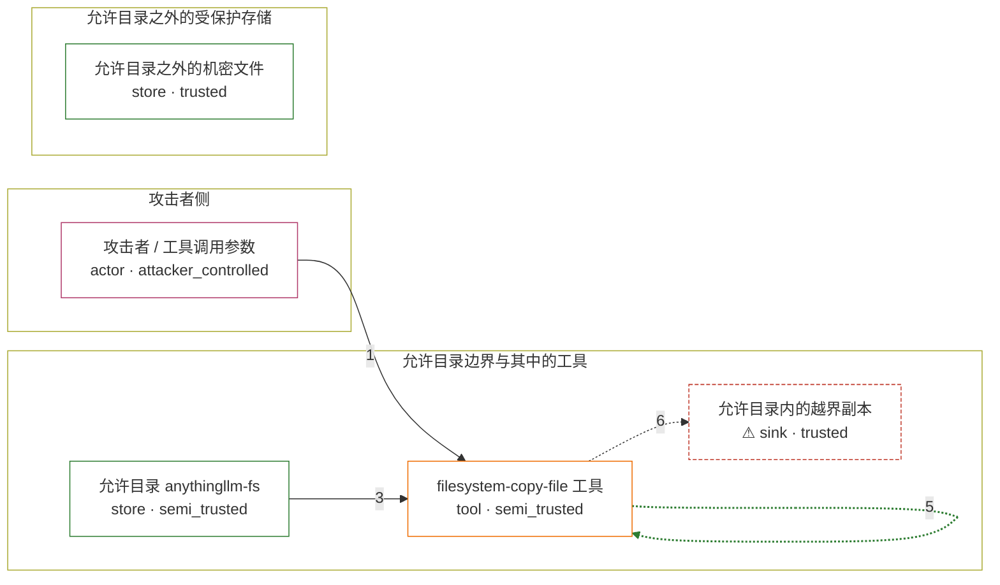

# anything-llm / CVE-2026-45403

状态：草稿，未完成环境和复现。这个目录由模板生成，不构成漏洞确认。

图解的唯一来源是 `diagram.toml`：编辑后运行 `python3 -m runner diagram anything-llm/CVE-2026-45403` 重新生成下方的图解区块。图解必须覆盖漏洞涉及的每个主体，并标出漏洞版/修复版的分歧步骤。

<!-- diagram:begin (generated from diagram.toml by `python3 -m runner diagram`; edit diagram.toml, not this block) -->
## 漏洞图解 — anything-llm / CVE-2026-45403 漏洞图解

filesystem-copy-file 只对顶层的 source 与 destination 调用 validatePath，递归复制子项的 copyRecursive 不再做任何校验，并且使用跟随符号链接的 fs.stat 与 fs.copyFile。允许目录内预先存在的符号链接因此在其目标位于允许目录之外时仍被解引用，根外文件的内容被复制成允许目录内的一个常规文件。修复版把 copyRecursive 改为 fs.lstat，并在每个递归层级对符号链接抛错，同一调用在触达 fs.copyFile 之前中止。影响面仅为机密性：越界读取的内容落在允许目录内，不涉及写入、篡改或代码执行。

### 涉及主体

| 主体 | 类型 | 信任级别 | 在漏洞里的作用 | 来源 |
| --- | --- | --- | --- | --- |
| 攻击者 / 工具调用参数 (`attacker`) | `actor` | `attacker_controlled` | 决定 filesystem-copy-file 这次调用的 source 与 destination。它够不到允许目录之外的机密文件，只能依赖允许目录内一条已经存在的符号链接把越界读取接进这次复制。 | — |
| filesystem-copy-file 工具 (`copy_tool`) | `tool` | `semi_trusted` | 受影响的上游 handler 与它的递归辅助函数 copyRecursive。顶层路径经过 validatePath 的 realpath 检查，但递归下探的每个子项都由 path.join 直接拼接后进入 copyRecursive，没有任何一层再做边界判断。 | server/utils/agents/aibitat/plugins/filesystem/copy-file.js |
| 允许目录 anythingllm-fs (`allowed_root`) | `store` | `semi_trusted` | 工具被允许读写的根目录（默认 STORAGE_DIR/anythingllm-fs）。它内部预先存在一条指向根外的符号链接，这条链接是被复制的目录项之一。 | — |
| 允许目录之外的机密文件 (`outside_file`) | `store` | `trusted` | 边界内侧受保护的数据，攻击者本来够不到。它是符号链接的目标，也是越界复制真正读到的内容；本身不参与任何调用步骤，只是这次调用发生时的环境事实。 | fixtures/canary.txt |
| ⚠ 允许目录内的越界副本 (`leaked_copy`) | `sink` | `trusted` | 漏洞版把根外文件内容复制成允许目录内的常规文件 out/leak。它落在攻击者随后可以读取的位置，效果方向是内容从边界内侧流向允许目录内；载体内容是合成的 canary，不代表真实外部目标。 | — |

**信任边界**

- **攻击者侧** (`attacker_side`)：成员 `attacker`。攻击者能控制的只有这次工具调用的参数，以及依赖允许目录里已经存在的符号链接；它不能直接读取允许目录之外的任何路径。
- **允许目录边界与其中的工具** (`allowed_directory`)：成员 `copy_tool`、`allowed_root`、`leaked_copy`。这道边界本应保证 source 与 destination 都在允许目录内。validatePath 只检查被显式请求的顶层路径，递归子项完全绕过它，所以边界在递归下探时失效。
- **允许目录之外的受保护存储** (`protected_storage`)：成员 `outside_file`。允许目录之外的文件，只有通过 realpath 检查的目标才能被访问。符号链接的目标绕过该检查后，这里的数据被读出边界。

标 ⚠ 的主体是本仓库合成的替身或无害效果载体，不代表真实外部目标。

### 触发过程

### 主体与信任边界

箭头上的数字是上面的步骤编号；方框只标主体和信任级别，具体动作见「触发过程」。

**分歧点**：第 4 步（`vulnerable_only`）漏洞版用跟随链接的 fs.stat 与 fs.copyFile 处理该子项，符号链接被解引用，根外内容被当作常规文件读出。
**分歧点**：第 5 步（`patched_only`）修复版改用 fs.lstat，在每个递归层级发现符号链接即抛错，复制在触达 fs.copyFile 之前中止。
<!-- diagram:end -->

## 公告与机制

TODO：官方公告、漏洞根因、Agent 信任边界、受影响范围和修复来源。

## 前提

TODO：认证要求、用户交互、已有批准、工具权限、攻击者能控制的内容。

## 版本与启动

TODO：补全 metadata、Dockerfile/镜像 digest 和 Compose，再写出精确启动命令。

Compose 中 `vulnerable` 与 `patched` profiles 分开使用；未指定 profile 不启动服务。镜像变量未配置时 Compose 会明确报错。此模板不暴露宿主端口，也不挂载主机数据。

## 机制复现

TODO：实现 `reproduce.py`，固定输入并执行真实漏洞路径，注明运行位置、参数和超时。

完成实现后使用 `python3 -m runner reproduce anything-llm/CVE-2026-45403 --build --rounds 3`。
两脚本统一接受 `--context <context.json> --output <目录>`，详细字段见仓库 `docs/environment-contract.md`。
PoC 输出 `facts.json` 和效果文件；验证器只读证据，输出含 `target_ready` 及对应效果断言的 `verdict.json`。
镜像必须包含 Python 3 和 `/lab/` 下的脚本、fixtures；`runtime.mode` 选择 `oneshot` 或有 healthcheck 的 `service`。

## 端到端复现

TODO：实现 `end_to_end.py`；若不需要模型，明确写出不适用原因。真实模型的结果与机制复现分开统计。

## 验证与修复对照

TODO：实现 `verify.py`。记录漏洞版无害效果、修复版阻断和正常任务成功的证据，不能把服务启动失败当成阻断。

## 清理

默认运行器按每个测试的唯一 Compose project 清理容器、网络和 volume。
`--keep-on-failure` 保留失败项目，项目标识和 Compose 配置在结果目录中；仅清理该项目，不能使用全局 prune。

## 失败诊断

TODO：为本漏洞写出预期效果缺失、修复版仍有越界效果、正常任务失败及前提不满足时的具体排查路径。
启动失败、健康检查失败和超时都不能当作修复阻断。报告中应能定位到阶段、预期、实际和受控证据。

## 构建与输入

TODO：填写两版源码 archive、完整 commit，记录 `build.inputs` 中每个下载的 SHA-256；依赖安装必须支持禁网构建。
固定攻击和正常输入放入 `fixtures/` 并登记到 `fixtures/manifest.toml`。固定 seed、环境变量，说明无害效果与真实影响的关系。

## 隔离例外

默认无例外。确需例外时同时填写 `runtime.exceptions`、理由及最小范围，晋升由两位维护者审阅。

## 来源与许可

TODO：列出引用代码、fixtures 和镜像的来源及许可。
