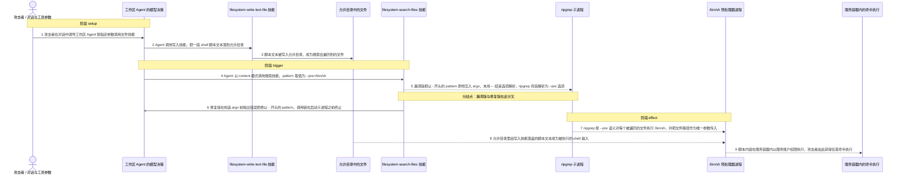
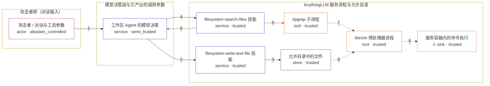

# anything-llm / CVE-2026-48116

状态：草稿，未完成环境和复现。这个目录由模板生成，不构成漏洞确认。

图解的唯一来源是 `diagram.toml`：编辑后运行 `python3 -m runner diagram anything-llm/CVE-2026-48116` 重新生成下方的图解区块。图解必须覆盖漏洞涉及的每个主体，并标出漏洞版/修复版的分歧步骤。

<!-- diagram:begin (generated from diagram.toml by `python3 -m runner diagram`; edit diagram.toml, not this block) -->
## 漏洞图解 — anything-llm / CVE-2026-48116 — ripgrep --pre 参数注入导致命令执行

AnythingLLM 1.13.0 之前，filesystem-search-files 技能在 content 模式下把模型可控的 pattern 作为位置参数交给 ripgrep，且没有用 -- 结束选项解析，因此 pattern = --pre=/bin/sh 会被 ripgrep 当成选项，成为对每个被遍历文件执行 /bin/sh <file> 的预处理器命令。攻击者用兄弟技能把一段 shell 脚本文本写进允许目录，搜索触发时该脚本被 ripgrep 执行，命令落在 AnythingLLM 服务容器内。修复版在构造 argv 前拒绝以 - 开头的 pattern，并用 -- 把后续参数固定为位置参数。

### 涉及主体

| 主体 | 类型 | 信任级别 | 在漏洞里的作用 | 来源 |
| --- | --- | --- | --- | --- |
| 攻击者 / 对话与工具参数 (`attacker`) | `actor` | `attacker_controlled` | 通过聊天引导工作区 Agent 选择文件技能与调用参数，并决定写入允许目录的脚本文本；它不能直接读写服务器文件系统，也不能直接执行命令。 | — |
| 工作区 Agent 的模型决策 (`agent`) | `service` | `semi_trusted` | 把攻击者的对话意图翻译成技能调用参数，其中 content 模式的 pattern 完全来自模型输出，因此成为攻击者可控字符串；这一层本身不做参数安全校验。 | — |
| filesystem-write-text-file 技能 (`write_skill`) | `service` | `trusted` | 兄弟技能：按 Agent 给出的路径与内容把脚本文本写入允许目录，为参数注入提供可被遍历到的落盘载体。 | — |
| filesystem-search-files 技能 (`search_skill`) | `service` | `trusted` | 受影响组件：content 模式把 pattern 原样压入 ripgrep 的 argv，既没有 -- 分隔，也没有拒绝 - 前缀，于是位置参数被当成选项。 | server/utils/agents/aibitat/plugins/filesystem/search-files.js |
| ripgrep 子进程 (`ripgrep`) | `tool` | `trusted` | 把收到的 argv 解析成选项与位置参数；--pre 的值被当作预处理器命令，对每个被搜索的文件执行它。 | — |
| /bin/sh 预处理器进程 (`shell`) | `tool` | `trusted` | 由 ripgrep 按 --pre 语义启动，接收被遍历文件的路径作为第一个也是唯一的参数，并把文件内容当作 shell 命令执行。 | — |
| 允许目录中的文件 (`allowed_files`) | `store` | `trusted` | 工作区允许访问的目录内容；攻击者的脚本文本经写入技能落盘于此，随后被搜索遍历并送进预处理器。 | — |
| ⚠ 服务容器内的命令执行 (`command_exec`) | `sink` | `trusted` | 漏洞触发后效果落点：脚本内容在 AnythingLLM 服务容器内以服务账户权限执行。机制复现中该落点由无害标记承载，用于确认执行确实发生，而不是指向真实外部目标。 | — |

**信任边界**

- **攻击者侧（对话输入）** (`attacker_side`)：成员 `attacker`。攻击者只能通过聊天文本影响 Agent 的工具调用，不能直接操作服务进程、允许目录或子进程。
- **模型决策层与它产出的调用参数** (`model_layer`)：成员 `agent`。模型把不可信对话转成后续受信任流程使用的技能参数；pattern 在这一层变成攻击者可控字符串，而这一层没有做参数安全校验。
- **AnythingLLM 服务进程与允许目录** (`server_side`)：成员 `write_skill`、`search_skill`、`ripgrep`、`shell`、`allowed_files`、`command_exec`。服务端本应只让技能在允许目录内搜索和写入；缺少 -- 分隔使 pattern 越过了 argv 的选项解析边界，从搜索参数变成预处理器命令，最终成为容器内命令执行。

标 ⚠ 的主体是本仓库合成的替身或无害效果载体，不代表真实外部目标。

### 触发过程

### 主体与信任边界

箭头上的数字是上面的步骤编号；方框只标主体和信任级别，具体动作见「触发过程」。

**分歧点**：第 5 步（`vulnerable_only`）漏洞版把以 - 开头的 pattern 原样压入 argv，未用 -- 结束选项解析，ripgrep 将其解析为 --pre 选项。
**分歧点**：第 6 步（`patched_only`）修复版在构造 argv 前抛出错误拒绝以 - 开头的 pattern，调用链在启动子进程之前终止。
<!-- diagram:end -->

## 公告与机制

TODO：官方公告、漏洞根因、Agent 信任边界、受影响范围和修复来源。

## 前提

TODO：认证要求、用户交互、已有批准、工具权限、攻击者能控制的内容。

## 版本与启动

TODO：补全 metadata、Dockerfile/镜像 digest 和 Compose，再写出精确启动命令。

Compose 中 `vulnerable` 与 `patched` profiles 分开使用；未指定 profile 不启动服务。镜像变量未配置时 Compose 会明确报错。此模板不暴露宿主端口，也不挂载主机数据。

## 机制复现

TODO：实现 `reproduce.py`，固定输入并执行真实漏洞路径，注明运行位置、参数和超时。

完成实现后使用 `python3 -m runner reproduce anything-llm/CVE-2026-48116 --build --rounds 3`。
两脚本统一接受 `--context <context.json> --output <目录>`，详细字段见仓库 `docs/environment-contract.md`。
PoC 输出 `facts.json` 和效果文件；验证器只读证据，输出含 `target_ready` 及对应效果断言的 `verdict.json`。
镜像必须包含 Python 3 和 `/lab/` 下的脚本、fixtures；`runtime.mode` 选择 `oneshot` 或有 healthcheck 的 `service`。

## 端到端复现

TODO：实现 `end_to_end.py`；若不需要模型，明确写出不适用原因。真实模型的结果与机制复现分开统计。

## 验证与修复对照

TODO：实现 `verify.py`。记录漏洞版无害效果、修复版阻断和正常任务成功的证据，不能把服务启动失败当成阻断。

## 清理

默认运行器按每个测试的唯一 Compose project 清理容器、网络和 volume。
`--keep-on-failure` 保留失败项目，项目标识和 Compose 配置在结果目录中；仅清理该项目，不能使用全局 prune。

## 失败诊断

TODO：为本漏洞写出预期效果缺失、修复版仍有越界效果、正常任务失败及前提不满足时的具体排查路径。
启动失败、健康检查失败和超时都不能当作修复阻断。报告中应能定位到阶段、预期、实际和受控证据。

## 构建与输入

TODO：填写两版源码 archive、完整 commit，记录 `build.inputs` 中每个下载的 SHA-256；依赖安装必须支持禁网构建。
固定攻击和正常输入放入 `fixtures/` 并登记到 `fixtures/manifest.toml`。固定 seed、环境变量，说明无害效果与真实影响的关系。

## 隔离例外

默认无例外。确需例外时同时填写 `runtime.exceptions`、理由及最小范围，晋升由两位维护者审阅。

## 来源与许可

TODO：列出引用代码、fixtures 和镜像的来源及许可。
