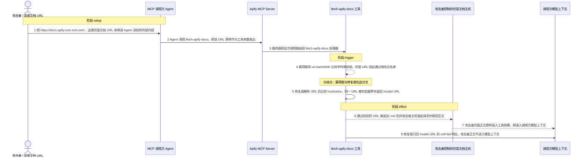
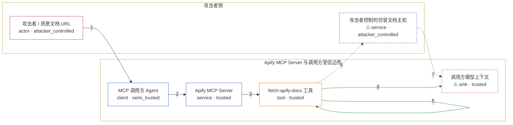

# apify-mcp-server / CVE-2026-46341

状态：草稿，未完成环境和复现。这个目录由模板生成，不构成漏洞确认。

图解的唯一来源是 `diagram.toml`：编辑后运行 `python3 -m runner diagram apify-mcp-server/CVE-2026-46341` 重新生成下方的图解区块。图解必须覆盖漏洞涉及的每个主体，并标出漏洞版/修复版的分歧步骤。

<!-- diagram:begin (generated from diagram.toml by `python3 -m runner diagram`; edit diagram.toml, not this block) -->
## 漏洞图解 — apify-mcp-server / CVE-2026-46341 域名白名单前缀匹配绕过

fetch-apify-docs 只允许抓取 Apify 与 Crawlee 官方文档，但 0.9.21 之前用 url.startsWith(ALLOWED_DOC_DOMAINS) 做白名单，只比较字符串前缀而不解析 URL 结构。 攻击者把 URL 写成 https://docs.apify.com.evil.com/... 这类以其为前缀的形式即可通过校验， 工具随后把 .md 追加到路径并向攻击者主机发起请求。抓回的页面正文被原样放进 MCP 工具结果， 从而进入调用方模型上下文，可携带进一步指示。

### 涉及主体

| 主体 | 类型 | 信任级别 | 在漏洞里的作用 | 来源 |
| --- | --- | --- | --- | --- |
| 攻击者 / 恶意文档 URL (`attacker`) | `actor` | `attacker_controlled` | 构造并散布以 https://docs.apify.com 开头的仿冒文档 URL；它只能控制这个 URL 字符串和被指向主机上的响应内容，不能改工具代码。 | fixtures/attack.json |
| MCP 调用方 Agent (`agent_client`) | `client` | `semi_trusted` | 按外部内容里的链接调用 fetch-apify-docs，把其中的 URL 原样作为工具参数传给服务端。 | — |
| Apify MCP Server (`mcp_server`) | `service` | `trusted` | 承载内部工具的 MCP 服务，按工具名把调用路由到处理器，不对参数做二次校验。 | — |
| fetch-apify-docs 工具 (`docs_tool`) | `tool` | `trusted` | 缺陷所在：它做域名白名单校验并执行网络抓取；漏洞版只比较字符串前缀，修复版解析 URL 后比较 hostname。 | src/tools/common/fetch_apify_docs.ts |
| ⚠ 攻击者控制的仿冒文档主机 (`attacker_host`) | `service` | `attacker_controlled` | 响应工具改写后的 .md 路径并返回注入正文；在机制复现里由本地受控接收端扮演这个角色。 | fixtures/attacker_page.md |
| ⚠ 调用方模型上下文 (`agent_context`) | `sink` | `trusted` | 抓取结果进入的模型上下文；攻击者页面正文在这里成为后续指令，机制复现中以工具返回结果作为该落点的载体。 | — |

**信任边界**

- **攻击者侧** (`attacker_side`)：成员 `attacker`、`attacker_host`。攻击者只能控制传入的 URL 和它自己主机上的响应内容，拿不到工具源码、调用方凭据或已通过校验的合法文档。
- **Apify MCP Server 与调用方受信边界** (`product`)：成员 `agent_client`、`mcp_server`、`docs_tool`、`agent_context`。白名单本意是只允许抓 docs.apify.com 与 crawlee.dev 官方文档，保证这个工具确实只读；前缀比较让这道边界失效。

标 ⚠ 的主体是本仓库合成的替身或无害效果载体，不代表真实外部目标。

### 触发过程

### 主体与信任边界

箭头上的数字是上面的步骤编号；方框只标主体和信任级别，具体动作见「触发过程」。

**分歧点**：第 4 步（`vulnerable_only`）漏洞版用 url.startsWith 比较字符串前缀，仿冒 URL 因此通过域名白名单。
**分歧点**：第 5 步（`patched_only`）修复版解析 URL 后比较 hostname，同一 URL 被判定越界并返回 Invalid URL。
<!-- diagram:end -->

## 公告与机制

TODO：官方公告、漏洞根因、Agent 信任边界、受影响范围和修复来源。

## 前提

TODO：认证要求、用户交互、已有批准、工具权限、攻击者能控制的内容。

## 版本与启动

TODO：补全 metadata、Dockerfile/镜像 digest 和 Compose，再写出精确启动命令。

Compose 中 `vulnerable` 与 `patched` profiles 分开使用；未指定 profile 不启动服务。镜像变量未配置时 Compose 会明确报错。此模板不暴露宿主端口，也不挂载主机数据。

## 机制复现

TODO：实现 `reproduce.py`，固定输入并执行真实漏洞路径，注明运行位置、参数和超时。

完成实现后使用 `python3 -m runner reproduce apify-mcp-server/CVE-2026-46341 --build --rounds 3`。
两脚本统一接受 `--context <context.json> --output <目录>`，详细字段见仓库 `docs/environment-contract.md`。
PoC 输出 `facts.json` 和效果文件；验证器只读证据，输出含 `target_ready` 及对应效果断言的 `verdict.json`。
镜像必须包含 Python 3 和 `/lab/` 下的脚本、fixtures；`runtime.mode` 选择 `oneshot` 或有 healthcheck 的 `service`。

## 端到端复现

TODO：实现 `end_to_end.py`；若不需要模型，明确写出不适用原因。真实模型的结果与机制复现分开统计。

## 验证与修复对照

TODO：实现 `verify.py`。记录漏洞版无害效果、修复版阻断和正常任务成功的证据，不能把服务启动失败当成阻断。

## 清理

默认运行器按每个测试的唯一 Compose project 清理容器、网络和 volume。
`--keep-on-failure` 保留失败项目，项目标识和 Compose 配置在结果目录中；仅清理该项目，不能使用全局 prune。

## 失败诊断

TODO：为本漏洞写出预期效果缺失、修复版仍有越界效果、正常任务失败及前提不满足时的具体排查路径。
启动失败、健康检查失败和超时都不能当作修复阻断。报告中应能定位到阶段、预期、实际和受控证据。

## 构建与输入

TODO：填写两版源码 archive、完整 commit，记录 `build.inputs` 中每个下载的 SHA-256；依赖安装必须支持禁网构建。
固定攻击和正常输入放入 `fixtures/` 并登记到 `fixtures/manifest.toml`。固定 seed、环境变量，说明无害效果与真实影响的关系。

## 隔离例外

默认无例外。确需例外时同时填写 `runtime.exceptions`、理由及最小范围，晋升由两位维护者审阅。

## 来源与许可

TODO：列出引用代码、fixtures 和镜像的来源及许可。
