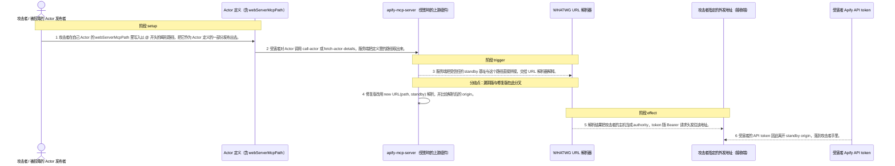
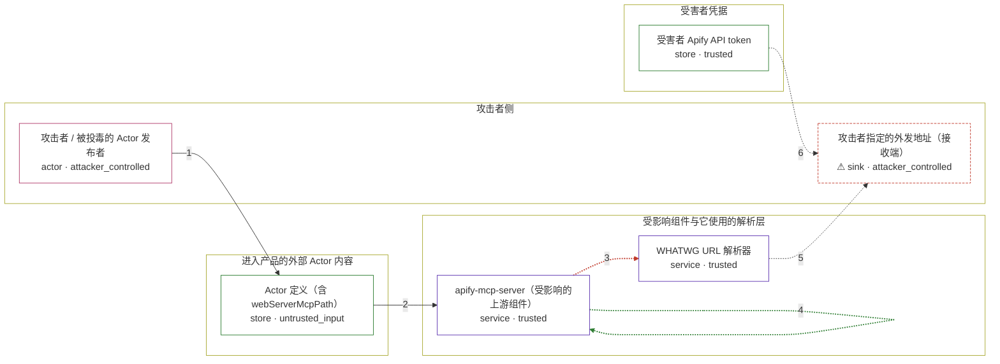

# apify-mcp-server / CVE-2026-50143

状态：草稿，未完成环境和复现。这个目录由模板生成，不构成漏洞确认。

图解的唯一来源是 `diagram.toml`：编辑后运行 `python3 -m runner diagram apify-mcp-server/CVE-2026-50143` 重新生成下方的图解区块。图解必须覆盖漏洞涉及的每个主体，并标出漏洞版/修复版的分歧步骤。

<!-- diagram:begin (generated from diagram.toml by `python3 -m runner diagram`; edit diagram.toml, not this block) -->
## 漏洞图解 — apify-mcp-server / CVE-2026-50143 Actor 路径改写 standby 域导致的令牌外泄

Apify Actor 定义里的 webServerMcpPath 由发布该 Actor 的人控制，MCP 服务端却把它当成相对路径追加到受信任的 standby 基址上：getActorMCPServerURL() 先拼出字符串，再交给 WHATWG URL 解析器。当该字段以 @ 开头时，解析器把拼接结果里 standby 域的部分读成 userinfo，host 变成攻击者指定的地址；随后 connectMCPClient() 无条件把受害者的 Authorization: Bearer <APIFY_TOKEN> 发给这个 host。修复版改为 new URL(path, standby) 并比较解析后的 origin，越界即抛错，同时清除残留的 userinfo。

### 涉及主体

| 主体 | 类型 | 信任级别 | 在漏洞里的作用 | 来源 |
| --- | --- | --- | --- | --- |
| 攻击者 / 被投毒的 Actor 发布者 (`attacker`) | `actor` | `attacker_controlled` | 在 Apify Store 上发布一个自带 webServerMcpPath 字段的 Actor，并诱导受害者的 MCP 客户端对它调用 call-actor 或 fetch-actor-details。攻击者想要的是受害者账号的 API token，它能控制的只有自己 Actor 定义里的这个字段，以及自己那一侧的接收端。 | — |
| Actor 定义（含 webServerMcpPath） (`actor_definition`) | `store` | `untrusted_input` | 受害者在一次工具调用里请求的那个 Actor 的公开定义。webServerMcpPath 来自发布者，是本漏洞里唯一被攻击者控制的输入；该字段只经过 trim() 和逗号切分，没有任何路径或 origin 校验。 | fixtures/attack.json |
| 受害者 Apify API token (`token_store`) | `store` | `trusted` | 受害者账号凭据，本来只会交给解析出来的 standby 域。攻击者拿不到它，否则不必绕这一圈；只有它离开 standby origin 才算越界。 | — |
| apify-mcp-server（受影响的上游组件） (`mcp_server`) | `service` | `trusted` | 出问题的上游组件。getActorMCPServerURL() 用朴素字符串拼接把受信任的 standby 基址与发布者可控的路径组合起来，connectMCPClient() 随后无条件把 Bearer token 附到请求上，构造 URL 到发出请求之间没有任何 origin 检查。 | https://github.com/apify/apify-mcp-server/blob/2e2c11e7107abd261c073581174a139998854f73/src/mcp/actors.ts |
| WHATWG URL 解析器 (`url_resolver`) | `service` | `trusted` | Node 平台自带的 URL 解析原语。它按 RFC 3986 处理拼接结果里的 authority：@ 之前的内容退化为 userinfo，后半段成为真正的 host。它不是被攻击者入侵的组件，而是把拼接结果按标准解释出来的那一层。 | https://github.com/apify/apify-mcp-server/blob/2e2c11e7107abd261c073581174a139998854f73/src/mcp/actors.ts |
| ⚠ 攻击者指定的外发地址（接收端） (`exfil_endpoint`) | `sink` | `attacker_controlled` | 漏洞效果最终落到的位置：原设计是 actorId.apify.actor，被改写后变成攻击者控制的主机，带 Authorization 头的请求就发到这里。 | — |

**信任边界**

- **攻击者侧** (`attacker_side`)：成员 `attacker`、`exfil_endpoint`。攻击者在这里能控制自己发布的 Actor 定义和自己那一侧的接收端；它够不着受害者的 token 与 standby 域。
- **受害者凭据** (`victim_credential`)：成员 `token_store`。凭据本来只会交给 standby origin。漏洞让这份数据出现在离开该 origin 的请求头里。
- **受影响组件与它使用的解析层** (`mcp_process`)：成员 `mcp_server`、`url_resolver`。这道边界本该保证 MCP 客户端只把 token 发给它自己解析出的 standby 域。漏洞版从没在代码里表达过这道检查，只有一个字符串拼接。
- **进入产品的外部 Actor 内容** (`untrusted_definition`)：成员 `actor_definition`。Actor 定义是外部发布的内容，进入受信任流程前必须经过校验；畸形 path 就是从这里进来的。

标 ⚠ 的主体是本仓库合成的替身或无害效果载体，不代表真实外部目标。

### 触发过程

### 主体与信任边界

箭头上的数字是上面的步骤编号；方框只标主体和信任级别，具体动作见「触发过程」。

**分歧点**：第 3 步（`vulnerable_only`）服务端把受信任的 standby 基址与这个路径直接拼接，交给 URL 解析器解释。。
**分歧点**：第 4 步（`patched_only`）修复版改用 new URL(path, standby) 解析，并比较解析后的 origin。。
<!-- diagram:end -->

## 公告与机制

TODO：官方公告、漏洞根因、Agent 信任边界、受影响范围和修复来源。

## 前提

TODO：认证要求、用户交互、已有批准、工具权限、攻击者能控制的内容。

## 版本与启动

TODO：补全 metadata、Dockerfile/镜像 digest 和 Compose，再写出精确启动命令。

Compose 中 `vulnerable` 与 `patched` profiles 分开使用；未指定 profile 不启动服务。镜像变量未配置时 Compose 会明确报错。此模板不暴露宿主端口，也不挂载主机数据。

## 机制复现

TODO：实现 `reproduce.py`，固定输入并执行真实漏洞路径，注明运行位置、参数和超时。

完成实现后使用 `python3 -m runner reproduce apify-mcp-server/CVE-2026-50143 --build --rounds 3`。
两脚本统一接受 `--context <context.json> --output <目录>`，详细字段见仓库 `docs/environment-contract.md`。
PoC 输出 `facts.json` 和效果文件；验证器只读证据，输出含 `target_ready` 及对应效果断言的 `verdict.json`。
镜像必须包含 Python 3 和 `/lab/` 下的脚本、fixtures；`runtime.mode` 选择 `oneshot` 或有 healthcheck 的 `service`。

## 端到端复现

TODO：实现 `end_to_end.py`；若不需要模型，明确写出不适用原因。真实模型的结果与机制复现分开统计。

## 验证与修复对照

TODO：实现 `verify.py`。记录漏洞版无害效果、修复版阻断和正常任务成功的证据，不能把服务启动失败当成阻断。

## 清理

默认运行器按每个测试的唯一 Compose project 清理容器、网络和 volume。
`--keep-on-failure` 保留失败项目，项目标识和 Compose 配置在结果目录中；仅清理该项目，不能使用全局 prune。

## 失败诊断

TODO：为本漏洞写出预期效果缺失、修复版仍有越界效果、正常任务失败及前提不满足时的具体排查路径。
启动失败、健康检查失败和超时都不能当作修复阻断。报告中应能定位到阶段、预期、实际和受控证据。

## 构建与输入

TODO：填写两版源码 archive、完整 commit，记录 `build.inputs` 中每个下载的 SHA-256；依赖安装必须支持禁网构建。
固定攻击和正常输入放入 `fixtures/` 并登记到 `fixtures/manifest.toml`。固定 seed、环境变量，说明无害效果与真实影响的关系。

## 隔离例外

默认无例外。确需例外时同时填写 `runtime.exceptions`、理由及最小范围，晋升由两位维护者审阅。

## 来源与许可

TODO：列出引用代码、fixtures 和镜像的来源及许可。
