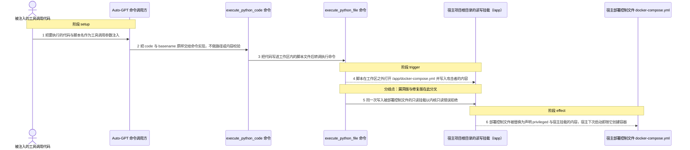

# auto-gpt / CVE-2023-37273

状态：草稿。图解、机制 PoC、离线构建与四场景验收均已执行；这个目录仍不构成漏洞确认，直到 review 通过。

图解的唯一来源是 `diagram.toml`：编辑后运行 `python3 -m runner diagram auto-gpt/CVE-2023-37273` 重新生成下方的图解区块。图解必须覆盖漏洞涉及的每个主体，并标出漏洞版/修复版的分歧步骤。

<!-- diagram:begin (generated from diagram.toml by `python3 -m runner diagram`; edit diagram.toml, not this block) -->
## 漏洞图解 — Auto-GPT 部署控制文件被容器内命令覆写

Auto-GPT 按仓库根的 docker-compose.yml 启动时把项目根目录读写挂载到容器 /app，而同一个文件正是宿主下一次执行 docker compose 时解析的部署控制文件。上游的 execute_python_code 把模型给出的代码写进工作区后交给 execute_python_file 直接执行，工作区校验只覆盖被执行的脚本路径，脚本内部对 /app/docker-compose.yml 的写入不受约束，因此可以整份替换这份控制文件。0.4.3 给该文件叠加只读挂载，让同一次写入在内核层被拒绝；效果是宿主的部署控制文件变成攻击者声明的 privileged 与宿主挂载内容，宿主下次启动就按它创建容器。

### 涉及主体

| 主体 | 类型 | 信任级别 | 在漏洞里的作用 | 来源 |
| --- | --- | --- | --- | --- |
| 被注入的工具调用代码 (`attacker`) | `actor` | `attacker_controlled` | 决定 execute_python_code 收到的 code 与 basename：要执行的代码文本与其中的目标路径完全由它给出，但它本身没有别的宿主权限。 | fixtures/attack_overwrite_compose.py |
| Auto-GPT 命令调用方 (`agent`) | `client` | `semi_trusted` | 把模型给出的 code 与 basename 原样交给命令实现；basename 不在路径类参数之列，所以这次调用不会被工作区路径解析拦下。 | — |
| execute_python_code 命令 (`execute_python_code`) | `tool` | `trusted` | 把代码写进 workspace/ai_name/executed_code 下的脚本文件，然后转调 execute_python_file；它只决定脚本写在哪里，不检查脚本内部要写什么。 | — |
| execute_python_file 命令 (`execute_python_file`) | `tool` | `trusted` | 先对脚本自身的路径做工作区校验，再以 subprocess 执行它；被执行的脚本内容不受这道校验约束，脚本里的 open('/app/docker-compose.yml','w') 因此直接落到项目根目录上。 | — |
| 宿主项目根目录的读写挂载（/app） (`project_mount`) | `store` | `trusted` | 项目根目录连同其中的部署控制文件被读写挂载进容器；漏洞版没有更具体的只读挂载覆盖它，修复版给 docker-compose.yml 与 Dockerfile 各叠加一条只读挂载。 | — |
| ⚠ 宿主部署控制文件 docker-compose.yml (`deployment_file`) | `sink` | `trusted` | 宿主下一次执行 docker compose 时解析的控制文件，可以声明任意 volume、entrypoint 与 privileged，是这次攻击的落点。图中这一落点是受控载体，不代表真实宿主。 | — |

**信任边界**

- **攻击者可控输入** (`attacker_side`)：成员 `attacker`。攻击者只能决定这一次工具调用的代码文本与脚本名，不能直接读写宿主文件，也不能选择挂载方式。
- **Auto-GPT 命令执行环境** (`autogpt_runtime`)：成员 `agent`、`execute_python_code`、`execute_python_file`。受信命令实现把未校验的目标路径带进了执行环节；工作区校验只作用于被执行的脚本路径，不作用于脚本要写的目标。
- **宿主项目根目录与部署控制文件** (`host_project`)：成员 `project_mount`、`deployment_file`。这道边界本应把宿主项目根目录留在容器之外；读写挂载让容器内进程可以整份覆写其中的部署控制文件。

标 ⚠ 的主体是本仓库合成的替身或无害效果载体，不代表真实外部目标。

### 触发过程

### 主体与信任边界

箭头上的数字是上面的步骤编号；方框只标主体和信任级别，具体动作见「触发过程」。

```mermaid
%% Auto-GPT 部署控制文件被容器内命令覆写 — generated from diagram.toml
flowchart LR
  subgraph attacker_side["攻击者可控输入"]
    attacker["被注入的工具调用代码<br/>actor · attacker_controlled"]
  end
  subgraph autogpt_runtime["Auto-GPT 命令执行环境"]
    agent["Auto-GPT 命令调用方<br/>client · semi_trusted"]
    execute_python_code["execute_python_code 命令<br/>tool · trusted"]
    execute_python_file["execute_python_file 命令<br/>tool · trusted"]
  end
  subgraph host_project["宿主项目根目录与部署控制文件"]
    project_mount["宿主项目根目录的读写挂载（/app）<br/>store · trusted"]
    deployment_file["宿主部署控制文件 docker-compose.yml<br/>⚠ sink · trusted"]
  end
  attacker -->|"1"| agent
  agent -->|"2"| execute_python_code
  execute_python_code -->|"3"| execute_python_file
  execute_python_file -.->|"4"| project_mount
  execute_python_file -.->|"5"| project_mount
  project_mount -.->|"6"| deployment_file
  classDef actor fill:transparent,stroke:#b03a6a
  classDef client fill:transparent,stroke:#1565c0
  classDef service fill:transparent,stroke:#5e35b1
  classDef tool fill:transparent,stroke:#ef6c00
  classDef sink fill:transparent,stroke:#c0392b
  classDef store fill:transparent,stroke:#2e7d32
  classDef synthetic stroke-dasharray: 4 2
  class attacker actor
  class agent client
  class execute_python_code tool
  class execute_python_file tool
  class project_mount store
  class deployment_file sink
  class deployment_file synthetic
  style attacker_side fill:transparent
  style autogpt_runtime fill:transparent
  style host_project fill:transparent
  linkStyle 3 stroke:#c0392b,stroke-width:2px
  linkStyle 4 stroke:#2e7d32,stroke-width:2px
```

**分歧点**：第 4 步（`vulnerable_only`）脚本在工作区之外打开 /app/docker-compose.yml 并写入攻击者的内容。
**分歧点**：第 5 步（`patched_only`）同一次写入被部署控制文件的只读挂载以内核只读错误拒绝。
<!-- diagram:end -->

## 公告与机制

- CVE：`CVE-2023-37273`（`GHSA-x5gj-2chr-4ch6`），CNA 标题 *Docker escape in Auto-GPT when running from docker-compose.yml included in git repo*，严重级 HIGH，CNA 记 CWE-94。advisory：https://nvd.nist.gov/vuln/detail/CVE-2023-37273
- 机制修复提交：`321edc5e3db0e801430d51aacfa0c343883ee52d`（PR #4761，只改 `docker-compose.yml`，2 行插入）；发布提交：`refs/tags/v0.4.3` = `80151dd6b2870dc6f91aafadb3a451f2e440a3ba`。
- 根因：仓库根 `docker-compose.yml` 把 `./` 挂到容器 `/app`（读写），而同一个文件是宿主下一次 `docker compose` 解析的部署控制文件。修复版给 `docker-compose.yml` 与 `Dockerfile` 各叠加一条 `:ro` 挂载，靠更具体的挂载覆盖宽泛的读写挂载。
- 可达路径：`execute_python_code` 把模型给出的代码写进 `<workspace>/<ai_name>/executed_code/` 并交给 `execute_python_file` 执行；工作区校验（`Workspace.get_path`）只作用于**被执行的脚本路径**，脚本内部 `open("/app/docker-compose.yml","w")` 不受任何约束。公告点名的正是 `execute_python_file` / `execute_python_code`。
- 效果：宿主项目根的部署控制文件被整份替换，宿主下次启动就按攻击者声明的 `privileged`、宿主挂载与 `entrypoint` 创建容器。
- 与 `research/public.md` 的差异（以固定源码为准）：public.md 把 `write_to_file` 记为"无路径约束、单独足够"的原语。函数体确实没有约束，但 v0.4.2 的 agent 会在派发前用 `Workspace.get_path()` 解析 `filename` 这类路径参数，`/app/docker-compose.yml` 会被拒绝，因此 `write_to_file` **不是** v0.4.2 上的可达路径；本环境的 attack fixture 走公告点名的代码执行路径。

## 前提

- 必须按仓库根 `docker-compose.yml` + `docker compose run auto-gpt` 的方式启动，`./` 才会读写挂载到 `/app`；改用官方文档推荐的独立 compose 文件时 `/app` 内不存在可写的部署控制文件，链不成立。
- `RESTRICT_TO_WORKSPACE=True` 是本环境的设置。它拦得住路径参数，拦不住被执行脚本内部要写的目标，漏洞正因此成立；PoC 显式保持该开关为真。
- 攻击者可控的只有这次工具调用的 `code` 与 `basename` 两个参数：它不能选择挂载方式，也不能直接读写宿主文件。
- 真实宿主逃逸（宿主 daemon 重新解析被篡改的 compose 并以新 volume/entrypoint 启动）需要嵌套 Docker 或特权容器，不在本环境范围内。

## 版本与启动

- vulnerable：`refs/tags/v0.4.2` = `1fead303a0955d60730f1c46ac33321487326003`（受影响范围内最后一个发布版本；仓库根 `docker-compose.yml` 的 volumes 只有 `./:/app`）。
- patched：`refs/tags/v0.4.3` = `80151dd6b2870dc6f91aafadb3a451f2e440a3ba`（公告明确的 fixed 版本；另外两条 `:ro` 由祖先提交 `321edc5e...` 引入）。注意 v0.4.2 的 `pyproject.toml` 仍写 `version = "0.4.1"`，不要用版本字符串判断。
- 两个变体用同一份固定基础镜像，源码 revision 由 `SOURCE_ARCHIVE` 区分；镜像以非 root 用户 `1000:1000` 运行，`/app` 整棵树来自镜像而非挂载（见「机制复现」的部署投影）。
- Compose 中 `vulnerable` 与 `patched` profiles 分开使用；未指定 profile 不启动服务。镜像变量未配置时 Compose 会明确报错。此环境不暴露宿主端口，也不挂载主机目录。

## 机制复现

`reproduce.py` 只调用固定 revision 的上游代码，不重写漏洞逻辑：

1. 按 `context["scenario"]` 从 `/lab/fixtures/` 读固定工具参数（`attack_overwrite_compose.py` / `benign_workspace_note.py`）；
2. 把 `/app` 加入 `sys.path`，`import autogpt.commands.execute_code`，并用上游 `autogpt.setup.CFG`、`autogpt.workspace.Workspace` 按 `autogpt/main.py` 的方式建立 workspace 与 `file_logger.txt`，保持 `RESTRICT_TO_WORKSPACE=True`；
3. 调用 `execute_python_code(code=<fixture>, basename=<fixture stem>, agent=<最小调用方>)`，调用方的 `config` 指向同一份上游 `Config` 单例，使 `execute_python_file` 看到一致的 workspace；
4. 记录 `/app/docker-compose.yml` 调用前后的字节、上游返回值、上游写出并执行的脚本文件、该路径在 `/proc/self/mountinfo` 中的挂载项，以及控制文件是否自带 v0.4.3 的文件级只读 guard 行。

效果文件：`control_file.before`、`control_file.after`、`command_result.txt`、`executed_code.py`，attack 另有特异性探针 `unprotected_probe.txt`，benign 另有 `workspace_notes.txt` 与直接写在 `/app` 下的 `benign_app_probe.txt`。预期：vulnerable 攻击 `control_file_changed=true`、新内容含 `privileged: true` 与标记 `AVH-CVE-2023-37273-HOST-CONTROL`，且控制文件不含 guard 行；patched 攻击的 `command_result` 含内核拒绝错误，`control_file.after` 与 before 逐字节相同，控制文件在挂载前就自带 guard 行；两版的 `/app` 特异性探针都必须写成功；两版 benign 都写出 `AVH-CVE-2023-37273-BENIGN-OK`，patched 还要在 `/app` 根下写出探针，证明 `/app` 没有被整体关成只读。

**部署投影（本环境的等价替身，必须如实声明）**：上游 v0.4.3 的修复是保留 `./:/app` 读写，再叠加两条**文件级**只读挂载 `./docker-compose.yml:/app/docker-compose.yml:ro` 与 `./Dockerfile:/app/Dockerfile:ro`，仓库其余部分仍可写。本仓库的单容器不允许宿主目录 bind mount，也不能嵌套 Docker，因此 `compose.yaml` 不向 `/app` 挂任何东西，而是把修复投影成"内容 + 文件属主"：两个服务都以 `user: "1000:1000"` 运行，镜像把整棵 `/app` 交给该用户（对应 `./:/app` 可写）；只有 patched 镜像额外把 `/app/docker-compose.yml` 与 `/app/Dockerfile` 改成 `0:0` + `0444`，让该用户无法以写方式打开——这是两条 `:ro` 挂载的逐文件投影。镜像里 patched 的 `docker-compose.yml` 就是固定 v0.4.3 的字节（自带 guard 行），refusal 由固定产物本身的内容与权限产生，而不是由整树只读挂载产生。`verify.py` 用 `control_file_declares_guard` 与 `control_file_mount`（拒绝整 `/app` 只读挂载）把这一点钉死。这不是真实宿主逃逸。投影的如实边界：`0444` 拒绝的是以写方式打开这两个文件（本环境攻击 fixture 与上游 `write_to_file`/`execute_python_code` 落点的实际原语）；它不像 bind mount 那样连 unlink 后重建也一并禁止，而本环境不测试 unlink 路径。

运行位置与超时：`oneshot` 模式下 `runner reproduce` 用 `python3 /lab/reproduce.py --context /lab/results/context.json --output /lab/results`；`execute_python_file` 自己用 `python` 调起子进程，因此镜像必须提供 `python`。

完成实现后使用 `python3 -m runner reproduce auto-gpt/CVE-2023-37273 --build --rounds 3`。
两脚本统一接受 `--context <context.json> --output <目录>`，详细字段见仓库 `docs/environment-contract.md`。

## 端到端复现

不适用。`runtime.requires_model = false`：本环境不调用模型 API，攻击输入是固定 fixture，只提供机制层证据。公告里的模型链路（LLM 被诱导调用 `execute_python_code`）不属于本环境声明通过的范围。

## 验证与修复对照

`verify.py` 只读 `facts.json`、`observation.json` 与效果文件，绝不放宽判定；`check_id` 取值为：

- `vulnerable_effect_observed`：控制文件不自带 guard 行（`control_file_declares_guard is False`，即固定的是 v0.4.2），`/app` 特异性探针写成功，`control_file_changed is True`，`control_file.after` 含 `privileged: true` 与标记 `AVH-CVE-2023-37273-HOST-CONTROL`，且标记出现在 `command_result` 中；
- `patched_effect_blocked`：控制文件自带 guard 行（`control_file_declares_guard is True`，即固定的是 v0.4.3），`/app` 特异性探针仍然写成功，覆盖控制文件的挂载既不是 `/app` 也不含 `ro`（`blanket_app_read_only_mount is False`，拒绝"整树只读"投影），`control_file.after` 与 before 逐字节相同，`command_result` 含内核拒绝错误；
- `benign_task_passed`：`command_result` 含 `AVH-CVE-2023-37273-BENIGN-OK`，`workspace_notes.txt` 内容与之相符，并且直接写在 `/app` 下的 `benign_app_probe.txt` 也写成功（证明命令仍在执行、`/app` 没有被整体设为只读）。

`target_ready` 为 true 表示上游模块导入成功、部署控制文件读取成功且命令返回了结果。启动失败、健康检查失败和超时都不能当成修复阻断。

## 清理

默认运行器按每个测试的唯一 Compose project 清理容器、网络和 volume，包括本次创建的 `results` 命名 volume。
`--keep-on-failure` 保留失败项目，项目标识和 Compose 配置在结果目录中；仅清理该项目，不能使用全局 prune。

## 失败诊断

- vulnerable 攻击 `control_file_changed=false`：先看 `observation.json` 的 `command_result`。上游模块导入失败（缺依赖）、`/app` 下没有源码或没有 `docker-compose.yml`、镜像里没有 `python`、`/.dockerenv` 缺失导致走了 Docker SDK 分支，都会在这里留下具体异常。
- patched 攻击没有出现只读错误：检查 `control_file_mount`、`control_file_declares_guard` 与 `unprotected_write_succeeded`。若镜像里是 v0.4.2（`declares_guard=False`）或控制文件权限不是 `0:0 0444`，说明固定产物/权限投影失配；若覆盖挂载是只读的 `/app`（`blanket_app_read_only_mount=True`），说明又退回了整树只读的旧投影——这两种都**不是**"漏洞不存在"。
- benign 失败：说明命令本身没跑起来、workspace 不可写，或 `/app` 被整体设成只读，此时不能把 patched 的结果当作修复阻断。
- `runner reproduce` 退出 2：`verify.py` 缺失或返回 `not_run`，属于 validate 阶段尚未完成，不是漏洞结论。

## 构建与输入

- vulnerable：`refs/tags/v0.4.2` = `1fead303a0955d60730f1c46ac33321487326003`；patched：`refs/tags/v0.4.3` = `80151dd6b2870dc6f91aafadb3a451f2e440a3ba`。两版源码归档的 URL 与 SHA-256 由 build 阶段写入 `metadata.toml` 的 `build.inputs`。
- 镜像布局（`reproduce.py` 依赖）：两版源码解包到 `/app`（对齐上游 `WORKDIR /app`，attack 代码按部署形态写 `/app/docker-compose.yml`）；`/lab/` 放 `reproduce.py`、`verify.py`、`end_to_end.py`、`lab_support.py` 与 `fixtures/`。
- 依赖：`autogpt.commands.execute_code` 的导入链会拉入整棵应用（`autogpt.agent.agent`、`autogpt.setup`、`autogpt.memory.vector`、`docker`、`openai`、`tiktoken`、`jinja2` 等），必须完整安装上游 `requirements.txt`，禁网构建需自带 wheel 包。
- 导入期写入：`autogpt/logs.py` 在导入时会在 `/app/logs/` 建目录并打开两个 FileHandler；`Config()` 会在当前工作目录（`/lab`）生成 `plugins_config.yaml`。镜像在构建时把 `/app`、`/lab` 与 `/lab/results` 都交给 `1000:1000`，因此非 root 运行用户在这两处都可写。
- 固定攻击与正常输入在 `fixtures/` 并登记到 `fixtures/manifest.toml`；PoC 不使用真凭据、不调用模型 API、不联网。

## 隔离例外

默认无例外。`runtime.exceptions` 保持为空：本环境不使用宿主端口、宿主目录挂载、特权、额外 capability 或外部网络；vulnerable 与 patched 的差异只是 patched 镜像里两个受保护文件的内容（v0.4.3 的 guard 行）与属主/权限，`/app` 在两者都可写。

## 来源与许可

- 上游仓库：https://github.com/Significant-Gravitas/AutoGPT （旧 URL `Significant-Gravitas/Auto-GPT`，MIT）。
- 引用文件：`docker-compose.yml`（v0.4.2 / v0.4.3）、`autogpt/commands/execute_code.py`、`autogpt/workspace/workspace.py`、`autogpt/main.py`（均为上述固定 revision）。
- 一手来源：NVD、GitHub Security Advisory `GHSA-x5gj-2chr-4ch6`、OSV、PR #4761、修复提交 `321edc5e...`，逐条见 `research/public.md`。
- fixtures 为本环境合成的最小工具参数，不含真实凭据、真实用户数据或宿主路径。
