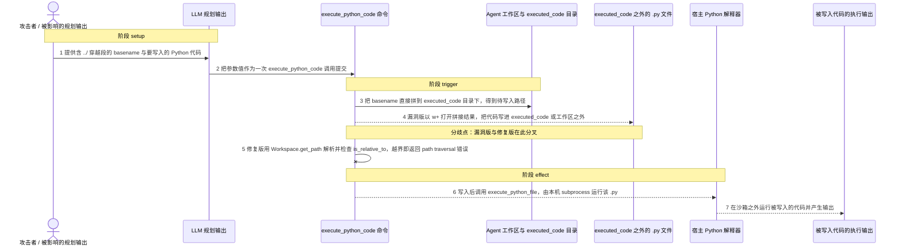
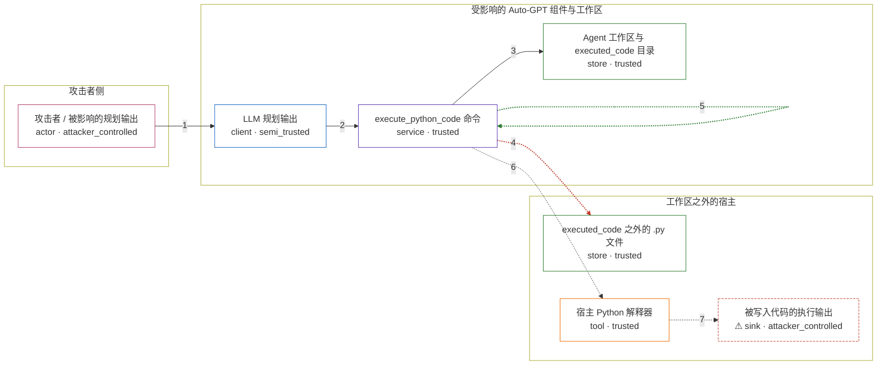

# auto-gpt / CVE-2023-37274

状态：草稿，未完成环境和复现。这个目录由模板生成，不构成漏洞确认。

图解的唯一来源是 `diagram.toml`：编辑后运行 `python3 -m runner diagram auto-gpt/CVE-2023-37274` 重新生成下方的图解区块。图解必须覆盖漏洞涉及的每个主体，并标出漏洞版/修复版的分歧步骤。

<!-- diagram:begin (generated from diagram.toml by `python3 -m runner diagram`; edit diagram.toml, not this block) -->
## 漏洞图解 — auto-gpt / CVE-2023-37274 漏洞图解

execute_python_code 把规划输出里的 basename 参数直接拼到 executed_code 目录后面，既不做路径归一化也不做包含性校验，于是 basename 中的 ../ 可以把 Python 代码写到 executed_code 甚至工作区之外。修复版改用 Workspace.get_path 解析路径并用 is_relative_to(code_dir) 判定越界，命中即返回 path traversal 错误。写入发生在执行之前，落进工作区的 .py 随后由宿主 Python 解释器运行，形成沙箱之外的代码执行。

### 涉及主体

| 主体 | 类型 | 信任级别 | 在漏洞里的作用 | 来源 |
| --- | --- | --- | --- | --- |
| 攻击者 / 被影响的规划输出 (`attacker`) | `actor` | `attacker_controlled` | 决定 execute_python_code 的 basename 与 code 两个参数取值，并在 basename 里塞入 ../ 穿越段。 | fixtures/attack.json |
| LLM 规划输出 (`planner`) | `client` | `semi_trusted` | 把不可信的自然语言目标转成一次 execute_python_code 工具调用，并原样转发攻击者给出的参数值。 | — |
| execute_python_code 命令 (`command`) | `service` | `trusted` | 把 basename 直接拼到 executed_code 目录后以 w+ 打开写入；漏洞版在写入前不做归一化与包含性校验。 | autogpt/commands/execute_code.py |
| Agent 工作区与 executed_code 目录 (`workspace`) | `store` | `trusted` | 本应把生成的 .py 限制在 executed_code 内；修复版用 Workspace.get_path 解析并检查 is_relative_to(code_dir)。 | — |
| executed_code 之外的 .py 文件 (`outside_file`) | `store` | `trusted` | 攻击者真正想覆盖的目标：工作区内的启动/工具脚本，或工作区之外任意可写的 .py 文件。 | — |
| 宿主 Python 解释器 (`interpreter`) | `tool` | `trusted` | 容器不可用时 execute_python_file 回退到本机 subprocess.run，在沙箱之外执行被覆盖的 .py。 | — |
| ⚠ 被写入代码的执行输出 (`execution_effect`) | `sink` | `attacker_controlled` | 攻击者代码在沙箱之外运行后产生的受控输出标记，代表代码执行效果本身。 | — |

**信任边界**

- **攻击者侧** (`attacker_side`)：成员 `attacker`。攻击者只能决定一次工具调用的参数字符串，不能在宿主上直接写文件。
- **受影响的 Auto-GPT 组件与工作区** (`product`)：成员 `planner`、`command`、`workspace`。这道边界把生成的 Python 文件限制在 executed_code 目录内；漏洞版在写入前不做包含性校验，边界失效。
- **工作区之外的宿主** (`host`)：成员 `outside_file`、`interpreter`、`execution_effect`。工作区之外的文件与解释器本来不受命令参数影响，穿越让它可被写入并执行。

标 ⚠ 的主体是本仓库合成的替身或无害效果载体，不代表真实外部目标。

### 触发过程

### 主体与信任边界

箭头上的数字是上面的步骤编号；方框只标主体和信任级别，具体动作见「触发过程」。

**分歧点**：第 4 步（`vulnerable_only`）漏洞版以 w+ 打开拼接结果，把代码写进 executed_code 或工作区之外。
**分歧点**：第 5 步（`patched_only`）修复版用 Workspace.get_path 解析并检查 is_relative_to，越界即返回 path traversal 错误。
<!-- diagram:end -->

## 公告与机制

TODO：官方公告、漏洞根因、Agent 信任边界、受影响范围和修复来源。

## 前提

TODO：认证要求、用户交互、已有批准、工具权限、攻击者能控制的内容。

## 版本与启动

TODO：补全 metadata、Dockerfile/镜像 digest 和 Compose，再写出精确启动命令。

Compose 中 `vulnerable` 与 `patched` profiles 分开使用；未指定 profile 不启动服务。镜像变量未配置时 Compose 会明确报错。此模板不暴露宿主端口，也不挂载主机数据。

## 机制复现

TODO：实现 `reproduce.py`，固定输入并执行真实漏洞路径，注明运行位置、参数和超时。

完成实现后使用 `python3 -m runner reproduce auto-gpt/CVE-2023-37274 --build --rounds 3`。
两脚本统一接受 `--context <context.json> --output <目录>`，详细字段见仓库 `docs/environment-contract.md`。
PoC 输出 `facts.json` 和效果文件；验证器只读证据，输出含 `target_ready` 及对应效果断言的 `verdict.json`。
镜像必须包含 Python 3 和 `/lab/` 下的脚本、fixtures；`runtime.mode` 选择 `oneshot` 或有 healthcheck 的 `service`。

## 端到端复现

TODO：实现 `end_to_end.py`；若不需要模型，明确写出不适用原因。真实模型的结果与机制复现分开统计。

## 验证与修复对照

TODO：实现 `verify.py`。记录漏洞版无害效果、修复版阻断和正常任务成功的证据，不能把服务启动失败当成阻断。

## 清理

默认运行器按每个测试的唯一 Compose project 清理容器、网络和 volume。
`--keep-on-failure` 保留失败项目，项目标识和 Compose 配置在结果目录中；仅清理该项目，不能使用全局 prune。

## 失败诊断

TODO：为本漏洞写出预期效果缺失、修复版仍有越界效果、正常任务失败及前提不满足时的具体排查路径。
启动失败、健康检查失败和超时都不能当作修复阻断。报告中应能定位到阶段、预期、实际和受控证据。

## 构建与输入

TODO：填写两版源码 archive、完整 commit，记录 `build.inputs` 中每个下载的 SHA-256；依赖安装必须支持禁网构建。
固定攻击和正常输入放入 `fixtures/` 并登记到 `fixtures/manifest.toml`。固定 seed、环境变量，说明无害效果与真实影响的关系。

## 隔离例外

默认无例外。确需例外时同时填写 `runtime.exceptions`、理由及最小范围，晋升由两位维护者审阅。

## 来源与许可

TODO：列出引用代码、fixtures 和镜像的来源及许可。
