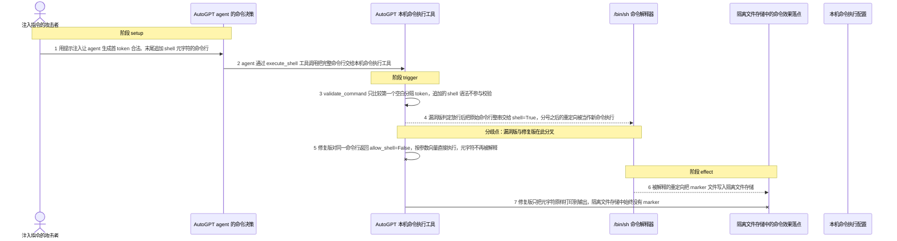
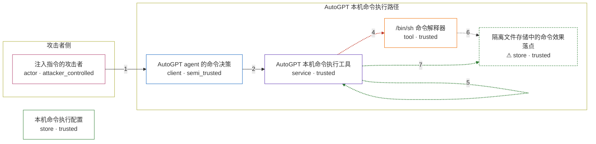

# autogpt / CVE-2024-1881

状态：草稿，未完成环境和复现。这个目录由模板生成，不构成漏洞确认。

图解的唯一来源是 `diagram.toml`：编辑后运行 `python3 -m runner diagram autogpt/CVE-2024-1881` 重新生成下方的图解区块。图解必须覆盖漏洞涉及的每个主体，并标出漏洞版/修复版的分歧步骤。

<!-- diagram:begin (generated from diagram.toml by `python3 -m runner diagram`; edit diagram.toml, not this block) -->
## 漏洞图解 — autogpt / CVE-2024-1881 漏洞图解

AutoGPT Classic 的 execute_shell 用 validate_command 只对命令行的第一个空白分隔 token 做 allowlist/denylist 判断，随后却把未经重写的原始字符串交给 subprocess 并以 shell=True 执行，被校验的对象和被执行的字符串不是同一个东西。攻击者只要让 agent 生成首 token 合法、后面追加 shell 元字符的命令行，就能越过命令过滤边界执行任意命令；图中以隔离文件存储里出现的合成 marker 表示这道边界的失效。

### 涉及主体

| 主体 | 类型 | 信任级别 | 在漏洞里的作用 | 来源 |
| --- | --- | --- | --- | --- |
| 注入指令的攻击者 (`attacker`) | `actor` | `attacker_controlled` | 在整条链上唯一可控的是让 agent 生成的命令行文本。它用提示注入把 shell 元字符带进本机命令执行工具，除此之外不能直接读写目标主机。 | fixtures/attack_command.txt |
| AutoGPT agent 的命令决策 (`agent`) | `client` | `semi_trusted` | 把（可被注入的）指令翻译成 execute_shell 的命令行字符串，并把它作为工具参数交给本机命令执行工具。 | — |
| AutoGPT 本机命令执行工具 (`execute_code`) | `service` | `trusted` | validate_command 只取第一个空白分隔 token 判断 allowlist/denylist，随后把未经重写的原始命令行交给 subprocess 执行；校验对象与执行对象不一致，这就是根因。 | — |
| /bin/sh 命令解释器 (`shell`) | `tool` | `trusted` | 以 shell=True 接收原始命令行，解释其中的分号、逻辑与管道、命令替换等元字符，把追加的片段当成新命令执行。 | — |
| ⚠ 隔离文件存储中的命令效果落点 (`results_store`) | `store` | `trusted` | 被追加的重定向命令在这里写入一个合成 marker 文件，用来表示任意命令执行产生的无害效果；它不是真实外部目标，也不代表对宿主机的实际破坏。 | — |
| 本机命令执行配置 (`config`) | `store` | `trusted` | execute_local_commands 默认 False、shell_command_control 默认 denylist、shell_denylist 默认 sudo/su；部署方显式打开本机命令执行是漏洞成立的前提。 | — |

**信任边界**

- **攻击者侧** (`attacker_side`)：成员 `attacker`。攻击者只能控制送进 agent 的指令文本，不能直接读写目标主机；命令过滤边界本该在它之后拦住越权命令。
- **AutoGPT 本机命令执行路径** (`product`)：成员 `agent`、`execute_code`、`shell`、`results_store`。这道边界期望 denylist/allowlist 只放行安全命令。漏洞让校验通过的原始命令行继续被 shell 解释，追加的片段因此越过了过滤边界。
- 未列入上述边界：`config`。

标 ⚠ 的主体是本仓库合成的替身或无害效果载体，不代表真实外部目标。

### 触发过程

### 主体与信任边界

箭头上的数字是上面的步骤编号；方框只标主体和信任级别，具体动作见「触发过程」。

**分歧点**：第 4 步（`vulnerable_only`）漏洞版判定放行后把原始命令行整串交给 shell=True，分号之后的重定向被当作新命令执行。
**分歧点**：第 5 步（`patched_only`）修复版对同一命令行返回 allow_shell=False，按参数向量直接执行，元字符不再被解释。
<!-- diagram:end -->

## 公告与机制

CVE-2024-1881（CWE-78，CNA 记录 CVSS:3.0 = 8.8 HIGH），产品 `significant-gravitas/autogpt`（AutoGPT Classic），官方受影响范围 `>= 0.5.0, < 0.5.1`。

- 漏洞路径：`autogpts/autogpt/autogpt/commands/execute_code.py` 的 `execute_shell` / `execute_shell_popen`。
- 根因：`validate_command` 只取 `command.split()[0]` 做 allowlist/denylist 判断，随后却把未经重写的原始字符串交给 `subprocess.run(..., shell=True)`；被校验的 token 和被执行的字符串不是同一个东西。
- 信任边界：命令行由 agent 决策产生（可经提示注入操纵），进入本机命令执行工具；denylist 本应只放行安全命令，但追加的 `;`、`&&`、`|`、`$()`、重定向、换行都不参与校验，因而被 shell 解释。
- 效果落点：以 AutoGPT 进程权限执行任意 OS 命令。
- 修复：提交 `5090f55eba388a664d7e5ee214178ab4791e8367`（PR #6903，`fix(agent/security): Mitigate shell injection vulnerabilities`）。`validate_command` 改为返回 `(allowed, allow_shell)`，控制生效时 `allow_shell=False`，执行点改用 `shlex.split` + `shell=False`，元字符退化为普通参数。
- 版本注意：CVE 记录引用的 `26324f29849967fa72c207da929af612f1740669` 是 `autogpt-v0.5.1` 发布 tag（发布边界），不是代码修复提交；直接用它与 parent 做 diff 看不到安全修复，因此 patched 源码必须固定在 `5090f55…`（或含它的 `autogpt-v0.5.1`）。

## 前提

- `EXECUTE_LOCAL_COMMANDS=True`。`execute_shell` / `execute_shell_popen` 由 `enabled=lambda config: config.execute_local_commands` 控制，该值默认 `False`；不显式打开时工具不暴露给 agent，漏洞路径不可达。本环境在 agent 替身上显式打开它。
- `shell_command_control` 保持默认 `denylist`，`shell_denylist` 保持默认 `["sudo", "su"]`，`shell_allowlist` 为空。allowlist 模式下只要首 token 在白名单内，追加的元字符同样会执行。
- `agent.workspace.root` 指向的目录存在且可写，因为 `execute_shell` 会 `os.chdir` 到该目录再切回。
- 攻击者在整条链上唯一能控制的是让 agent 生成的命令行文本（提示注入）；它不能直接操作宿主文件系统、也没有本机 shell 权限。

## 版本与启动

TODO：补全 metadata、Dockerfile/镜像 digest 和 Compose，再写出精确启动命令。

Compose 中 `vulnerable` 与 `patched` profiles 分开使用；未指定 profile 不启动服务。镜像变量未配置时 Compose 会明确报错。此模板不暴露宿主端口，也不挂载主机数据。

## 机制复现

`reproduce.py` 不重写漏洞逻辑：它定位并导入镜像里的上游 `autogpt.commands.execute_code` 模块，构造一个只暴露 `legacy_config` 与 `workspace.root` 的 agent 替身，直接调用上游 `execute_shell`（若该属性被 `@command` 包装则取其 `method`）。

- 运行位置：容器内 `/lab/reproduce.py`，输入从 `/lab/fixtures/` 读取，效果写入 `--output`（`/lab/results`）。
- 固定输入：`attack` 场景读 `fixtures/attack_command.txt`；`benign` 场景读 `fixtures/benign_command.txt`（普通允许命令）与 `fixtures/denied_command.txt`（首 token 为 `sudo`，应被 denylist 拦下）。
- 无害效果：攻击命令用 `;` 追加 `printf … > {effect_path}`，只有漏洞版把它交给 shell 才会生成 `shell-effect.txt`；修复版把同一行拆成参数向量执行，`;` 和 `>` 只是普通参数，不产生文件。所有 effect 都落在隔离的结果卷内，不接触真实外部目标。
- `observation.json` 显式记录 `target_ready` 与 `execution_status`，并带上上游模块路径与 SHA-256、命令行、stdout、是否被拒绝、效果是否存在。

完成实现后使用 `python3 -m runner reproduce autogpt/CVE-2024-1881 --build --rounds 3`。
两脚本统一接受 `--context <context.json> --output <目录>`，详细字段见仓库 `docs/environment-contract.md`。
PoC 输出 `facts.json` 和效果文件；验证器只读证据，输出含 `target_ready` 及对应效果断言的 `verdict.json`。
镜像必须包含 Python 3 和 `/lab/` 下的脚本、fixtures；`runtime.mode` 选择 `oneshot` 或有 healthcheck 的 `service`。

## 端到端复现

不适用：本漏洞由 agent 决策产生的命令行触发，但机制复现直接调用上游工具函数即可判定分叉，无需真实 LLM，`metadata.toml` 中 `requires_model = false`，`verification.end_to_end.status = "not_applicable"`。真实模型下的提示注入成功率属于独立实验，不能与本机制结果混算。

## 验证与修复对照

`verify.py` 只读 `facts.json`、`observation.json` 与哈希核对过的效果文件，不重跑攻击：

- `vulnerable_effect_observed`：`attack` + `vulnerable` 必须出现 `shell-effect.txt`，内容为 `AVH-CVE-2024-1881-SHELL-EFFECT`。
- `patched_effect_blocked`：`attack` + `patched` 不得出现该效果文件；`execute_shell` 正常返回且 stdout 只含字面量元字符。
- `benign_task_passed`：`benign` 两版都必须 `normal_rejected=False`、`normal_stdout` 含 `AVH-CVE-2024-1881-BENIGN-OK`、`denied_rejected=True`，且没有效果文件。

服务启动失败、超时、缺证据都不能当作修复阻断。

## 清理

默认运行器按每个测试的唯一 Compose project 清理容器、网络和 volume。
`--keep-on-failure` 保留失败项目，项目标识和 Compose 配置在结果目录中；仅清理该项目，不能使用全局 prune。

## 失败诊断

- `target_ready = false`：`autogpt` 模块没装上或不在 `sys.path` 上。检查 `observation.json` 的 `upstream_module` 与 `upstream_module_sha256`，确认镜像安装的是 `af3ebdf6…`（漏洞版）或 `5090f55…`（修复版）的 `execute_code.py`。
- 漏洞版攻击缺 `shell-effect.txt`：确认 agent 替身上 `execute_local_commands=True`、`shell_command_control="denylist"`，且 `/lab/results` 可写；不要据此判定漏洞不存在。
- 修复版攻击仍有 `shell-effect.txt`：说明 patched 源码固定在发布 tag `26324f29…` 而不是修复提交 `5090f55…`，或执行点仍是 `shell=True`；修复对照失败，检查版本固定。
- `benign` 场景 `denied_rejected=False`：denylist 没生效或 `shell_denylist` 被改写；正常任务失败时不能判定复现通过。
- 启动失败、健康检查失败和超时都不能当作修复阻断。报告中应能定位到阶段、预期、实际和受控证据。

## 构建与输入

TODO：填写两版源码 archive、完整 commit，记录 `build.inputs` 中每个下载的 SHA-256；依赖安装必须支持禁网构建。
固定攻击和正常输入放入 `fixtures/` 并登记到 `fixtures/manifest.toml`。固定 seed、环境变量，说明无害效果与真实影响的关系。

## 隔离例外

默认无例外。确需例外时同时填写 `runtime.exceptions`、理由及最小范围，晋升由两位维护者审阅。

## 来源与许可

- 上游代码：<https://github.com/Significant-Gravitas/AutoGPT>，vulnerable `af3ebdf6af1704e42254ad07791bf7e1642c43d3`（`autogpt-v0.5.0`，文件 blob `93bfd53d40e3190ed946ed4ff568fac22059624c`），patched `5090f55eba388a664d7e5ee214178ab4791e8367`（PR #6903，文件 blob `dff993504284b0fc11fac5d505fee1d87307f537`）；许可见上游仓库。
- 公告与修复对照：<https://nvd.nist.gov/vuln/detail/CVE-2024-1881>、<https://api.osv.dev/v1/vulns/CVE-2024-1881>、<https://github.com/Significant-Gravitas/AutoGPT/pull/6903>。
- fixtures 与图解均为本环境手写的合成输入，不含真实凭据、真实用户数据或真实外部目标；详见 `fixtures/README.md` 与 `research/public.md`。
