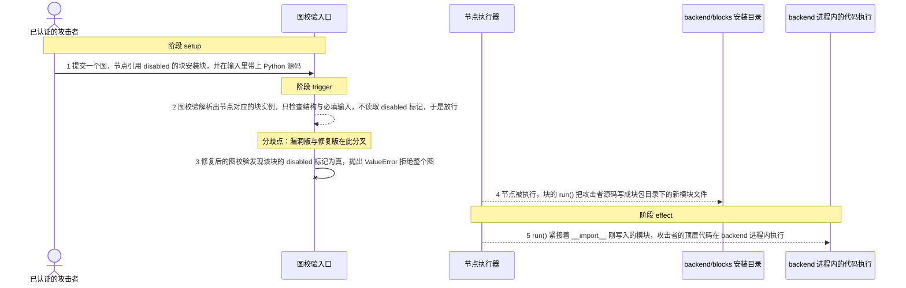
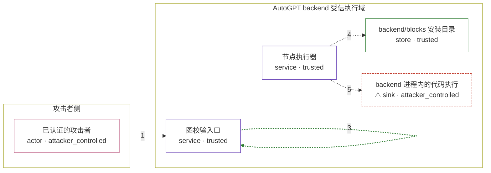

# autogpt / CVE-2026-26020

状态：草稿，未完成环境和复现。这个目录由模板生成，不构成漏洞确认。

图解的唯一来源是 `diagram.toml`：编辑后运行 `python3 -m runner diagram autogpt/CVE-2026-26020` 重新生成下方的图解区块。图解必须覆盖漏洞涉及的每个主体，并标出漏洞版/修复版的分歧步骤。

<!-- diagram:begin (generated from diagram.toml by `python3 -m runner diagram`; edit diagram.toml, not this block) -->
## 漏洞图解 — autogpt / CVE-2026-26020 漏洞图解

AutoGPT 的图校验用 get_block 解析每个节点引用的块实例，却从不读取块自身的 disabled 标记，因此已认证用户可以提交一个包含 BlockInstallationBlock 的图。BlockInstallationBlock 的 run() 会把节点输入里的 Python 源码写进 backend/blocks 目录并立刻 __import__ 该模块，于是攻击者提供的代码在 backend 进程内执行。修复版本在图校验和节点执行两处都拒绝 disabled 块。

### 涉及主体

| 主体 | 类型 | 信任级别 | 在漏洞里的作用 | 来源 |
| --- | --- | --- | --- | --- |
| 已认证的攻击者 (`attacker`) | `actor` | `attacker_controlled` | 构造一次图提交：节点引用 disabled 的 BlockInstallationBlock，并在节点输入里放入想要执行的 Python 源码。攻击者只控制这次提交的内容，拿不到 backend 主机的文件权限。 | fixtures/attack_graph.json |
| 图校验入口 (`graph_api`) | `service` | `trusted` | 接收图创建/更新请求，用 get_block 解析节点引用的块实例并做结构与必填输入校验；它的白名单、推荐列表和直接执行端点都会过滤 disabled 块，唯独图校验这一条路径不读 disabled 标记。 | — |
| 节点执行器 (`executor`) | `service` | `trusted` | 按图结构执行节点：取回节点对应的块实例并调用它的 run()。它在执行前只校验输入数据，不重新检查块是否 disabled。 | — |
| backend/blocks 安装目录 (`blocks_dir`) | `store` | `trusted` | backend 进程里已安装的块包目录。BlockInstallationBlock.run() 以输入中的 UUID 为文件名，把攻击者源码写成该目录下的新模块。 | — |
| ⚠ backend 进程内的代码执行 (`code_sink`) | `sink` | `attacker_controlled` | 攻击者的顶层语句在 backend 进程内被导入并执行，效果落在一个无害的标记文件上；它代表被攻陷的 backend 进程，不是真实的外部目标。 | — |

**信任边界**

- **攻击者侧** (`attacker_side`)：成员 `attacker`。攻击者能控制这次图提交的节点、块引用和输入内容；它不能直接写 backend 宿主机的文件，只能通过产品接口提交。
- **AutoGPT backend 受信执行域** (`backend_process`)：成员 `graph_api`、`executor`、`blocks_dir`、`code_sink`。这道边界本来只让已部署的块代码在 backend 进程内运行。漏洞让图校验放行了 disabled 块，执行器于是把攻击者源码写进块目录并导入，边界随之失效。

标 ⚠ 的主体是本仓库合成的替身或无害效果载体，不代表真实外部目标。

### 触发过程

### 主体与信任边界

箭头上的数字是上面的步骤编号；方框只标主体和信任级别，具体动作见「触发过程」。

**分歧点**：第 2 步（`vulnerable_only`）图校验解析出节点对应的块实例，只检查结构与必填输入，不读取 disabled 标记，于是放行。
**分歧点**：第 3 步（`patched_only`）修复后的图校验发现该块的 disabled 标记为真，抛出 ValueError 拒绝整个图。
<!-- diagram:end -->

## 公告与机制

TODO：官方公告、漏洞根因、Agent 信任边界、受影响范围和修复来源。

## 前提

TODO：认证要求、用户交互、已有批准、工具权限、攻击者能控制的内容。

## 版本与启动

TODO：补全 metadata、Dockerfile/镜像 digest 和 Compose，再写出精确启动命令。

Compose 中 `vulnerable` 与 `patched` profiles 分开使用；未指定 profile 不启动服务。镜像变量未配置时 Compose 会明确报错。此模板不暴露宿主端口，也不挂载主机数据。

## 机制复现

TODO：实现 `reproduce.py`，固定输入并执行真实漏洞路径，注明运行位置、参数和超时。

完成实现后使用 `python3 -m runner reproduce autogpt/CVE-2026-26020 --build --rounds 3`。
两脚本统一接受 `--context <context.json> --output <目录>`，详细字段见仓库 `docs/environment-contract.md`。
PoC 输出 `facts.json` 和效果文件；验证器只读证据，输出含 `target_ready` 及对应效果断言的 `verdict.json`。
镜像必须包含 Python 3 和 `/lab/` 下的脚本、fixtures；`runtime.mode` 选择 `oneshot` 或有 healthcheck 的 `service`。

## 端到端复现

TODO：实现 `end_to_end.py`；若不需要模型，明确写出不适用原因。真实模型的结果与机制复现分开统计。

## 验证与修复对照

TODO：实现 `verify.py`。记录漏洞版无害效果、修复版阻断和正常任务成功的证据，不能把服务启动失败当成阻断。

## 清理

默认运行器按每个测试的唯一 Compose project 清理容器、网络和 volume。
`--keep-on-failure` 保留失败项目，项目标识和 Compose 配置在结果目录中；仅清理该项目，不能使用全局 prune。

## 失败诊断

TODO：为本漏洞写出预期效果缺失、修复版仍有越界效果、正常任务失败及前提不满足时的具体排查路径。
启动失败、健康检查失败和超时都不能当作修复阻断。报告中应能定位到阶段、预期、实际和受控证据。

## 构建与输入

TODO：填写两版源码 archive、完整 commit，记录 `build.inputs` 中每个下载的 SHA-256；依赖安装必须支持禁网构建。
固定攻击和正常输入放入 `fixtures/` 并登记到 `fixtures/manifest.toml`。固定 seed、环境变量，说明无害效果与真实影响的关系。

## 隔离例外

默认无例外。确需例外时同时填写 `runtime.exceptions`、理由及最小范围，晋升由两位维护者审阅。

## 来源与许可

TODO：列出引用代码、fixtures 和镜像的来源及许可。
