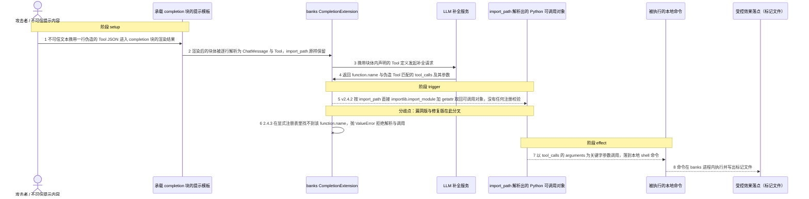
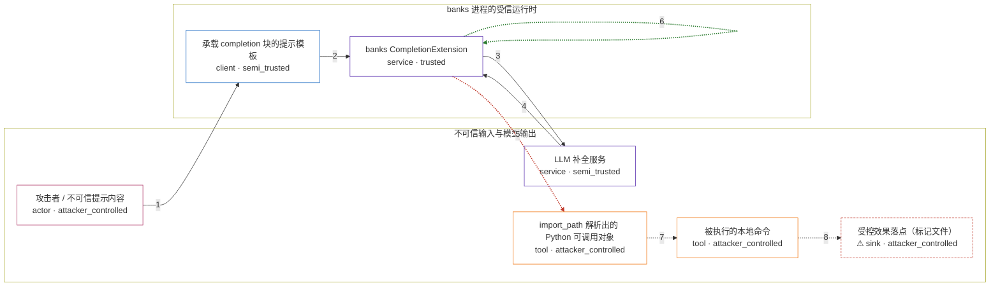

# banks / CVE-2026-61536

状态：草稿，未完成环境和复现。这个目录由模板生成，不构成漏洞确认。

图解的唯一来源是 `diagram.toml`：编辑后运行 `python3 -m runner diagram banks/CVE-2026-61536` 重新生成下方的图解区块。图解必须覆盖漏洞涉及的每个主体，并标出漏洞版/修复版的分歧步骤。

<!-- diagram:begin (generated from diagram.toml by `python3 -m runner diagram`; edit diagram.toml, not this block) -->
## 漏洞图解 — banks / CVE-2026-61536 任意 import_path 解析导致代码执行

banks 的 CompletionExtension 把  块体的每一行都尝试解析成 Tool，而 Tool 模型自带的 import_path 字段没有任何白名单。当模型返回的 tool_calls 命中该 Tool 的 function.name 时，v2.4.2 对 import_path 直接执行 importlib.import_module 加 getattr，并把 tool_call.arguments 作为关键字参数调用取回的可调用对象。攻击者因此只需让一行纯文本 Tool JSON 进入块体，就能在 banks 进程内执行任意可导入的 Python 属性，例如 subprocess.getoutput。2.4.3 改为只从显式注册表解析 callable，未注册即抛 ValueError 并在调用前阻断。

### 涉及主体

| 主体 | 类型 | 信任级别 | 在漏洞里的作用 | 来源 |
| --- | --- | --- | --- | --- |
| 攻击者 / 不可信提示内容 (`attacker`) | `actor` | `attacker_controlled` | 把一行伪造的 Tool JSON 作为不可信文本送进 completion 块体，并在同一次请求里诱导模型返回同名的 tool_calls。 | fixtures/attack/injected_tool.json |
| 承载 completion 块的提示模板 (`prompt_template`) | `client` | `semi_trusted` | 把不可信内容插值进受信块体，并在块体内声明模型与工具定义，是恶意 Tool JSON 进入渲染结果的通道。 | fixtures/attack/completion_template.j2 |
| banks CompletionExtension (`completion_extension`) | `service` | `trusted` | 把块体逐行解析成 ChatMessage 与 Tool，再按 tool_calls 解析要调用的可调用对象；v2.4.2 在这里用 import_path 直接做 importlib 解析。 | src/banks/extensions/completion.py |
| LLM 补全服务 (`llm_service`) | `service` | `semi_trusted` | 返回携带 tool_calls 的响应；function.name 与 arguments 由攻击者诱导的上下文决定，本身不构成可信的调用依据。 | fixtures/attack/model_response.json |
| import_path 解析出的 Python 可调用对象 (`resolved_callable`) | `tool` | `attacker_controlled` | 攻击者通过 import_path 选定的任意可导入属性，例如 subprocess.getoutput；它取代了本该由开发者在 tool 过滤器里显式注册的 callable。 | subprocess.getoutput |
| 被执行的本地命令 (`shell_command`) | `tool` | `attacker_controlled` | 以 tool_calls 的 arguments 为参数运行，命令内容完全由模型响应中攻击者选定的参数决定。 | — |
| ⚠ 受控效果落点（标记文件） (`canary_file`) | `sink` | `attacker_controlled` | 命令执行后写出的标记文件，代表攻击者在 banks 进程里拿到的代码执行效果；它不是真实的外部目标。 | — |

**信任边界**

- **不可信输入与模型输出** (`untrusted_inputs`)：成员 `attacker`、`llm_service`、`resolved_callable`、`shell_command`、`canary_file`。攻击者控制进入块体的文本、被解析出的目标属性与命令参数，模型输出受这些文本诱导；这条链上的任何内容都不能作为代码执行依据。
- **banks 进程的受信运行时** (`trusted_runtime`)：成员 `prompt_template`、`completion_extension`。这里本该只调用开发者通过 tool 过滤器显式注册的 callable；v2.4.2 让 import_path 直接决定 importlib 的目标，这道边界因此失效。

标 ⚠ 的主体是本仓库合成的替身或无害效果载体，不代表真实外部目标。

### 触发过程

### 主体与信任边界

箭头上的数字是上面的步骤编号；方框只标主体和信任级别，具体动作见「触发过程」。

**分歧点**：第 5 步（`vulnerable_only`）v2.4.2 按 import_path 直接 importlib.import_module 加 getattr 取回可调用对象，没有任何注册校验。
**分歧点**：第 6 步（`patched_only`）2.4.3 在显式注册表里找不到该 function.name，抛 ValueError 拒绝解析与调用。
<!-- diagram:end -->

## 公告与机制

TODO：官方公告、漏洞根因、Agent 信任边界、受影响范围和修复来源。

## 前提

TODO：认证要求、用户交互、已有批准、工具权限、攻击者能控制的内容。

## 版本与启动

TODO：补全 metadata、Dockerfile/镜像 digest 和 Compose，再写出精确启动命令。

Compose 中 `vulnerable` 与 `patched` profiles 分开使用；未指定 profile 不启动服务。镜像变量未配置时 Compose 会明确报错。此模板不暴露宿主端口，也不挂载主机数据。

## 机制复现

TODO：实现 `reproduce.py`，固定输入并执行真实漏洞路径，注明运行位置、参数和超时。

完成实现后使用 `python3 -m runner reproduce banks/CVE-2026-61536 --build --rounds 3`。
两脚本统一接受 `--context <context.json> --output <目录>`，详细字段见仓库 `docs/environment-contract.md`。
PoC 输出 `facts.json` 和效果文件；验证器只读证据，输出含 `target_ready` 及对应效果断言的 `verdict.json`。
镜像必须包含 Python 3 和 `/lab/` 下的脚本、fixtures；`runtime.mode` 选择 `oneshot` 或有 healthcheck 的 `service`。

## 端到端复现

TODO：实现 `end_to_end.py`；若不需要模型，明确写出不适用原因。真实模型的结果与机制复现分开统计。

## 验证与修复对照

TODO：实现 `verify.py`。记录漏洞版无害效果、修复版阻断和正常任务成功的证据，不能把服务启动失败当成阻断。

## 清理

默认运行器按每个测试的唯一 Compose project 清理容器、网络和 volume。
`--keep-on-failure` 保留失败项目，项目标识和 Compose 配置在结果目录中；仅清理该项目，不能使用全局 prune。

## 失败诊断

TODO：为本漏洞写出预期效果缺失、修复版仍有越界效果、正常任务失败及前提不满足时的具体排查路径。
启动失败、健康检查失败和超时都不能当作修复阻断。报告中应能定位到阶段、预期、实际和受控证据。

## 构建与输入

TODO：填写两版源码 archive、完整 commit，记录 `build.inputs` 中每个下载的 SHA-256；依赖安装必须支持禁网构建。
固定攻击和正常输入放入 `fixtures/` 并登记到 `fixtures/manifest.toml`。固定 seed、环境变量，说明无害效果与真实影响的关系。

## 隔离例外

默认无例外。确需例外时同时填写 `runtime.exceptions`、理由及最小范围，晋升由两位维护者审阅。

## 来源与许可

TODO：列出引用代码、fixtures 和镜像的来源及许可。
