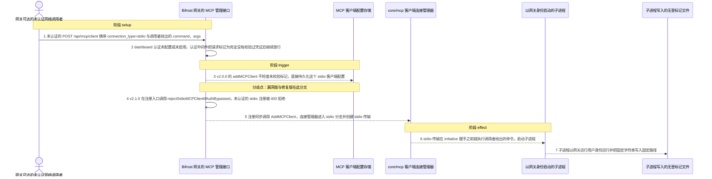
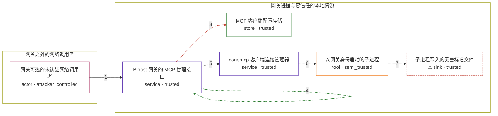

# bifrost / CVE-2026-90898

状态：草稿，未完成环境和复现。这个目录由模板生成，不构成漏洞确认。

图解的唯一来源是 `diagram.toml`：编辑后运行 `python3 -m runner diagram bifrost/CVE-2026-90898` 重新生成下方的图解区块。图解必须覆盖漏洞涉及的每个主体，并标出漏洞版/修复版的分歧步骤。

<!-- diagram:begin (generated from diagram.toml by `python3 -m runner diagram`; edit diagram.toml, not this block) -->
## 漏洞图解 — bifrost / CVE-2026-90898 未认证 MCP stdio 注册导致命令执行

Bifrost 的 dashboard 认证未配置或未启用时，认证中间件把请求标记为“完全没有校验过凭证”，并继续交给下游 handler（BifrostContextKeyAuthBypassed）。v2.0.0 的 POST /api/mcp/client handler 没有检查这个标记，于是一次未认证请求就能注册 stdio MCP 客户端；注册被同步执行，core/mcp 的连接管理器随即为 stdio 分支建立传输，mcp-go 的 stdio 传输在 initialize 握手之前就用调用者给出的 command 与 args 启动了子进程，子进程以网关运行用户身份执行。v2.1.0 在注册入口新增 rejectStdioMCPClientIfAuthBypassed，对未认证的 stdio 注册直接返回 403，在任何 spawn 之前切断这条链。

### 涉及主体

| 主体 | 类型 | 信任级别 | 在漏洞里的作用 | 来源 |
| --- | --- | --- | --- | --- |
| 网关可达的未认证网络调用者 (`attacker`) | `actor` | `attacker_controlled` | 不需要任何凭证，只需要能路由到网关端口；它完全控制这次请求体的 connection_type 与 stdio_config.command/args，但控制不了网关主机上的文件。 | fixtures/attack.json |
| Bifrost 网关的 MCP 管理接口 (`gateway`) | `service` | `trusted` | transports/bifrost-http 的认证中间件在这里判定 dashboard 认证是否启用，POST /api/mcp/client（addMCPClient）在这里决定是否放行 stdio 注册；v2.0.0 缺失 AuthBypassed 检查，v2.1.0 在同一入口补上 403 gate。 | transports/bifrost-http/handlers/mcp.go |
| MCP 客户端配置存储 (`config_store`) | `store` | `trusted` | stdio 客户端配置在注册时被持久化；config store 不可用时 handler 直接返回 503，所以可用的存储是触发链的前提。 | — |
| core/mcp 客户端连接管理器 (`mcp_manager`) | `service` | `trusted` | 注册动作同步调用 AddClient，为非禁用的客户端建立状态，并转入 connectToMCPClient 的 stdio 分支。 | core/mcp/clientmanager.go |
| 以网关身份启动的子进程 (`stdio_child`) | `tool` | `semi_trusted` | mark3labs/mcp-go 的 stdio 传输把调用者给出的 command/args 交给 exec.CommandContext；进程在 initialize 握手之前就已启动，并以网关运行用户（官方镜像为 appuser）执行。 | core/mcp/clientmanager.go |
| ⚠ 子进程写入的无害标记文件 (`marker_file`) | `sink` | `trusted` | 漏洞效果的受控落点：被启动的程序把固定字符串写入固定路径，用来证明命令确实以网关身份被执行。它只是一个无害的效果载体，不是真实的外部目标。 | — |

**信任边界**

- **网关之外的网络调用者** (`remote`)：成员 `attacker`。攻击者只能控制一次 HTTP 请求体；它没有网关主机上的读写权限，也不持有任何 admin 凭证。
- **网关进程与它信任的本地资源** (`product`)：成员 `gateway`、`config_store`、`mcp_manager`、`stdio_child`、`marker_file`。管理接口本应只由已认证的 admin 调用。认证未启用时中间件把请求原样交给下游，并用 AuthBypassed 标出“未校验”；漏洞就是下游没有把这个标记当成拒绝条件。

标 ⚠ 的主体是本仓库合成的替身或无害效果载体，不代表真实外部目标。

### 触发过程

### 主体与信任边界

箭头上的数字是上面的步骤编号；方框只标主体和信任级别，具体动作见「触发过程」。

**分歧点**：第 3 步（`vulnerable_only`）v2.0.0 的 addMCPClient 不检查未校验标记，直接持久化这个 stdio 客户端配置。
**分歧点**：第 4 步（`patched_only`）v2.1.0 在注册入口调用 rejectStdioMCPClientIfAuthBypassed，未认证的 stdio 注册被 403 拒绝。
<!-- diagram:end -->

## 公告与机制

TODO：官方公告、漏洞根因、Agent 信任边界、受影响范围和修复来源。

## 前提

TODO：认证要求、用户交互、已有批准、工具权限、攻击者能控制的内容。

## 版本与启动

TODO：补全 metadata、Dockerfile/镜像 digest 和 Compose，再写出精确启动命令。

Compose 中 `vulnerable` 与 `patched` profiles 分开使用；未指定 profile 不启动服务。镜像变量未配置时 Compose 会明确报错。此模板不暴露宿主端口，也不挂载主机数据。

## 机制复现

TODO：实现 `reproduce.py`，固定输入并执行真实漏洞路径，注明运行位置、参数和超时。

完成实现后使用 `python3 -m runner reproduce bifrost/CVE-2026-90898 --build --rounds 3`。
两脚本统一接受 `--context <context.json> --output <目录>`，详细字段见仓库 `docs/environment-contract.md`。
PoC 输出 `facts.json` 和效果文件；验证器只读证据，输出含 `target_ready` 及对应效果断言的 `verdict.json`。
镜像必须包含 Python 3 和 `/lab/` 下的脚本、fixtures；`runtime.mode` 选择 `oneshot` 或有 healthcheck 的 `service`。

## 端到端复现

TODO：实现 `end_to_end.py`；若不需要模型，明确写出不适用原因。真实模型的结果与机制复现分开统计。

## 验证与修复对照

TODO：实现 `verify.py`。记录漏洞版无害效果、修复版阻断和正常任务成功的证据，不能把服务启动失败当成阻断。

## 清理

默认运行器按每个测试的唯一 Compose project 清理容器、网络和 volume。
`--keep-on-failure` 保留失败项目，项目标识和 Compose 配置在结果目录中；仅清理该项目，不能使用全局 prune。

## 失败诊断

TODO：为本漏洞写出预期效果缺失、修复版仍有越界效果、正常任务失败及前提不满足时的具体排查路径。
启动失败、健康检查失败和超时都不能当作修复阻断。报告中应能定位到阶段、预期、实际和受控证据。

## 构建与输入

TODO：填写两版源码 archive、完整 commit，记录 `build.inputs` 中每个下载的 SHA-256；依赖安装必须支持禁网构建。
固定攻击和正常输入放入 `fixtures/` 并登记到 `fixtures/manifest.toml`。固定 seed、环境变量，说明无害效果与真实影响的关系。

## 隔离例外

默认无例外。确需例外时同时填写 `runtime.exceptions`、理由及最小范围，晋升由两位维护者审阅。

## 来源与许可

TODO：列出引用代码、fixtures 和镜像的来源及许可。
