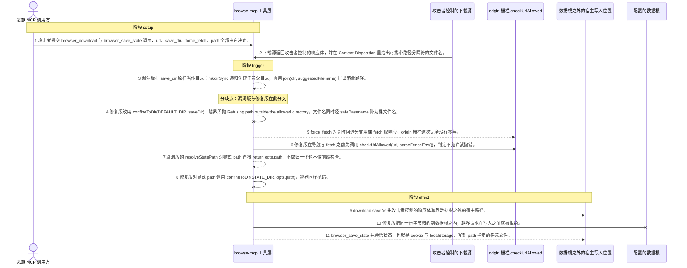
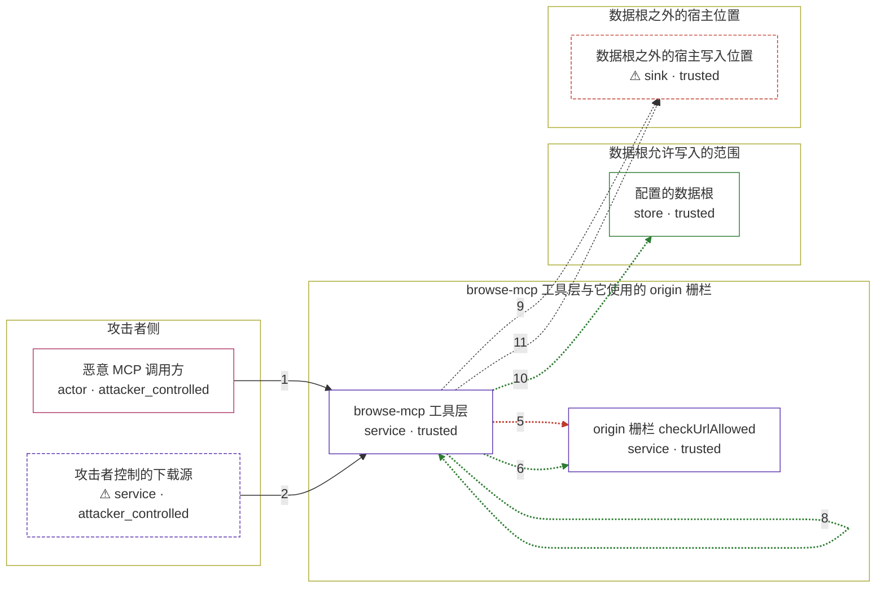

# browse-mcp / CVE-2026-55557

状态：草稿，未完成环境和复现。这个目录由模板生成，不构成漏洞确认。

图解的唯一来源是 `diagram.toml`：编辑后运行 `python3 -m runner diagram browse-mcp/CVE-2026-55557` 重新生成下方的图解区块。图解必须覆盖漏洞涉及的每个主体，并标出漏洞版/修复版的分歧步骤。

<!-- diagram:begin (generated from diagram.toml by `python3 -m runner diagram`; edit diagram.toml, not this block) -->
## 漏洞图解 — browse-mcp / CVE-2026-55557 下载与会话状态写入路径越界

browse-mcp 的 browser_download 与 browser_save_state 把 MCP 调用方给的 save_dir 与 path 参数直接当作文件系统目标：save_dir 未经归一化就交给 mkdirSync 与 join，显式 path 也被 resolveStatePath 原样返回，于是写入落在配置的数据根之外。同一路径上 force_fetch 回退还用裸 fetch 取响应，绕过了 src/fence.ts 里的 origin 栅栏。修复版新增 confineToDir 与 safeBasename，把目标限制在数据根内并对文件名做 basename 归约，越界即抛错。最终效果是攻击者控制的响应体或会话状态被写到数据根之外的宿主位置。

### 涉及主体

| 主体 | 类型 | 信任级别 | 在漏洞里的作用 | 来源 |
| --- | --- | --- | --- | --- |
| 恶意 MCP 调用方 (`attacker`) | `actor` | `attacker_controlled` | 以 MCP 客户端身份调用工具，或被访问页面间接提示注入操纵的 agent。它完全控制这次调用的参数：browser_download 的 url、save_dir、force_fetch，以及 browser_save_state 的 name 与 path；它够不着数据根之外的宿主文件。 | fixtures/attack.json |
| ⚠ 攻击者控制的下载源 (`attacker_source`) | `service` | `attacker_controlled` | 攻击者自己那一侧的 HTTP 源，响应体就是最终落到宿主上的字节，Content-Disposition 里的文件名同样由它给出。它代表外部攻击者主机，不是真实互联网目标。 | — |
| browse-mcp 工具层 (`browse_mcp`) | `service` | `trusted` | 受影响的上游组件。src/download.ts 的 downloadUrl 用 saveDir 拼出写入目录，src/state.ts 的 resolveStatePath 对显式 path 原样返回，src/tools/session.ts 的 handler 随后把结果交给 page.context().storageState({path}) 与 download.saveAs()。构造路径到落盘之间没有任何包含性检查。 | https://github.com/That1Drifter/browse-mcp/blob/0924d487acaf56de5727a80b8ce475528f02d97c/src/download.ts |
| origin 栅栏 checkUrlAllowed (`origin_fence`) | `service` | `trusted` | src/fence.ts 里的 origin 白名单与黑名单判定，本该在取任何 URL 之前拦住不允许的 origin。漏洞版只在导航路径上调用它，force_fetch 的回退分支用裸 fetch 取响应，这次判定没有机会运行。 | https://github.com/That1Drifter/browse-mcp/blob/0924d487acaf56de5727a80b8ce475528f02d97c/src/fence.ts |
| 配置的数据根 (`data_root`) | `store` | `trusted` | download 根与 state 根，由 BROWSE_MCP_HOME 重定位，默认在用户主目录下。它们才是这两个工具被允许写入的范围，也是修复版 confineToDir 的基准目录。 | — |
| ⚠ 数据根之外的宿主写入位置 (`host_path`) | `sink` | `trusted` | 越界写入最终落到的宿主路径，例如自启动目录或计划任务目录。攻击者本来写不到这里，否则不必绕这一圈；本图里它是一个受控的无害标记位置，不是真实外部目标。 | — |

**信任边界**

- **攻击者侧** (`attacker_side`)：成员 `attacker`、`attacker_source`。攻击者在这里能控制自己发出的工具参数、自己托管的响应体和文件名；它够不着数据根之外的宿主路径。
- **browse-mcp 工具层与它使用的 origin 栅栏** (`tool_layer`)：成员 `browse_mcp`、`origin_fence`。这道边界本该保证工具只把字节写到数据根内、只从允许的 origin 取内容。漏洞版既没有对目录参数做包含性检查，也把 origin 判定漏在了回退分支之外。
- **数据根允许写入的范围** (`confined_root`)：成员 `data_root`。download 与 state 两个根是工具被授权写入的全部范围。修复版的 confineToDir 用 resolve 归一化后要求结果等于根或以根加分隔符开头，越界即抛错。
- **数据根之外的宿主位置** (`host_target`)：成员 `host_path`。受保护的一侧：这里的文件本应只有宿主自身的进程能写。漏洞让攻击者控制的字节出现在这里。

标 ⚠ 的主体是本仓库合成的替身或无害效果载体，不代表真实外部目标。

### 触发过程

### 主体与信任边界

箭头上的数字是上面的步骤编号；方框只标主体和信任级别，具体动作见「触发过程」。

**分歧点**：第 3 步（`vulnerable_only`）漏洞版把 save_dir 原样当作目录：mkdirSync 递归创建任意父目录，再用 join(dir, suggestedFilename) 拼出落盘路径。。
**分歧点**：第 4 步（`patched_only`）修复版改用 confineToDir(DEFAULT_DIR, saveDir)，越界即抛 Refusing path outside the allowed directory，文件名同时经 safeBasename 降为裸文件名。。
**分歧点**：第 5 步（`vulnerable_only`）force_fetch 为真时回退分支用裸 fetch 取响应，origin 栅栏这次完全没有参与。。
**分歧点**：第 6 步（`patched_only`）修复版在导航与 fetch 之前先调用 checkUrlAllowed(url, parseFenceEnv())，判定不允许就抛错。。
**分歧点**：第 7 步（`vulnerable_only`）漏洞版的 resolveStatePath 对显式 path 直接 return opts.path，不做归一化也不做前缀检查。。
**分歧点**：第 8 步（`patched_only`）修复版对显式 path 调用 confineToDir(STATE_DIR, opts.path)，越界同样抛错。。
<!-- diagram:end -->

## 公告与机制

TODO：官方公告、漏洞根因、Agent 信任边界、受影响范围和修复来源。

## 前提

TODO：认证要求、用户交互、已有批准、工具权限、攻击者能控制的内容。

## 版本与启动

TODO：补全 metadata、Dockerfile/镜像 digest 和 Compose，再写出精确启动命令。

Compose 中 `vulnerable` 与 `patched` profiles 分开使用；未指定 profile 不启动服务。镜像变量未配置时 Compose 会明确报错。此模板不暴露宿主端口，也不挂载主机数据。

## 机制复现

TODO：实现 `reproduce.py`，固定输入并执行真实漏洞路径，注明运行位置、参数和超时。

完成实现后使用 `python3 -m runner reproduce browse-mcp/CVE-2026-55557 --build --rounds 3`。
两脚本统一接受 `--context <context.json> --output <目录>`，详细字段见仓库 `docs/environment-contract.md`。
PoC 输出 `facts.json` 和效果文件；验证器只读证据，输出含 `target_ready` 及对应效果断言的 `verdict.json`。
镜像必须包含 Python 3 和 `/lab/` 下的脚本、fixtures；`runtime.mode` 选择 `oneshot` 或有 healthcheck 的 `service`。

## 端到端复现

TODO：实现 `end_to_end.py`；若不需要模型，明确写出不适用原因。真实模型的结果与机制复现分开统计。

## 验证与修复对照

TODO：实现 `verify.py`。记录漏洞版无害效果、修复版阻断和正常任务成功的证据，不能把服务启动失败当成阻断。

## 清理

默认运行器按每个测试的唯一 Compose project 清理容器、网络和 volume。
`--keep-on-failure` 保留失败项目，项目标识和 Compose 配置在结果目录中；仅清理该项目，不能使用全局 prune。

## 失败诊断

TODO：为本漏洞写出预期效果缺失、修复版仍有越界效果、正常任务失败及前提不满足时的具体排查路径。
启动失败、健康检查失败和超时都不能当作修复阻断。报告中应能定位到阶段、预期、实际和受控证据。

## 构建与输入

TODO：填写两版源码 archive、完整 commit，记录 `build.inputs` 中每个下载的 SHA-256；依赖安装必须支持禁网构建。
固定攻击和正常输入放入 `fixtures/` 并登记到 `fixtures/manifest.toml`。固定 seed、环境变量，说明无害效果与真实影响的关系。

## 隔离例外

默认无例外。确需例外时同时填写 `runtime.exceptions`、理由及最小范围，晋升由两位维护者审阅。

## 来源与许可

TODO：列出引用代码、fixtures 和镜像的来源及许可。
