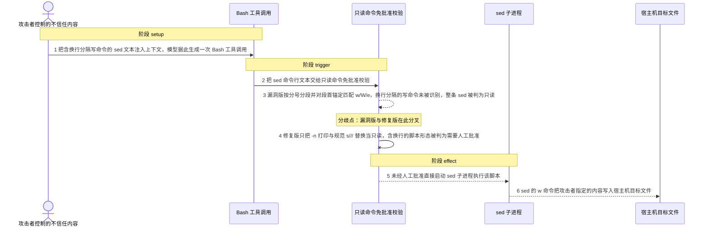
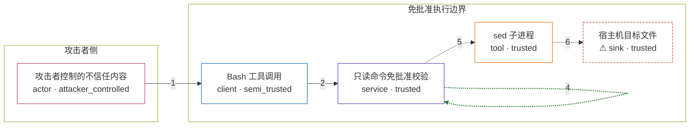

# claude-code / CVE-2025-64755

状态：草稿，未完成环境和复现。这个目录由模板生成，不构成漏洞确认。

图解的唯一来源是 `diagram.toml`：编辑后运行 `python3 -m runner diagram claude-code/CVE-2025-64755` 重新生成下方的图解区块。图解必须覆盖漏洞涉及的每个主体，并标出漏洞版/修复版的分歧步骤。

<!-- diagram:begin (generated from diagram.toml by `python3 -m runner diagram`; edit diagram.toml, not this block) -->
## 漏洞图解 — claude-code / CVE-2025-64755 漏洞图解

Claude Code 在执行 Bash 工具调用前，用内置的只读命令表决定哪些命令可以免人工批准。漏洞版的 sed 附加危险判定按分号切分脚本、并以段首锚定匹配 w/W/e 写命令，所以一条用换行分隔写命令的 sed 脚本（先打印、再换行写文件）不会命中任何写命令模式，整条命令被当成只读。于是这条能写任意文件的命令直接执行，sed 的 w 把攻击者指定的内容写到宿主机文件系统上。修复版把判定改成白名单：只有 -n 搭配纯 p/N/N,M 打印或单个规范的 s/// 替换才算只读，含换行等脚本形态一律按需要批准处理。

### 涉及主体

| 主体 | 类型 | 信任级别 | 在漏洞里的作用 | 来源 |
| --- | --- | --- | --- | --- |
| 攻击者控制的不信任内容 (`attacker`) | `actor` | `attacker_controlled` | 通过间接提示注入把一段含 sed 写命令的文本送进上下文窗口，从而决定 Bash 工具调用里的命令字符串；它不能直接读写宿主机文件系统，也不能改动只读命令表。 | fixtures/attack/sed_bypass.json |
| Bash 工具调用 (`bash_call`) | `client` | `semi_trusted` | 模型依据上下文中的不可信内容生成的一次 Bash 调用，携带完整的 sed 命令行文本，交给 CLI 的权限预检。整条调用里唯一受攻击者影响的就是这个命令字符串。 | — |
| 只读命令免批准校验 (`readonly_gate`) | `service` | `trusted` | Claude Code CLI 在执行 Bash 调用前做的权限预检：查内置只读命令表，并对 sed 运行附加危险判定，决定免批准执行还是要求人工批准。漏洞就出在这处 sed 脚本解析。 | — |
| sed 子进程 (`sed_process`) | `tool` | `trusted` | 被免批准放行后启动的 sed 子进程，按脚本执行打印与替换，以及 w/W 写文件和 e 执行外部命令。 | — |
| ⚠ 宿主机目标文件 (`host_file`) | `sink` | `trusted` | 写命令的落点：sed 的 w 把攻击者指定内容写到这里。机制复现只观察免批准判定，写入路径指向一个合成 canary 文件，不对真实目标执行写入。 | — |

**信任边界**

- **攻击者侧** (`attacker_side`)：成员 `attacker`。攻击者只能控制进入上下文窗口的那段文本，既不能触碰只读命令表，也不能直接访问宿主机文件系统。
- **免批准执行边界** (`approval_boundary`)：成员 `bash_call`、`readonly_gate`、`sed_process`、`host_file`。这道边界只允许被判定为只读的命令跳过人工批准。漏洞让一条能写任意文件的 sed 命令落进只读集合，边界因此失效，写命令直接在宿主机上执行。

标 ⚠ 的主体是本仓库合成的替身或无害效果载体，不代表真实外部目标。

### 触发过程

### 主体与信任边界

箭头上的数字是上面的步骤编号；方框只标主体和信任级别，具体动作见「触发过程」。

**分歧点**：第 3 步（`vulnerable_only`）漏洞版按分号分段并对段首锚定匹配 w/W/e，换行分隔的写命令未被识别，整条 sed 被判为只读。
**分歧点**：第 4 步（`patched_only`）修复版只把 -n 打印与规范 s/// 替换当只读，含换行的脚本形态被判为需要人工批准。
<!-- diagram:end -->

## 公告与机制

TODO：官方公告、漏洞根因、Agent 信任边界、受影响范围和修复来源。

## 前提

TODO：认证要求、用户交互、已有批准、工具权限、攻击者能控制的内容。

## 版本与启动

TODO：补全 metadata、Dockerfile/镜像 digest 和 Compose，再写出精确启动命令。

Compose 中 `vulnerable` 与 `patched` profiles 分开使用；未指定 profile 不启动服务。镜像变量未配置时 Compose 会明确报错。此模板不暴露宿主端口，也不挂载主机数据。

## 机制复现

TODO：实现 `reproduce.py`，固定输入并执行真实漏洞路径，注明运行位置、参数和超时。

完成实现后使用 `python3 -m runner reproduce claude-code/CVE-2025-64755 --build --rounds 3`。
两脚本统一接受 `--context <context.json> --output <目录>`，详细字段见仓库 `docs/environment-contract.md`。
PoC 输出 `facts.json` 和效果文件；验证器只读证据，输出含 `target_ready` 及对应效果断言的 `verdict.json`。
镜像必须包含 Python 3 和 `/lab/` 下的脚本、fixtures；`runtime.mode` 选择 `oneshot` 或有 healthcheck 的 `service`。

## 端到端复现

TODO：实现 `end_to_end.py`；若不需要模型，明确写出不适用原因。真实模型的结果与机制复现分开统计。

## 验证与修复对照

TODO：实现 `verify.py`。记录漏洞版无害效果、修复版阻断和正常任务成功的证据，不能把服务启动失败当成阻断。

## 清理

默认运行器按每个测试的唯一 Compose project 清理容器、网络和 volume。
`--keep-on-failure` 保留失败项目，项目标识和 Compose 配置在结果目录中；仅清理该项目，不能使用全局 prune。

## 失败诊断

TODO：为本漏洞写出预期效果缺失、修复版仍有越界效果、正常任务失败及前提不满足时的具体排查路径。
启动失败、健康检查失败和超时都不能当作修复阻断。报告中应能定位到阶段、预期、实际和受控证据。

## 构建与输入

TODO：填写两版源码 archive、完整 commit，记录 `build.inputs` 中每个下载的 SHA-256；依赖安装必须支持禁网构建。
固定攻击和正常输入放入 `fixtures/` 并登记到 `fixtures/manifest.toml`。固定 seed、环境变量，说明无害效果与真实影响的关系。

## 隔离例外

默认无例外。确需例外时同时填写 `runtime.exceptions`、理由及最小范围，晋升由两位维护者审阅。

## 来源与许可

TODO：列出引用代码、fixtures 和镜像的来源及许可。
