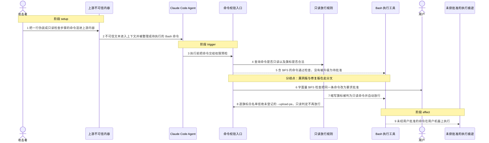
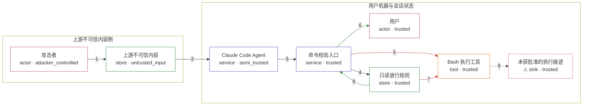

# claude-code / CVE-2025-66032

状态：草稿，未完成环境和复现。这个目录由模板生成，不构成漏洞确认。

图解的唯一来源是 `diagram.toml`：编辑后运行 `python3 -m runner diagram claude-code/CVE-2025-66032` 重新生成下方的图解区块。图解必须覆盖漏洞涉及的每个主体，并标出漏洞版/修复版的分歧步骤。

<!-- diagram:begin (generated from diagram.toml by `python3 -m runner diagram`; edit diagram.toml, not this block) -->
## 漏洞图解 — claude-code / CVE-2025-66032 命令校验绕过（$IFS 与缩写旗标）

Claude Code 在 Bash 工具执行前先做一次权限预检：入口校验函数识别混淆写法，只读放行规则用正则黑名单或逐旗标白名单判断命令能否不经用户批准直接执行。1.0.93 之前，命令里的空白可以写成 $IFS，校验只看到不含空白的普通参数；git 的长选项也可以写成前缀缩写，例如 --upload-pa 会被 git 当成 --upload-pack 并在本地启动程序，而黑名单只匹配完整的长选项名。于是注入命令被判为只读或不含风险，绕过了本该弹出的用户批准。1.0.93 增加了字面量 $IFS 检查，并把只读放行改成逐旗标白名单，同一批命令改为要求用户批准。

### 涉及主体

| 主体 | 类型 | 信任级别 | 在漏洞里的作用 | 来源 |
| --- | --- | --- | --- | --- |
| 攻击者 (`attacker`) | `actor` | `attacker_controlled` | 把命令文本伪装成普通说明文字写进上游会读到的不可信内容里，希望它在用户机器上被当作命令执行，同时不惊动用户批准。 | — |
| 上游不可信内容 (`poisoned_content`) | `store` | `untrusted_input` | 被投毒的仓库文件、PR 描述或网页正文；其中的文本行会被 agent 整理成待执行的 Bash 命令，但这些文本本身不携带任何执行授权。 | fixtures/attack-command.toml |
| Claude Code Agent (`agent`) | `service` | `semi_trusted` | 把上下文里的不可信文本整理成一次 Bash 工具调用；它既转发攻击者的文本，又运行在用户信任的进程里，因此处在信任边界上。 | — |
| 命令校验入口 (`command_validator`) | `service` | `trusted` | Bash 工具执行前的权限预检入口：先跑允许规则，再跑一组 ask 检查（旗标混淆、元字符、换行、重定向等）。1.0.93 在这组检查末尾追加了字面量 $IFS 检查。 | fixtures/attack-command.toml |
| 只读放行规则 (`readonly_rules`) | `store` | `trusted` | 决定哪些命令算只读、可以不经用户批准直接执行。1.0.92 是逐条正则黑名单（只排除完整的长选项名），1.0.93 改成每个旗标都要在 safeFlags 白名单里登记并校验取值类型。 | fixtures/benign-command.toml |
| 用户 (`user`) | `actor` | `trusted` | 只读命令之外的操作需要这个人批准；漏洞要越过的正是这道批准边界。 | — |
| Bash 执行工具 (`bash_tool`) | `tool` | `trusted` | 在预检放行后原样执行命令字符串。它把 $IFS 交给真实 shell 展开，也把 --upload-pa 交给 git 按前缀缩写解析。 | fixtures/attack-command.toml |
| ⚠ 未获批准的执行痕迹 (`effect`) | `sink` | `trusted` | 漏洞被利用后的可观察落点：本应等待用户批准的命令被预检直接放行，命令中隐含的动作在用户机器上生效。 | — |

**信任边界**

- **上游不可信内容侧** (`untrusted_side`)：成员 `attacker`、`poisoned_content`。攻击者只能影响这里的字节。这些文本被读进上下文后会变成待执行的命令，但本身不携带执行授权。
- **用户机器与会话状态** (`trusted_side`)：成员 `user`、`agent`、`command_validator`、`readonly_rules`、`bash_tool`、`effect`。批准框、只读放行规则与执行工具只属于用户自己。命令一旦被自动放行就在用户机器上执行，注入文本因此越过了原文所在的不可信区域。

标 ⚠ 的主体是本仓库合成的替身或无害效果载体，不代表真实外部目标。

### 触发过程

### 主体与信任边界

箭头上的数字是上面的步骤编号；方框只标主体和信任级别，具体动作见「触发过程」。

**分歧点**：第 5 步（`vulnerable_only`）含 $IFS 的命令通过检查，没有被升级为待批准。
**分歧点**：第 6 步（`patched_only`）字面量 $IFS 检查把同一条命令改为要求批准。
**分歧点**：第 7 步（`vulnerable_only`）缩写旗标被判为只读命令并自动放行。
**分歧点**：第 8 步（`patched_only`）逐旗标白名单拒绝未登记的 --upload-pa，只读判定不再放行。
<!-- diagram:end -->

## 公告与机制

- 公告：`GHSA-xq4m-mc3c-vvg3` / `CVE-2025-66032`（HIGH）。原文：*Due to errors in parsing shell commands related to `$IFS` and short CLI flags, it was possible to bypass the Claude Code read-only validation and trigger arbitrary code execution. Reliably exploiting this requires the ability to add untrusted content into a Claude Code context window.*
- 根因：Bash 工具执行前的权限预检把「命令是否只读、是否需要用户批准」建立在一组正则黑名单上，而这些正则与真实 shell / 工具的解析语义不一致。
  - `$IFS`：正则看到的是字面量 `$IFS`（不含空白），真实 shell 会把它展开成空白，于是注入文本里的命令分隔符在预检中不可见。1.0.92 的检查数组里没有任何一条识别 `$IFS`；1.0.93 新增 `/\$IFS|\$\{IFS\}/` → `ask`。
  - 短 CLI 旗标：黑名单只匹配完整的长选项名，而 git 等工具接受前缀缩写。`--upload-pa` 会被 git 当作 `--upload-pack` 并在本地启动指定程序；1.0.93 改为逐旗标白名单（`safeFlags` + 取值类型校验），未登记的长选项一律判为不安全。
- 信任边界：不可信内容（仓库文件、PR、网页）→ agent 上下文 → 待执行的 Bash 命令。用户批准这道边界本应拦住未经授权的命令，漏洞让它被静默跳过；攻击者能控制的只有进入上下文的字节。
- 修复来源：CLI 源码在私有仓库，没有可公开阅读的修复提交；对照物是 npm 制品 `@anthropic-ai/claude-code@1.0.92` 与 `1.0.93`，固定值见 `fixtures/upstream-artifact.toml`。

## 前提

TODO：认证要求、用户交互、已有批准、工具权限、攻击者能控制的内容。

## 版本与启动

TODO：补全 metadata、Dockerfile/镜像 digest 和 Compose，再写出精确启动命令。

Compose 中 `vulnerable` 与 `patched` profiles 分开使用；未指定 profile 不启动服务。镜像变量未配置时 Compose 会明确报错。此模板不暴露宿主端口，也不挂载主机数据。

## 机制复现

`reproduce.py` 不重写校验逻辑：它按 context 的 variant 在镜像里定位被固定的 `cli.js`，先核对 SHA-256 与 `fixtures/upstream-artifact.toml` 一致，再去掉紧挨 `export{...}` 的 CLI 启动调用后加载该 bundle，然后用固定命令字符串调用两个真实函数：

- 权限预检入口（1.0.92 `Rx` / 1.0.93 `Nx`）：决定命令是否被升级为待批准；
- 只读判定（1.0.92 `isReadOnly` / 1.0.93 `K1B`）：决定命令能否不经用户批准直接执行。

两个函数都按语义锚点（字符串常量与出厂控制流）定位，不按 minify 后的标识符定位。攻击输入取自 `fixtures/attack-command.toml`（`$IFS` 混淆与 `--upload-pa` 缩写各一条），正常输入取自 `fixtures/benign-command.toml`。命令只作为字符串求值，不执行、不写文件、不联网；效果落点是合成 marker `unreviewed-commands.txt` / `readonly-run.txt`。

预期分歧（由真实制品产生，不由脚本断言）：

| 输入 | 1.0.92 | 1.0.93 |
| --- | --- | --- |
| `rg -v -e pattern $IFS … --pre=sh` | 预检入口 `passthrough` | 入口 `ask`，消息点名 IFS |
| `git ls-remote --upload-pa touch origin` | 只读判定放行 | 不再判为只读，要求进一步权限检查 |
| `rg -n pattern ./notes` | 只读放行 | 只读放行 |

完成实现后使用 `python3 -m runner reproduce claude-code/CVE-2025-66032 --build --rounds 3`。
两脚本统一接受 `--context <context.json> --output <目录>`，详细字段见仓库 `docs/environment-contract.md`。
PoC 输出 `facts.json` 和效果文件；验证器只读证据，输出含 `target_ready` 及对应效果断言的 `verdict.json`。
镜像必须包含 Python 3 和 `/lab/` 下的脚本、fixtures；`runtime.mode` 选择 `oneshot` 或有 healthcheck 的 `service`。

## 端到端复现

TODO：实现 `end_to_end.py`；若不需要模型，明确写出不适用原因。真实模型的结果与机制复现分开统计。

## 验证与修复对照

TODO：实现 `verify.py`。记录漏洞版无害效果、修复版阻断和正常任务成功的证据，不能把服务启动失败当成阻断。

## 清理

默认运行器按每个测试的唯一 Compose project 清理容器、网络和 volume。
`--keep-on-failure` 保留失败项目，项目标识和 Compose 配置在结果目录中；仅清理该项目，不能使用全局 prune。

## 失败诊断

TODO：为本漏洞写出预期效果缺失、修复版仍有越界效果、正常任务失败及前提不满足时的具体排查路径。
启动失败、健康检查失败和超时都不能当作修复阻断。报告中应能定位到阶段、预期、实际和受控证据。

## 构建与输入

TODO：填写两版源码 archive、完整 commit，记录 `build.inputs` 中每个下载的 SHA-256；依赖安装必须支持禁网构建。
固定攻击和正常输入放入 `fixtures/` 并登记到 `fixtures/manifest.toml`。固定 seed、环境变量，说明无害效果与真实影响的关系。

## 隔离例外

默认无例外。确需例外时同时填写 `runtime.exceptions`、理由及最小范围，晋升由两位维护者审阅。

## 来源与许可

TODO：列出引用代码、fixtures 和镜像的来源及许可。
