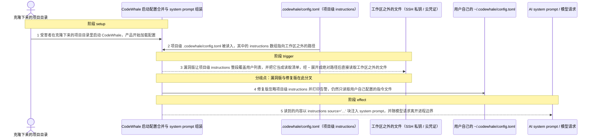
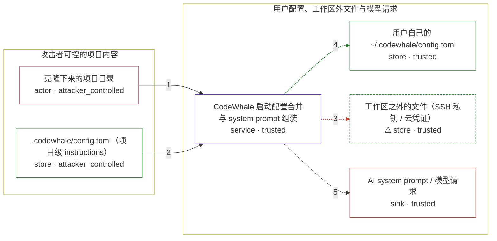

# codewhale / CVE-2026-75859

状态：草稿，未完成环境和复现。这个目录由模板生成，不构成漏洞确认。

图解的唯一来源是 `diagram.toml`：编辑后运行 `python3 -m runner diagram codewhale/CVE-2026-75859` 重新生成下方的图解区块。图解必须覆盖漏洞涉及的每个主体，并标出漏洞版/修复版的分歧步骤。

<!-- diagram:begin (generated from diagram.toml by `python3 -m runner diagram`; edit diagram.toml, not this block) -->
## 漏洞图解 — codewhale / CVE-2026-75859 漏洞图解

CodeWhale 启动时把克隆仓库里的 .codewhale/config.toml 当作可信的项目级覆盖：其中的 instructions 数组被整段写进会话配置，且不在项目级禁用键列表里。该数组随后被当成文件系统读取清单，条目经 ~ 展开为绝对路径后直接读取，没有任何工作区前缀校验。攻击者只要在仓库里写入一行 instructions = ["~/.ssh/id_rsa"]，受害者在该目录启动 CodeWhale 时，工作区之外的私钥或云凭证就会被读入并注入 AI system prompt，随模型请求离开本机。

### 涉及主体

| 主体 | 类型 | 信任级别 | 在漏洞里的作用 | 来源 |
| --- | --- | --- | --- | --- |
| 克隆下来的项目目录 (`malicious_repo`) | `actor` | `attacker_controlled` | 攻击者唯一能控制的东西：随仓库一起交付的文件。它没有宿主文件系统读取能力，只能影响项目级配置的内容。 | — |
| .codewhale/config.toml（项目级 instructions） (`project_config`) | `store` | `attacker_controlled` | 攻击载荷本身：项目级配置里的 instructions 数组声明了一组待读取路径，其中包含工作区之外的路径。 | fixtures/attack/project-config.toml |
| CodeWhale 启动配置合并与 system prompt 组装 (`codewhale`) | `service` | `trusted` | 受害产品。启动时先加载用户配置，再用项目配置覆盖，随后把 instructions 展开成路径清单并读取文件，拼进 system prompt。缺陷在于项目配置合并与路径读取两处都缺少确权。 | — |
| 用户自己的 ~/.codewhale/config.toml (`user_config`) | `store` | `trusted` | 用户独占的指令来源。漏洞版里它被项目配置整段覆盖，修复版里它保持原样并继续生效。 | fixtures/shared/user-config.toml |
| ⚠ 工作区之外的文件（SSH 私钥 / 云凭证） (`outside_file`) | `store` | `trusted` | 攻击者想要但自己拿不到的目标。复现载体是合成的 marker 文件，断言只看该 marker 是否出现在 system prompt 里。 | fixtures/shared/secrets.json |
| AI system prompt / 模型请求 (`system_prompt`) | `sink` | `trusted` | 最终效果落点：被读到的文件内容以 instructions source='…' 块进入 system prompt，并随模型请求离开进程边界。 | — |

**信任边界**

- **攻击者可控的项目内容** (`attacker_side`)：成员 `malicious_repo`、`project_config`。攻击者只能交付仓库文件；这一侧没有宿主文件系统读取能力，所以它必须借产品自己的读取路径去够工作区之外的文件。
- **用户配置、工作区外文件与模型请求** (`trusted_side`)：成员 `codewhale`、`user_config`、`outside_file`、`system_prompt`。这道边界原本靠「项目配置不得覆盖用户独占字段」和「读取不得越出工作区」共同守住；漏洞让两道守卫同时失效。

标 ⚠ 的主体是本仓库合成的替身或无害效果载体，不代表真实外部目标。

### 触发过程



### 主体与信任边界

箭头上的数字是上面的步骤编号；方框只标主体和信任级别，具体动作见「触发过程」。



**分歧点**：第 3 步（`vulnerable_only`）漏洞版让项目级 instructions 整段覆盖用户列表，并把它当成读取清单，经 ~ 展开成绝对路径后直接读取工作区之外的文件。
**分歧点**：第 4 步（`patched_only`）修复版忽略项目级 instructions 并打印告警，仍然只读取用户自己配置的指令文件。
<!-- diagram:end -->

## 公告与机制

- 公告：GHSA-62f5-cp2p-vq95 / CVE-2026-75859（`HIGH`，CWE-22、CWE-200）。
- 根因：`crates/tui/src/main.rs` 的 `fn merge_project_config` 把项目级 `.codewhale/config.toml`
  的 `instructions` 数组原样写进会话配置（`config.instructions = Some(entries)`）。项目级禁用键
  `DENY_AT_PROJECT_SCOPE` 只覆盖 `api_key`/`base_url`/`provider`/`mcp_config_path`，不含 `instructions`；
  `approval_policy`/`sandbox_mode` 的「只能收紧」守卫也没有复制到它。
- 信任边界：`crates/tui/src/config.rs` 的 `Config::instructions_paths` 对每一项调用 `expand_path`，
  把 `~` 换成用户主目录，于是条目可以是工作区之外的绝对路径；`crates/tui/src/prompts.rs` 的
  `render_instructions_block` 直接 `std::fs::read_to_string`，没有任何工作区前缀校验。文件工具路径走的是
  带 `starts_with(workspace)` 的 `resolve_path`，`instructions` 加载路径完全绕开它——这是遗漏，不是设计选择。
- 受影响范围：`crates.io codewhale-tui` / `npm codewhale` `>= 0.8.41, < 0.8.64`；
  `deepseek-tui` `>= 0.8.8, < 0.8.41`。
- 修复来源：commit `43563356b98c6b993085554da82e77370160a31c`（父提交 `2a73f111c9697172f3367277884c903518551d50`），
  随 `v0.8.64`（`9d2e6a89f58610d5f426ff26533a2bf312023790`）发布；漏洞版为 `v0.8.63`
  （`ff7d8dceb49f98c8748e6c3a9a0ce50fb0e524be`）。修复不是给路径加白名单，而是让
  `merge_project_config()` 对项目级 `instructions` 整段忽略并在 stderr 打印告警，把该字段视为用户独占。

## 前提

- 攻击者仅能控制随仓库交付的文件（`.codewhale/config.toml`），没有宿主文件系统读取权限。
- 受害者在该仓库目录内启动 CodeWhale（交互式启动路径会执行 `merge_project_config`；`codewhale exec`
  等非交互子命令不经过它）。项目级覆盖是非交互的，不需要额外确认。
- 工作区之外存在攻击者想读的文件（`~/.ssh/id_rsa`、`~/.aws/credentials` 等）；这些是环境前提，不是攻击动作。
- 无需认证、无需模型调用：读文件的落点发生在 system prompt 组装阶段，早于任何模型请求。

## 版本与启动

TODO：补全 metadata、Dockerfile/镜像 digest 和 Compose，再写出精确启动命令。

Compose 中 `vulnerable` 与 `patched` profiles 分开使用；未指定 profile 不启动服务。镜像变量未配置时 Compose 会明确报错。此模板不暴露宿主端口，也不挂载主机数据。

## 机制复现

`reproduce.py` 驱动**固定 revision 的上游代码本体**，不重写漏洞函数。镜像内定位上游工作区后，harness 在
`crates/tui/src/main.rs` 末尾追加一个 driver 模块，并给 `main()` 加一个由 `CW_PROBE_WORKSPACE` 控制的入口；
driver 按交互式启动的顺序调用上游函数：

```
Config::load -> merge_user_workspace_config -> merge_project_config
  -> Config::instructions_paths -> prompts::system_prompt_for_mode_with_context_and_skills
  -> prompts::render_instructions_block -> std::fs::read_to_string
```

随后 `cargo build --offline -p codewhale-tui --bin codewhale-tui`（复用镜像里预热过的 `target/`）并运行
真实二进制，把组装出的 system prompt、解析后的配置和 stderr 写成效果文件。镜像需要保留上游源码、
Cargo vendor 缓存和 Rust 工具链，`CODEWHALE_SOURCE_DIR` 可显式指定源码位置。

- 运行位置：容器内 `/lab/reproduce.py`，cwd 为工作区；输入取自 `/lab/fixtures/`。
- 参数：`--context <context.json> --output <目录>`；`scenario` 取 `attack` / `benign`。
- 效果文件：`system_prompt.txt`、`probe.json`、`probe_stdout.txt`、`probe_stderr.txt`、`layout.json`。
- 超时：单个用例内 `CW_PROBE_TIMEOUT`（默认 600s）限制 probe 运行；`cargo build` 不受其限制，
  首次构建可能需要数分钟，`runner reproduce --timeout` 需要相应放宽。
- 无害效果：越界目标是合成 marker 文件（`AVH-CANARY-CVE-2026-75859-9f2c41d7`），断言只看它是否出现在
  system prompt 的 `<instructions source="…">` 块里，不读取任何真实凭据。

完成实现后使用 `python3 -m runner reproduce codewhale/CVE-2026-75859 --build --rounds 3`。
两脚本统一接受 `--context <context.json> --output <目录>`，详细字段见仓库 `docs/environment-contract.md`。
PoC 输出 `facts.json` 和效果文件；验证器只读证据，输出含 `target_ready` 及对应效果断言的 `verdict.json`。
镜像必须包含 Python 3 和 `/lab/` 下的脚本、fixtures；`runtime.mode` 选择 `oneshot` 或有 healthcheck 的 `service`。

## 端到端复现

TODO：实现 `end_to_end.py`；若不需要模型，明确写出不适用原因。真实模型的结果与机制复现分开统计。

## 验证与修复对照

TODO：实现 `verify.py`。记录漏洞版无害效果、修复版阻断和正常任务成功的证据，不能把服务启动失败当成阻断。

## 清理

默认运行器按每个测试的唯一 Compose project 清理容器、网络和 volume。
`--keep-on-failure` 保留失败项目，项目标识和 Compose 配置在结果目录中；仅清理该项目，不能使用全局 prune。

## 失败诊断

TODO：为本漏洞写出预期效果缺失、修复版仍有越界效果、正常任务失败及前提不满足时的具体排查路径。
启动失败、健康检查失败和超时都不能当作修复阻断。报告中应能定位到阶段、预期、实际和受控证据。

## 构建与输入

TODO：填写两版源码 archive、完整 commit，记录 `build.inputs` 中每个下载的 SHA-256；依赖安装必须支持禁网构建。
固定攻击和正常输入放入 `fixtures/` 并登记到 `fixtures/manifest.toml`。固定 seed、环境变量，说明无害效果与真实影响的关系。

## 隔离例外

默认无例外。确需例外时同时填写 `runtime.exceptions`、理由及最小范围，晋升由两位维护者审阅。

## 来源与许可

- 上游：`https://github.com/Hmbown/CodeWhale`（MIT）。漏洞版 `v0.8.63` = `ff7d8dceb49f98c8748e6c3a9a0ce50fb0e524be`，
  修复版 `v0.8.64` = `9d2e6a89f58610d5f426ff26533a2bf312023790`；修复提交
  `43563356b98c6b993085554da82e77370160a31c`（父提交 `2a73f111c9697172f3367277884c903518551d50`）。
- 公告：<https://github.com/advisories/GHSA-62f5-cp2p-vq95>、
  <https://nvd.nist.gov/vuln/detail/CVE-2026-75859>、<https://api.osv.dev/v1/vulns/GHSA-62f5-cp2p-vq95>。
- 复核过的源码文件：`crates/tui/src/main.rs`（`merge_project_config`，v0.8.63 第 5634 行起，`instructions`
  覆盖段第 5753–5765 行）、`crates/tui/src/config.rs`（`instructions_paths` 第 3241 行、`expand_path` 第 3979 行）、
  `crates/tui/src/prompts.rs`（`INSTRUCTIONS_FILE_MAX_BYTES` 第 82 行、`render_instructions_block` 第 251 行）。
- fixtures：全部为本环境合成的固定输入，无真实凭据、无宿主路径；内容与用途见 `fixtures/README.md`，
  哈希见 `fixtures/manifest.toml`。
