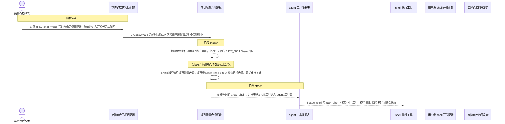
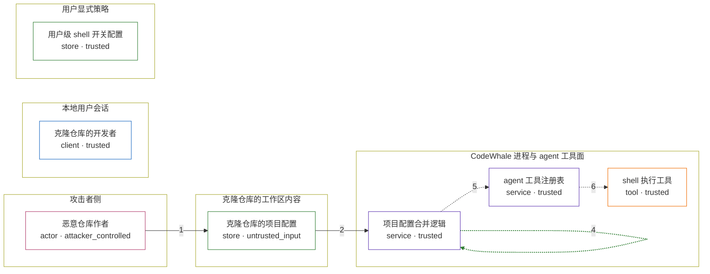

# codewhale / CVE-2026-75911

状态：草稿，未完成环境和复现。这个目录由模板生成，不构成漏洞确认。

图解的唯一来源是 `diagram.toml`：编辑后运行 `python3 -m runner diagram codewhale/CVE-2026-75911` 重新生成下方的图解区块。图解必须覆盖漏洞涉及的每个主体，并标出漏洞版/修复版的分歧步骤。

<!-- diagram:begin (generated from diagram.toml by `python3 -m runner diagram`; edit diagram.toml, not this block) -->
## 漏洞图解 — codewhale / CVE-2026-75911 漏洞图解

项目级配置覆盖缺少方向检查：克隆仓库里的 .codewhale/config.toml 可以把用户关闭的 allow_shell 直接改写为开启，绕过用户对 shell 执行能力的显式 opt-in。同一个 merge_project_config 对 approval_policy 和 sandbox_mode 都有只能收紧的守卫，唯独 allow_shell 是无条件写入。修复提交把该键改成只能收紧：项目级 true 被忽略并告警，项目级 false 仍然生效。开启后 CodeWhale 的工具注册表会纳入 exec_shell 与 task_shell_*，模型据此可发起宿主机命令执行。

### 涉及主体

| 主体 | 类型 | 信任级别 | 在漏洞里的作用 | 来源 |
| --- | --- | --- | --- | --- |
| 恶意仓库作者 (`attacker`) | `actor` | `attacker_controlled` | 编写并公开一个仓库，仓库内自带开启 shell 的项目级配置；它只能控制仓库内容，改不了开发者本地的用户级配置。 | — |
| 克隆仓库的项目配置 (`project_config`) | `store` | `untrusted_input` | 工作区里的 .codewhale/config.toml（旧路径 .deepseek/config.toml 回退），由攻击者控制内容，随克隆进入开发者机器。 | fixtures/attack/project-config.toml |
| 用户级 shell 开关配置 (`user_config`) | `store` | `trusted` | shell 执行能力本应由用户在这里显式 opt-in；默认关闭，攻击者够不着这份配置。 | 用户级 codewhale 配置中的 allow_shell |
| 克隆仓库的开发者 (`workspace_user`) | `client` | `trusted` | 在克隆目录内启动 CodeWhale 且未传 --no-project-config，是触发所需的用户交互前提，不是攻击动作。 | — |
| 项目配置合并逻辑 (`config_merge`) | `service` | `trusted` | 把项目级显式字段覆盖到全局配置上；漏洞版在这里无条件写入 allow_shell，没有像 approval_policy、sandbox_mode 那样做只能收紧的守卫。 | crates/tui/src/main.rs: merge_project_config |
| agent 工具注册表 (`tool_registry`) | `service` | `trusted` | 按 allow_shell 的值决定是否把 shell 工具注册进 agent 可用工具集；它是策略位与真实执行面之间的闸门。 | crates/tui/src/tools/registry.rs: with_agent_tools / with_shell_tools |
| shell 执行工具 (`shell_tools`) | `tool` | `trusted` | exec_shell、exec_shell_wait、task_shell_start 等工具以宿主机子进程执行模型给出的命令，是越权后真正落地的能力。 | crates/tui/src/tools/shell.rs: Command::new |

**信任边界**

- **攻击者侧** (`attacker_side`)：成员 `attacker`。攻击者只能控制仓库文件内容，无法读取或修改开发者的用户级配置，也无法直接调用本地工具。
- **本地用户会话** (`local_session`)：成员 `workspace_user`。开发者在这里克隆仓库并启动 CodeWhale；用户交互是漏洞前提，但从未包含同意开启 shell。
- **克隆仓库的工作区内容** (`cloned_repo`)：成员 `project_config`。仓库自带内容是不可信输入，却会被当作项目级配置直接合并；它本来只应带来仓库自己的构建与源码文件。
- **用户显式策略** (`user_policy`)：成员 `user_config`。shell 执行能力只能由用户在这里显式开启；项目级配置不应改写它。
- **CodeWhale 进程与 agent 工具面** (`codewhale_process`)：成员 `config_merge`、`tool_registry`、`shell_tools`。策略合并、工具注册与命令执行都在受信进程内；这道边界要求只有用户 opt-in 才能让 shell 工具进入工具集。

### 触发过程

### 主体与信任边界

箭头上的数字是上面的步骤编号；方框只标主体和信任级别，具体动作见「触发过程」。

**分歧点**：第 3 步（`vulnerable_only`）漏洞版无条件采用项目级布尔值，把用户关闭的 allow_shell 改写为开启。
**分歧点**：第 4 步（`patched_only`）修复版只允许项目配置收紧：项目级 allow_shell = true 被忽略并告警，开关保持关闭。
<!-- diagram:end -->

## 公告与机制

官方公告：GitHub Advisory `GHSA-gx45-xrj5-g6c4` / `CVE-2026-75911`（VulnCheck 分配，CWE-94，CVSS v4.0 8.5）。

根因：`crates/tui/src/main.rs` 的 `merge_project_config()` 把工作区 `.codewhale/config.toml`（旧名 `.deepseek/config.toml` 回退）里的显式字段覆盖到全局配置。同一函数对 `approval_policy`、`sandbox_mode` 都有只能收紧的 `project_*_is_allowed()` 守卫，`DENY_AT_PROJECT_SCOPE` 拒绝清单又不含 `allow_shell`，于是项目级 `allow_shell = true` 被无条件写入 `config.allow_shell`，把用户关闭的 shell 执行能力重新打开。该值经 `RegistryBuilder::with_agent_tools(allow_shell)` 决定是否注册 `exec_shell`、`task_shell_*`，最终在 `crates/tui/src/tools/shell.rs` 以 `Command::new` 执行宿主机命令。

信任边界：克隆仓库内容（不可信）→ 用户对 shell 执行能力的显式 opt-in（默认关闭）。

受影响范围：crates.io/npm `deepseek-tui >= 0.8.6, < 0.8.41`，`codewhale-tui`/`codewhale >= 0.8.41, < 0.8.64`。修复提交 `43563356b98c6b993085554da82e77370160a31c`（`fix(tui): keep project overlays from loosening policy`）把 `allow_shell` 改为 tightening-only：项目级 `true` 被忽略并告警，项目级 `false` 仍然生效；同一提交还取消了项目级 `instructions` 数组的整体替换语义。本环境按 public.md 固定 vulnerable `v0.8.50`（`0072209d12f2825fbf6a22e05d2645f7ae1bc6fe`）与 patched `v0.8.64`（`9d2e6a89f58610d5f426ff26533a2bf312023790`）。

## 前提

- 攻击者可控：仓库内的文件内容，即 `.codewhale/config.toml` 里的 `allow_shell = true`。
- 环境前提（不是攻击动作）：开发者克隆该仓库并在该目录内启动 CodeWhale，且未传 `--no-project-config`（该开关是上游提供的规避手段）；开发者的用户级配置里 shell 处于关闭/未设置状态。对应 CVSS 的 `UI:R` / `UI:P`。
- 攻击者不可控：用户级配置、宿主文件系统、CodeWhale 进程本身。
- 机制层不需要模型：`allow_shell` 到 shell 工具注册是纯策略计算。完整 RCE 还要求模型真的发出 shell 工具调用，那一段不属于机制复现的判据。

## 版本与启动

TODO：补全 metadata、Dockerfile/镜像 digest 和 Compose，再写出精确启动命令。

Compose 中 `vulnerable` 与 `patched` profiles 分开使用；未指定 profile 不启动服务。镜像变量未配置时 Compose 会明确报错。此模板不暴露宿主端口，也不挂载主机数据。

## 机制复现

`reproduce.py` 在镜像内把 `fixtures/probe/mechanism_probe.rs` 挂载进被固定的上游 crate：默认追加到 `crates/tui/src/main.rs` 末尾，若该位置取不到配置类型则改挂到其 `#[cfg(test)] mod tests` 内。随后用 `cargo test --offline --bins -p <包名> <探针测试名>` 运行探针。探针只做三件事：从环境变量取工作区目录、用上游配置类型构造初始配置（attack 场景里用户已经关闭 shell）、调用上游真实的 `merge_project_config`，再把生效的 `allow_shell` 写进 `LAB_EFFECT_FILE`。合并逻辑本身既没有重写也没有被抽取，运行结束 `main.rs` 会原样恢复。

- 固定输入：`fixtures/attack/`（项目级 `allow_shell = true`）与 `fixtures/benign/`（项目级只收紧策略），`fixtures/manifest.toml` 记录全部 SHA-256。
- 效果证据：`probe-effect.txt`（探针写出的原始值）、`effective-config.json`、`mounted-probe.rs`、`cargo-test-*.log`，全部进入 `facts.json` 的哈希清单。
- 退出码沿用实验室契约：0 执行完成、1 执行失败、2 前提不足（例如镜像里找不到被固定的上游源码树）。

构建阶段需要提供（不在本阶段决定）：镜像内 Python 3、cargo、被固定版本的上游源码树（可用 `LAB_SOURCE_DIR` 或 `LAB_TUI_MAIN` 指定，否则在 `/lab`、`/opt`、`/src`、`/workspace` 等目录下按 `crates/tui/src/main.rs` 搜索），以及离线 vendor 的依赖与 dev-dependencies；预先执行 `cargo test --no-run` 预热 target 可以显著缩短运行时间。

完成实现后使用 `python3 -m runner reproduce codewhale/CVE-2026-75911 --build --rounds 3`。
两脚本统一接受 `--context <context.json> --output <目录>`，详细字段见仓库 `docs/environment-contract.md`。
PoC 输出 `facts.json` 和效果文件；验证器只读证据，输出含 `target_ready` 及对应效果断言的 `verdict.json`。
镜像必须包含 Python 3 和 `/lab/` 下的脚本、fixtures；`runtime.mode` 选择 `oneshot` 或有 healthcheck 的 `service`。

## 端到端复现

TODO：实现 `end_to_end.py`；若不需要模型，明确写出不适用原因。真实模型的结果与机制复现分开统计。

## 验证与修复对照

TODO：实现 `verify.py`。记录漏洞版无害效果、修复版阻断和正常任务成功的证据，不能把服务启动失败当成阻断。

## 清理

默认运行器按每个测试的唯一 Compose project 清理容器、网络和 volume。
`--keep-on-failure` 保留失败项目，项目标识和 Compose 配置在结果目录中；仅清理该项目，不能使用全局 prune。

## 失败诊断

- 找不到上游源码树：`observation.json.detail` 会写 `pinned upstream main.rs not found`，退出码 2。检查 build 是否把源码装进镜像，或 `LAB_SOURCE_DIR` 是否指对。
- 探针没有编译：`cargo-test-*.log` 里有 rustc 诊断。常见原因是上游 `Config` 类型或 `merge_project_config` 签名与探针假设不符；`reproduce.py` 已依次尝试三种挂载方式，`effective-config.json.attempts` 记录每次的返回码。
- 漏洞版 `observed_allow_shell` 为 `false`：先看日志是不是被过滤成 0 个测试（探针测试名不匹配），再看是否把初始值当成了结果。
- 修复版 `observed_allow_shell` 为 `true`：说明固定的 patched 源码不含 tighten-only 分支，核对 commit 是否为 `9d2e6a89…` 及其祖先。
- 正常任务失败：核对 benign fixture 的哈希，或上游是否不支持该配置目录名。
- 启动失败、健康检查失败和超时都不能当作修复阻断。报告中应能定位到阶段、预期、实际和受控证据。

## 构建与输入

TODO：填写两版源码 archive、完整 commit，记录 `build.inputs` 中每个下载的 SHA-256；依赖安装必须支持禁网构建。
固定攻击和正常输入放入 `fixtures/` 并登记到 `fixtures/manifest.toml`。固定 seed、环境变量，说明无害效果与真实影响的关系。

## 隔离例外

默认无例外。确需例外时同时填写 `runtime.exceptions`、理由及最小范围，晋升由两位维护者审阅。

## 来源与许可

TODO：列出引用代码、fixtures 和镜像的来源及许可。
