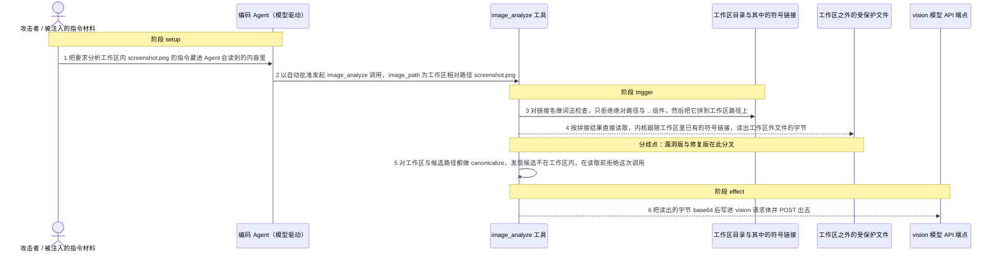
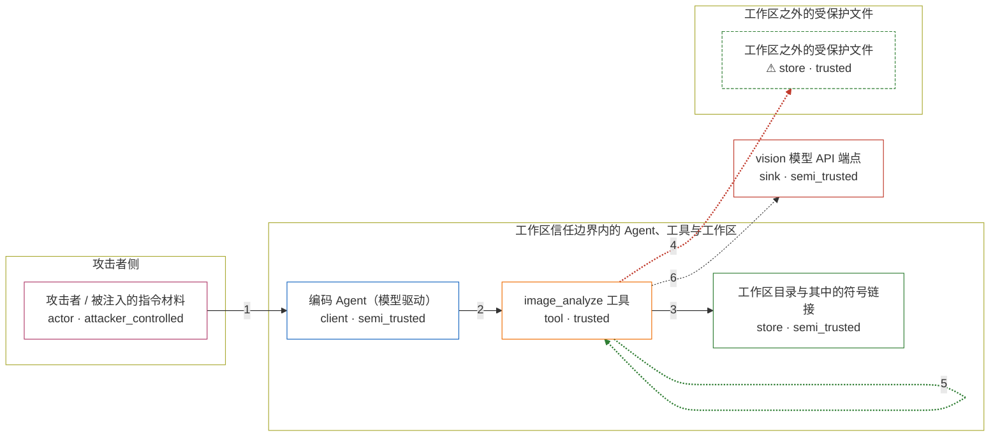

# codewhale / CVE-2026-75914

状态：草稿，未完成环境和复现。这个目录由模板生成，不构成漏洞确认。

图解的唯一来源是 `diagram.toml`：编辑后运行 `python3 -m runner diagram codewhale/CVE-2026-75914` 重新生成下方的图解区块。图解必须覆盖漏洞涉及的每个主体，并标出漏洞版/修复版的分歧步骤。

<!-- diagram:begin (generated from diagram.toml by `python3 -m runner diagram`; edit diagram.toml, not this block) -->
## 漏洞图解 — codewhale / CVE-2026-75914 漏洞图解

image_analyze 只对 image_path 做词法检查（拒绝绝对路径与 .. 组件），既不 canonicalize 也不重新检查工作区包含性，于是工作区里一条指向外部的符号链接被当作普通图片名读取，工作区外文件的字节被读出。它绕开的是集中路径解析器所代表的工作区信任边界：该解析器默认拒绝指向工作区外的符号链接，而 image_analyze 是唯一自己拼接路径的读文件工具。读出的字节被 base64 后放进 vision 请求体发出，文件内容因此离开进程，进入外部 vision 端点。

### 涉及主体

| 主体 | 类型 | 信任级别 | 在漏洞里的作用 | 来源 |
| --- | --- | --- | --- | --- |
| 攻击者 / 被注入的指令材料 (`attacker`) | `actor` | `attacker_controlled` | 把指令藏进 Agent 会读到的内容里（被投毒的项目文档、抓取的网页、MCP 输出），让一次 image_analyze 调用带上工作区相对路径 screenshot.png。它能控制的只有这条调用参数，够不到工作区外的文件本身。 | — |
| 编码 Agent（模型驱动） (`agent`) | `client` | `semi_trusted` | 把读到的被投毒内容当成用户任务，在一轮对话里以自动批准的方式调用 image_analyze，并把工作区相对路径作为参数传下去；它自己没有读取工作区外文件的权限。 | — |
| image_analyze 工具 (`image_analyze`) | `tool` | `trusted` | 受影响的上游工具函数：只按组件做词法检查，随后把 image_path 直接拼到工作区路径上读取，不 canonicalize、不重检包含性，因此工作区里已有的符号链接会被内核跟随。 | crates/tui/src/vision/tools.rs |
| 工作区目录与其中的符号链接 (`workspace_dir`) | `store` | `semi_trusted` | 工具被允许访问的根目录。目录里本来就有 screenshot.png 这样一条指向工作区外文件的符号链接——这是环境前提，不是攻击者的写操作。 | — |
| ⚠ 工作区之外的受保护文件 (`outside_secret`) | `store` | `trusted` | 攻击者想要但够不到的数据，只有被越界读出后其字节才离开工作区。这里的文件内容是合成的无害标记，因此泄露本身不造成真实数据损失。 | fixtures/attack/outside_secret.txt |
| vision 模型 API 端点 (`vision_endpoint`) | `sink` | `semi_trusted` | 工具把读到的文件字节 base64 后放进请求体 POST 到这里；字节因此离开本机进程，进入 vision 供应商链路。这是漏洞的受控效果落点。 | — |

**信任边界**

- **攻击者侧** (`attacker_side`)：成员 `attacker`。攻击者能决定的只有注入的指令内容，也就是这次调用的 image_path 取值；它没有宿主机写权限，符号链接与工作区外的目标文件都是既有前提。
- **工作区信任边界内的 Agent、工具与工作区** (`agent_side`)：成员 `agent`、`image_analyze`、`workspace_dir`。这道边界本来把工具的读取限制在工作区之内：集中路径解析器默认拒绝指向工作区外的符号链接。image_analyze 绕开解析器自己拼接路径，边界因此失效。
- **工作区之外的受保护文件** (`outside_side`)：成员 `outside_secret`。与工作区同级受保护的数据；工具跟随符号链接后本不应读到它，攻击者自己也无法直接读取。
- 未列入上述边界：`vision_endpoint`。

标 ⚠ 的主体是本仓库合成的替身或无害效果载体，不代表真实外部目标。

### 触发过程

### 主体与信任边界

箭头上的数字是上面的步骤编号；方框只标主体和信任级别，具体动作见「触发过程」。

**分歧点**：第 4 步（`vulnerable_only`）按拼接结果直接读取，内核跟随工作区里已有的符号链接，读出工作区外文件的字节。
**分歧点**：第 5 步（`patched_only`）对工作区与候选路径都做 canonicalize，发现候选不在工作区内，在读取前拒绝这次调用。
<!-- diagram:end -->

## 公告与机制

TODO：官方公告、漏洞根因、Agent 信任边界、受影响范围和修复来源。

## 前提

TODO：认证要求、用户交互、已有批准、工具权限、攻击者能控制的内容。

## 版本与启动

TODO：补全 metadata、Dockerfile/镜像 digest 和 Compose，再写出精确启动命令。

Compose 中 `vulnerable` 与 `patched` profiles 分开使用；未指定 profile 不启动服务。镜像变量未配置时 Compose 会明确报错。此模板不暴露宿主端口，也不挂载主机数据。

## 机制复现

TODO：实现 `reproduce.py`，固定输入并执行真实漏洞路径，注明运行位置、参数和超时。

完成实现后使用 `python3 -m runner reproduce codewhale/CVE-2026-75914 --build --rounds 3`。
两脚本统一接受 `--context <context.json> --output <目录>`，详细字段见仓库 `docs/environment-contract.md`。
PoC 输出 `facts.json` 和效果文件；验证器只读证据，输出含 `target_ready` 及对应效果断言的 `verdict.json`。
镜像必须包含 Python 3 和 `/lab/` 下的脚本、fixtures；`runtime.mode` 选择 `oneshot` 或有 healthcheck 的 `service`。

## 端到端复现

TODO：实现 `end_to_end.py`；若不需要模型，明确写出不适用原因。真实模型的结果与机制复现分开统计。

## 验证与修复对照

TODO：实现 `verify.py`。记录漏洞版无害效果、修复版阻断和正常任务成功的证据，不能把服务启动失败当成阻断。

## 清理

默认运行器按每个测试的唯一 Compose project 清理容器、网络和 volume。
`--keep-on-failure` 保留失败项目，项目标识和 Compose 配置在结果目录中；仅清理该项目，不能使用全局 prune。

## 失败诊断

TODO：为本漏洞写出预期效果缺失、修复版仍有越界效果、正常任务失败及前提不满足时的具体排查路径。
启动失败、健康检查失败和超时都不能当作修复阻断。报告中应能定位到阶段、预期、实际和受控证据。

## 构建与输入

TODO：填写两版源码 archive、完整 commit，记录 `build.inputs` 中每个下载的 SHA-256；依赖安装必须支持禁网构建。
固定攻击和正常输入放入 `fixtures/` 并登记到 `fixtures/manifest.toml`。固定 seed、环境变量，说明无害效果与真实影响的关系。

## 隔离例外

默认无例外。确需例外时同时填写 `runtime.exceptions`、理由及最小范围，晋升由两位维护者审阅。

## 来源与许可

TODO：列出引用代码、fixtures 和镜像的来源及许可。
