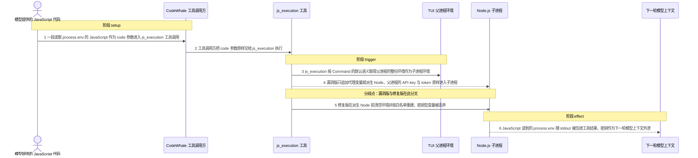
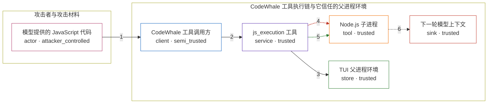

# codewhale / CVE-2026-75915

状态：草稿，未完成环境和复现。这个目录由模板生成，不构成漏洞确认。

图解的唯一来源是 `diagram.toml`：编辑后运行 `python3 -m runner diagram codewhale/CVE-2026-75915` 重新生成下方的图解区块。图解必须覆盖漏洞涉及的每个主体，并标出漏洞版/修复版的分歧步骤。

<!-- diagram:begin (generated from diagram.toml by `python3 -m runner diagram`; edit diagram.toml, not this block) -->
## 漏洞图解 — codewhale / CVE-2026-75915 父进程环境经 js_execution 泄露进模型上下文

CodeWhale 的 js_execution 工具用 tokio::process::Command 派生 Node.js 子进程时沿用默认继承语义，既没有调用进程内已有的 child_env 清理器，也没有 env_clear，Node 因此拿到 TUI 父进程的完整环境。模型提供的 JavaScript 只要读取 process.env，就能取得父进程里的 API key、云凭证与 forge token。工具的 stdout 会被包进 ToolResult 回灌成下一轮模型上下文，父进程密钥由此越过本地工具信任边界进入模型可见内容。修复版改走 apply_to_tokio_command，先清空环境再按白名单重建，密钥型变量在 Node 启动前即被丢弃。

### 涉及主体

| 主体 | 类型 | 信任级别 | 在漏洞里的作用 | 来源 |
| --- | --- | --- | --- | --- |
| 模型提供的 JavaScript 代码 (`attacker_code`) | `actor` | `attacker_controlled` | 攻击者唯一可控的东西：作为 js_execution 的 code 参数提交的一段 JavaScript，例如读取 process.env 并打印。 | fixtures/attack_env_dump.js |
| CodeWhale 工具调用方 (`tool_caller`) | `client` | `semi_trusted` | 把模型给出的 code 参数原样交给 js_execution，并把返回的 ToolResult 作为工具结果交给下一轮模型；它转发不可信内容，本身不是漏洞点。 | crates/tui/src/tools/mod.rs |
| js_execution 工具 (`js_execution`) | `service` | `trusted` | 受影响的本地工具。它派生 Node 前不做环境净化，是信任边界失效的确切位置。 | crates/tui/src/tools/js_execution.rs |
| Node.js 子进程 (`node_runtime`) | `tool` | `trusted` | 真正执行 JavaScript 的运行时；它继承到的环境变量对执行的代码完全可见。 | crates/tui/src/dependencies.rs |
| TUI 父进程环境 (`parent_env`) | `store` | `trusted` | 保存 API key、云凭证与 forge token 的进程环境；这是攻击者想要、正常途径够不着的数据。 | — |
| 下一轮模型上下文 (`model_context`) | `sink` | `trusted` | 工具结果最终被拼进的内容；父进程密钥一旦到了这里，泄露就已经发生。 | crates/tui/src/core/engine.rs |

**信任边界**

- **攻击者与攻击材料** (`attacker_side`)：成员 `attacker_code`。攻击者只能控制这一次工具调用的 code 参数，不能直接读写目标主机，也不能自己挑选父进程里有哪些变量。
- **CodeWhale 工具执行链与它信任的父进程环境** (`product_side`)：成员 `tool_caller`、`js_execution`、`node_runtime`、`parent_env`、`model_context`。这道边界按设计要把模型提供的代码与宿主环境隔开：子进程只应拿到白名单变量。js_execution 沿用默认继承语义，让整份父进程环境随 Node 子进程越过边界。

### 触发过程

### 主体与信任边界

箭头上的数字是上面的步骤编号；方框只标主体和信任级别，具体动作见「触发过程」。

**分歧点**：第 4 步（`vulnerable_only`）漏洞版只追加代理变量就派生 Node，父进程的 API key 与 token 原样进入子进程。
**分歧点**：第 5 步（`patched_only`）修复版在派生 Node 前清空环境并按白名单重建，密钥型变量被丢弃。
<!-- diagram:end -->

## 公告与机制

TODO：官方公告、漏洞根因、Agent 信任边界、受影响范围和修复来源。

## 前提

TODO：认证要求、用户交互、已有批准、工具权限、攻击者能控制的内容。

## 版本与启动

TODO：补全 metadata、Dockerfile/镜像 digest 和 Compose，再写出精确启动命令。

Compose 中 `vulnerable` 与 `patched` profiles 分开使用；未指定 profile 不启动服务。镜像变量未配置时 Compose 会明确报错。此模板不暴露宿主端口，也不挂载主机数据。

## 机制复现

TODO：实现 `reproduce.py`，固定输入并执行真实漏洞路径，注明运行位置、参数和超时。

完成实现后使用 `python3 -m runner reproduce codewhale/CVE-2026-75915 --build --rounds 3`。
两脚本统一接受 `--context <context.json> --output <目录>`，详细字段见仓库 `docs/environment-contract.md`。
PoC 输出 `facts.json` 和效果文件；验证器只读证据，输出含 `target_ready` 及对应效果断言的 `verdict.json`。
镜像必须包含 Python 3 和 `/lab/` 下的脚本、fixtures；`runtime.mode` 选择 `oneshot` 或有 healthcheck 的 `service`。

## 端到端复现

TODO：实现 `end_to_end.py`；若不需要模型，明确写出不适用原因。真实模型的结果与机制复现分开统计。

## 验证与修复对照

TODO：实现 `verify.py`。记录漏洞版无害效果、修复版阻断和正常任务成功的证据，不能把服务启动失败当成阻断。

## 清理

默认运行器按每个测试的唯一 Compose project 清理容器、网络和 volume。
`--keep-on-failure` 保留失败项目，项目标识和 Compose 配置在结果目录中；仅清理该项目，不能使用全局 prune。

## 失败诊断

TODO：为本漏洞写出预期效果缺失、修复版仍有越界效果、正常任务失败及前提不满足时的具体排查路径。
启动失败、健康检查失败和超时都不能当作修复阻断。报告中应能定位到阶段、预期、实际和受控证据。

## 构建与输入

TODO：填写两版源码 archive、完整 commit，记录 `build.inputs` 中每个下载的 SHA-256；依赖安装必须支持禁网构建。
固定攻击和正常输入放入 `fixtures/` 并登记到 `fixtures/manifest.toml`。固定 seed、环境变量，说明无害效果与真实影响的关系。

## 隔离例外

默认无例外。确需例外时同时填写 `runtime.exceptions`、理由及最小范围，晋升由两位维护者审阅。

## 来源与许可

TODO：列出引用代码、fixtures 和镜像的来源及许可。
