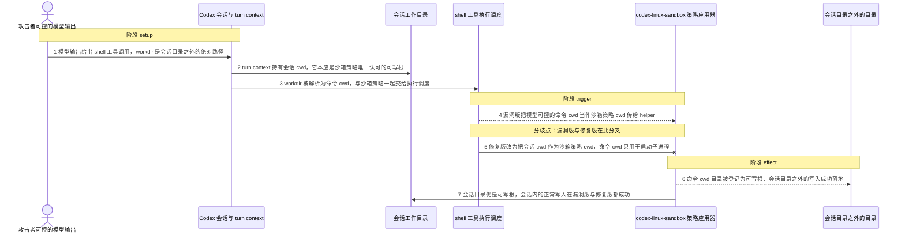
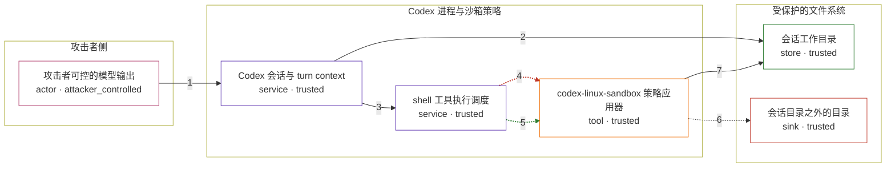

# codex / CVE-2025-59532

状态：草稿，未完成环境和复现。这个目录由模板生成，不构成漏洞确认。

图解的唯一来源是 `diagram.toml`：编辑后运行 `python3 -m runner diagram codex/CVE-2025-59532` 重新生成下方的图解区块。图解必须覆盖漏洞涉及的每个主体，并标出漏洞版/修复版的分歧步骤。

<!-- diagram:begin (generated from diagram.toml by `python3 -m runner diagram`; edit diagram.toml, not this block) -->
## 漏洞图解 — codex / CVE-2025-59532 漏洞图解

Codex CLI 0.2.0–0.38.0 在 workspace-write 模式下把「命令要运行的目录」与「沙箱策略用来计算可写根的目录」合并成同一个值，而该值来自模型可控的 shell 工具 workdir。模型给出会话目录之外的绝对路径时，该目录被无条件加入可写根，越过只允许写会话目录的边界。效果是任意越界文件写入，并可借由可写目录中的内容执行命令；网络禁用不受这条路径影响。

### 涉及主体

| 主体 | 类型 | 信任级别 | 在漏洞里的作用 | 来源 |
| --- | --- | --- | --- | --- |
| 攻击者可控的模型输出 (`attacker`) | `actor` | `attacker_controlled` | 决定 shell 工具调用的 command 与 workdir；workdir 取会话目录之外的绝对路径，这是攻击者唯一能控制的输入。 | fixtures/attack.json |
| Codex 会话与 turn context (`codex_session`) | `service` | `trusted` | 把 workdir 解析成命令 cwd，同时在 turn context 中持有会话 cwd；两者本该分别用于启动子进程和计算沙箱可写根。 | — |
| shell 工具执行调度 (`exec_sandbox`) | `service` | `trusted` | 把命令 cwd 与沙箱策略一起交给 Linux 沙箱 helper；v0.38.0 只接受一个 cwd，于是命令 cwd 同时成了策略 cwd。 | — |
| codex-linux-sandbox 策略应用器 (`landlock`) | `tool` | `trusted` | 以传入的策略 cwd 计算 writable roots 并安装 Landlock 规则；传入哪个目录，哪个目录就可写。 | — |
| 会话工作目录 (`session_dir`) | `store` | `trusted` | workspace-write 模式下唯一应当可写的目录，由 turn context 的 cwd 指定。 | fixtures/benign.json |
| 会话目录之外的目录 (`outside_dir`) | `sink` | `trusted` | 攻击者希望写入、但沙箱本应禁止写入的目录；越界写入最终落在这里。 | fixtures/attack.json |

**信任边界**

- **攻击者侧** (`attacker_side`)：成员 `attacker`。模型输出由攻击者或提示注入控制。它不能任意读写宿主机，只能选择这次 shell 工具调用的参数，包括 command 与绝对 workdir。
- **Codex 进程与沙箱策略** (`codex_runtime`)：成员 `codex_session`、`exec_sandbox`、`landlock`。这一侧决定命令在哪个目录运行、以及沙箱把哪个目录当作可写根。缺陷就发生在这里：两个语义不同的 cwd 被当成同一个值。
- **受保护的文件系统** (`host_fs`)：成员 `session_dir`、`outside_dir`。workspace-write 只应让会话目录可写，会话目录之外的目录必须保持只读；漏洞让后者也进入可写根。

### 触发过程

### 主体与信任边界

箭头上的数字是上面的步骤编号；方框只标主体和信任级别，具体动作见「触发过程」。

**分歧点**：第 4 步（`vulnerable_only`）漏洞版把模型可控的命令 cwd 当作沙箱策略 cwd 传给 helper。
**分歧点**：第 5 步（`patched_only`）修复版改为把会话 cwd 作为沙箱策略 cwd，命令 cwd 只用于启动子进程。
<!-- diagram:end -->

## 公告与机制

TODO：官方公告、漏洞根因、Agent 信任边界、受影响范围和修复来源。

## 前提

漏洞前提是 `workspace-write` 沙箱模式（0.38.0 的默认 shell 工具策略），以及攻击者能决定这次 shell 工具调用的参数。机制复现里攻击者只控制两样东西：`command`，以及一个会话目录之外的**绝对** `workdir`；`workdir` 的绝对路径语义由 `TurnContext::resolve_path()` 的 `self.cwd.join(path)` 决定。会话目录、`writable_roots: []` 与 `exclude_slash_tmp` / `exclude_tmpdir_env_var = true` 都是环境前提，不是攻击动作。

运行时前提：Linux 内核可用 Landlock（helper 用 `ABI::V5`，`CompatLevel::BestEffort`，`NotEnforced` 会让 helper 直接失败）。容器需要放行 `landlock_create_ruleset` / `landlock_add_rule` / `landlock_restrict_self`，Docker 默认 seccomp profile 可能拦截，需要放宽或为该服务设置 `security-opt: ["seccomp=unconfined"]`（`cap_drop: [ALL]` 与 `no-new-privileges` 不影响 Landlock）。若沙箱整体不可用，漏洞版与修复版都会失败，观察不到边界差异，不能据此判定修复阻断。机制复现不需要真实模型。

## 版本与启动

TODO：补全 metadata、Dockerfile/镜像 digest 和 Compose，再写出精确启动命令。

Compose 中 `vulnerable` 与 `patched` profiles 分开使用；未指定 profile 不启动服务。镜像变量未配置时 Compose 会明确报错。此模板不暴露宿主端口，也不挂载主机数据。

## 机制复现

`reproduce.py` 不实现任何沙箱逻辑，它驱动的是镜像里 pin 住的上游源码：

1. 从 `/lab/fixtures/attack.json`（或 `benign.json`）读取固定的 shell 工具调用与 `SandboxPolicy`；
2. 在临时目录里建出 `session`（会话目录，策略 cwd）与 `command`（模型可控 workdir）两个目录；
3. 把 `/lab/fixtures/probe/` 中对应 revision 的驱动写到
   `<source>/codex-rs/core/examples/codex_cwd_probe.rs`，用
   `cargo run --offline -p codex-core --example codex_cwd_probe` 编译并运行；
4. 驱动只重建 `codex-rs/core/src/codex.rs` 对 shell 工具调用的处理，然后调用本 revision 自己的
   `codex_core::exec::process_exec_tool_call`；沙箱组合、策略 cwd 的选择、Linux helper 与 Landlock
   计算全部是上游代码。0.38.0 与 0.39.0 的差别只有 `sandbox_cwd` 这一个形参；
5. 观察 `command` 目录里是否出现 `forbidden.txt`：漏洞版写入落地，修复版被 Landlock 拒绝。

镜像要求：保留上游 workspace（默认 `CODEX_SRC_DIR`，否则在 `/lab`、`/opt`、`/src` 等位置自动查找
`codex-rs/core/Cargo.toml`）、可用的 `cargo`、已构建的 `codex-exec` helper（`codex-exec` 通过 arg0
`codex-linux-sandbox` 承载 helper）与预热的 `target/`（否则示例首次编译可能超出 `--timeout 300`）。
查找源、helper 与 cargo 的位置可用 `CODEX_SRC_DIR`、`CODEX_EXEC_BIN`、`CARGO` 覆盖。

完成实现后使用 `python3 -m runner reproduce codex/CVE-2025-59532 --build --rounds 3`。
两脚本统一接受 `--context <context.json> --output <目录>`，详细字段见仓库 `docs/environment-contract.md`。
PoC 输出 `facts.json` 和效果文件；验证器只读证据，输出含 `target_ready` 及对应效果断言的 `verdict.json`。
镜像必须包含 Python 3 和 `/lab/` 下的脚本、fixtures；`runtime.mode` 选择 `oneshot` 或有 healthcheck 的 `service`。

## 端到端复现

TODO：实现 `end_to_end.py`；若不需要模型，明确写出不适用原因。真实模型的结果与机制复现分开统计。

## 验证与修复对照

TODO：实现 `verify.py`。记录漏洞版无害效果、修复版阻断和正常任务成功的证据，不能把服务启动失败当成阻断。

## 清理

默认运行器按每个测试的唯一 Compose project 清理容器、网络和 volume。
`--keep-on-failure` 保留失败项目，项目标识和 Compose 配置在结果目录中；仅清理该项目，不能使用全局 prune。

## 失败诊断

TODO：为本漏洞写出预期效果缺失、修复版仍有越界效果、正常任务失败及前提不满足时的具体排查路径。
启动失败、健康检查失败和超时都不能当作修复阻断。报告中应能定位到阶段、预期、实际和受控证据。

## 构建与输入

TODO：填写两版源码 archive、完整 commit，记录 `build.inputs` 中每个下载的 SHA-256；依赖安装必须支持禁网构建。
固定攻击和正常输入放入 `fixtures/` 并登记到 `fixtures/manifest.toml`。固定 seed、环境变量，说明无害效果与真实影响的关系。

## 隔离例外

默认无例外。确需例外时同时填写 `runtime.exceptions`、理由及最小范围，晋升由两位维护者审阅。

## 来源与许可

TODO：列出引用代码、fixtures 和镜像的来源及许可。
