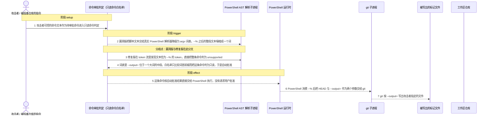
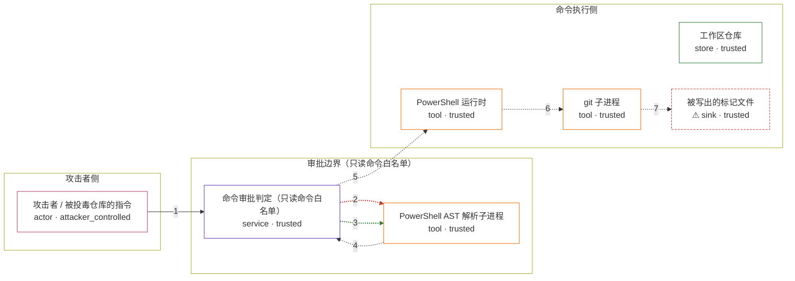

# codex / CVE-2026-19591

状态：草稿，未完成环境和复现。这个目录由模板生成，不构成漏洞确认。

图解的唯一来源是 `diagram.toml`：编辑后运行 `python3 -m runner diagram codex/CVE-2026-19591` 重新生成下方的图解区块。图解必须覆盖漏洞涉及的每个主体，并标出漏洞版/修复版的分歧步骤。

<!-- diagram:begin (generated from diagram.toml by `python3 -m runner diagram`; edit diagram.toml, not this block) -->
## 漏洞图解 — codex / CVE-2026-19591 漏洞图解

Codex 在执行 shell 命令前用一份只读命令白名单决定该命令能否免批准运行，而这份白名单是用静态解析去预测 PowerShell 的真实执行语义。遇到停止解析 token `--%` 时，真实 PowerShell 把该行剩余文本交给原生命令自行拆分，Codex 的 AST 降级却把这段文本塌缩成一个 argv 词，于是 `--output=` 不再位于词首，按词首前缀匹配的白名单判定这条会写文件的命令为只读并自动批准。修复版只要在 token 流里发现文本恰为 `--%` 的 token 就把整条命令标为 unsupported，改回必须请求用户批准。

### 涉及主体

| 主体 | 类型 | 信任级别 | 在漏洞里的作用 | 来源 |
| --- | --- | --- | --- | --- |
| 攻击者 / 被投毒仓库的指令 (`attacker`) | `actor` | `attacker_controlled` | 仓库指令与其中的命令文本完全由攻击者提供。真实链路里这段文本经由被提示注入的编码 agent 变成一条待审批的 PowerShell 调用；攻击者只能决定这段文本，不能直接读写宿主机。 | fixtures/attack.json |
| 命令审批判定（只读命令白名单） (`approval`) | `service` | `trusted` | codex-shell-command 的 is_known_safe_command：用 PowerShell 解析结果和只读 git 子命令白名单判断一条命令能否免批准运行。这条 PowerShell 路径没有平台门控，在 Linux 上同样会被走到。 | fixtures/attack.json |
| PowerShell AST 解析子进程 (`parser`) | `tool` | `trusted` | 常驻的真实 pwsh 子进程，用 powershell_parser.ps1 把脚本文本解析成 AST 再降级为 argv 形状的词表。--% 之后的一整段文本在这里被降级进同一个词，检查器看到的 argv 从此与运行时 argv 分叉。 | fixtures/attack.json |
| PowerShell 运行时 (`shell`) | `tool` | `trusted` | 真正执行已批准命令的 pwsh：它消费掉 --% 本身，把剩余文本按原生命令的规则拆开传给 git，所以检查阶段没看见的选项在运行阶段生效。 | fixtures/attack.json |
| git 子进程 (`git`) | `tool` | `trusted` | 收到白名单没有识别的 --output=，按该选项把输出写进文件，是命令从只读变成写文件的关键一步。 | fixtures/attack.json |
| 工作区仓库 (`workspace`) | `store` | `trusted` | 命令运行所在的 git 工作区。它既是 --output 的写入落点，也是真实链路上 Codex 配置所在的目录。 | fixtures/attack.json |
| ⚠ 被写出的标记文件 (`effect`) | `sink` | `trusted` | 漏洞版实际产生的受控效果载体：git --output 在仓库里写出的文件。它不是真实外部目标；真实链路会用同一写入动作改写 Codex 配置，从而让攻击者控制的 MCP server 在下次加载配置时启动。 | fixtures/attack.json |

**信任边界**

- **攻击者侧** (`attacker_side`)：成员 `attacker`。攻击者只能提供仓库指令和其中的命令文本，不能直接写工作区；命令是否执行由下面的审批边界决定。
- **审批边界（只读命令白名单）** (`approval_boundary`)：成员 `approval`、`parser`。这道边界本该让写文件的命令必须请求用户批准。它把真实 PowerShell 的解析结果降级成 argv 词表后按词首前缀匹配危险选项，而 --% 让危险选项藏在词的中间，检查因此失效。
- **命令执行侧** (`execution_boundary`)：成员 `shell`、`git`、`workspace`、`effect`。命令一旦被自动批准就在这一侧真实运行：PowerShell 消费 --% 后把剩余文本交给 git，git 按未经检查的选项写出文件。

标 ⚠ 的主体是本仓库合成的替身或无害效果载体，不代表真实外部目标。

### 触发过程

### 主体与信任边界

箭头上的数字是上面的步骤编号；方框只标主体和信任级别，具体动作见「触发过程」。

**分歧点**：第 2 步（`vulnerable_only`）漏洞版把脚本文本交给真实 PowerShell 解析器降级为 argv 词表，--% 之后的整段文本塌缩成一个词。
**分歧点**：第 3 步（`patched_only`）修复版在 token 流里发现文本恰为 --% 的 token，直接把整条命令判为 unsupported。
<!-- diagram:end -->

## 公告与机制

TODO：官方公告、漏洞根因、Agent 信任边界、受影响范围和修复来源。

## 前提

TODO：认证要求、用户交互、已有批准、工具权限、攻击者能控制的内容。

## 版本与启动

TODO：补全 metadata、Dockerfile/镜像 digest 和 Compose，再写出精确启动命令。

Compose 中 `vulnerable` 与 `patched` profiles 分开使用；未指定 profile 不启动服务。镜像变量未配置时 Compose 会明确报错。此模板不暴露宿主端口，也不挂载主机数据。

## 机制复现

TODO：实现 `reproduce.py`，固定输入并执行真实漏洞路径，注明运行位置、参数和超时。

完成实现后使用 `python3 -m runner reproduce codex/CVE-2026-19591 --build --rounds 3`。
两脚本统一接受 `--context <context.json> --output <目录>`，详细字段见仓库 `docs/environment-contract.md`。
PoC 输出 `facts.json` 和效果文件；验证器只读证据，输出含 `target_ready` 及对应效果断言的 `verdict.json`。
镜像必须包含 Python 3 和 `/lab/` 下的脚本、fixtures；`runtime.mode` 选择 `oneshot` 或有 healthcheck 的 `service`。

## 端到端复现

TODO：实现 `end_to_end.py`；若不需要模型，明确写出不适用原因。真实模型的结果与机制复现分开统计。

## 验证与修复对照

TODO：实现 `verify.py`。记录漏洞版无害效果、修复版阻断和正常任务成功的证据，不能把服务启动失败当成阻断。

## 清理

默认运行器按每个测试的唯一 Compose project 清理容器、网络和 volume。
`--keep-on-failure` 保留失败项目，项目标识和 Compose 配置在结果目录中；仅清理该项目，不能使用全局 prune。

## 失败诊断

TODO：为本漏洞写出预期效果缺失、修复版仍有越界效果、正常任务失败及前提不满足时的具体排查路径。
启动失败、健康检查失败和超时都不能当作修复阻断。报告中应能定位到阶段、预期、实际和受控证据。

## 构建与输入

TODO：填写两版源码 archive、完整 commit，记录 `build.inputs` 中每个下载的 SHA-256；依赖安装必须支持禁网构建。
固定攻击和正常输入放入 `fixtures/` 并登记到 `fixtures/manifest.toml`。固定 seed、环境变量，说明无害效果与真实影响的关系。

## 隔离例外

默认无例外。确需例外时同时填写 `runtime.exceptions`、理由及最小范围，晋升由两位维护者审阅。

## 来源与许可

TODO：列出引用代码、fixtures 和镜像的来源及许可。
