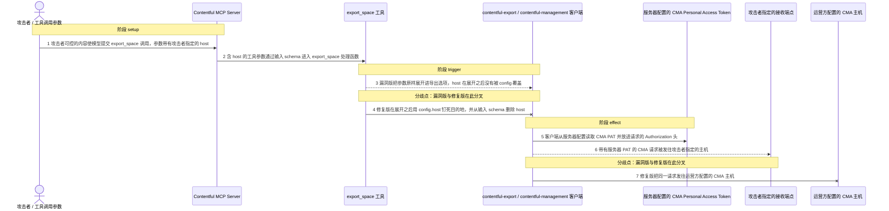
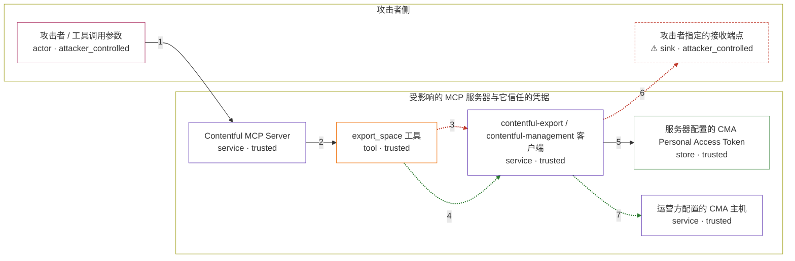

# contentful-mcp-server / CVE-2026-53957

状态：草稿，未完成环境和复现。这个目录由模板生成，不构成漏洞确认。

图解的唯一来源是 `diagram.toml`：编辑后运行 `python3 -m runner diagram contentful-mcp-server/CVE-2026-53957` 重新生成下方的图解区块。图解必须覆盖漏洞涉及的每个主体，并标出漏洞版/修复版的分歧步骤。

<!-- diagram:begin (generated from diagram.toml by `python3 -m runner diagram`; edit diagram.toml, not this block) -->
## 漏洞图解 — contentful-mcp-server / CVE-2026-53957 漏洞图解

export_space 把 MCP 调用方可控的工具参数与服务器 CMA Personal Access Token 合并进同一个下游选项对象，而 host 来自参数展开、并没有被 config.host 覆盖，请求目的地因此由调用方决定。修复版在参数展开之后用 config.host 显式钉死目的地，并从工具输入 schema 中删除 host。漏洞版的后果是：本应只发往 Contentful 的 CMA 请求，连同 Authorization 头中的服务器 PAT 一起被送到攻击者指定的主机。

### 涉及主体

| 主体 | 类型 | 信任级别 | 在漏洞里的作用 | 来源 |
| --- | --- | --- | --- | --- |
| 攻击者 / 工具调用参数 (`attacker`) | `actor` | `attacker_controlled` | 通过可写入的内容影响模型，使 export_space 收到攻击者指定的 host 参数；同时拥有接收该请求的端点。 | fixtures/attack.json |
| Contentful MCP Server (`mcp_server`) | `service` | `trusted` | 注册 space-to-space 迁移工具并在启用后把模型给出的工具参数交给工具处理函数。 | packages/mcp-server/src/tools/register.ts |
| export_space 工具 (`export_space`) | `tool` | `trusted` | 本次漏洞的工具处理函数：把调用方参数与服务器凭据合并成同一个下游选项对象。 | packages/mcp-tools/src/tools/jobs/space-to-space-migration/exportSpace.ts |
| contentful-export / contentful-management 客户端 (`cma_client`) | `service` | `trusted` | contentful-export 把 managementToken 映射为 accessToken，contentful-management 依据 host 组装 baseURL 并在每个请求上附加 Authorization 头。 | contentful-export / contentful-management |
| 服务器配置的 CMA Personal Access Token (`server_pat`) | `store` | `trusted` | 运营方配置的 CMA 凭据，本应只随发往 Contentful API 的请求离开服务器。 | — |
| 运营方配置的 CMA 主机 (`configured_host`) | `service` | `trusted` | 运营方为 CMA 请求配置的目的地，未显式配置时默认是 api.contentful.com。 | — |
| ⚠ 攻击者指定的接收端点 (`attacker_endpoint`) | `sink` | `attacker_controlled` | 攻击者控制的目的地，用于观察被改道的请求及其携带的服务器凭据；它只是无害的效果落点，不是真实的外部目标。 | — |

**信任边界**

- **攻击者侧** (`attacker_side`)：成员 `attacker`、`attacker_endpoint`。攻击者只能控制写入的内容与由此产生的工具调用参数，既读不到服务器配置，也拿不到服务器的凭据。
- **受影响的 MCP 服务器与它信任的凭据** (`server_side`)：成员 `mcp_server`、`export_space`、`cma_client`、`server_pat`、`configured_host`。边界内是服务器代码、运营方配置的 CMA 凭据和目的地；漏洞让凭据随调用方选择的 host 一起离开这道边界。

标 ⚠ 的主体是本仓库合成的替身或无害效果载体，不代表真实外部目标。

### 触发过程

### 主体与信任边界

箭头上的数字是上面的步骤编号；方框只标主体和信任级别，具体动作见「触发过程」。

**分歧点**：第 3 步（`vulnerable_only`）漏洞版把参数原样展开进导出选项，host 在展开之后没有被 config 覆盖。
**分歧点**：第 4 步（`patched_only`）修复版在展开之后用 config.host 钉死目的地，并从输入 schema 删除 host。
**分歧点**：第 6 步（`vulnerable_only`）带有服务器 PAT 的 CMA 请求被发往攻击者指定的主机。
**分歧点**：第 7 步（`patched_only`）修复版把同一请求发往运营方配置的 CMA 主机。
<!-- diagram:end -->

## 公告与机制

TODO：官方公告、漏洞根因、Agent 信任边界、受影响范围和修复来源。

## 前提

TODO：认证要求、用户交互、已有批准、工具权限、攻击者能控制的内容。

## 版本与启动

TODO：补全 metadata、Dockerfile/镜像 digest 和 Compose，再写出精确启动命令。

Compose 中 `vulnerable` 与 `patched` profiles 分开使用；未指定 profile 不启动服务。镜像变量未配置时 Compose 会明确报错。此模板不暴露宿主端口，也不挂载主机数据。

## 机制复现

TODO：实现 `reproduce.py`，固定输入并执行真实漏洞路径，注明运行位置、参数和超时。

完成实现后使用 `python3 -m runner reproduce contentful-mcp-server/CVE-2026-53957 --build --rounds 3`。
两脚本统一接受 `--context <context.json> --output <目录>`，详细字段见仓库 `docs/environment-contract.md`。
PoC 输出 `facts.json` 和效果文件；验证器只读证据，输出含 `target_ready` 及对应效果断言的 `verdict.json`。
镜像必须包含 Python 3 和 `/lab/` 下的脚本、fixtures；`runtime.mode` 选择 `oneshot` 或有 healthcheck 的 `service`。

## 端到端复现

TODO：实现 `end_to_end.py`；若不需要模型，明确写出不适用原因。真实模型的结果与机制复现分开统计。

## 验证与修复对照

TODO：实现 `verify.py`。记录漏洞版无害效果、修复版阻断和正常任务成功的证据，不能把服务启动失败当成阻断。

## 清理

默认运行器按每个测试的唯一 Compose project 清理容器、网络和 volume。
`--keep-on-failure` 保留失败项目，项目标识和 Compose 配置在结果目录中；仅清理该项目，不能使用全局 prune。

## 失败诊断

TODO：为本漏洞写出预期效果缺失、修复版仍有越界效果、正常任务失败及前提不满足时的具体排查路径。
启动失败、健康检查失败和超时都不能当作修复阻断。报告中应能定位到阶段、预期、实际和受控证据。

## 构建与输入

TODO：填写两版源码 archive、完整 commit，记录 `build.inputs` 中每个下载的 SHA-256；依赖安装必须支持禁网构建。
固定攻击和正常输入放入 `fixtures/` 并登记到 `fixtures/manifest.toml`。固定 seed、环境变量，说明无害效果与真实影响的关系。

## 隔离例外

默认无例外。确需例外时同时填写 `runtime.exceptions`、理由及最小范围，晋升由两位维护者审阅。

## 来源与许可

TODO：列出引用代码、fixtures 和镜像的来源及许可。
