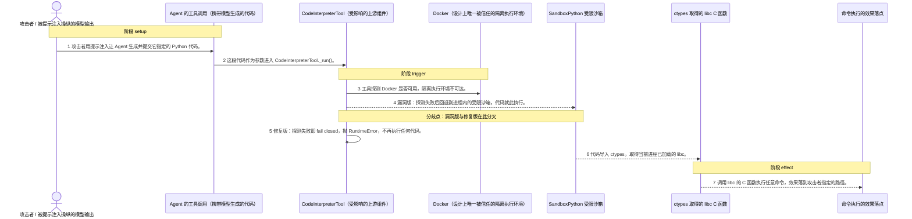
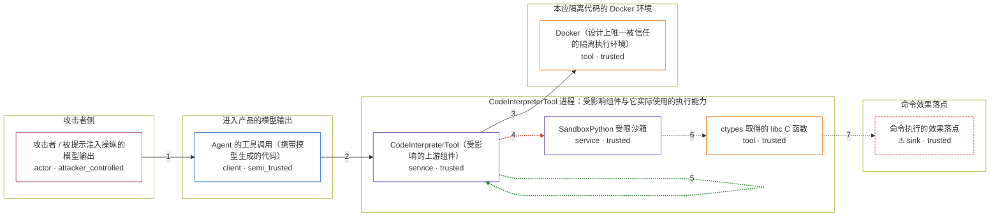

# crewai-codeinterpreter-tool-falls-back-to-sandbo / CVE-2026-2275

状态：草稿，未完成环境和复现。这个目录由模板生成，不构成漏洞确认。

图解的唯一来源是 `diagram.toml`：编辑后运行 `python3 -m runner diagram crewai-codeinterpreter-tool-falls-back-to-sandbo/CVE-2026-2275` 重新生成下方的图解区块。图解必须覆盖漏洞涉及的每个主体，并标出漏洞版/修复版的分歧步骤。

<!-- diagram:begin (generated from diagram.toml by `python3 -m runner diagram`; edit diagram.toml, not this block) -->
## 漏洞图解 — CrewAI CodeInterpreterTool 的 Docker 回退沙箱逃逸

CodeInterpreterTool 本应只在 Docker 容器里执行代码，但当 docker info 探测失败时（没有 docker 可执行文件或 daemon 不可达），run_code_safety() 会静默回退到进程内的 SandboxPython。SandboxPython 只按模块名拉黑少数模块，ctypes 不在名单内，于是被执行的代码能取得当前进程已加载的 libc，并调用其中的任意 C 函数（CWE-749）。隔离能力缺失时选择更弱的执行环境而不是拒绝执行，使攻击者可经提示注入在宿主 Agent 进程上执行任意命令；修复版改为 fail closed，直接抛 RuntimeError。

### 涉及主体

| 主体 | 类型 | 信任级别 | 在漏洞里的作用 | 来源 |
| --- | --- | --- | --- | --- |
| 攻击者 / 被提示注入操纵的模型输出 (`attacker`) | `actor` | `attacker_controlled` | 攻击者用直接或间接提示注入让 Agent 生成并执行它指定的 Python 代码。它想要的是一段以宿主 Agent 身份运行的命令，而它自己能控制的只有这段代码文本。 | fixtures/attack.json |
| Agent 的工具调用（携带模型生成的代码） (`agent_call`) | `client` | `semi_trusted` | 把模型生成的代码作为 code 参数送进 CodeInterpreterTool 的调用方。调用链本身是可信代码，却把不可信的模型输出原样带了进来。 | fixtures/attack.json |
| CodeInterpreterTool（受影响的上游组件） (`interpreter_tool`) | `service` | `trusted` | 出问题的上游组件。_run() 在 unsafe_mode 关闭时调用 run_code_safety()，由这里决定代码究竟在 Docker 里跑，还是回退到进程内沙箱。 | lib/crewai-tools/src/crewai_tools/tools/code_interpreter_tool/code_interpreter_tool.py |
| Docker（设计上唯一被信任的隔离执行环境） (`docker_runtime`) | `tool` | `trusted` | 代码本该在其中执行的环境。_check_docker_available() 用 docker info 探测它；探测失败是触发降级的前提条件，不是攻击者的动作。 | lib/crewai-tools/src/crewai_tools/tools/code_interpreter_tool/code_interpreter_tool.py |
| SandboxPython 受限沙箱 (`sandbox_python`) | `service` | `trusted` | Docker 不可达时被选中的执行环境。它只把少数模块名拉黑、删掉几个内建函数，进程内执行并不构成安全边界。 | lib/crewai-tools/src/crewai_tools/tools/code_interpreter_tool/code_interpreter_tool.py |
| ctypes 取得的 libc C 函数 (`libc_ctypes`) | `tool` | `trusted` | 被暴露出来的危险能力。ctypes 既不在黑名单里也不被删除，代码因此能取得当前进程已加载的 libc，并调用 system 之类的任意 C 函数。 | lib/crewai-tools/src/crewai_tools/tools/code_interpreter_tool/code_interpreter_tool.py |
| ⚠ 命令执行的效果落点 (`escape_sink`) | `sink` | `trusted` | 攻击者命令实际生效的位置，本来可以是宿主上的任意路径；这里只写入一个受控的无害标记文件。漏洞版能让效果落在这里，修复版到不了。 | — |

**信任边界**

- **攻击者侧** (`attacker_side`)：成员 `attacker`。攻击者只能影响交给工具的代码文本。它没有宿主执行权限，否则不必绕这一圈。
- **进入产品的模型输出** (`model_output`)：成员 `agent_call`。产品信任自己的 Agent 调用链，却没有把模型生成的代码当成不可信输入对待。
- **CodeInterpreterTool 进程：受影响组件与它实际使用的执行能力** (`crewai_process`)：成员 `interpreter_tool`、`sandbox_python`、`libc_ctypes`。这道边界本该把不可信代码与宿主进程隔开。回退到进程内沙箱让代码直接落在这道边界内侧执行。
- **本应隔离代码的 Docker 环境** (`docker_isolation`)：成员 `docker_runtime`。设计上代码只允许在这里执行。探测不到它时，产品没有拒绝执行，而是换了一个不具备隔离能力的环境。
- **命令效果落点** (`effect_side`)：成员 `escape_sink`。命令以宿主进程身份生效的位置。漏洞版能到达，修复版到不了。

标 ⚠ 的主体是本仓库合成的替身或无害效果载体，不代表真实外部目标。

### 触发过程

### 主体与信任边界

箭头上的数字是上面的步骤编号；方框只标主体和信任级别，具体动作见「触发过程」。

**分歧点**：第 4 步（`vulnerable_only`）漏洞版：探测失败后回退到进程内的受限沙箱，代码就此执行。。
**分歧点**：第 5 步（`patched_only`）修复版：探测失败即 fail closed，抛 RuntimeError，不再执行任何代码。。
<!-- diagram:end -->

## 公告与机制

TODO：官方公告、漏洞根因、Agent 信任边界、受影响范围和修复来源。

## 前提

TODO：认证要求、用户交互、已有批准、工具权限、攻击者能控制的内容。

## 版本与启动

TODO：补全 metadata、Dockerfile/镜像 digest 和 Compose，再写出精确启动命令。

Compose 中 `vulnerable` 与 `patched` profiles 分开使用；未指定 profile 不启动服务。镜像变量未配置时 Compose 会明确报错。此模板不暴露宿主端口，也不挂载主机数据。

## 机制复现

TODO：实现 `reproduce.py`，固定输入并执行真实漏洞路径，注明运行位置、参数和超时。

完成实现后使用 `python3 -m runner reproduce crewai-codeinterpreter-tool-falls-back-to-sandbo/CVE-2026-2275 --build --rounds 3`。
两脚本统一接受 `--context <context.json> --output <目录>`，详细字段见仓库 `docs/environment-contract.md`。
PoC 输出 `facts.json` 和效果文件；验证器只读证据，输出含 `target_ready` 及对应效果断言的 `verdict.json`。
镜像必须包含 Python 3 和 `/lab/` 下的脚本、fixtures；`runtime.mode` 选择 `oneshot` 或有 healthcheck 的 `service`。

## 端到端复现

TODO：实现 `end_to_end.py`；若不需要模型，明确写出不适用原因。真实模型的结果与机制复现分开统计。

## 验证与修复对照

TODO：实现 `verify.py`。记录漏洞版无害效果、修复版阻断和正常任务成功的证据，不能把服务启动失败当成阻断。

## 清理

默认运行器按每个测试的唯一 Compose project 清理容器、网络和 volume。
`--keep-on-failure` 保留失败项目，项目标识和 Compose 配置在结果目录中；仅清理该项目，不能使用全局 prune。

## 失败诊断

TODO：为本漏洞写出预期效果缺失、修复版仍有越界效果、正常任务失败及前提不满足时的具体排查路径。
启动失败、健康检查失败和超时都不能当作修复阻断。报告中应能定位到阶段、预期、实际和受控证据。

## 构建与输入

TODO：填写两版源码 archive、完整 commit，记录 `build.inputs` 中每个下载的 SHA-256；依赖安装必须支持禁网构建。
固定攻击和正常输入放入 `fixtures/` 并登记到 `fixtures/manifest.toml`。固定 seed、环境变量，说明无害效果与真实影响的关系。

## 隔离例外

默认无例外。确需例外时同时填写 `runtime.exceptions`、理由及最小范围，晋升由两位维护者审阅。

## 来源与许可

TODO：列出引用代码、fixtures 和镜像的来源及许可。
