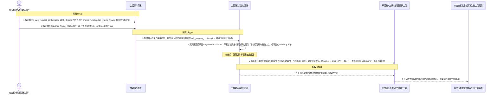
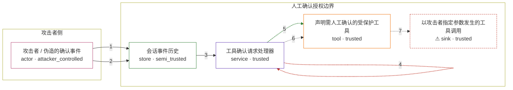

# cve-2026-18236-google-adk-up-to-2-4-x-tool-confi / CVE-2026-18236

状态：草稿，未完成环境和复现。这个目录由模板生成，不构成漏洞确认。

图解的唯一来源是 `diagram.toml`：编辑后运行 `python3 -m runner diagram cve-2026-18236-google-adk-up-to-2-4-x-tool-confi/CVE-2026-18236` 重新生成下方的图解区块。图解必须覆盖漏洞涉及的每个主体，并标出漏洞版/修复版的分歧步骤。

<!-- diagram:begin (generated from diagram.toml by `python3 -m runner diagram`; edit diagram.toml, not this block) -->
## 漏洞图解 — CVE-2026-18236 Google ADK 工具确认继续伪造

ADK 的人工确认流程把会话历史里的 adk_request_confirmation 调用与用户确认响应当作授权凭据，处理器据此重新绑定并重新执行被确认的工具。v2.4.0 的 request_processor 直接采信确认里内嵌的 originalFunctionCall，既不要求历史中存在对应的原始工具调用，也不校验目标工具是否注册、是否真的需要确认，以及 name 与 args 是否与历史一致。能注入会话事件的一方因此可以伪造整段确认回路，让声明必须人工确认的工具按攻击者指定的参数被执行；v2.5.0 在重新执行前补齐这三道校验并中止伪造。

### 涉及主体

| 主体 | 类型 | 信任级别 | 在漏洞里的作用 | 来源 |
| --- | --- | --- | --- | --- |
| 攻击者 / 伪造的确认事件 (`attacker`) | `actor` | `attacker_controlled` | 能够向会话历史注入事件的一方。它完全控制伪造事件的字段：确认调用的 id、内嵌 originalFunctionCall 的 name 与 args，以及用户确认响应的 confirmed 取值。这种注入能力是漏洞前提，它并不因此获得对上游代码或宿主的写权限。 | fixtures/attack_confirmation_forgery.json |
| 会话事件历史 (`session_history`) | `store` | `semi_trusted` | 保存对话与工具调用事件的记录。确认处理器把其中的 adk_request_confirmation 调用和 author 为 user 的确认响应当作人工授权凭据，而攻击者也能往同一记录里写入事件，因此它同时承载可信与伪造内容。 | — |
| 工具确认请求处理器 (`confirmation_processor`) | `service` | `trusted` | 上游 google.adk.flows.llm_flows.request_confirmation 中的 _RequestConfirmationLlmRequestProcessor。它从历史事件里解析用户确认、解析出待恢复的原始工具调用，并调用工具执行路径重新执行它；缺少校验的一环就在这里。 | src/google/adk/flows/llm_flows/request_confirmation.py |
| 声明需人工确认的受保护工具 (`gated_tool`) | `tool` | `trusted` | 注册在执行 agent 上、require_confirmation 为真的工具。它的授权前提是人类确认原始调用的 name 与 args；漏洞版让处理器用攻击者伪造的参数真实调用它。 | — |
| ⚠ 以攻击者指定参数发生的工具调用 (`tool_effect`) | `sink` | `trusted` | 漏洞触发后的效果落点：受保护工具带着攻击者指定的参数被执行，其调用参数就是可核对的效果。这里由无害工具承载该效果，它不代表真实的外部目标。 | — |

**信任边界**

- **攻击者侧** (`attacker_side`)：成员 `attacker`。攻击者能控制的是注入事件的字段内容；它既不能改写上游处理器，也不能直接读到自己想要的数据，只能借伪造的确认让受信组件替它执行工具。
- **人工确认授权边界** (`hitl_authorization`)：成员 `session_history`、`confirmation_processor`、`gated_tool`、`tool_effect`。这道边界本来要求：确认请求对应历史中真实存在的原始工具调用，目标工具确实需要确认，且确认里的 name 与 args 与历史调用逐字段一致。漏洞版在重新执行前没有做这些核对，使伪造事件等价于人工批准。

标 ⚠ 的主体是本仓库合成的替身或无害效果载体，不代表真实外部目标。

### 触发过程

### 主体与信任边界

箭头上的数字是上面的步骤编号；方框只标主体和信任级别，具体动作见「触发过程」。

**分歧点**：第 4 步（`vulnerable_only`）漏洞版直接采信 originalFunctionCall：不要求在历史中找到原始调用，不校验注册与需确认性，也不比对 name 与 args。
**分歧点**：第 5 步（`patched_only`）修复版在重新执行前要求历史中存在该原始调用、目标工具已注册、确实需要确认，且 name 与 args 与历史一致，任一不满足即抛 ValueError，工具不被执行。
<!-- diagram:end -->

## 公告与机制

TODO：官方公告、漏洞根因、Agent 信任边界、受影响范围和修复来源。

## 前提

TODO：认证要求、用户交互、已有批准、工具权限、攻击者能控制的内容。

## 版本与启动

TODO：补全 metadata、Dockerfile/镜像 digest 和 Compose，再写出精确启动命令。

Compose 中 `vulnerable` 与 `patched` profiles 分开使用；未指定 profile 不启动服务。镜像变量未配置时 Compose 会明确报错。此模板不暴露宿主端口，也不挂载主机数据。

## 机制复现

TODO：实现 `reproduce.py`，固定输入并执行真实漏洞路径，注明运行位置、参数和超时。

完成实现后使用 `python3 -m runner reproduce cve-2026-18236-google-adk-up-to-2-4-x-tool-confi/CVE-2026-18236 --build --rounds 3`。
两脚本统一接受 `--context <context.json> --output <目录>`，详细字段见仓库 `docs/environment-contract.md`。
PoC 输出 `facts.json` 和效果文件；验证器只读证据，输出含 `target_ready` 及对应效果断言的 `verdict.json`。
镜像必须包含 Python 3 和 `/lab/` 下的脚本、fixtures；`runtime.mode` 选择 `oneshot` 或有 healthcheck 的 `service`。

## 端到端复现

TODO：实现 `end_to_end.py`；若不需要模型，明确写出不适用原因。真实模型的结果与机制复现分开统计。

## 验证与修复对照

TODO：实现 `verify.py`。记录漏洞版无害效果、修复版阻断和正常任务成功的证据，不能把服务启动失败当成阻断。

## 清理

默认运行器按每个测试的唯一 Compose project 清理容器、网络和 volume。
`--keep-on-failure` 保留失败项目，项目标识和 Compose 配置在结果目录中；仅清理该项目，不能使用全局 prune。

## 失败诊断

TODO：为本漏洞写出预期效果缺失、修复版仍有越界效果、正常任务失败及前提不满足时的具体排查路径。
启动失败、健康检查失败和超时都不能当作修复阻断。报告中应能定位到阶段、预期、实际和受控证据。

## 构建与输入

TODO：填写两版源码 archive、完整 commit，记录 `build.inputs` 中每个下载的 SHA-256；依赖安装必须支持禁网构建。
固定攻击和正常输入放入 `fixtures/` 并登记到 `fixtures/manifest.toml`。固定 seed、环境变量，说明无害效果与真实影响的关系。

## 隔离例外

默认无例外。确需例外时同时填写 `runtime.exceptions`、理由及最小范围，晋升由两位维护者审阅。

## 来源与许可

TODO：列出引用代码、fixtures 和镜像的来源及许可。
