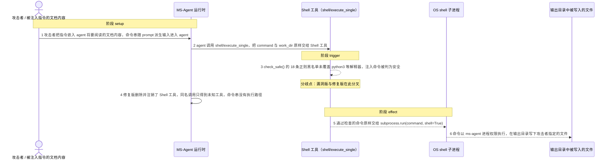
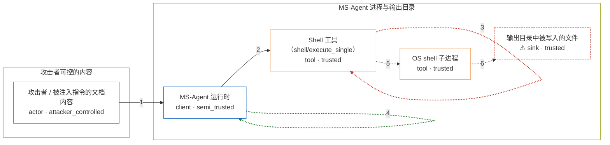

# cve-2026-2256-poc / CVE-2026-2256

状态：草稿，未完成环境和复现。这个目录由模板生成，不构成漏洞确认。

图解的唯一来源是 `diagram.toml`：编辑后运行 `python3 -m runner diagram cve-2026-2256-poc/CVE-2026-2256` 重新生成下方的图解区块。图解必须覆盖漏洞涉及的每个主体，并标出漏洞版/修复版的分歧步骤。

<!-- diagram:begin (generated from diagram.toml by `python3 -m runner diagram`; edit diagram.toml, not this block) -->
## 漏洞图解 — MS-Agent Shell 工具命令注入（CVE-2026-2256）

MS-Agent 的 Shell 工具把 shell/execute_single 的命令串只交给 check_safe() 的 18 条正则黑名单把关，黑名单里没有任何解释器或网络工具，python3 -c 这类命令可以整条通过。agent 会把 prompt 派生的不可信文本原样转成 command 参数，因此间接提示注入就足以让命令通过检查并落到 subprocess.run(shell=True)。通过检查的命令随后以 ms-agent 进程权限由 OS shell 执行，攻击者因此获得任意命令执行能力。

### 涉及主体

| 主体 | 类型 | 信任级别 | 在漏洞里的作用 | 来源 |
| --- | --- | --- | --- | --- |
| 攻击者 / 被注入指令的文档内容 (`attacker`) | `actor` | `attacker_controlled` | 攻击者只能控制 agent 将要阅读的文档内容，以及由这段内容派生的 shell/execute_single 命令串；它自己够不着目标进程和输出目录。 | fixtures/attack.json |
| MS-Agent 运行时 (`agent`) | `client` | `semi_trusted` | 把 prompt 派生的不可信文本转成工具调用参数并转发给已注册的工具；它信任 Shell 工具会替它把关，因此没有第二道校验。 | — |
| Shell 工具（shell/execute_single） (`shell_tool`) | `tool` | `trusted` | 唯一的把关点：check_safe() 用 18 条正则黑名单判断命令是否安全，通过后由 execute_shell() 原样交给 subprocess.run(shell=True)。 | ms_agent/tools/shell/shell.py |
| OS shell 子进程 (`os_shell`) | `tool` | `trusted` | subprocess.run(shell=True) 拉起的 /bin/sh，命令在这里以 ms-agent 进程的权限被解析执行。 | — |
| ⚠ 输出目录中被写入的文件 (`effect_file`) | `sink` | `trusted` | 命令执行落点的无害载体：被绕过的命令在这个目录写下的文件。它是受控观测载体，不代表攻击者真实的外部目标。 | — |

**信任边界**

- **攻击者可控的内容** (`attacker_side`)：成员 `attacker`。攻击者能控制的只有 agent 将阅读的文档内容和由此派生的命令串；它不能直接读写目标进程、输出目录或工具注册表。
- **MS-Agent 进程与输出目录** (`service_side`)：成员 `agent`、`shell_tool`、`os_shell`、`effect_file`。这道边界本应把不可信的 prompt 派生内容挡在 OS 命令执行之外。唯一把关的是 Shell 工具的正则黑名单，而黑名单没有覆盖 python3 等解释器，也不以白名单或隔离兜底，命令因此越过边界。

标 ⚠ 的主体是本仓库合成的替身或无害效果载体，不代表真实外部目标。

### 触发过程

### 主体与信任边界

箭头上的数字是上面的步骤编号；方框只标主体和信任级别，具体动作见「触发过程」。

**分歧点**：第 3 步（`vulnerable_only`）check_safe() 的 18 条正则黑名单未覆盖 python3 等解释器，注入命令被判为安全。
**分歧点**：第 4 步（`patched_only`）修复版删除并注销了 Shell 工具，同名调用只得到未知工具，命令串没有执行路径。
<!-- diagram:end -->

## 公告与机制

TODO：官方公告、漏洞根因、Agent 信任边界、受影响范围和修复来源。

## 前提

TODO：认证要求、用户交互、已有批准、工具权限、攻击者能控制的内容。

## 版本与启动

TODO：补全 metadata、Dockerfile/镜像 digest 和 Compose，再写出精确启动命令。

Compose 中 `vulnerable` 与 `patched` profiles 分开使用；未指定 profile 不启动服务。镜像变量未配置时 Compose 会明确报错。此模板不暴露宿主端口，也不挂载主机数据。

## 机制复现

TODO：实现 `reproduce.py`，固定输入并执行真实漏洞路径，注明运行位置、参数和超时。

完成实现后使用 `python3 -m runner reproduce cve-2026-2256-poc/CVE-2026-2256 --build --rounds 3`。
两脚本统一接受 `--context <context.json> --output <目录>`，详细字段见仓库 `docs/environment-contract.md`。
PoC 输出 `facts.json` 和效果文件；验证器只读证据，输出含 `target_ready` 及对应效果断言的 `verdict.json`。
镜像必须包含 Python 3 和 `/lab/` 下的脚本、fixtures；`runtime.mode` 选择 `oneshot` 或有 healthcheck 的 `service`。

## 端到端复现

TODO：实现 `end_to_end.py`；若不需要模型，明确写出不适用原因。真实模型的结果与机制复现分开统计。

## 验证与修复对照

TODO：实现 `verify.py`。记录漏洞版无害效果、修复版阻断和正常任务成功的证据，不能把服务启动失败当成阻断。

## 清理

默认运行器按每个测试的唯一 Compose project 清理容器、网络和 volume。
`--keep-on-failure` 保留失败项目，项目标识和 Compose 配置在结果目录中；仅清理该项目，不能使用全局 prune。

## 失败诊断

TODO：为本漏洞写出预期效果缺失、修复版仍有越界效果、正常任务失败及前提不满足时的具体排查路径。
启动失败、健康检查失败和超时都不能当作修复阻断。报告中应能定位到阶段、预期、实际和受控证据。

## 构建与输入

TODO：填写两版源码 archive、完整 commit，记录 `build.inputs` 中每个下载的 SHA-256；依赖安装必须支持禁网构建。
固定攻击和正常输入放入 `fixtures/` 并登记到 `fixtures/manifest.toml`。固定 seed、环境变量，说明无害效果与真实影响的关系。

## 隔离例外

默认无例外。确需例外时同时填写 `runtime.exceptions`、理由及最小范围，晋升由两位维护者审阅。

## 来源与许可

TODO：列出引用代码、fixtures 和镜像的来源及许可。
