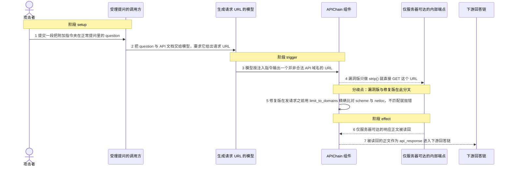
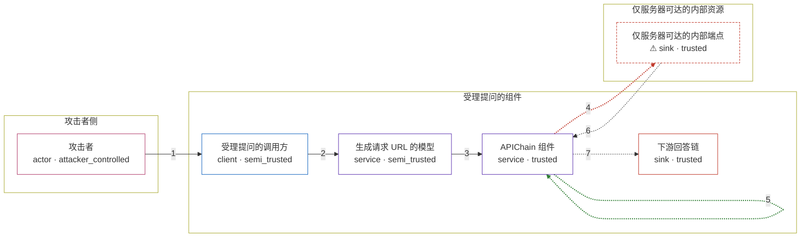

# d265f46fc3161b31ac2e81db44d662e1 / CVE-2023-32786

状态：草稿，未完成环境和复现。这个目录由模板生成，不构成漏洞确认。

图解的唯一来源是 `diagram.toml`：编辑后运行 `python3 -m runner diagram d265f46fc3161b31ac2e81db44d662e1/CVE-2023-32786` 重新生成下方的图解区块。图解必须覆盖漏洞涉及的每个主体，并标出漏洞版/修复版的分歧步骤。

<!-- diagram:begin (generated from diagram.toml by `python3 -m runner diagram`; edit diagram.toml, not this block) -->
## 漏洞图解 — LangChain APIChain 提示注入导致的 SSRF（CVE-2023-32786）

LangChain 的 APIChain 让模型依据用户提问生成请求 URL，随后只对该字符串做 strip() 就由服务器直接发起 HTTP GET，既没有 scheme 校验也没有 host 白名单。攻击者把附加指令写进 question，模型便会输出一个并非合法 API 域名的 URL，服务器于是替攻击者访问该目标。漏洞效果是仅服务器网络位置可达的内部资源被读回，并且响应内容被继续注入到下游回答链。修复版在发请求之前用 limit_to_domains 精确比对 scheme 与 netloc，且默认不给白名单就无法构造。

### 涉及主体

| 主体 | 类型 | 信任级别 | 在漏洞里的作用 | 来源 |
| --- | --- | --- | --- | --- |
| 攻击者 (`attacker`) | `actor` | `attacker_controlled` | 构造伪装成普通提问的注入文本。它只能控制提交上来的 question 文本，不能直接指定服务器实际发起请求的目标，也不能自己访问内部资源。 | fixtures/attack_question.txt |
| 受理提问的调用方 (`caller`) | `client` | `semi_trusted` | 接受用户提问并调用 APIChain 的应用侧代码。它把用户可控的 question 与 API 文档原样传给下游，本身不检查提问里是否夹带指令。 | fixtures/benign_question.txt |
| 生成请求 URL 的模型 (`llm`) | `service` | `semi_trusted` | 负责把 question 与 api_docs 映射成一条请求 URL。它会把不可信文本里的附加指令当成新任务，从而输出攻击者想要的 URL。 | fixtures/llm_outputs.json |
| APIChain 组件 (`api_chain`) | `service` | `trusted` | 受影响的上游组件。它把模型输出的字符串当作可信的请求目标，漏洞版只在 strip() 之后直接调用 TextRequestsWrapper.get，缺少 scheme 与 host 校验。 | libs/langchain/langchain/chains/api/base.py |
| ⚠ 仅服务器可达的内部端点 (`internal_endpoint`) | `sink` | `trusted` | 攻击者真正想要但自己够不着的东西：只有服务器的网络位置能访问的内部端点，例如云元数据或内网服务。机制对照里由回环地址上的接收器充当，返回一段合成标记而不是真实凭据。 | — |
| 下游回答链 (`answer_chain`) | `sink` | `trusted` | 接收 API 响应的下游组件。任意 URL 的响应正文会作为 api_response 进入它的提示词，使被读取的内容影响最终答案。 | — |

**信任边界**

- **攻击者侧** (`attacker_side`)：成员 `attacker`。攻击者只掌握提交上来的提问文本，既不拥有服务器，也不在服务器的网络位置上，因此目标资源必须由服务器代它访问。
- **受理提问的组件** (`service_side`)：成员 `caller`、`llm`、`api_chain`、`answer_chain`。这道边界本应把用户提问限制在“生成答案”的范围内：请求目标应由 API 文档决定，而不是由提问文本派生；模型输出不是可信的授权来源。
- **仅服务器可达的内部资源** (`internal_side`)：成员 `internal_endpoint`。该资源只对服务器的网络位置开放，本不该被用户提问间接读到。漏洞让攻击者借服务器的身份越过了这道隔离。

标 ⚠ 的主体是本仓库合成的替身或无害效果载体，不代表真实外部目标。

### 触发过程

### 主体与信任边界

箭头上的数字是上面的步骤编号；方框只标主体和信任级别，具体动作见「触发过程」。

**分歧点**：第 4 步（`vulnerable_only`）漏洞版只做 strip() 就直接 GET 这个 URL。
**分歧点**：第 5 步（`patched_only`）修复版在发请求之前用 limit_to_domains 精确比对 scheme 与 netloc，不匹配就抛错。
<!-- diagram:end -->

## 公告与机制

TODO：官方公告、漏洞根因、Agent 信任边界、受影响范围和修复来源。

## 前提

TODO：认证要求、用户交互、已有批准、工具权限、攻击者能控制的内容。

## 版本与启动

TODO：补全 metadata、Dockerfile/镜像 digest 和 Compose，再写出精确启动命令。

Compose 中 `vulnerable` 与 `patched` profiles 分开使用；未指定 profile 不启动服务。镜像变量未配置时 Compose 会明确报错。此模板不暴露宿主端口，也不挂载主机数据。

## 机制复现

TODO：实现 `reproduce.py`，固定输入并执行真实漏洞路径，注明运行位置、参数和超时。

完成实现后使用 `python3 -m runner reproduce d265f46fc3161b31ac2e81db44d662e1/CVE-2023-32786 --build --rounds 3`。
两脚本统一接受 `--context <context.json> --output <目录>`，详细字段见仓库 `docs/environment-contract.md`。
PoC 输出 `facts.json` 和效果文件；验证器只读证据，输出含 `target_ready` 及对应效果断言的 `verdict.json`。
镜像必须包含 Python 3 和 `/lab/` 下的脚本、fixtures；`runtime.mode` 选择 `oneshot` 或有 healthcheck 的 `service`。

## 端到端复现

TODO：实现 `end_to_end.py`；若不需要模型，明确写出不适用原因。真实模型的结果与机制复现分开统计。

## 验证与修复对照

TODO：实现 `verify.py`。记录漏洞版无害效果、修复版阻断和正常任务成功的证据，不能把服务启动失败当成阻断。

## 清理

默认运行器按每个测试的唯一 Compose project 清理容器、网络和 volume。
`--keep-on-failure` 保留失败项目，项目标识和 Compose 配置在结果目录中；仅清理该项目，不能使用全局 prune。

## 失败诊断

TODO：为本漏洞写出预期效果缺失、修复版仍有越界效果、正常任务失败及前提不满足时的具体排查路径。
启动失败、健康检查失败和超时都不能当作修复阻断。报告中应能定位到阶段、预期、实际和受控证据。

## 构建与输入

TODO：填写两版源码 archive、完整 commit，记录 `build.inputs` 中每个下载的 SHA-256；依赖安装必须支持禁网构建。
固定攻击和正常输入放入 `fixtures/` 并登记到 `fixtures/manifest.toml`。固定 seed、环境变量，说明无害效果与真实影响的关系。

## 隔离例外

默认无例外。确需例外时同时填写 `runtime.exceptions`、理由及最小范围，晋升由两位维护者审阅。

## 来源与许可

TODO：列出引用代码、fixtures 和镜像的来源及许可。
