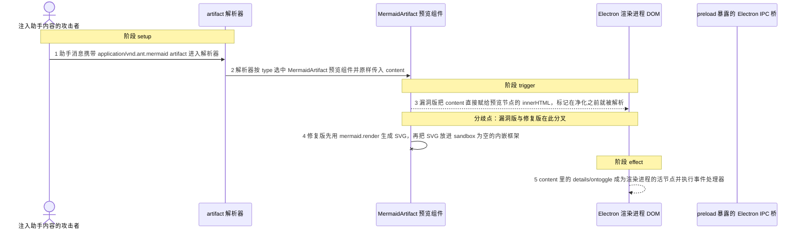
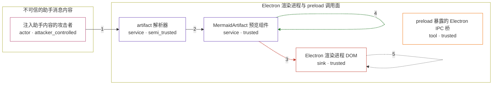

# deepchat / CVE-2025-66222

状态：草稿，未完成环境和复现。这个目录由模板生成，不构成漏洞确认。

图解的唯一来源是 `diagram.toml`：编辑后运行 `python3 -m runner diagram deepchat/CVE-2025-66222` 重新生成下方的图解区块。图解必须覆盖漏洞涉及的每个主体，并标出漏洞版/修复版的分歧步骤。

<!-- diagram:begin (generated from diagram.toml by `python3 -m runner diagram`; edit diagram.toml, not this block) -->
## 漏洞图解 — deepchat / CVE-2025-66222 漏洞图解

助手消息里的 artifact 内容由模型输出或被提示注入的网页决定，属于攻击者完全可控的不可信输入。漏洞版的 MermaidArtifact 预览组件把这个字符串直接赋给预览节点的 innerHTML，content 里的 details/ontoggle 等标记在赋值瞬间就成为 Electron 渲染进程里的活节点并执行事件处理器，绕过了 Mermaid securityLevel=strict 的净化。修复版改为先用 mermaid.render 生成 SVG，再把它放进 sandbox 为空的内嵌框架，事件处理器不再具有渲染进程的权限。preload 暴露的原始 ipcRenderer 让渲染进程内的执行可以继续调用主进程的 presenter:call，最终抵达 MCP 子进程 spawn，这正是该 XSS 被判为严重的原因。

### 涉及主体

| 主体 | 类型 | 信任级别 | 在漏洞里的作用 | 来源 |
| --- | --- | --- | --- | --- |
| 注入助手内容的攻击者 (`attacker`) | `actor` | `attacker_controlled` | 通过被提示注入的网页内容或分享会话决定助手消息里的 artifact 内容，即完全控制 MermaidArtifact 收到的 content 字符串；它自己拿不到渲染进程，只能让这段字符串被预览组件处理。 | fixtures/attack-mermaid-artifact-toggle.mmd |
| artifact 解析器 (`artifact_parser`) | `service` | `semi_trusted` | 用正则从助手消息块里提取 antArtifact 并解析 type，把不可信 content 带进受信的渲染流程；它只判断 artifact 类型，不校验内容里的标记。 | src/renderer/src/composables/useArtifacts.ts |
| MermaidArtifact 预览组件 (`mermaid_preview`) | `service` | `trusted` | isPreview 为真时渲染 artifact 预览。v0.5.0 把 props.block.content 直接赋给预览节点的 innerHTML；修复版先用 mermaid.render 生成 SVG，再交给 sandbox 为空的内嵌框架显示。 | src/renderer/src/components/artifacts/MermaidArtifact.vue |
| Electron 渲染进程 DOM (`renderer_dom`) | `sink` | `trusted` | 漏洞的效果落点：被原样注入的标记在这里成为活节点，事件处理器以渲染进程的权限执行。它本应只显示经过净化的图表，而不是把消息内容当标记解析。 | fixtures/attack-mermaid-artifact-toggle.mmd |
| preload 暴露的 Electron IPC 桥 (`ipc_bridge`) | `tool` | `trusted` | preload 通过 exposeElectronAPI() 把原始 ipcRenderer 暴露为 window.electron.ipcRenderer，主进程的 presenter:call 又按名字直接调用 presenter 方法；渲染进程里执行的事件处理器因此能走到 mcpPresenter.addMcpServer 与 startServer 的 spawn 路径，把 XSS 放大成任意命令执行。 | src/preload/index.ts |

**信任边界**

- **不可信的助手消息内容** (`assistant_content`)：成员 `attacker`。攻击者完全控制这里的内容，包括 artifact 的 type、标题和正文；它不能直接把标记写进渲染进程，只能依赖预览组件去解析这段字符串。
- **Electron 渲染进程与 preload 调用面** (`electron_renderer`)：成员 `artifact_parser`、`mermaid_preview`、`renderer_dom`、`ipc_bridge`。这道边界原本靠 Mermaid securityLevel=strict 的净化把不可信内容挡成文本；漏洞版的 innerHTML 赋值在净化之前就把标记解析成活节点，边界失效。

### 触发过程

### 主体与信任边界

箭头上的数字是上面的步骤编号；方框只标主体和信任级别，具体动作见「触发过程」。

**分歧点**：第 3 步（`vulnerable_only`）漏洞版把 content 直接赋给预览节点的 innerHTML，标记在净化之前就被解析。
**分歧点**：第 4 步（`patched_only`）修复版先用 mermaid.render 生成 SVG，再把 SVG 放进 sandbox 为空的内嵌框架。
<!-- diagram:end -->

## 公告与机制

TODO：官方公告、漏洞根因、Agent 信任边界、受影响范围和修复来源。

## 前提

TODO：认证要求、用户交互、已有批准、工具权限、攻击者能控制的内容。

## 版本与启动

TODO：补全 metadata、Dockerfile/镜像 digest 和 Compose，再写出精确启动命令。

Compose 中 `vulnerable` 与 `patched` profiles 分开使用；未指定 profile 不启动服务。镜像变量未配置时 Compose 会明确报错。此模板不暴露宿主端口，也不挂载主机数据。

## 机制复现

TODO：实现 `reproduce.py`，固定输入并执行真实漏洞路径，注明运行位置、参数和超时。

完成实现后使用 `python3 -m runner reproduce deepchat/CVE-2025-66222 --build --rounds 3`。
两脚本统一接受 `--context <context.json> --output <目录>`，详细字段见仓库 `docs/environment-contract.md`。
PoC 输出 `facts.json` 和效果文件；验证器只读证据，输出含 `target_ready` 及对应效果断言的 `verdict.json`。
镜像必须包含 Python 3 和 `/lab/` 下的脚本、fixtures；`runtime.mode` 选择 `oneshot` 或有 healthcheck 的 `service`。

## 端到端复现

TODO：实现 `end_to_end.py`；若不需要模型，明确写出不适用原因。真实模型的结果与机制复现分开统计。

## 验证与修复对照

TODO：实现 `verify.py`。记录漏洞版无害效果、修复版阻断和正常任务成功的证据，不能把服务启动失败当成阻断。

## 清理

默认运行器按每个测试的唯一 Compose project 清理容器、网络和 volume。
`--keep-on-failure` 保留失败项目，项目标识和 Compose 配置在结果目录中；仅清理该项目，不能使用全局 prune。

## 失败诊断

TODO：为本漏洞写出预期效果缺失、修复版仍有越界效果、正常任务失败及前提不满足时的具体排查路径。
启动失败、健康检查失败和超时都不能当作修复阻断。报告中应能定位到阶段、预期、实际和受控证据。

## 构建与输入

TODO：填写两版源码 archive、完整 commit，记录 `build.inputs` 中每个下载的 SHA-256；依赖安装必须支持禁网构建。
固定攻击和正常输入放入 `fixtures/` 并登记到 `fixtures/manifest.toml`。固定 seed、环境变量，说明无害效果与真实影响的关系。

## 隔离例外

默认无例外。确需例外时同时填写 `runtime.exceptions`、理由及最小范围，晋升由两位维护者审阅。

## 来源与许可

TODO：列出引用代码、fixtures 和镜像的来源及许可。
