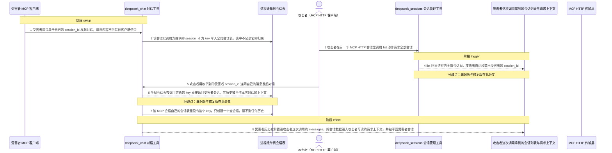
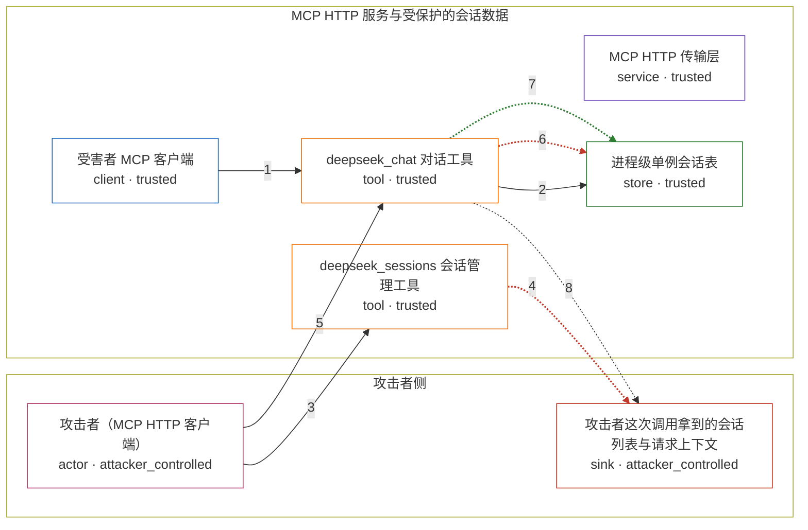

# deepseek-mcp-server / CVE-2026-55604

状态：草稿，未完成环境和复现。这个目录由模板生成，不构成漏洞确认。

图解的唯一来源是 `diagram.toml`：编辑后运行 `python3 -m runner diagram deepseek-mcp-server/CVE-2026-55604` 重新生成下方的图解区块。图解必须覆盖漏洞涉及的每个主体，并标出漏洞版/修复版的分歧步骤。

<!-- diagram:begin (generated from diagram.toml by `python3 -m runner diagram`; edit diagram.toml, not this block) -->
## 漏洞图解 — deepseek-mcp-server / CVE-2026-55604 会话表单例导致的跨会话数据暴露

HTTP transport 会为每个 MCP 会话新建一个 McpServer 实例，但工具注册始终解析到同一个进程级会话表单例。该会话表以调用方自选的 session_id 作为唯一 key，既不校验格式也不记录会话归属，因此任意客户端用他人的 session_id 就能命中并复用它人的会话。攻击者据此枚举他人会话 id、把他人对话历史前置进自己发往模型 API 的请求，并把自己的消息写回他人会话。

### 涉及主体

| 主体 | 类型 | 信任级别 | 在漏洞里的作用 | 来源 |
| --- | --- | --- | --- | --- |
| 攻击者（MCP HTTP 客户端） (`attacker`) | `actor` | `attacker_controlled` | 无需认证即可访问 HTTP 端点，控制自己发起的 MCP 会话、自选的 session_id、消息内容与会话管理动作。 | fixtures/attack.json |
| 攻击者这次调用拿到的会话列表与请求上下文 (`attacker_view`) | `sink` | `attacker_controlled` | 漏洞效果落点：攻击者自己的工具输出里出现的他人会话 id，以及被前置了他人历史的那个请求上下文与回复。 | — |
| 受害者 MCP 客户端 (`victim_client`) | `client` | `trusted` | 在独立的 MCP HTTP 会话里建立并保存只有自己可见的对话历史，这段历史是跨会话读取的目标。 | fixtures/attack.json |
| MCP HTTP 传输层 (`http_transport`) | `service` | `trusted` | 按 mcp-session-id 为每个 MCP 会话新建 McpServer 实例，本应把不同客户端隔开；工具注册却仍走进程级会话表。 | — |
| deepseek_sessions 会话管理工具 (`deepseek_sessions`) | `tool` | `trusted` | list 动作回显进程内全部会话 id；delete 与 clear 可作用于调用方指定的任意会话。 | src/tools/deepseek-sessions.ts |
| deepseek_chat 对话工具 (`deepseek_chat`) | `tool` | `trusted` | 按 session_id 取出会话历史并前置到发往模型 API 的 messages，再把本次消息与回复写回同一个会话。 | src/tools/deepseek-chat.ts |
| 进程级单例会话表 (`session_store`) | `store` | `trusted` | 以调用方提供的 session_id 为 key 保存会话历史，既不校验 key 的来源也不记录会话属于哪个客户端。 | src/session.ts |

**信任边界**

- **攻击者侧** (`attacker_side`)：成员 `attacker`、`attacker_view`。攻击者只控制自己的 MCP HTTP 会话、自选的 session_id 与消息内容；受害者的会话历史本来不在这里。
- **MCP HTTP 服务与受保护的会话数据** (`product`)：成员 `victim_client`、`http_transport`、`deepseek_sessions`、`deepseek_chat`、`session_store`。HTTP 层为每个 MCP 会话建立独立的 McpServer，本应把客户端彼此隔离；会话表单例让这道隔离失效，任何 key 都能命中他人数据。

### 触发过程

### 主体与信任边界

箭头上的数字是上面的步骤编号；方框只标主体和信任级别，具体动作见「触发过程」。

**分歧点**：第 4 步（`vulnerable_only`）list 回显进程内全部会话 id，攻击者由此枚举出受害者的 session_id。
**分歧点**：第 6 步（`vulnerable_only`）全局会话表按调用方给的 key 直接返回受害者会话，其历史被当作本次对话的上下文。
**分歧点**：第 7 步（`patched_only`）该 MCP 会话自己的会话表里没有这个 key，只新建一个空会话，读不到任何历史。
<!-- diagram:end -->

## 公告与机制

TODO：官方公告、漏洞根因、Agent 信任边界、受影响范围和修复来源。

## 前提

TODO：认证要求、用户交互、已有批准、工具权限、攻击者能控制的内容。

## 版本与启动

TODO：补全 metadata、Dockerfile/镜像 digest 和 Compose，再写出精确启动命令。

Compose 中 `vulnerable` 与 `patched` profiles 分开使用；未指定 profile 不启动服务。镜像变量未配置时 Compose 会明确报错。此模板不暴露宿主端口，也不挂载主机数据。

## 机制复现

TODO：实现 `reproduce.py`，固定输入并执行真实漏洞路径，注明运行位置、参数和超时。

完成实现后使用 `python3 -m runner reproduce deepseek-mcp-server/CVE-2026-55604 --build --rounds 3`。
两脚本统一接受 `--context <context.json> --output <目录>`，详细字段见仓库 `docs/environment-contract.md`。
PoC 输出 `facts.json` 和效果文件；验证器只读证据，输出含 `target_ready` 及对应效果断言的 `verdict.json`。
镜像必须包含 Python 3 和 `/lab/` 下的脚本、fixtures；`runtime.mode` 选择 `oneshot` 或有 healthcheck 的 `service`。

## 端到端复现

TODO：实现 `end_to_end.py`；若不需要模型，明确写出不适用原因。真实模型的结果与机制复现分开统计。

## 验证与修复对照

TODO：实现 `verify.py`。记录漏洞版无害效果、修复版阻断和正常任务成功的证据，不能把服务启动失败当成阻断。

## 清理

默认运行器按每个测试的唯一 Compose project 清理容器、网络和 volume。
`--keep-on-failure` 保留失败项目，项目标识和 Compose 配置在结果目录中；仅清理该项目，不能使用全局 prune。

## 失败诊断

TODO：为本漏洞写出预期效果缺失、修复版仍有越界效果、正常任务失败及前提不满足时的具体排查路径。
启动失败、健康检查失败和超时都不能当作修复阻断。报告中应能定位到阶段、预期、实际和受控证据。

## 构建与输入

TODO：填写两版源码 archive、完整 commit，记录 `build.inputs` 中每个下载的 SHA-256；依赖安装必须支持禁网构建。
固定攻击和正常输入放入 `fixtures/` 并登记到 `fixtures/manifest.toml`。固定 seed、环境变量，说明无害效果与真实影响的关系。

## 隔离例外

默认无例外。确需例外时同时填写 `runtime.exceptions`、理由及最小范围，晋升由两位维护者审阅。

## 来源与许可

TODO：列出引用代码、fixtures 和镜像的来源及许可。
