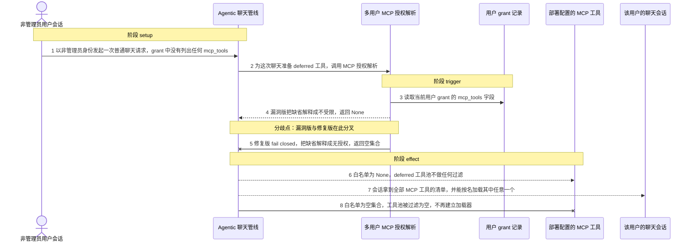
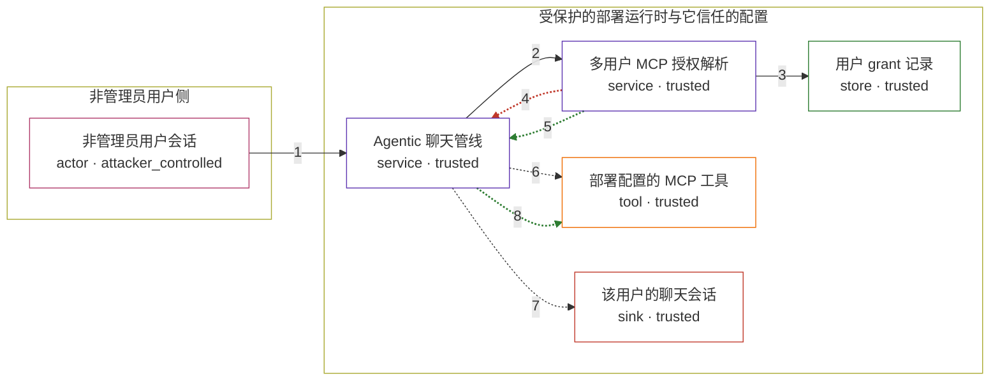

# deeptutor / CVE-2026-58168

状态：草稿，未完成环境和复现。这个目录由模板生成，不构成漏洞确认。

图解的唯一来源是 `diagram.toml`：编辑后运行 `python3 -m runner diagram deeptutor/CVE-2026-58168` 重新生成下方的图解区块。图解必须覆盖漏洞涉及的每个主体，并标出漏洞版/修复版的分歧步骤。

<!-- diagram:begin (generated from diagram.toml by `python3 -m runner diagram`; edit diagram.toml, not this block) -->
## 漏洞图解 — deeptutor / CVE-2026-58168 非管理员 MCP 工具授权缺失

非管理员用户的 grant v2 省略 mcp_tools 时，allowed_mcp_tools() 把「没有显式授权」和「不受限」都编码成 None，聊天管线因此不对 deferred MCP 工具池做任何过滤。于是「未经授权不得发现或加载 MCP 工具」这道授权边界整体失效：该用户的会话会收到部署中配置的全部 MCP 工具清单，并能按名加载其中任意一个，包括 filesystem、shell 这类代理宿主侧能力的工具。修复版把缺省的 mcp_tools 解析为空集合，同一输入被完全拒绝。

### 涉及主体

| 主体 | 类型 | 信任级别 | 在漏洞里的作用 | 来源 |
| --- | --- | --- | --- | --- |
| 非管理员用户会话 (`non_admin_user`) | `actor` | `attacker_controlled` | 以非管理员身份发起普通聊天请求。grant 里没有列出任何 mcp_tools，所以它本来没有任何 MCP 工具授权；它想要的是 MCP server 背后的宿主侧能力。它能控制的只有这次请求和其中的工具调用意图。 | fixtures/attack.json |
| Agentic 聊天管线 (`chat_pipeline`) | `service` | `trusted` | 在 _prepare_deferred_tools 里解析当前用户的 MCP 白名单，据此过滤 deferred 工具池、渲染工具清单并建立 DeferredToolLoader。它把白名单解析结果直接当成授权结论。 | deeptutor/agents/chat/agentic_pipeline.py |
| 多用户 MCP 授权解析 (`tool_access`) | `service` | `trusted` | allowed_mcp_tools() 读取 grant 的 mcp_tools 并给出授权结论；combine_whitelists() 把调用方白名单与用户白名单取交集。字段缺省时，漏洞版返回 None 表示「不受限」，修复版返回空集合表示「无授权」。 | deeptutor/multi_user/tool_access.py |
| 用户 grant 记录 (`grant_store`) | `store` | `trusted` | 按用户保存 v2 grant。管理员显式授权前 mcp_tools 一直缺省，正常语义应是「零个 MCP 工具」，而不是「全部工具」。 | deeptutor/multi_user/grants.py |
| 部署配置的 MCP 工具 (`mcp_tools`) | `tool` | `trusted` | deferred 的 MCP 工具，可代理宿主侧文件系统、shell 等能力。只有被告知明确授权的用户才应能列出并加载它们。 | deeptutor/runtime/registry/deferred_tools.py |
| 该用户的聊天会话 (`user_session`) | `sink` | `trusted` | 授权判定失效后，这个会话收到全部 MCP 工具的清单，并可按名加载其中任意一个。 | — |

**信任边界**

- **非管理员用户侧** (`user_side`)：成员 `non_admin_user`。用户只能控制自己的这次聊天请求和其中的工具调用意图；它既读不到 grant 记录，也够不到任何 MCP server。
- **受保护的部署运行时与它信任的配置** (`product_side`)：成员 `chat_pipeline`、`tool_access`、`grant_store`、`mcp_tools`、`user_session`。这道边界承担「未经显式授权不得发现或加载 MCP 工具」的授权职责。grant 缺省被解释成不受限后，白名单、工具池过滤和加载器三层一起放开。

### 触发过程

### 主体与信任边界

箭头上的数字是上面的步骤编号；方框只标主体和信任级别，具体动作见「触发过程」。

**分歧点**：第 4 步（`vulnerable_only`）漏洞版把缺省解释成不受限，返回 None。
**分歧点**：第 5 步（`patched_only`）修复版 fail closed，把缺省解释成无授权，返回空集合。
<!-- diagram:end -->

## 公告与机制

TODO：官方公告、漏洞根因、Agent 信任边界、受影响范围和修复来源。

## 前提

TODO：认证要求、用户交互、已有批准、工具权限、攻击者能控制的内容。

## 版本与启动

TODO：补全 metadata、Dockerfile/镜像 digest 和 Compose，再写出精确启动命令。

Compose 中 `vulnerable` 与 `patched` profiles 分开使用；未指定 profile 不启动服务。镜像变量未配置时 Compose 会明确报错。此模板不暴露宿主端口，也不挂载主机数据。

## 机制复现

TODO：实现 `reproduce.py`，固定输入并执行真实漏洞路径，注明运行位置、参数和超时。

完成实现后使用 `python3 -m runner reproduce deeptutor/CVE-2026-58168 --build --rounds 3`。
两脚本统一接受 `--context <context.json> --output <目录>`，详细字段见仓库 `docs/environment-contract.md`。
PoC 输出 `facts.json` 和效果文件；验证器只读证据，输出含 `target_ready` 及对应效果断言的 `verdict.json`。
镜像必须包含 Python 3 和 `/lab/` 下的脚本、fixtures；`runtime.mode` 选择 `oneshot` 或有 healthcheck 的 `service`。

## 端到端复现

TODO：实现 `end_to_end.py`；若不需要模型，明确写出不适用原因。真实模型的结果与机制复现分开统计。

## 验证与修复对照

TODO：实现 `verify.py`。记录漏洞版无害效果、修复版阻断和正常任务成功的证据，不能把服务启动失败当成阻断。

## 清理

默认运行器按每个测试的唯一 Compose project 清理容器、网络和 volume。
`--keep-on-failure` 保留失败项目，项目标识和 Compose 配置在结果目录中；仅清理该项目，不能使用全局 prune。

## 失败诊断

TODO：为本漏洞写出预期效果缺失、修复版仍有越界效果、正常任务失败及前提不满足时的具体排查路径。
启动失败、健康检查失败和超时都不能当作修复阻断。报告中应能定位到阶段、预期、实际和受控证据。

## 构建与输入

TODO：填写两版源码 archive、完整 commit，记录 `build.inputs` 中每个下载的 SHA-256；依赖安装必须支持禁网构建。
固定攻击和正常输入放入 `fixtures/` 并登记到 `fixtures/manifest.toml`。固定 seed、环境变量，说明无害效果与真实影响的关系。

## 隔离例外

默认无例外。确需例外时同时填写 `runtime.exceptions`、理由及最小范围，晋升由两位维护者审阅。

## 来源与许可

TODO：列出引用代码、fixtures 和镜像的来源及许可。
