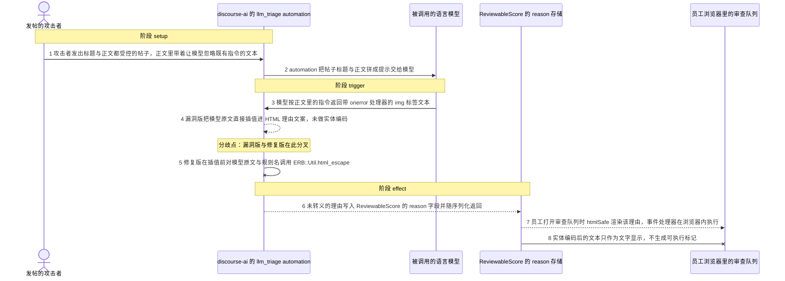
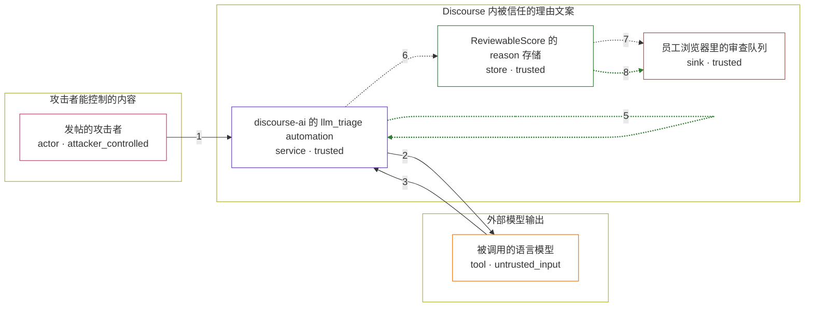

# discourse / CVE-2026-27740

状态：草稿，未完成环境和复现。这个目录由模板生成，不构成漏洞确认。

图解的唯一来源是 `diagram.toml`：编辑后运行 `python3 -m runner diagram discourse/CVE-2026-27740` 重新生成下方的图解区块。图解必须覆盖漏洞涉及的每个主体，并标出漏洞版/修复版的分歧步骤。

<!-- diagram:begin (generated from diagram.toml by `python3 -m runner diagram`; edit diagram.toml, not this block) -->
## 漏洞图解 — discourse / CVE-2026-27740 漏洞图解

AI triage automation 把帖子标题与正文原样交给语言模型，再把模型返回的文本直接插值进一段 HTML 审查理由文案。帖子正文可控的攻击者用提示注入让模型返回带 onerror 的 img 标签，该标记未经实体编码就写入 ReviewableScore 的 reason，并由审查队列以 htmlSafe 渲染，脚本于是在员工的浏览器里执行。修复版在插值前对模型输出与自动化规则名调用 ERB::Util.html_escape，同一输入只剩文字。

### 涉及主体

| 主体 | 类型 | 信任级别 | 在漏洞里的作用 | 来源 |
| --- | --- | --- | --- | --- |
| 发帖的攻击者 (`attacker`) | `actor` | `attacker_controlled` | 只能控制自己帖子的标题与正文。它在正文里放入让模型忽略既有指令的文本，等待这段文本被模型复述进审查理由。 | fixtures/attack.json |
| discourse-ai 的 llm_triage automation (`triage_automation`) | `service` | `trusted` | 把帖子标题与正文拼成提示调用模型，并把模型返回的文本与规则名插值进审查理由文案；这里缺少 HTML 实体编码。 | fixtures/upstream/vulnerable/plugins/discourse-ai/lib/automation/llm_triage.rb |
| 被调用的语言模型 (`llm`) | `tool` | `untrusted_input` | 返回受帖子正文影响的文本。它的输出没有经过校验就被当作可信的 HTML 文案参数使用。 | fixtures/upstream/vulnerable/plugins/discourse-ai/lib/personas/tools/flag_post.rb |
| ReviewableScore 的 reason 存储 (`reviewable_score`) | `store` | `trusted` | 持久化 flag 理由，并由序列化器作为 reason 字段返回给审查界面。 | fixtures/sink/app/serializers/reviewable_score_serializer.rb |
| 员工浏览器里的审查队列 (`review_queue`) | `sink` | `trusted` | 把收到的 reason 交给 htmlSafe 渲染，于是存储的事件处理器在员工浏览器内执行。 | fixtures/sink/frontend/discourse/app/components/reviewable-scores.gjs |

**信任边界**

- **攻击者能控制的内容** (`attacker_side`)：成员 `attacker`。攻击者只写自己的帖子，够不着审查理由、存储和员工浏览器。
- **外部模型输出** (`model_side`)：成员 `llm`。模型输出完全受帖子正文摆布，平台却把它当成可信的文案参数。
- **Discourse 内被信任的理由文案** (`product`)：成员 `triage_automation`、`reviewable_score`、`review_queue`。这道边界把审查理由当作可信 HTML（原本是为了支持文案里的链接）。模型输出未经实体编码就穿过它写入存储，再由 htmlSafe 渲染。

### 触发过程

### 主体与信任边界

箭头上的数字是上面的步骤编号；方框只标主体和信任级别，具体动作见「触发过程」。

**分歧点**：第 4 步（`vulnerable_only`）漏洞版把模型原文直接插值进 HTML 理由文案，未做实体编码。
**分歧点**：第 5 步（`patched_only`）修复版在插值前对模型原文与规则名调用 ERB::Util.html_escape。
<!-- diagram:end -->

## 公告与机制

TODO：官方公告、漏洞根因、Agent 信任边界、受影响范围和修复来源。

## 前提

TODO：认证要求、用户交互、已有批准、工具权限、攻击者能控制的内容。

## 版本与启动

TODO：补全 metadata、Dockerfile/镜像 digest 和 Compose，再写出精确启动命令。

Compose 中 `vulnerable` 与 `patched` profiles 分开使用；未指定 profile 不启动服务。镜像变量未配置时 Compose 会明确报错。此模板不暴露宿主端口，也不挂载主机数据。

## 机制复现

TODO：实现 `reproduce.py`，固定输入并执行真实漏洞路径，注明运行位置、参数和超时。

完成实现后使用 `python3 -m runner reproduce discourse/CVE-2026-27740 --build --rounds 3`。
两脚本统一接受 `--context <context.json> --output <目录>`，详细字段见仓库 `docs/environment-contract.md`。
PoC 输出 `facts.json` 和效果文件；验证器只读证据，输出含 `target_ready` 及对应效果断言的 `verdict.json`。
镜像必须包含 Python 3 和 `/lab/` 下的脚本、fixtures；`runtime.mode` 选择 `oneshot` 或有 healthcheck 的 `service`。

## 端到端复现

TODO：实现 `end_to_end.py`；若不需要模型，明确写出不适用原因。真实模型的结果与机制复现分开统计。

## 验证与修复对照

TODO：实现 `verify.py`。记录漏洞版无害效果、修复版阻断和正常任务成功的证据，不能把服务启动失败当成阻断。

## 清理

默认运行器按每个测试的唯一 Compose project 清理容器、网络和 volume。
`--keep-on-failure` 保留失败项目，项目标识和 Compose 配置在结果目录中；仅清理该项目，不能使用全局 prune。

## 失败诊断

TODO：为本漏洞写出预期效果缺失、修复版仍有越界效果、正常任务失败及前提不满足时的具体排查路径。
启动失败、健康检查失败和超时都不能当作修复阻断。报告中应能定位到阶段、预期、实际和受控证据。

## 构建与输入

TODO：填写两版源码 archive、完整 commit，记录 `build.inputs` 中每个下载的 SHA-256；依赖安装必须支持禁网构建。
固定攻击和正常输入放入 `fixtures/` 并登记到 `fixtures/manifest.toml`。固定 seed、环境变量，说明无害效果与真实影响的关系。

## 隔离例外

默认无例外。确需例外时同时填写 `runtime.exceptions`、理由及最小范围，晋升由两位维护者审阅。

## 来源与许可

TODO：列出引用代码、fixtures 和镜像的来源及许可。
