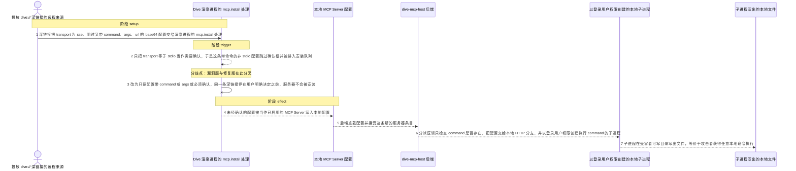
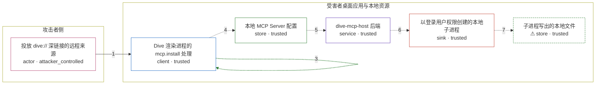

# dive / CVE-2026-23523

状态：草稿，未完成环境和复现。这个目录由模板生成，不构成漏洞确认。

图解的唯一来源是 `diagram.toml`：编辑后运行 `python3 -m runner diagram dive/CVE-2026-23523` 重新生成下方的图解区块。图解必须覆盖漏洞涉及的每个主体，并标出漏洞版/修复版的分歧步骤。

<!-- diagram:begin (generated from diagram.toml by `python3 -m runner diagram`; edit diagram.toml, not this block) -->
## 漏洞图解 — dive / CVE-2026-23523 漏洞图解

Dive 渲染进程处理 mcp.install 深链接时，只在 transport 为 stdio 时弹出安装确认框。攻击者构造 transport 为 sse、同时带 command/args/url 的配置，就绕过了这道确认边界，配置被当作已启用的 MCP Server 写入并由后端重载。后端的分派逻辑只看 command 是否存在，于是命令以登录用户权限被创建为本地子进程，攻击者无需任何额外交互即可执行任意本地命令。

### 涉及主体

| 主体 | 类型 | 信任级别 | 在漏洞里的作用 | 来源 |
| --- | --- | --- | --- | --- |
| 投放 dive:// 深链接的远程来源 (`attacker`) | `actor` | `attacker_controlled` | 任意网页、聊天消息或文档里的一个 dive://mcp.install 链接即可，无需认证；攻击者完全控制链接里的 name 与 base64 编码的 config 参数。 | — |
| Dive 渲染进程的 mcp.install 处理 (`renderer`) | `client` | `trusted` | 解码深链接参数并决定是否弹出安装确认框；它把「需要确认」错误地等价于「transport 为 stdio」，因此带 command/args 的非 stdio 配置被直接放行。 | src/App.tsx |
| 本地 MCP Server 配置 (`config_store`) | `store` | `trusted` | 渲染进程写入的已启用 MCP Server 条目，落盘后由后端读取；漏洞链里它未经用户确认就写入了攻击者的命令配置。 | src/views/Overlay/Tools/index.tsx |
| dive-mcp-host 后端 (`host`) | `service` | `trusted` | 重载配置并按 command/url 是否存在选择启动方式；它没有义务复核 transport，于是带 command 与 url 的配置落入本地 HTTP 分支。 | dive_mcp_host/host/tools/mcp_server.py |
| 以登录用户权限创建的本地子进程 (`user_process`) | `sink` | `trusted` | 真正的命令执行落点：配置里的 command、args 与 env 被原样交给 create_subprocess_exec，子进程继承受害者的权限与环境。 | dive_mcp_host/host/tools/local_http_server.py |
| ⚠ 子进程写出的本地文件 (`effect_file`) | `store` | `trusted` | 被创建的子进程在受害者可写目录留下的文件，用来承载可观察的无害效果；它代表任意命令的后果，而不是真实外部目标。 | — |

**信任边界**

- **攻击者侧** (`attacker_side`)：成员 `attacker`。攻击者只能投递一个深链接并控制其中的 name 与 config 字段，不能直接触碰受害者机器上的任何文件或进程。
- **受害者桌面应用与本地资源** (`victim_host`)：成员 `renderer`、`config_store`、`host`、`user_process`、`effect_file`。这道边界本应由安装确认框把守：任何携带命令的 MCP Server 配置都必须先得到用户明确同意，才能写入配置并交给后端启动。

标 ⚠ 的主体是本仓库合成的替身或无害效果载体，不代表真实外部目标。

### 触发过程

### 主体与信任边界

箭头上的数字是上面的步骤编号；方框只标主体和信任级别，具体动作见「触发过程」。

**分歧点**：第 2 步（`vulnerable_only`）只把 transport 等于 stdio 当作需要确认，于是这条带命令的非 stdio 配置跳过确认框并被排入安装队列。
**分歧点**：第 3 步（`patched_only`）改为只要配置带 command 或 args 就必须确认，同一条深链接停在用户明确决定之前，服务器不会被安装。
<!-- diagram:end -->

## 公告与机制

TODO：官方公告、漏洞根因、Agent 信任边界、受影响范围和修复来源。

## 前提

TODO：认证要求、用户交互、已有批准、工具权限、攻击者能控制的内容。

## 版本与启动

TODO：补全 metadata、Dockerfile/镜像 digest 和 Compose，再写出精确启动命令。

Compose 中 `vulnerable` 与 `patched` profiles 分开使用；未指定 profile 不启动服务。镜像变量未配置时 Compose 会明确报错。此模板不暴露宿主端口，也不挂载主机数据。

## 机制复现

TODO：实现 `reproduce.py`，固定输入并执行真实漏洞路径，注明运行位置、参数和超时。

完成实现后使用 `python3 -m runner reproduce dive/CVE-2026-23523 --build --rounds 3`。
两脚本统一接受 `--context <context.json> --output <目录>`，详细字段见仓库 `docs/environment-contract.md`。
PoC 输出 `facts.json` 和效果文件；验证器只读证据，输出含 `target_ready` 及对应效果断言的 `verdict.json`。
镜像必须包含 Python 3 和 `/lab/` 下的脚本、fixtures；`runtime.mode` 选择 `oneshot` 或有 healthcheck 的 `service`。

## 端到端复现

TODO：实现 `end_to_end.py`；若不需要模型，明确写出不适用原因。真实模型的结果与机制复现分开统计。

## 验证与修复对照

TODO：实现 `verify.py`。记录漏洞版无害效果、修复版阻断和正常任务成功的证据，不能把服务启动失败当成阻断。

## 清理

默认运行器按每个测试的唯一 Compose project 清理容器、网络和 volume。
`--keep-on-failure` 保留失败项目，项目标识和 Compose 配置在结果目录中；仅清理该项目，不能使用全局 prune。

## 失败诊断

TODO：为本漏洞写出预期效果缺失、修复版仍有越界效果、正常任务失败及前提不满足时的具体排查路径。
启动失败、健康检查失败和超时都不能当作修复阻断。报告中应能定位到阶段、预期、实际和受控证据。

## 构建与输入

TODO：填写两版源码 archive、完整 commit，记录 `build.inputs` 中每个下载的 SHA-256；依赖安装必须支持禁网构建。
固定攻击和正常输入放入 `fixtures/` 并登记到 `fixtures/manifest.toml`。固定 seed、环境变量，说明无害效果与真实影响的关系。

## 隔离例外

默认无例外。确需例外时同时填写 `runtime.exceptions`、理由及最小范围，晋升由两位维护者审阅。

## 来源与许可

TODO：列出引用代码、fixtures 和镜像的来源及许可。
