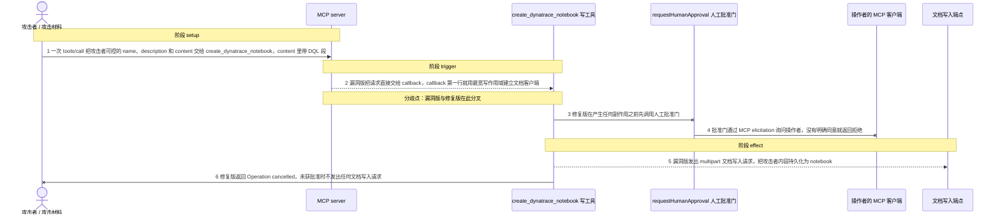
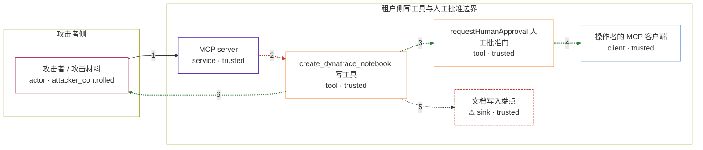

# dynatrace-mcp / GHSA-PC2W-4MQ8-32QW

状态：草稿，未完成环境和复现。这个目录由模板生成，不构成漏洞确认。

图解的唯一来源是 `diagram.toml`：编辑后运行 `python3 -m runner diagram dynatrace-mcp/GHSA-PC2W-4MQ8-32QW` 重新生成下方的图解区块。图解必须覆盖漏洞涉及的每个主体，并标出漏洞版/修复版的分歧步骤。

<!-- diagram:begin (generated from diagram.toml by `python3 -m runner diagram`; edit diagram.toml, not this block) -->
## 漏洞图解 — dynatrace-mcp / GHSA-PC2W-4MQ8-32QW 漏洞图解

create_dynatrace_notebook 是六个写类工具里唯一没有调用 requestHumanApproval 的一个：vulnerable 版的 callback 第一行就用最宽写作用域建立 HTTP 客户端并写入文档，绕过了人工批准这道边界。修复版在 callback 开头先调用批准门，未获明确同意就 fail-closed 返回取消，不再发出文档写入请求。漏洞本身的效果是：调用方无需任何人工同意即可把攻击者可控的 content（含 DQL 段）持久化为租户文档，该 DQL 之后会以打开 notebook 的用户身份执行。

### 涉及主体

| 主体 | 类型 | 信任级别 | 在漏洞里的作用 | 来源 |
| --- | --- | --- | --- | --- |
| 攻击者 / 攻击材料 (`attacker`) | `actor` | `attacker_controlled` | 构造并发出 tools/call 请求的调用方。它只能控制 create_dynatrace_notebook 的 name、description 和 content，没有租户凭据，也无法替操作者给出人工批准。 | fixtures/attack_tool_call.json |
| MCP server (`mcp_server`) | `service` | `trusted` | 受影响的上游组件：启动时不做鉴权，把六个写类工具注册给任意调用方，而 create_dynatrace_notebook 的注册处漏接了其余五个写工具都有的人工批准调用。 | https://raw.githubusercontent.com/dynatrace-oss/dynatrace-mcp/v1.8.6/src/index.ts |
| create_dynatrace_notebook 写工具 (`notebook_tool`) | `tool` | `trusted` | 被调用的工具 callback。vulnerable 版只声明 readOnlyHint，第一行就建立最宽写作用域的客户端并创建文档；patched 版在建立客户端之前先请求人工批准。 | https://raw.githubusercontent.com/dynatrace-oss/dynatrace-mcp/v1.8.6/src/index.ts |
| requestHumanApproval 人工批准门 (`approval_gate`) | `tool` | `trusted` | 通过 MCP elicitation 向操作者征求同意的批准门。只有 accept 且 approval 为 true 才放行；拒绝、取消或 elicitation 出错时一律返回 false。 | https://raw.githubusercontent.com/dynatrace-oss/dynatrace-mcp/2851d3ce29d834c93b67f0db903c10e0b488e7ac/src/index.ts |
| 操作者的 MCP 客户端 (`operator`) | `client` | `trusted` | 操作者一侧的调用方。批准门把待批准的操作发给它，只有它明确同意，写工具的持久化副作用才被允许。 | — |
| ⚠ 文档写入端点 (`document_api`) | `sink` | `trusted` | 租户的文档写入端点 POST /platform/document/v1/documents。notebook 内容在这里被持久化，之后对打开它的租户用户可见；嵌入的 DQL 段会以打开者的身份执行。 | fixtures/mock_document_response.json |

**信任边界**

- **攻击者侧** (`attacker_side`)：成员 `attacker`。攻击者只能控制这一次 tools/call 的参数，既拿不到租户凭据，也无法代替操作者批准。
- **租户侧写工具与人工批准边界** (`tenant_side`)：成员 `mcp_server`、`notebook_tool`、`approval_gate`、`operator`、`document_api`。写类工具本应在产生持久化副作用之前取得操作者的明确同意，人工批准门就是这道边界；vulnerable 版的 notebook 工具没有经过它。

标 ⚠ 的主体是本仓库合成的替身或无害效果载体，不代表真实外部目标。

### 触发过程

### 主体与信任边界

箭头上的数字是上面的步骤编号；方框只标主体和信任级别，具体动作见「触发过程」。

**分歧点**：第 2 步（`vulnerable_only`）漏洞版把请求直接交给 callback，callback 第一行就用最宽写作用域建立文档客户端。
**分歧点**：第 3 步（`patched_only`）修复版在产生任何副作用之前先调用人工批准门。
<!-- diagram:end -->

## 公告与机制

TODO：官方公告、漏洞根因、Agent 信任边界、受影响范围和修复来源。

## 前提

TODO：认证要求、用户交互、已有批准、工具权限、攻击者能控制的内容。

## 版本与启动

TODO：补全 metadata、Dockerfile/镜像 digest 和 Compose，再写出精确启动命令。

Compose 中 `vulnerable` 与 `patched` profiles 分开使用；未指定 profile 不启动服务。镜像变量未配置时 Compose 会明确报错。此模板不暴露宿主端口，也不挂载主机数据。

## 机制复现

TODO：实现 `reproduce.py`，固定输入并执行真实漏洞路径，注明运行位置、参数和超时。

完成实现后使用 `python3 -m runner reproduce dynatrace-mcp/GHSA-PC2W-4MQ8-32QW --build --rounds 3`。
两脚本统一接受 `--context <context.json> --output <目录>`，详细字段见仓库 `docs/environment-contract.md`。
PoC 输出 `facts.json` 和效果文件；验证器只读证据，输出含 `target_ready` 及对应效果断言的 `verdict.json`。
镜像必须包含 Python 3 和 `/lab/` 下的脚本、fixtures；`runtime.mode` 选择 `oneshot` 或有 healthcheck 的 `service`。

## 端到端复现

TODO：实现 `end_to_end.py`；若不需要模型，明确写出不适用原因。真实模型的结果与机制复现分开统计。

## 验证与修复对照

TODO：实现 `verify.py`。记录漏洞版无害效果、修复版阻断和正常任务成功的证据，不能把服务启动失败当成阻断。

## 清理

默认运行器按每个测试的唯一 Compose project 清理容器、网络和 volume。
`--keep-on-failure` 保留失败项目，项目标识和 Compose 配置在结果目录中；仅清理该项目，不能使用全局 prune。

## 失败诊断

TODO：为本漏洞写出预期效果缺失、修复版仍有越界效果、正常任务失败及前提不满足时的具体排查路径。
启动失败、健康检查失败和超时都不能当作修复阻断。报告中应能定位到阶段、预期、实际和受控证据。

## 构建与输入

TODO：填写两版源码 archive、完整 commit，记录 `build.inputs` 中每个下载的 SHA-256；依赖安装必须支持禁网构建。
固定攻击和正常输入放入 `fixtures/` 并登记到 `fixtures/manifest.toml`。固定 seed、环境变量，说明无害效果与真实影响的关系。

## 隔离例外

默认无例外。确需例外时同时填写 `runtime.exceptions`、理由及最小范围，晋升由两位维护者审阅。

## 来源与许可

TODO：列出引用代码、fixtures 和镜像的来源及许可。
