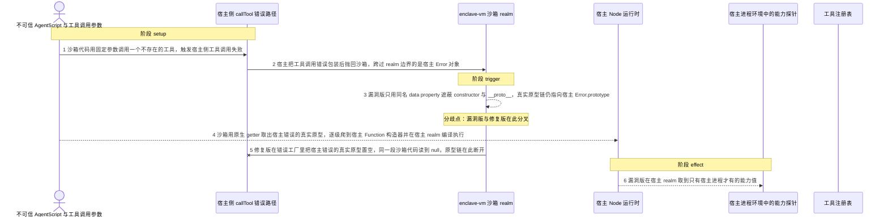
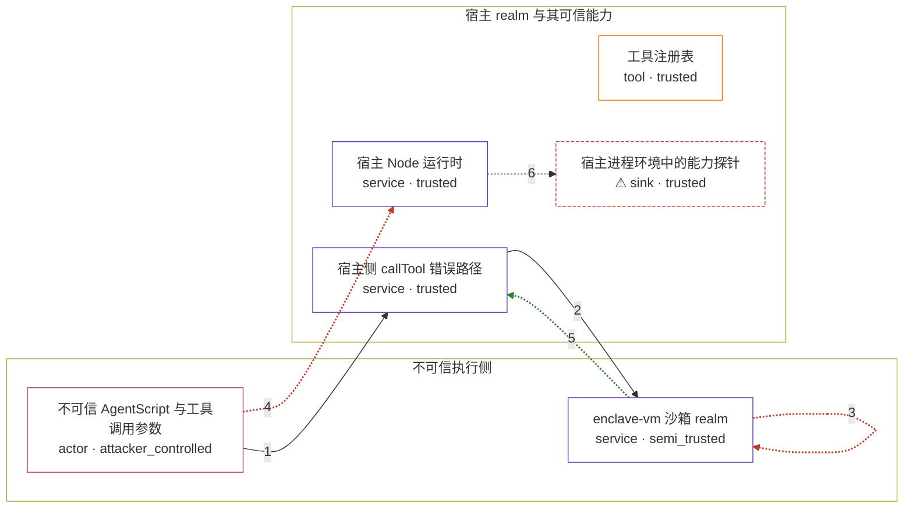

# enclave / CVE-2026-22686

状态：草稿，未完成环境和复现。这个目录由模板生成，不构成漏洞确认。

图解的唯一来源是 `diagram.toml`：编辑后运行 `python3 -m runner diagram enclave/CVE-2026-22686` 重新生成下方的图解区块。图解必须覆盖漏洞涉及的每个主体，并标出漏洞版/修复版的分歧步骤。

<!-- diagram:begin (generated from diagram.toml by `python3 -m runner diagram`; edit diagram.toml, not this block) -->
## 漏洞图解 — enclave 沙箱 callTool 错误对象原型链逃逸

enclave-vm 用 Node vm 上下文隔离不可信 AgentScript，宿主工具调用失败时把宿主 realm 的 Error 对象抛回沙箱。2.6.0 的 createSafeError 只用同名 data property 遮蔽 constructor 与 __proto__，没有切断真实 [[Prototype]]；沙箱代码用原生 __proto__ getter 取出真实原型，就能沿 Error.prototype → 宿主 Error → 宿主 Function 爬到宿主 Function 构造器，在宿主 realm 编译并执行任意代码，读到只有宿主进程才有的能力。2.7.0 在同一个错误工厂里加 Object.setPrototypeOf(error, null)，把这条链彻底切断。

### 涉及主体

| 主体 | 类型 | 信任级别 | 在漏洞里的作用 | 来源 |
| --- | --- | --- | --- | --- |
| 不可信 AgentScript 与工具调用参数 (`sandbox_code`) | `actor` | `attacker_controlled` | 攻击者唯一控制的部分：交给沙箱执行的脚本内容，以及这次 callTool 的工具名和参数。 | fixtures/attack.js |
| enclave-vm 沙箱 realm (`sandbox`) | `service` | `semi_trusted` | 在 Node vm 上下文里执行不可信代码，只把 callTool 的数据结果放行；SecureProxy 拦截常规属性访问，但拦不住沙箱内对已跨边界对象的原生 getter 调用。 | — |
| 宿主侧 callTool 错误路径 (`tool_router`) | `service` | `trusted` | 宿主 realm 的工具路由：工具不存在时抛出宿主 Error；2.6.0 的 createSafeError 包装它时保留真实原型链，2.7.0 把它置空。 | — |
| 工具注册表 (`tool_registry`) | `tool` | `trusted` | 宿主注册的工具集合。触发前提是请求的工具名不在其中，调用因此失败。 | — |
| 宿主 Node 运行时 (`host_runtime`) | `service` | `trusted` | 持有 process 与文件系统等能力；逃逸成功后攻击者代码在这里编译执行，宿主能力就是攻击目标。 | — |
| ⚠ 宿主进程环境中的能力探针 (`host_marker`) | `sink` | `trusted` | 只存在于宿主进程环境里的合成能力值，沙箱本身读不到；只有真正在宿主 realm 执行的代码才能把它取出来。 | — |

**信任边界**

- **不可信执行侧** (`untrusted_side`)：成员 `sandbox_code`、`sandbox`。沙箱只应让数据通过 callTool 边界，任何宿主对象图都不应进入这里。
- **宿主 realm 与其可信能力** (`host_side`)：成员 `tool_router`、`tool_registry`、`host_runtime`、`host_marker`。宿主 realm 与沙箱 realm 之间有原型链隔离；2.6.0 的错误包装没有切断它，于是沙箱拿到了宿主的 Function 构造器。

标 ⚠ 的主体是本仓库合成的替身或无害效果载体，不代表真实外部目标。

### 触发过程

### 主体与信任边界

箭头上的数字是上面的步骤编号；方框只标主体和信任级别，具体动作见「触发过程」。

**分歧点**：第 3 步（`vulnerable_only`）漏洞版只用同名 data property 遮蔽 constructor 与 __proto__，真实原型链仍指向宿主 Error.prototype。
**分歧点**：第 4 步（`vulnerable_only`）沙箱用原生 getter 取出宿主错误的真实原型，逐级爬到宿主 Function 构造器并在宿主 realm 编译执行。
**分歧点**：第 5 步（`patched_only`）修复版在错误工厂里把宿主错误的真实原型置空，同一段沙箱代码读到 null，原型链在此断开。
<!-- diagram:end -->

## 公告与机制

TODO：官方公告、漏洞根因、Agent 信任边界、受影响范围和修复来源。

## 前提

TODO：认证要求、用户交互、已有批准、工具权限、攻击者能控制的内容。

## 版本与启动

TODO：补全 metadata、Dockerfile/镜像 digest 和 Compose，再写出精确启动命令。

Compose 中 `vulnerable` 与 `patched` profiles 分开使用；未指定 profile 不启动服务。镜像变量未配置时 Compose 会明确报错。此模板不暴露宿主端口，也不挂载主机数据。

## 机制复现

TODO：实现 `reproduce.py`，固定输入并执行真实漏洞路径，注明运行位置、参数和超时。

完成实现后使用 `python3 -m runner reproduce enclave/CVE-2026-22686 --build --rounds 3`。
两脚本统一接受 `--context <context.json> --output <目录>`，详细字段见仓库 `docs/environment-contract.md`。
PoC 输出 `facts.json` 和效果文件；验证器只读证据，输出含 `target_ready` 及对应效果断言的 `verdict.json`。
镜像必须包含 Python 3 和 `/lab/` 下的脚本、fixtures；`runtime.mode` 选择 `oneshot` 或有 healthcheck 的 `service`。

## 端到端复现

TODO：实现 `end_to_end.py`；若不需要模型，明确写出不适用原因。真实模型的结果与机制复现分开统计。

## 验证与修复对照

TODO：实现 `verify.py`。记录漏洞版无害效果、修复版阻断和正常任务成功的证据，不能把服务启动失败当成阻断。

## 清理

默认运行器按每个测试的唯一 Compose project 清理容器、网络和 volume。
`--keep-on-failure` 保留失败项目，项目标识和 Compose 配置在结果目录中；仅清理该项目，不能使用全局 prune。

## 失败诊断

TODO：为本漏洞写出预期效果缺失、修复版仍有越界效果、正常任务失败及前提不满足时的具体排查路径。
启动失败、健康检查失败和超时都不能当作修复阻断。报告中应能定位到阶段、预期、实际和受控证据。

## 构建与输入

TODO：填写两版源码 archive、完整 commit，记录 `build.inputs` 中每个下载的 SHA-256；依赖安装必须支持禁网构建。
固定攻击和正常输入放入 `fixtures/` 并登记到 `fixtures/manifest.toml`。固定 seed、环境变量，说明无害效果与真实影响的关系。

## 隔离例外

默认无例外。确需例外时同时填写 `runtime.exceptions`、理由及最小范围，晋升由两位维护者审阅。

## 来源与许可

TODO：列出引用代码、fixtures 和镜像的来源及许可。
