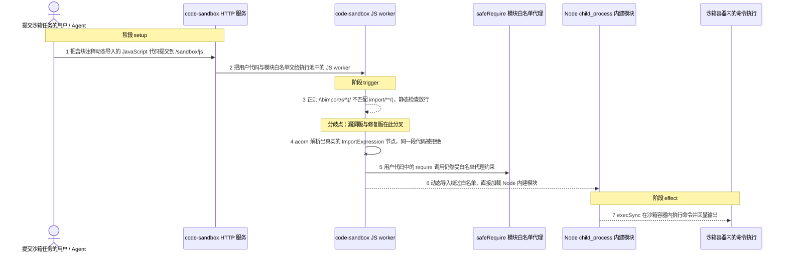
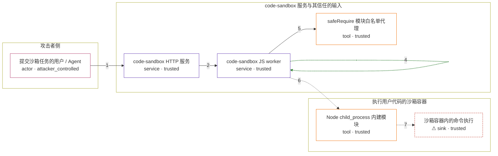

# fastgpt / CVE-2026-44287

状态：草稿，未完成环境和复现。这个目录由模板生成，不构成漏洞确认。

图解的唯一来源是 `diagram.toml`：编辑后运行 `python3 -m runner diagram fastgpt/CVE-2026-44287` 重新生成下方的图解区块。图解必须覆盖漏洞涉及的每个主体，并标出漏洞版/修复版的分歧步骤。

<!-- diagram:begin (generated from diagram.toml by `python3 -m runner diagram`; edit diagram.toml, not this block) -->
## 漏洞图解 — fastgpt / CVE-2026-44287 沙箱动态导入黑名单绕过

FastGPT 的 code-sandbox worker 只用正则 /\bimport\s*\(/ 做一次文本黑名单检查：它允许 import 与括号之间出现空白字符，却不认识块注释，因此 import/**/(...) 躲过检查，同时仍是合法的 ImportExpression。放行之后动态导入不经过 safeRequire 这个只代理 require 的白名单，攻击者由此加载 Node 内建 child_process，在沙箱容器内执行命令，构成沙箱逃逸到 RCE。修复版改为用 acorn 解析 AST，直接匹配真实的 ImportExpression 节点。

### 涉及主体

| 主体 | 类型 | 信任级别 | 在漏洞里的作用 | 来源 |
| --- | --- | --- | --- | --- |
| 提交沙箱任务的用户 / Agent (`attacker`) | `actor` | `attacker_controlled` | 构造并提交一段含块注释动态导入的用户 JavaScript，是整条链上唯一完全可控的输入。 | fixtures/attack_dynamic_import.js |
| code-sandbox HTTP 服务 (`sandbox_api`) | `service` | `trusted` | projects/code-sandbox/src/index.ts 的 POST /sandbox/js 入口，把用户代码与模块白名单转交给执行池。 | projects/code-sandbox/src/index.ts |
| code-sandbox JS worker (`js_worker`) | `service` | `trusted` | worker.ts 先用正则做文本黑名单检查，随后用 new Function 构造并执行用户代码；缺陷就在这次检查。 | — |
| safeRequire 模块白名单代理 (`require_guard`) | `tool` | `trusted` | 只拦截 require 调用的 Proxy；动态导入不经过它，所以它挡不住 import(...) 形式的模块加载。 | — |
| Node child_process 内建模块 (`child_process`) | `tool` | `trusted` | 本应被模块白名单挡住的 Node 内建模块，被绕过的动态导入直接加载，提供 execSync 等命令执行能力。 | — |
| ⚠ 沙箱容器内的命令执行 (`sandbox_shell`) | `sink` | `trusted` | 漏洞触发后 execSync 在沙箱容器内以 sandbox 用户身份执行的命令，回显被记录为无害合成标记，不代表真实外部目标。 | — |

**信任边界**

- **攻击者侧** (`attacker_side`)：成员 `attacker`。攻击者只能控制这次提交的代码文本；它不能直接读写沙箱容器文件，也不能改动 worker 的检查逻辑。
- **code-sandbox 服务与其信任的输入** (`sandbox_service`)：成员 `sandbox_api`、`js_worker`、`require_guard`。这道边界用模块白名单把用户代码限制在允许的依赖内，漏洞让动态导入从白名单旁边绕了过去。
- **执行用户代码的沙箱容器** (`sandbox_container`)：成员 `child_process`、`sandbox_shell`。容器以非 root 用户运行，RCE 的直接影响范围止于容器内部。

标 ⚠ 的主体是本仓库合成的替身或无害效果载体，不代表真实外部目标。

### 触发过程

### 主体与信任边界

箭头上的数字是上面的步骤编号；方框只标主体和信任级别，具体动作见「触发过程」。

**分歧点**：第 3 步（`vulnerable_only`）正则 /\bimport\s*\(/ 不匹配 import/**/(，静态检查放行。
**分歧点**：第 4 步（`patched_only`）acorn 解析出真实的 ImportExpression 节点，同一段代码被拒绝。
<!-- diagram:end -->

## 公告与机制

TODO：官方公告、漏洞根因、Agent 信任边界、受影响范围和修复来源。

## 前提

TODO：认证要求、用户交互、已有批准、工具权限、攻击者能控制的内容。

## 版本与启动

TODO：补全 metadata、Dockerfile/镜像 digest 和 Compose，再写出精确启动命令。

Compose 中 `vulnerable` 与 `patched` profiles 分开使用；未指定 profile 不启动服务。镜像变量未配置时 Compose 会明确报错。此模板不暴露宿主端口，也不挂载主机数据。

## 机制复现

TODO：实现 `reproduce.py`，固定输入并执行真实漏洞路径，注明运行位置、参数和超时。

完成实现后使用 `python3 -m runner reproduce fastgpt/CVE-2026-44287 --build --rounds 3`。
两脚本统一接受 `--context <context.json> --output <目录>`，详细字段见仓库 `docs/environment-contract.md`。
PoC 输出 `facts.json` 和效果文件；验证器只读证据，输出含 `target_ready` 及对应效果断言的 `verdict.json`。
镜像必须包含 Python 3 和 `/lab/` 下的脚本、fixtures；`runtime.mode` 选择 `oneshot` 或有 healthcheck 的 `service`。

## 端到端复现

TODO：实现 `end_to_end.py`；若不需要模型，明确写出不适用原因。真实模型的结果与机制复现分开统计。

## 验证与修复对照

TODO：实现 `verify.py`。记录漏洞版无害效果、修复版阻断和正常任务成功的证据，不能把服务启动失败当成阻断。

## 清理

默认运行器按每个测试的唯一 Compose project 清理容器、网络和 volume。
`--keep-on-failure` 保留失败项目，项目标识和 Compose 配置在结果目录中；仅清理该项目，不能使用全局 prune。

## 失败诊断

TODO：为本漏洞写出预期效果缺失、修复版仍有越界效果、正常任务失败及前提不满足时的具体排查路径。
启动失败、健康检查失败和超时都不能当作修复阻断。报告中应能定位到阶段、预期、实际和受控证据。

## 构建与输入

TODO：填写两版源码 archive、完整 commit，记录 `build.inputs` 中每个下载的 SHA-256；依赖安装必须支持禁网构建。
固定攻击和正常输入放入 `fixtures/` 并登记到 `fixtures/manifest.toml`。固定 seed、环境变量，说明无害效果与真实影响的关系。

## 隔离例外

默认无例外。确需例外时同时填写 `runtime.exceptions`、理由及最小范围，晋升由两位维护者审阅。

## 来源与许可

TODO：列出引用代码、fixtures 和镜像的来源及许可。
