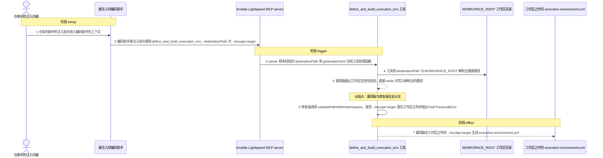
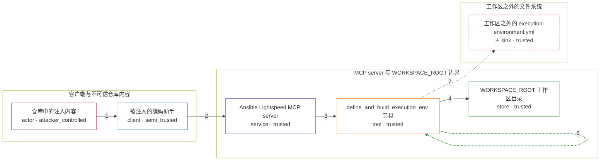

# flaw / CVE-2026-44192

状态：草稿，未完成环境和复现。这个目录由模板生成，不构成漏洞确认。

图解的唯一来源是 `diagram.toml`：编辑后运行 `python3 -m runner diagram flaw/CVE-2026-44192` 重新生成下方的图解区块。图解必须覆盖漏洞涉及的每个主体，并标出漏洞版/修复版的分歧步骤。

<!-- diagram:begin (generated from diagram.toml by `python3 -m runner diagram`; edit diagram.toml, not this block) -->
## 漏洞图解 — Ansible Lightspeed MCP server 路径穿越（CVE-2026-44192）

Ansible Lightspeed MCP server 的 define_and_build_execution_env 工具把调用方给出的 destinationPath 直接当作落盘目录，既不归一化也不判断它是否仍在 WORKSPACE_ROOT 之内。被间接提示注入操纵的编码助手因此可以让 server 用 ../escape-target 逃出工作区，在任意用户可写路径创建目录并写入 execution-environment.yml。修复版在 mkdir 之前调用 validatePathWithinWorkspace，路径解析到工作区之外时抛出 PathTraversalError 并拒绝写入。

### 涉及主体

| 主体 | 类型 | 信任级别 | 在漏洞里的作用 | 来源 |
| --- | --- | --- | --- | --- |
| 仓库中的注入内容 (`poisoned_content`) | `actor` | `attacker_controlled` | 攻击者放进仓库文件的内容。它不直接调用工具，而是通过间接提示注入操纵编码助手，让助手把越界的 destinationPath 填进工具参数。 | — |
| 被注入的编码助手 (`agent`) | `client` | `semi_trusted` | 读取仓库内容并把其中注入的指令转成 MCP 工具参数的调用方。它自己不做路径校验，把不可信输入带进了受信流程。 | — |
| Ansible Lightspeed MCP server (`mcp_server`) | `service` | `trusted` | 以 --stdio 暴露 MCP 工具，并从 WORKSPACE_ROOT 确定工作区根目录。漏洞版本在把参数交给 EE 工具之前没有任何路径约束。 | — |
| define_and_build_execution_env 工具 (`ee_tool`) | `tool` | `trusted` | 接收 destinationPath 与 generatedYaml，负责创建目录并写入 execution-environment.yml。漏洞版本直接使用调用方给出的路径，只把它当作缺省值处理。 | — |
| WORKSPACE_ROOT 工作区目录 (`workspace`) | `store` | `trusted` | 所有落盘路径本应被限制在其中的目录。漏洞版本从不判断 destinationPath 解析后是否仍位于这里。 | — |
| ⚠ 工作区之外的 execution-environment.yml (`outside_file`) | `sink` | `trusted` | 漏洞版本在 ../escape-target 下创建并写入的文件，是攻击者获得的越界写入落点。文件内容只是无害标记，用来证明写操作确实发生在工作区之外。 | — |

**信任边界**

- **客户端与不可信仓库内容** (`client_side`)：成员 `poisoned_content`、`agent`。编码助手会读取不可信仓库内容，但它本身不是攻击者控制的组件。注入内容在这里取得对工具参数的影响力。
- **MCP server 与 WORKSPACE_ROOT 边界** (`workspace_boundary`)：成员 `mcp_server`、`ee_tool`、`workspace`。这道边界要求所有落盘路径位于工作区之内。漏洞版本缺少包含性校验，所以带 ../ 的 destinationPath 可以逃出去。
- **工作区之外的文件系统** (`host_fs`)：成员 `outside_file`。攻击者本来没有写权限的区域。漏洞版本在 mkdir 之前不做校验，于是把文件落到了这里。

标 ⚠ 的主体是本仓库合成的替身或无害效果载体，不代表真实外部目标。

### 触发过程

### 主体与信任边界

箭头上的数字是上面的步骤编号；方框只标主体和信任级别，具体动作见「触发过程」。

**分歧点**：第 5 步（`vulnerable_only`）漏洞版跳过工作区包含性校验，直接 mkdir 并写入解析出的路径。
**分歧点**：第 6 步（`patched_only`）修复版调用 validatePathWithinWorkspace，发现 ../escape-target 落在工作区之外并抛出 PathTraversalError。
<!-- diagram:end -->

## 公告与机制

TODO：官方公告、漏洞根因、Agent 信任边界、受影响范围和修复来源。

## 前提

TODO：认证要求、用户交互、已有批准、工具权限、攻击者能控制的内容。

## 版本与启动

TODO：补全 metadata、Dockerfile/镜像 digest 和 Compose，再写出精确启动命令。

Compose 中 `vulnerable` 与 `patched` profiles 分开使用；未指定 profile 不启动服务。镜像变量未配置时 Compose 会明确报错。此模板不暴露宿主端口，也不挂载主机数据。

## 机制复现

TODO：实现 `reproduce.py`，固定输入并执行真实漏洞路径，注明运行位置、参数和超时。

完成实现后使用 `python3 -m runner reproduce flaw/CVE-2026-44192 --build --rounds 3`。
两脚本统一接受 `--context <context.json> --output <目录>`，详细字段见仓库 `docs/environment-contract.md`。
PoC 输出 `facts.json` 和效果文件；验证器只读证据，输出含 `target_ready` 及对应效果断言的 `verdict.json`。
镜像必须包含 Python 3 和 `/lab/` 下的脚本、fixtures；`runtime.mode` 选择 `oneshot` 或有 healthcheck 的 `service`。

## 端到端复现

TODO：实现 `end_to_end.py`；若不需要模型，明确写出不适用原因。真实模型的结果与机制复现分开统计。

## 验证与修复对照

TODO：实现 `verify.py`。记录漏洞版无害效果、修复版阻断和正常任务成功的证据，不能把服务启动失败当成阻断。

## 清理

默认运行器按每个测试的唯一 Compose project 清理容器、网络和 volume。
`--keep-on-failure` 保留失败项目，项目标识和 Compose 配置在结果目录中；仅清理该项目，不能使用全局 prune。

## 失败诊断

TODO：为本漏洞写出预期效果缺失、修复版仍有越界效果、正常任务失败及前提不满足时的具体排查路径。
启动失败、健康检查失败和超时都不能当作修复阻断。报告中应能定位到阶段、预期、实际和受控证据。

## 构建与输入

TODO：填写两版源码 archive、完整 commit，记录 `build.inputs` 中每个下载的 SHA-256；依赖安装必须支持禁网构建。
固定攻击和正常输入放入 `fixtures/` 并登记到 `fixtures/manifest.toml`。固定 seed、环境变量，说明无害效果与真实影响的关系。

## 隔离例外

默认无例外。确需例外时同时填写 `runtime.exceptions`、理由及最小范围，晋升由两位维护者审阅。

## 来源与许可

TODO：列出引用代码、fixtures 和镜像的来源及许可。
