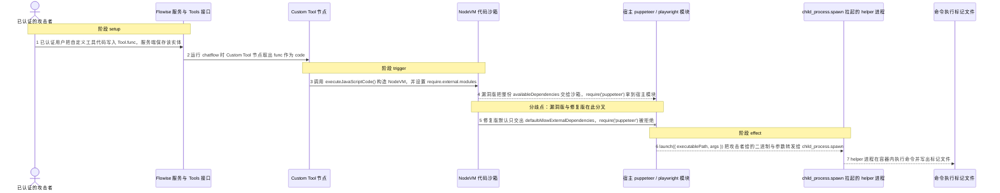

# flowise / CVE-2025-34267

状态：草稿，未完成环境和复现。这个目录由模板生成，不构成漏洞确认。

图解的唯一来源是 `diagram.toml`：编辑后运行 `python3 -m runner diagram flowise/CVE-2025-34267` 重新生成下方的图解区块。图解必须覆盖漏洞涉及的每个主体，并标出漏洞版/修复版的分歧步骤。

<!-- diagram:begin (generated from diagram.toml by `python3 -m runner diagram`; edit diagram.toml, not this block) -->
## 漏洞图解 — flowise / CVE-2025-34267 漏洞图解

Flowise 的 nodevm 代码执行沙箱在构造 NodeVM 时，把整份 availableDependencies 白名单交给 require.external.modules，其中包含 puppeteer 与 playwright。沙箱已把 child_process、fs、process 置空，但这两个宿主模块的 launch() 会把攻击者给出的 executablePath 与 args 原样转交 child_process.spawn。已认证用户因此在服务进程上下文里获得任意命令执行；修复版默认只在 ALLOW_BUILTIN_DEP=true 时才交出该白名单。

### 涉及主体

| 主体 | 类型 | 信任级别 | 在漏洞里的作用 | 来源 |
| --- | --- | --- | --- | --- |
| 已认证的攻击者 (`attacker`) | `actor` | `attacker_controlled` | 通过 Tools 接口提交自定义工具代码，并决定要拉起的二进制路径与参数。 | fixtures/attack/tool_code.js |
| Flowise 服务与 Tools 接口 (`flowise_server`) | `service` | `trusted` | 校验会话后把自定义工具的 func 字段保存为 Tool 实体，并在运行 chatflow 时取出执行；它信任已认证用户提交的代码。 | — |
| Custom Tool 节点 (`custom_tool`) | `service` | `trusted` | 把 Tool.func 映射为 code，调用 executeJavaScriptCode() 并传入 createCodeExecutionSandbox() 构造的沙箱。 | — |
| NodeVM 代码沙箱 (`nodevm_sandbox`) | `service` | `trusted` | 本应把工具代码限制在没有 child_process、fs、process 的隔离环境内；它的 require 白名单却把宿主模块交给沙箱。 | — |
| 宿主 puppeteer / playwright 模块 (`host_modules`) | `tool` | `semi_trusted` | 被 require 后在宿主 node_modules 中真实加载，launch() 把 executablePath 与 args 转发给 child_process.spawn。 | — |
| child_process.spawn 拉起的 helper 进程 (`helper_process`) | `tool` | `semi_trusted` | 以服务进程身份执行攻击者指定的二进制与参数，沙箱对它没有任何约束。 | — |
| ⚠ 命令执行标记文件 (`marker`) | `sink` | `trusted` | 被 helper 进程写入的容器内标记，证明命令确实执行；它是无害效果载体，不是真实外部目标。 | — |

**信任边界**

- **攻击者侧** (`attacker_side`)：成员 `attacker`。攻击者只能控制提交的工具代码与其中的二进制路径、参数，不能直接写宿主文件。
- **产品进程内的沙箱边界** (`product_sandbox`)：成员 `flowise_server`、`custom_tool`、`nodevm_sandbox`。这道边界本应把工具代码挡在 child_process、fs、process 之外；NodeVM 的 require 白名单让宿主模块穿过它。
- **宿主执行环境** (`host_execution`)：成员 `host_modules`、`helper_process`、`marker`。沙箱之外的真实模块与操作系统进程，命令执行效果最终落在这里。

标 ⚠ 的主体是本仓库合成的替身或无害效果载体，不代表真实外部目标。

### 触发过程

### 主体与信任边界

箭头上的数字是上面的步骤编号；方框只标主体和信任级别，具体动作见「触发过程」。

```mermaid
%% flowise / CVE-2025-34267 漏洞图解 — generated from diagram.toml
flowchart LR
  subgraph attacker_side["攻击者侧"]
    attacker["已认证的攻击者<br/>actor · attacker_controlled"]
  end
  subgraph product_sandbox["产品进程内的沙箱边界"]
    flowise_server["Flowise 服务与 Tools 接口<br/>service · trusted"]
    custom_tool["Custom Tool 节点<br/>service · trusted"]
    nodevm_sandbox["NodeVM 代码沙箱<br/>service · trusted"]
  end
  subgraph host_execution["宿主执行环境"]
    host_modules["宿主 puppeteer / playwright 模块<br/>tool · semi_trusted"]
    helper_process["child_process.spawn 拉起的 helper 进程<br/>tool · semi_trusted"]
    marker["命令执行标记文件<br/>⚠ sink · trusted"]
  end
  attacker -->|"1"| flowise_server
  flowise_server -->|"2"| custom_tool
  custom_tool -->|"3"| nodevm_sandbox
  nodevm_sandbox -.->|"4"| host_modules
  nodevm_sandbox -.->|"5"| host_modules
  host_modules -.->|"6"| helper_process
  helper_process -.->|"7"| marker
  classDef actor fill:transparent,stroke:#b03a6a
  classDef client fill:transparent,stroke:#1565c0
  classDef service fill:transparent,stroke:#5e35b1
  classDef tool fill:transparent,stroke:#ef6c00
  classDef sink fill:transparent,stroke:#c0392b
  classDef store fill:transparent,stroke:#2e7d32
  classDef synthetic stroke-dasharray: 4 2
  class attacker actor
  class flowise_server service
  class custom_tool service
  class nodevm_sandbox service
  class host_modules tool
  class helper_process tool
  class marker sink
  class marker synthetic
  style attacker_side fill:transparent
  style product_sandbox fill:transparent
  style host_execution fill:transparent
  linkStyle 3 stroke:#c0392b,stroke-width:2px
  linkStyle 4 stroke:#2e7d32,stroke-width:2px
```

**分歧点**：第 4 步（`vulnerable_only`）漏洞版把整份 availableDependencies 交给沙箱，require('puppeteer') 拿到宿主模块。
**分歧点**：第 5 步（`patched_only`）修复版默认只交出 defaultAllowExternalDependencies，require('puppeteer') 被拒绝。
<!-- diagram:end -->

## 公告与机制

TODO：官方公告、漏洞根因、Agent 信任边界、受影响范围和修复来源。

## 前提

TODO：认证要求、用户交互、已有批准、工具权限、攻击者能控制的内容。

## 版本与启动

TODO：补全 metadata、Dockerfile/镜像 digest 和 Compose，再写出精确启动命令。

Compose 中 `vulnerable` 与 `patched` profiles 分开使用；未指定 profile 不启动服务。镜像变量未配置时 Compose 会明确报错。此模板不暴露宿主端口，也不挂载主机数据。

## 机制复现

TODO：实现 `reproduce.py`，固定输入并执行真实漏洞路径，注明运行位置、参数和超时。

完成实现后使用 `python3 -m runner reproduce flowise/CVE-2025-34267 --build --rounds 3`。
两脚本统一接受 `--context <context.json> --output <目录>`，详细字段见仓库 `docs/environment-contract.md`。
PoC 输出 `facts.json` 和效果文件；验证器只读证据，输出含 `target_ready` 及对应效果断言的 `verdict.json`。
镜像必须包含 Python 3 和 `/lab/` 下的脚本、fixtures；`runtime.mode` 选择 `oneshot` 或有 healthcheck 的 `service`。

## 端到端复现

TODO：实现 `end_to_end.py`；若不需要模型，明确写出不适用原因。真实模型的结果与机制复现分开统计。

## 验证与修复对照

TODO：实现 `verify.py`。记录漏洞版无害效果、修复版阻断和正常任务成功的证据，不能把服务启动失败当成阻断。

## 清理

默认运行器按每个测试的唯一 Compose project 清理容器、网络和 volume。
`--keep-on-failure` 保留失败项目，项目标识和 Compose 配置在结果目录中；仅清理该项目，不能使用全局 prune。

## 失败诊断

TODO：为本漏洞写出预期效果缺失、修复版仍有越界效果、正常任务失败及前提不满足时的具体排查路径。
启动失败、健康检查失败和超时都不能当作修复阻断。报告中应能定位到阶段、预期、实际和受控证据。

## 构建与输入

TODO：填写两版源码 archive、完整 commit，记录 `build.inputs` 中每个下载的 SHA-256；依赖安装必须支持禁网构建。
固定攻击和正常输入放入 `fixtures/` 并登记到 `fixtures/manifest.toml`。固定 seed、环境变量，说明无害效果与真实影响的关系。

## 隔离例外

默认无例外。确需例外时同时填写 `runtime.exceptions`、理由及最小范围，晋升由两位维护者审阅。

## 来源与许可

TODO：列出引用代码、fixtures 和镜像的来源及许可。
