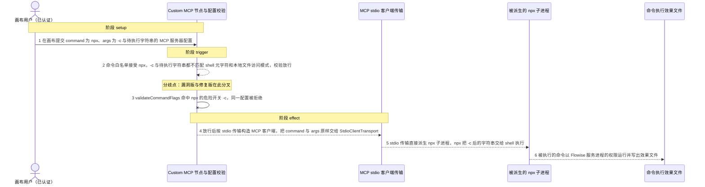
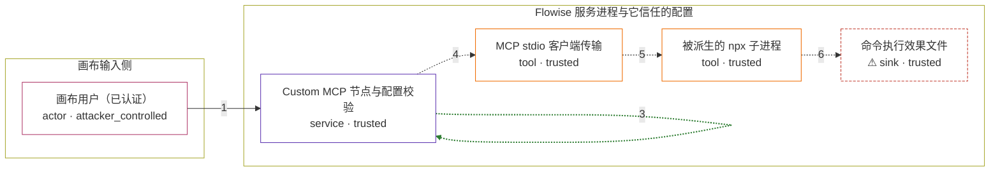

# flowise / CVE-2026-40933

状态：草稿，未完成环境和复现。这个目录由模板生成，不构成漏洞确认。

图解的唯一来源是 `diagram.toml`：编辑后运行 `python3 -m runner diagram flowise/CVE-2026-40933` 重新生成下方的图解区块。图解必须覆盖漏洞涉及的每个主体，并标出漏洞版/修复版的分歧步骤。

<!-- diagram:begin (generated from diagram.toml by `python3 -m runner diagram`; edit diagram.toml, not this block) -->
## 漏洞图解 — flowise / CVE-2026-40933 漏洞图解

Flowise 的画布把已认证用户提交的 MCP 服务器配置转成 stdio 子进程。配置进入进程派生之前只经过一层黑名单校验：命令白名单接受 npx，但校验只看 shell 元字符和本地文件访问模式，从不检查允许命令自身的危险开关。攻击者用 npx 的执行开关 -c 携带一段不含元字符的普通字符串，就能让两道检查同时放行，配置随即被交给 stdio 传输并派生为真实子进程。最终这条命令以 Flowise 服务进程的权限执行，已认证用户因此获得本不该有的任意命令执行能力。

### 涉及主体

| 主体 | 类型 | 信任级别 | 在漏洞里的作用 | 来源 |
| --- | --- | --- | --- | --- |
| 画布用户（已认证） (`attacker`) | `actor` | `attacker_controlled` | 在 Flowise 画布上提交 Custom MCP 节点的服务器配置，只控制这次提交里的 command、args 和 env；它拿不到服务进程的权限，这正是它要绕开校验的原因。 | — |
| Custom MCP 节点与配置校验 (`custom_mcp`) | `service` | `trusted` | 解析画布提交的 MCP 服务器配置并调用 validateMCPServerConfig。该校验只做命令白名单、shell 元字符和本地文件访问模式的黑名单匹配，缺少对允许命令自身危险开关的检查，因此它本来要拦住低信任配置进入进程派生，却漏掉了 npx 的执行开关。 | packages/components/nodes/tools/MCP/core.ts |
| MCP stdio 客户端传输 (`stdio_transport`) | `tool` | `trusted` | 在传输类型为 stdio 时直接用 command 与 args 派生（spawn）子进程，不再做任何二次过滤，是攻击者可控参数变成真实进程的最后一跳。 | @modelcontextprotocol/sdk/client/stdio.js |
| 被派生的 npx 子进程 (`npx_process`) | `tool` | `trusted` | 以 Flowise 服务进程的权限运行；npx 的 -c 开关把它后面的普通字符串交给 shell 执行，于是校验放行的字符串变成真正的命令。 | — |
| ⚠ 命令执行效果文件 (`marker_file`) | `sink` | `trusted` | 被执行的命令在服务进程权限下写出的文件，用来证明任意命令执行确实发生；它只是无害效果载体，不是真实外部目标。 | — |

**信任边界**

- **画布输入侧** (`attacker_side`)：成员 `attacker`。已认证用户只能控制这次提交的 MCP 服务器配置文本，既不能直接写服务进程的文件系统，也不能自己决定以什么权限运行命令。
- **Flowise 服务进程与它信任的配置** (`flowise_runtime`)：成员 `custom_mcp`、`stdio_transport`、`npx_process`、`marker_file`。配置校验是低信任配置进入进程派生前的唯一边界。它只匹配字符与路径，没有按允许命令检查危险开关，因此带 -c 的 npx 配置被当成安全输入放行。

标 ⚠ 的主体是本仓库合成的替身或无害效果载体，不代表真实外部目标。

### 触发过程

### 主体与信任边界

箭头上的数字是上面的步骤编号；方框只标主体和信任级别，具体动作见「触发过程」。

**分歧点**：第 2 步（`vulnerable_only`）命令白名单接受 npx，-c 与待执行字符串都不匹配 shell 元字符和本地文件访问模式，校验放行。
**分歧点**：第 3 步（`patched_only`）validateCommandFlags 命中 npx 的危险开关 -c，同一配置被拒绝。
<!-- diagram:end -->

## 公告与机制

TODO：官方公告、漏洞根因、Agent 信任边界、受影响范围和修复来源。

## 前提

TODO：认证要求、用户交互、已有批准、工具权限、攻击者能控制的内容。

## 版本与启动

TODO：补全 metadata、Dockerfile/镜像 digest 和 Compose，再写出精确启动命令。

Compose 中 `vulnerable` 与 `patched` profiles 分开使用；未指定 profile 不启动服务。镜像变量未配置时 Compose 会明确报错。此模板不暴露宿主端口，也不挂载主机数据。

## 机制复现

TODO：实现 `reproduce.py`，固定输入并执行真实漏洞路径，注明运行位置、参数和超时。

完成实现后使用 `python3 -m runner reproduce flowise/CVE-2026-40933 --build --rounds 3`。
两脚本统一接受 `--context <context.json> --output <目录>`，详细字段见仓库 `docs/environment-contract.md`。
PoC 输出 `facts.json` 和效果文件；验证器只读证据，输出含 `target_ready` 及对应效果断言的 `verdict.json`。
镜像必须包含 Python 3 和 `/lab/` 下的脚本、fixtures；`runtime.mode` 选择 `oneshot` 或有 healthcheck 的 `service`。

## 端到端复现

TODO：实现 `end_to_end.py`；若不需要模型，明确写出不适用原因。真实模型的结果与机制复现分开统计。

## 验证与修复对照

TODO：实现 `verify.py`。记录漏洞版无害效果、修复版阻断和正常任务成功的证据，不能把服务启动失败当成阻断。

## 清理

默认运行器按每个测试的唯一 Compose project 清理容器、网络和 volume。
`--keep-on-failure` 保留失败项目，项目标识和 Compose 配置在结果目录中；仅清理该项目，不能使用全局 prune。

## 失败诊断

TODO：为本漏洞写出预期效果缺失、修复版仍有越界效果、正常任务失败及前提不满足时的具体排查路径。
启动失败、健康检查失败和超时都不能当作修复阻断。报告中应能定位到阶段、预期、实际和受控证据。

## 构建与输入

TODO：填写两版源码 archive、完整 commit，记录 `build.inputs` 中每个下载的 SHA-256；依赖安装必须支持禁网构建。
固定攻击和正常输入放入 `fixtures/` 并登记到 `fixtures/manifest.toml`。固定 seed、环境变量，说明无害效果与真实影响的关系。

## 隔离例外

默认无例外。确需例外时同时填写 `runtime.exceptions`、理由及最小范围，晋升由两位维护者审阅。

## 来源与许可

TODO：列出引用代码、fixtures 和镜像的来源及许可。
