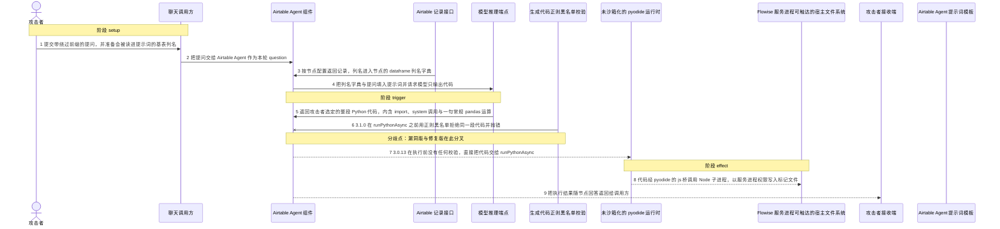
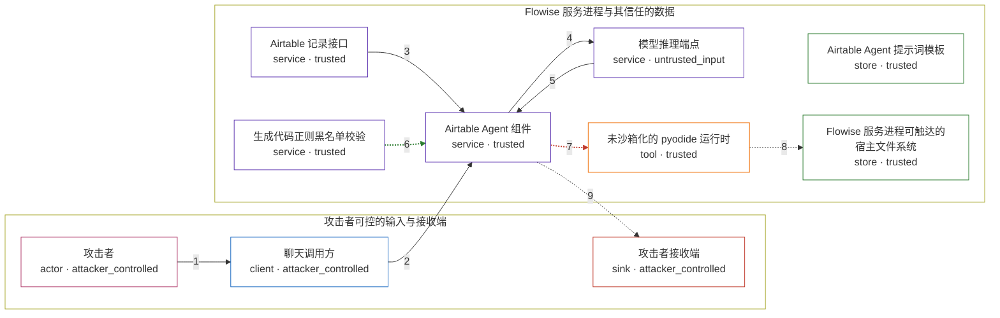

# flowise / CVE-2026-41138

状态：草稿，未完成环境和复现。这个目录由模板生成，不构成漏洞确认。

图解的唯一来源是 `diagram.toml`：编辑后运行 `python3 -m runner diagram flowise/CVE-2026-41138` 重新生成下方的图解区块。图解必须覆盖漏洞涉及的每个主体，并标出漏洞版/修复版的分歧步骤。

<!-- diagram:begin (generated from diagram.toml by `python3 -m runner diagram`; edit diagram.toml, not this block) -->
## 漏洞图解 — flowise / CVE-2026-41138 Airtable Agent 模型输出代码执行

Airtable Agent 把用户提问填进提示词、请求模型只输出 pandas 代码，然后把模型返回的 Python 原样交给同进程的 pyodide 执行：3.0.13 在执行前没有任何机器可执行的校验，提示词里的自然语言约束拦不住被注入的模型。3.1.0 在 runPythonAsync 之前插入 validatePythonCodeForDataFrame() 这道正则黑名单，同一段代码被拒并抛错。被放行的代码以 Flowise 服务进程的权限运行，可经 pyodide 的 js 桥在宿主文件系统写入任意文件。

### 涉及主体

| 主体 | 类型 | 信任级别 | 在漏洞里的作用 | 来源 |
| --- | --- | --- | --- | --- |
| 攻击者 (`attacker`) | `actor` | `attacker_controlled` | 控制聊天入口的提问与 Airtable 基表内容，并让该 chatflow 配置的模型端点返回自己指定的 Python 代码。 | — |
| 聊天调用方 (`chat_caller`) | `client` | `attacker_controlled` | 漏洞前提：POST /api/v1/prediction/{chatflowId} 把攻击者的 question 原样交给 Airtable Agent。 | — |
| Airtable 记录接口 (`airtable_api`) | `service` | `trusted` | 按 baseId/tableId 返回记录；列名随后成为 dataframe 列名字典进入提示词，是攻击者可影响的提示词片段。 | — |
| Airtable Agent 提示词模板 (`prompt_template`) | `store` | `trusted` | 漏洞前提：模板只声明「不要输出解释、只输出代码」这类自然语言约束，没有任何可执行的过滤。 | — |
| 模型推理端点 (`model_endpoint`) | `service` | `untrusted_input` | 按提示词返回待执行代码；被提示词注入说服后，其响应就是攻击者选定的 pythonCode。 | — |
| Airtable Agent 组件 (`agent`) | `service` | `trusted` | 取数、把列名字典与提问填进提示词、调用模型，并把模型返回的代码直接交给 pyodide 执行。 | — |
| 生成代码正则黑名单校验 (`code_gate`) | `service` | `trusted` | 3.1.0 新增：执行前对代码文本做正则黑名单匹配；只匹配源码字面量，不解析语法树，发现禁用字面量即抛错。 | — |
| 未沙箱化的 pyodide 运行时 (`pyodide`) | `tool` | `trusted` | 与 Flowise 同进程的 Python 运行时；没有额外沙箱，pythonCode 以服务进程权限运行并可访问宿主文件系统。 | — |
| Flowise 服务进程可触达的宿主文件系统 (`host_filesystem`) | `store` | `trusted` | 攻击者本来够不着的文件面；注入代码在其中写入标记文件以证明代码执行。 | — |
| 攻击者接收端 (`attacker_receiver`) | `sink` | `attacker_controlled` | 代码执行的返回值随节点回答回到调用方，攻击者在此拿到执行结果。 | — |

**信任边界**

- **攻击者可控的输入与接收端** (`attacker_side`)：成员 `attacker`、`chat_caller`、`attacker_receiver`。攻击者在这里控制提问、基表内容与自己的接收端，但够不着服务进程内的执行结果与宿主文件。
- **Flowise 服务进程与其信任的数据** (`product`)：成员 `airtable_api`、`prompt_template`、`model_endpoint`、`agent`、`code_gate`、`pyodide`、`host_filesystem`。这道边界本应只允许模型输出对 df 的 pandas 运算：提示词约束不是强制手段，3.1.0 之前也没有任何执行前检查，未沙箱化的运行时因此让模型输出变成了服务进程权限下的任意代码。

### 触发过程

### 主体与信任边界

箭头上的数字是上面的步骤编号；方框只标主体和信任级别，具体动作见「触发过程」。

**分歧点**：第 6 步（`patched_only`）3.1.0 在 runPythonAsync 之前用正则黑名单拒绝同一段代码并抛错。
**分歧点**：第 7 步（`vulnerable_only`）3.0.13 在执行前没有任何校验，直接把代码交给 runPythonAsync。
<!-- diagram:end -->

## 公告与机制

TODO：官方公告、漏洞根因、Agent 信任边界、受影响范围和修复来源。

## 前提

TODO：认证要求、用户交互、已有批准、工具权限、攻击者能控制的内容。

## 版本与启动

TODO：补全 metadata、Dockerfile/镜像 digest 和 Compose，再写出精确启动命令。

Compose 中 `vulnerable` 与 `patched` profiles 分开使用；未指定 profile 不启动服务。镜像变量未配置时 Compose 会明确报错。此模板不暴露宿主端口，也不挂载主机数据。

## 机制复现

TODO：实现 `reproduce.py`，固定输入并执行真实漏洞路径，注明运行位置、参数和超时。

完成实现后使用 `python3 -m runner reproduce flowise/CVE-2026-41138 --build --rounds 3`。
两脚本统一接受 `--context <context.json> --output <目录>`，详细字段见仓库 `docs/environment-contract.md`。
PoC 输出 `facts.json` 和效果文件；验证器只读证据，输出含 `target_ready` 及对应效果断言的 `verdict.json`。
镜像必须包含 Python 3 和 `/lab/` 下的脚本、fixtures；`runtime.mode` 选择 `oneshot` 或有 healthcheck 的 `service`。

## 端到端复现

TODO：实现 `end_to_end.py`；若不需要模型，明确写出不适用原因。真实模型的结果与机制复现分开统计。

## 验证与修复对照

TODO：实现 `verify.py`。记录漏洞版无害效果、修复版阻断和正常任务成功的证据，不能把服务启动失败当成阻断。

## 清理

默认运行器按每个测试的唯一 Compose project 清理容器、网络和 volume。
`--keep-on-failure` 保留失败项目，项目标识和 Compose 配置在结果目录中；仅清理该项目，不能使用全局 prune。

## 失败诊断

TODO：为本漏洞写出预期效果缺失、修复版仍有越界效果、正常任务失败及前提不满足时的具体排查路径。
启动失败、健康检查失败和超时都不能当作修复阻断。报告中应能定位到阶段、预期、实际和受控证据。

## 构建与输入

TODO：填写两版源码 archive、完整 commit，记录 `build.inputs` 中每个下载的 SHA-256；依赖安装必须支持禁网构建。
固定攻击和正常输入放入 `fixtures/` 并登记到 `fixtures/manifest.toml`。固定 seed、环境变量，说明无害效果与真实影响的关系。

## 隔离例外

默认无例外。确需例外时同时填写 `runtime.exceptions`、理由及最小范围，晋升由两位维护者审阅。

## 来源与许可

TODO：列出引用代码、fixtures 和镜像的来源及许可。
