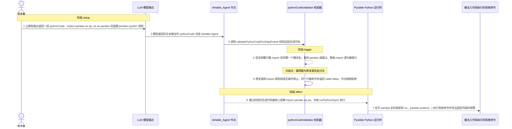
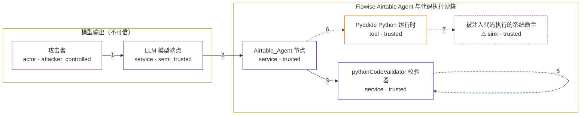

# flowise / CVE-2026-41265

状态：草稿，未完成环境和复现。这个目录由模板生成，不构成漏洞确认。

图解的唯一来源是 `diagram.toml`：编辑后运行 `python3 -m runner diagram flowise/CVE-2026-41265` 重新生成下方的图解区块。图解必须覆盖漏洞涉及的每个主体，并标出漏洞版/修复版的分歧步骤。

<!-- diagram:begin (generated from diagram.toml by `python3 -m runner diagram`; edit diagram.toml, not this block) -->
## 漏洞图解 — flowise / CVE-2026-41265 漏洞图解

Flowise 的 Airtable_Agent 节点把 LLM 生成的 Python 交给 pythonCodeValidator 校验，通过后才在 Pyodide 里执行，这个纯 denylist 校验器是生成代码与代码执行之间唯一的边界。漏洞版把 import 规则写成 /\bimport\s+(?!pandas|numpy\b)/，否定前瞻只看 import 之后的第一个模块名。攻击者用 import pandas as np, os as pandas 让前瞻看到 pandas 而放行，同一语句却把 os 绑定到名字 pandas，随后 pandas.system(...) 实际调用 os.system。越界代码于是进入执行阶段，在 Python 运行时里执行任意系统命令。

### 涉及主体

| 主体 | 类型 | 信任级别 | 在漏洞里的作用 | 来源 |
| --- | --- | --- | --- | --- |
| 攻击者 (`attacker`) | `actor` | `attacker_controlled` | 决定模型端点返回的 Python：可以把自己的模型服务接进 chatflow，也可以用提示词注入引导真实模型输出这段代码。它不能调用校验器，也不能直接执行代码。 | — |
| LLM 模型端点 (`llm_endpoint`) | `service` | `semi_trusted` | 返回 LLM 生成的 pandas 代码。节点把这段文本当作待校验的数据，攻击者通过提示词或自建端点影响它的内容。 | — |
| Airtable_Agent 节点 (`airtable_agent`) | `service` | `trusted` | 把 Airtable 表载入 Pyodide 中的 DataFrame，向模型索取 pandas 代码，校验通过后拼上前奏再交给 runPythonAsync；校验失败则抛错拒绝。 | packages/components/nodes/agents/AirtableAgent/AirtableAgent.ts |
| pythonCodeValidator 校验器 (`code_validator`) | `service` | `trusted` | 生成代码进入执行前唯一的检查点：逐条匹配 denylist 正则，命中就返回 valid=false，未命中返回 valid=true。 | packages/components/src/pythonCodeValidator.ts |
| Pyodide Python 运行时 (`pyodide`) | `tool` | `trusted` | 执行 import pandas as pd 前奏加已通过校验的代码，df 与 pandas、numpy 预置模块处在同一个作用域。 | — |
| ⚠ 被注入代码执行的系统命令 (`exec_effect`) | `sink` | `trusted` | 放行后的代码把 os 绑定到名字 pandas，再由 pandas.system(...) 执行系统命令；这里是无害效果的落点，不是真实的外部目标。 | — |

**信任边界**

- **模型输出（不可信）** (`model_boundary`)：成员 `attacker`、`llm_endpoint`。攻击者能决定的只有模型端点返回的文本；这段文本被节点当作数据带入受信流程，而不是可信代码。
- **Flowise Airtable Agent 与代码执行沙箱** (`flowise_boundary`)：成员 `airtable_agent`、`code_validator`、`pyodide`、`exec_effect`。节点原本靠 pythonCodeValidator 挡住 import、os、subprocess 等构造，再让 Pyodide 只跑 DataFrame 运算；denylist 一旦被绕过，生成代码就直达执行。

标 ⚠ 的主体是本仓库合成的替身或无害效果载体，不代表真实外部目标。

### 触发过程

### 主体与信任边界

箭头上的数字是上面的步骤编号；方框只标主体和信任级别，具体动作见「触发过程」。

**分歧点**：第 4 步（`vulnerable_only`）否定前瞻只看 import 后的第一个模块名，看到 pandas 就跳过，整条 import 语句被放行。
**分歧点**：第 5 步（`patched_only`）修复版把 import 规则改成无条件禁止，同一行被命中并返回 valid=false，节点抛错拒绝。
<!-- diagram:end -->

## 公告与机制

TODO：官方公告、漏洞根因、Agent 信任边界、受影响范围和修复来源。

## 前提

TODO：认证要求、用户交互、已有批准、工具权限、攻击者能控制的内容。

## 版本与启动

TODO：补全 metadata、Dockerfile/镜像 digest 和 Compose，再写出精确启动命令。

Compose 中 `vulnerable` 与 `patched` profiles 分开使用；未指定 profile 不启动服务。镜像变量未配置时 Compose 会明确报错。此模板不暴露宿主端口，也不挂载主机数据。

## 机制复现

`reproduce.py` 调用镜像里固定上游源码的 `validatePythonCodeForDataFrame`（不重写、不抽取校验逻辑），
输入取自 `fixtures/`：

- `attack`：`attack_advisory.py` 是 advisory 与修复提交回归测试逐字引用的绕过输入，只用于断言校验判定，
  不会被执行；`attack_marker.py` 保持同一绕过结构，命令换成写固定内容的 marker。校验器放行后，按
  `Airtable_Agents.run()` 的方式把 `import pandas as pd` 前奏拼在生成代码前并交给执行侧，`os` 被绑定到
  名字 `pandas`，`pandas.system(...)` 写出 `injection_marker.txt`。
- `benign`：`benign_task.py` 对节点载入的 DataFrame 求 `Age` 均值，两版都应放行并得到 `20.0`。

判定与效果写进 `observation.json` / `facts.json`：`cases[]` 记录每个输入的 `valid` 与 `reason`，
`validator` 记录实际加载的文件路径、SHA-256、导入规则以及是否与 variant 期望一致，`sink` 记录受控效果落点。
两版校验器文件（`packages/components/src/pythonCodeValidator.ts`）的 SHA-256 与 `public.md` 里的
vulnerable/fix revision 一一对应，加载到的文件不是期望版本时会被如实记录，不会被当作通过。

镜像侧约定（build 阶段按此实现，否则 PoC 只记 `target_ready=false` 并返回 2）：

- 提供 `node`（`PATH` 或 `AVH_NODE`）。>= 22.7 需要 `--experimental-strip-types`，>= 23.6 默认剥离类型，
  两种调用都会尝试。
- 完整解包对应 variant 的源码归档，保留 `packages/components/` 结构，推荐 `/lab/upstream/<commit>/`。
  `reproduce.py` 会搜索 `/lab`、`/app`、`/src`、`/opt`、`/usr/src` 等根目录，也可用 `AVH_VALIDATOR_SRC`
  直接指定文件；归档仍留在 `/inputs/` 时退回从归档读取，并用固定 SHA-256 区分 vulnerable/patched。
- fixtures 挂到 `/lab/fixtures`（`AVH_FIXTURES` 可覆盖）。
- 不需要安装 pandas/numpy：Pyodide 的执行环境由本地 CPython 加最小 pandas 替身代替，被验证的校验器
  本身始终来自上游源码。

局限：advisory 断言 `os.system` 最终触达宿主 shell，但 Pyodide 的 Node 集成没有在真实运行环境核实；
这里只声明「恶意生成代码通过校验并被执行到系统命令」这一受控效果（写出固定 marker），不声明宿主 RCE。

用 `AVH_ROOT=<staging> python3 -m runner reproduce flowise/CVE-2026-41265 --build --rounds 3` 验收。

## 端到端复现

TODO：实现 `end_to_end.py`；若不需要模型，明确写出不适用原因。真实模型的结果与机制复现分开统计。

## 验证与修复对照

TODO：实现 `verify.py`。记录漏洞版无害效果、修复版阻断和正常任务成功的证据，不能把服务启动失败当成阻断。

## 清理

默认运行器按每个测试的唯一 Compose project 清理容器、网络和 volume。
`--keep-on-failure` 保留失败项目，项目标识和 Compose 配置在结果目录中；仅清理该项目，不能使用全局 prune。

## 失败诊断

TODO：为本漏洞写出预期效果缺失、修复版仍有越界效果、正常任务失败及前提不满足时的具体排查路径。
启动失败、健康检查失败和超时都不能当作修复阻断。报告中应能定位到阶段、预期、实际和受控证据。

## 构建与输入

TODO：填写两版源码 archive、完整 commit，记录 `build.inputs` 中每个下载的 SHA-256；依赖安装必须支持禁网构建。
固定攻击和正常输入放入 `fixtures/` 并登记到 `fixtures/manifest.toml`。固定 seed、环境变量，说明无害效果与真实影响的关系。

## 隔离例外

默认无例外。确需例外时同时填写 `runtime.exceptions`、理由及最小范围，晋升由两位维护者审阅。

## 来源与许可

TODO：列出引用代码、fixtures 和镜像的来源及许可。
