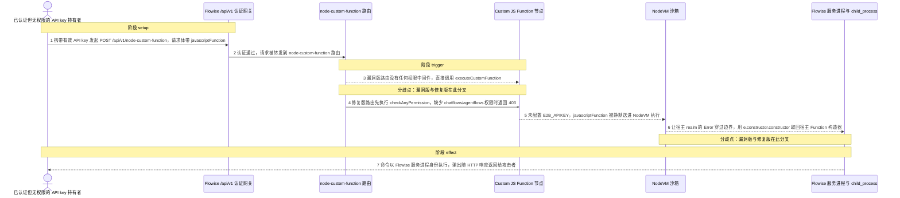

# flowise / CVE-2026-46442

状态：草稿，未完成环境和复现。这个目录由模板生成，不构成漏洞确认。

图解的唯一来源是 `diagram.toml`：编辑后运行 `python3 -m runner diagram flowise/CVE-2026-46442` 重新生成下方的图解区块。图解必须覆盖漏洞涉及的每个主体，并标出漏洞版/修复版的分歧步骤。

<!-- diagram:begin (generated from diagram.toml by `python3 -m runner diagram`; edit diagram.toml, not this block) -->
## 漏洞图解 — flowise / CVE-2026-46442 漏洞图解

Flowise 的 POST /api/v1/node-custom-function 只要求通过 /api/v1 全局认证，路由层没有任何权限中间件，任何有效会话或 API key 都能把任意 JavaScript 送进 CustomFunction 节点。节点在未配置 E2B_APIKEY 时静默回退到 NodeVM，而攻击者可以让宿主 realm 抛出的 Error 穿过沙箱边界，用 e.constructor.constructor 取回宿主 Function 构造器，进而拿到 process 与 child_process。修复版 3.1.2 给同一路由补上 chatflows/agentflows 权限校验，无权限的同一请求被 403 拒绝。

### 涉及主体

| 主体 | 类型 | 信任级别 | 在漏洞里的作用 | 来源 |
| --- | --- | --- | --- | --- |
| 已认证但无权限的 API key 持有者 (`attacker`) | `actor` | `attacker_controlled` | 构造带恶意 javascriptFunction 的请求体，并持有任意一个有效会话或 API key；它拿不到 chatflows:create/update 或 agentflows:create/update 权限，本来不该触达这段代码执行能力。 | fixtures/attack-input.json |
| Flowise /api/v1 认证网关 (`api_server`) | `service` | `trusted` | 对未列入白名单的 /api/v1 路径要求有效凭据，命中 x-request-from: internal 时走 verifyToken，其余走 validateAPIKey；它只做认证，不判断这个凭据能不能执行代码。 | packages/server/src/index.ts |
| node-custom-function 路由 (`function_route`) | `client` | `trusted` | 把 POST 请求交给 executeCustomFunction。3.1.1 只注册了 handler 本身，没有权限中间件；3.1.2 在此处补上 checkAnyPermission('chatflows:create,chatflows:update,agentflows:create,agentflows:update')。 | packages/server/src/routes/node-custom-functions/index.ts |
| Custom JS Function 节点 (`custom_function_node`) | `service` | `trusted` | 把请求体里的 javascriptFunction 原样当作节点要执行的代码，配合 createCodeExecutionSandbox 生成的沙箱变量交给 executeJavaScriptCode，自身不做内容校验。 | packages/components/nodes/utilities/CustomFunction/CustomFunction.ts |
| NodeVM 沙箱 (`nodevm_sandbox`) | `tool` | `trusted` | E2B_APIKEY 未配置时被静默选中的代码执行路径，声明了 eval: false、wasm: false 并 mock 掉 HTTP 客户端，却没拦住异常沿构造器链回到宿主 realm。 | packages/components/src/utils.ts |
| Flowise 服务进程与 child_process (`host_process`) | `sink` | `trusted` | 沙箱逃逸后攻击者所触及的宿主运行时：以服务进程身份执行命令、读环境变量与密钥、读写任意文件。 | packages/components/src/utils.ts |

**信任边界**

- **攻击者侧** (`attacker_side`)：成员 `attacker`。攻击者只控制这一次请求的报文体和一个有效凭据；它不能预先修改 Flowise 的文件、依赖或数据库。
- **全局认证边界 /api/v1** (`auth_boundary`)：成员 `api_server`。这一层只回答凭据是否有效：端点是否在白名单、是否 internal 决定走哪种校验。它对端点具备什么权限不做判断。
- **受影响的 Flowise 服务与它执行的代码** (`product`)：成员 `function_route`、`custom_function_node`、`nodevm_sandbox`、`host_process`。这道边界本该把自定义 JavaScript 限制在沙箱里；缺失的路由授权让任何已认证凭据都能提交代码，NodeVM 的异常路径又把宿主 realm 泄漏进沙箱。

### 触发过程

### 主体与信任边界

箭头上的数字是上面的步骤编号；方框只标主体和信任级别，具体动作见「触发过程」。

```mermaid
%% flowise / CVE-2026-46442 漏洞图解 — generated from diagram.toml
flowchart LR
  subgraph attacker_side["攻击者侧"]
    attacker["已认证但无权限的 API key 持有者<br/>actor · attacker_controlled"]
  end
  subgraph auth_boundary["全局认证边界 /api/v1"]
    api_server["Flowise /api/v1 认证网关<br/>service · trusted"]
  end
  subgraph product["受影响的 Flowise 服务与它执行的代码"]
    function_route["node-custom-function 路由<br/>client · trusted"]
    custom_function_node["Custom JS Function 节点<br/>service · trusted"]
    nodevm_sandbox["NodeVM 沙箱<br/>tool · trusted"]
    host_process["Flowise 服务进程与 child_process<br/>sink · trusted"]
  end
  attacker -->|"1"| api_server
  api_server -->|"2"| function_route
  function_route -.->|"3"| custom_function_node
  function_route -.->|"4"| custom_function_node
  custom_function_node -.->|"5"| nodevm_sandbox
  nodevm_sandbox -.->|"6"| host_process
  host_process -.->|"7"| attacker
  classDef actor fill:transparent,stroke:#b03a6a
  classDef client fill:transparent,stroke:#1565c0
  classDef service fill:transparent,stroke:#5e35b1
  classDef tool fill:transparent,stroke:#ef6c00
  classDef sink fill:transparent,stroke:#c0392b
  classDef store fill:transparent,stroke:#2e7d32
  classDef synthetic stroke-dasharray: 4 2
  class attacker actor
  class api_server service
  class function_route client
  class custom_function_node service
  class nodevm_sandbox tool
  class host_process sink
  style attacker_side fill:transparent
  style auth_boundary fill:transparent
  style product fill:transparent
  linkStyle 2 stroke:#c0392b,stroke-width:2px
  linkStyle 3 stroke:#2e7d32,stroke-width:2px
  linkStyle 5 stroke:#c0392b,stroke-width:2px
```

**分歧点**：第 3 步（`vulnerable_only`）漏洞版路由没有任何权限中间件，直接调用 executeCustomFunction。
**分歧点**：第 6 步（`vulnerable_only`）让宿主 realm 的 Error 穿过边界，用 e.constructor.constructor 取回宿主 Function 构造器。
<!-- diagram:end -->

## 公告与机制

TODO：官方公告、漏洞根因、Agent 信任边界、受影响范围和修复来源。

## 前提

TODO：认证要求、用户交互、已有批准、工具权限、攻击者能控制的内容。

## 版本与启动

TODO：补全 metadata、Dockerfile/镜像 digest 和 Compose，再写出精确启动命令。

Compose 中 `vulnerable` 与 `patched` profiles 分开使用；未指定 profile 不启动服务。镜像变量未配置时 Compose 会明确报错。此模板不暴露宿主端口，也不挂载主机数据。

## 机制复现

TODO：实现 `reproduce.py`，固定输入并执行真实漏洞路径，注明运行位置、参数和超时。

完成实现后使用 `python3 -m runner reproduce flowise/CVE-2026-46442 --build --rounds 3`。
两脚本统一接受 `--context <context.json> --output <目录>`，详细字段见仓库 `docs/environment-contract.md`。
PoC 输出 `facts.json` 和效果文件；验证器只读证据，输出含 `target_ready` 及对应效果断言的 `verdict.json`。
镜像必须包含 Python 3 和 `/lab/` 下的脚本、fixtures；`runtime.mode` 选择 `oneshot` 或有 healthcheck 的 `service`。

## 端到端复现

TODO：实现 `end_to_end.py`；若不需要模型，明确写出不适用原因。真实模型的结果与机制复现分开统计。

## 验证与修复对照

TODO：实现 `verify.py`。记录漏洞版无害效果、修复版阻断和正常任务成功的证据，不能把服务启动失败当成阻断。

## 清理

默认运行器按每个测试的唯一 Compose project 清理容器、网络和 volume。
`--keep-on-failure` 保留失败项目，项目标识和 Compose 配置在结果目录中；仅清理该项目，不能使用全局 prune。

## 失败诊断

TODO：为本漏洞写出预期效果缺失、修复版仍有越界效果、正常任务失败及前提不满足时的具体排查路径。
启动失败、健康检查失败和超时都不能当作修复阻断。报告中应能定位到阶段、预期、实际和受控证据。

## 构建与输入

TODO：填写两版源码 archive、完整 commit，记录 `build.inputs` 中每个下载的 SHA-256；依赖安装必须支持禁网构建。
固定攻击和正常输入放入 `fixtures/` 并登记到 `fixtures/manifest.toml`。固定 seed、环境变量，说明无害效果与真实影响的关系。

## 隔离例外

默认无例外。确需例外时同时填写 `runtime.exceptions`、理由及最小范围，晋升由两位维护者审阅。

## 来源与许可

TODO：列出引用代码、fixtures 和镜像的来源及许可。
