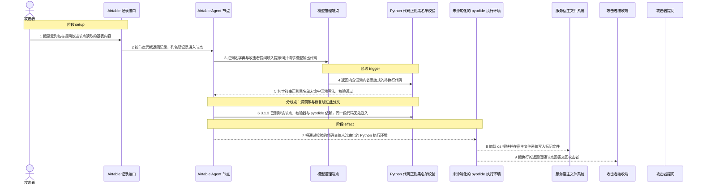
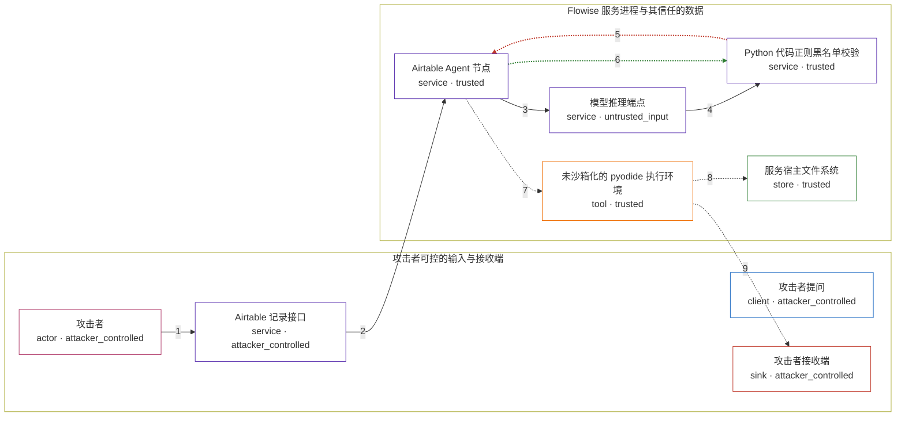

# flowise / CVE-2026-73485

状态：草稿，未完成环境和复现。这个目录由模板生成，不构成漏洞确认。

图解的唯一来源是 `diagram.toml`：编辑后运行 `python3 -m runner diagram flowise/CVE-2026-73485` 重新生成下方的图解区块。图解必须覆盖漏洞涉及的每个主体，并标出漏洞版/修复版的分歧步骤。

<!-- diagram:begin (generated from diagram.toml by `python3 -m runner diagram`; edit diagram.toml, not this block) -->
## 漏洞图解 — flowise / CVE-2026-73485 Airtable Agent 代码注入

Airtable Agent 用纯文本正则黑名单校验模型生成的 Python 代码：黑名单只匹配源码字面量，既不解析语法树，也不做标识符归一化，因此变量赋值、chr() 拼接、字典取值等等价写法都能通过。攻击者可控的 Airtable 列名与提问一起进入提示词，模型返回的代码因此可以携带混淆后的内省表达式，绕过检查后交给未沙箱化的 pyodide 执行。执行成功即取得进程内的 Python 代码执行能力，可加载 os 等任意模块并读写文件；3.1.3 整体删除该节点、校验器与 pyodide 依赖，这条执行路径不再存在。

### 涉及主体

| 主体 | 类型 | 信任级别 | 在漏洞里的作用 | 来源 |
| --- | --- | --- | --- | --- |
| 攻击者 (`attacker`) | `actor` | `attacker_controlled` | 控制 Airtable 基表内容与提问，并让 chatflow 所连的模型端点返回自己指定的 Python 代码。 | — |
| 攻击者提问 (`attacker_prompt`) | `client` | `attacker_controlled` | 漏洞前提：聊天入口把攻击者的提问原样交给 Airtable Agent，用作提示词的 question 部分。 | — |
| Airtable 记录接口 (`airtable_api`) | `service` | `attacker_controlled` | 按 baseId/tableId 返回记录；列名由攻击者决定，随后作为 dataframe 字典进入提示词。 | — |
| 模型推理端点 (`llm`) | `service` | `untrusted_input` | 根据提示词返回待执行代码，其内容决定送入校验器的 pythonCode。 | fixtures/hostile_llm_output.py |
| Airtable Agent 节点 (`agent`) | `service` | `trusted` | 拉取记录、把列名与提问填进提示词、调用模型，并把模型返回的代码交给校验和执行。 | — |
| Python 代码正则黑名单校验 (`validator`) | `service` | `trusted` | 本应拦下危险代码，但只对源码字符串做正则匹配，对变量赋值、chr() 拼接与字典取值无效。 | — |
| 未沙箱化的 pyodide 执行环境 (`pyodide`) | `tool` | `trusted` | 执行通过校验的代码；没有额外沙箱，代码以服务进程权限运行并可访问宿主文件系统。 | — |
| 服务宿主文件系统 (`host_file`) | `store` | `trusted` | 攻击者本来够不着的文件面；注入代码在其中写入标记文件以证明代码执行。 | — |
| 攻击者接收端 (`attacker_receiver`) | `sink` | `attacker_controlled` | 代码执行的返回值随节点回答回到调用方，攻击者在此拿到执行结果。 | — |

**信任边界**

- **攻击者可控的输入与接收端** (`attacker_side`)：成员 `attacker`、`attacker_prompt`、`airtable_api`、`attacker_receiver`。攻击者在这里控制提问、基表内容与自己的接收端，但够不着服务进程内的执行结果与被读写的宿主文件。
- **Flowise 服务进程与其信任的数据** (`product`)：成员 `agent`、`llm`、`validator`、`pyodide`、`host_file`。该边界内的校验器与 pyodide 本应只允许对 df 做 pandas 运算；黑名单被混淆写法绕过，pyodide 又未沙箱化，于是模型返回的代码得以读写边界外的宿主文件。

### 触发过程

### 主体与信任边界

箭头上的数字是上面的步骤编号；方框只标主体和信任级别，具体动作见「触发过程」。

**分歧点**：第 5 步（`vulnerable_only`）纯字符串正则黑名单未命中混淆写法，校验通过。
**分歧点**：第 6 步（`patched_only`）3.1.3 已删除该节点、校验器与 pyodide 依赖，同一段代码无处送入。
<!-- diagram:end -->

## 公告与机制

TODO：官方公告、漏洞根因、Agent 信任边界、受影响范围和修复来源。

## 前提

TODO：认证要求、用户交互、已有批准、工具权限、攻击者能控制的内容。

## 版本与启动

TODO：补全 metadata、Dockerfile/镜像 digest 和 Compose，再写出精确启动命令。

Compose 中 `vulnerable` 与 `patched` profiles 分开使用；未指定 profile 不启动服务。镜像变量未配置时 Compose 会明确报错。此模板不暴露宿主端口，也不挂载主机数据。

## 机制复现

TODO：实现 `reproduce.py`，固定输入并执行真实漏洞路径，注明运行位置、参数和超时。

完成实现后使用 `python3 -m runner reproduce flowise/CVE-2026-73485 --build --rounds 3`。
两脚本统一接受 `--context <context.json> --output <目录>`，详细字段见仓库 `docs/environment-contract.md`。
PoC 输出 `facts.json` 和效果文件；验证器只读证据，输出含 `target_ready` 及对应效果断言的 `verdict.json`。
镜像必须包含 Python 3 和 `/lab/` 下的脚本、fixtures；`runtime.mode` 选择 `oneshot` 或有 healthcheck 的 `service`。

## 端到端复现

TODO：实现 `end_to_end.py`；若不需要模型，明确写出不适用原因。真实模型的结果与机制复现分开统计。

## 验证与修复对照

TODO：实现 `verify.py`。记录漏洞版无害效果、修复版阻断和正常任务成功的证据，不能把服务启动失败当成阻断。

## 清理

默认运行器按每个测试的唯一 Compose project 清理容器、网络和 volume。
`--keep-on-failure` 保留失败项目，项目标识和 Compose 配置在结果目录中；仅清理该项目，不能使用全局 prune。

## 失败诊断

TODO：为本漏洞写出预期效果缺失、修复版仍有越界效果、正常任务失败及前提不满足时的具体排查路径。
启动失败、健康检查失败和超时都不能当作修复阻断。报告中应能定位到阶段、预期、实际和受控证据。

## 构建与输入

TODO：填写两版源码 archive、完整 commit，记录 `build.inputs` 中每个下载的 SHA-256；依赖安装必须支持禁网构建。
固定攻击和正常输入放入 `fixtures/` 并登记到 `fixtures/manifest.toml`。固定 seed、环境变量，说明无害效果与真实影响的关系。

## 隔离例外

默认无例外。确需例外时同时填写 `runtime.exceptions`、理由及最小范围，晋升由两位维护者审阅。

## 来源与许可

TODO：列出引用代码、fixtures 和镜像的来源及许可。
