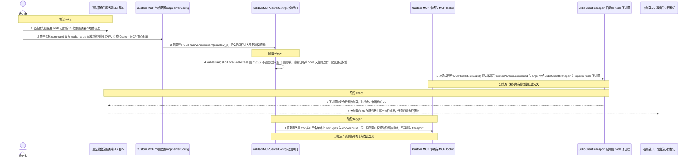
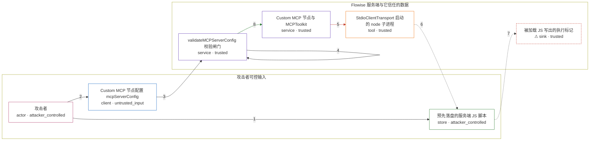

# flowise / GHSA-M99R-2HXC-CP3Q

状态：草稿，未完成环境和复现。这个目录由模板生成，不构成漏洞确认。

图解的唯一来源是 `diagram.toml`：编辑后运行 `python3 -m runner diagram flowise/GHSA-M99R-2HXC-CP3Q` 重新生成下方的图解区块。图解必须覆盖漏洞涉及的每个主体，并标出漏洞版/修复版的分歧步骤。

<!-- diagram:begin (generated from diagram.toml by `python3 -m runner diagram`; edit diagram.toml, not this block) -->
## 漏洞图解 — flowise / GHSA-M99R-2HXC-CP3Q 漏洞图解

Custom MCP 节点的 mcpServerConfig 由任意登录用户或持有 chatflow 更新权限的 API key 提交，服务端只靠 validateMCPServerConfig() 把关。该函数用 /^\/[^/]/ 判断绝对路径，双斜杠开头的路径不被匹配，于是 {"command":"node","args":["//..."]} 通过校验，serverParams 被原样交给 MCP stdio transport 并在 Flowise 主机上真实 spawn 子进程。修复版把正则收紧为 /^\//，并补齐 npx 的 --yes 与 docker 的 build 等黑名单条目，同一输入在校验阶段就被拒绝。

### 涉及主体

| 主体 | 类型 | 信任级别 | 在漏洞里的作用 | 来源 |
| --- | --- | --- | --- | --- |
| 攻击者 (`attacker`) | `actor` | `attacker_controlled` | 拥有任意角色 Flowise 账号或 chatflow view & update API key，负责写入 Custom MCP 节点的 mcpServerConfig。 | — |
| 预先落盘的服务端 JS 脚本 (`uploaded_script`) | `store` | `attacker_controlled` | 攻击者上一步放在服务器本地路径上的 JS 文件；节点配置通过校验后，它就是要被 node 加载执行的内容。 | fixtures/mcp_payload.js |
| Custom MCP 节点配置 mcpServerConfig (`mcp_config`) | `client` | `untrusted_input` | 攻击者提交的 JSON，决定 command 与 args；serverParams.command/args 原样流向 stdio transport。 | fixtures/attack_config.json |
| validateMCPServerConfig 校验闸门 (`config_validator`) | `service` | `trusted` | 唯一把关点：白名单命令、参数本地文件访问、命令注入与危险 flag 检查都集中在这里，双斜杠绝对路径从它的正则缺口漏过。 | — |
| Custom MCP 节点与 MCPToolkit (`mcp_node`) | `service` | `trusted` | getTools() 校验通过后构造 MCPToolkit(serverParams,'stdio') 并 initialize()，把未改写的配置交给 stdio transport。 | — |
| StdioClientTransport 启动的 node 子进程 (`spawned_process`) | `tool` | `trusted` | 在服务器上真实 spawn 出 process.execPath；node 加载攻击者落盘的 JS，漏洞效果在此落地。 | — |
| ⚠ 被加载 JS 写出的执行标记 (`child_effect`) | `sink` | `trusted` | 子进程执行后写下的受控标记，用来证明任意命令确实在服务器上跑过，不代表真实的外部攻击目标。 | — |

**信任边界**

- **攻击者可控输入** (`attacker_side`)：成员 `attacker`、`uploaded_script`、`mcp_config`。攻击者只能控制自己提交的节点配置内容，以及上一步落在服务器上的那个 JS 文件；它无法让校验函数改变判定。
- **Flowise 服务端与它信任的数据** (`server_side`)：成员 `config_validator`、`mcp_node`、`spawned_process`、`child_effect`。这道边界本来只允许白名单命令加载合法 MCP server；校验漏判绝对路径后，同一份配置直接变成服务器上的命令执行。

标 ⚠ 的主体是本仓库合成的替身或无害效果载体，不代表真实外部目标。

### 触发过程

### 主体与信任边界

箭头上的数字是上面的步骤编号；方框只标主体和信任级别，具体动作见「触发过程」。

**分歧点**：第 5 步（`vulnerable_only`）校验放行后 MCPToolkit.initialize() 把未改写的 serverParams.command 与 args 交给 StdioClientTransport 并 spawn node 子进程。
**分歧点**：第 8 步（`patched_only`）修复版改用 /^\// 并在黑名单补上 npx --yes 与 docker build，同一份配置在校验阶段即被拒绝，不再进入 transport。
<!-- diagram:end -->

## 公告与机制

TODO：官方公告、漏洞根因、Agent 信任边界、受影响范围和修复来源。

## 前提

TODO：认证要求、用户交互、已有批准、工具权限、攻击者能控制的内容。

## 版本与启动

TODO：补全 metadata、Dockerfile/镜像 digest 和 Compose，再写出精确启动命令。

Compose 中 `vulnerable` 与 `patched` profiles 分开使用；未指定 profile 不启动服务。镜像变量未配置时 Compose 会明确报错。此模板不暴露宿主端口，也不挂载主机数据。

## 机制复现

TODO：实现 `reproduce.py`，固定输入并执行真实漏洞路径，注明运行位置、参数和超时。

完成实现后使用 `python3 -m runner reproduce flowise/GHSA-M99R-2HXC-CP3Q --build --rounds 3`。
两脚本统一接受 `--context <context.json> --output <目录>`，详细字段见仓库 `docs/environment-contract.md`。
PoC 输出 `facts.json` 和效果文件；验证器只读证据，输出含 `target_ready` 及对应效果断言的 `verdict.json`。
镜像必须包含 Python 3 和 `/lab/` 下的脚本、fixtures；`runtime.mode` 选择 `oneshot` 或有 healthcheck 的 `service`。

## 端到端复现

TODO：实现 `end_to_end.py`；若不需要模型，明确写出不适用原因。真实模型的结果与机制复现分开统计。

## 验证与修复对照

TODO：实现 `verify.py`。记录漏洞版无害效果、修复版阻断和正常任务成功的证据，不能把服务启动失败当成阻断。

## 清理

默认运行器按每个测试的唯一 Compose project 清理容器、网络和 volume。
`--keep-on-failure` 保留失败项目，项目标识和 Compose 配置在结果目录中；仅清理该项目，不能使用全局 prune。

## 失败诊断

TODO：为本漏洞写出预期效果缺失、修复版仍有越界效果、正常任务失败及前提不满足时的具体排查路径。
启动失败、健康检查失败和超时都不能当作修复阻断。报告中应能定位到阶段、预期、实际和受控证据。

## 构建与输入

TODO：填写两版源码 archive、完整 commit，记录 `build.inputs` 中每个下载的 SHA-256；依赖安装必须支持禁网构建。
固定攻击和正常输入放入 `fixtures/` 并登记到 `fixtures/manifest.toml`。固定 seed、环境变量，说明无害效果与真实影响的关系。

## 隔离例外

默认无例外。确需例外时同时填写 `runtime.exceptions`、理由及最小范围，晋升由两位维护者审阅。

## 来源与许可

TODO：列出引用代码、fixtures 和镜像的来源及许可。
