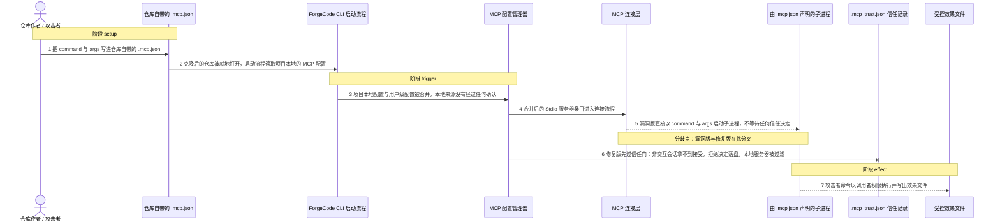

# forgecode / CVE-2026-57860

状态：草稿，未完成环境和复现。这个目录由模板生成，不构成漏洞确认。

图解的唯一来源是 `diagram.toml`：编辑后运行 `python3 -m runner diagram forgecode/CVE-2026-57860` 重新生成下方的图解区块。图解必须覆盖漏洞涉及的每个主体，并标出漏洞版/修复版的分歧步骤。

<!-- diagram:begin (generated from diagram.toml by `python3 -m runner diagram`; edit diagram.toml, not this block) -->
## 漏洞图解 — forgecode / CVE-2026-57860 漏洞图解

ForgeCode 启动时把项目本地的 .mcp.json 与用户级配置无条件合并，Stdio 条目的 command/args 被直接交给连接层，在 MCP 握手之前就 spawn 成子进程。仓库内容因此被当作可信功能纳入执行，绕过“项目本地配置需要用户确认”的信任边界，以调用者权限执行任意命令。修复版为项目本地配置增加交互式信任门，非交互会话下未获接受的本地服务器被过滤，命令不再执行。

### 涉及主体

| 主体 | 类型 | 信任级别 | 在漏洞里的作用 | 来源 |
| --- | --- | --- | --- | --- |
| 仓库作者 / 攻击者 (`attacker`) | `actor` | `attacker_controlled` | 决定仓库自带 .mcp.json 里的 command 与 args，从而决定 ForgeCode 启动时执行什么程序。 | — |
| 仓库自带的 .mcp.json (`repository_config`) | `store` | `untrusted_input` | 项目本地 MCP 配置；command/args 完全由仓库内容提供，随克隆进入工作目录。 | fixtures/attack.mcp.json |
| ForgeCode CLI 启动流程 (`forge_cli`) | `service` | `trusted` | 启动时读取 MCP 配置并请求可用工具，调用链最终落到 MCP 服务层。 | — |
| MCP 配置管理器 (`mcp_manager`) | `service` | `trusted` | 合并用户级与项目本地配置；漏洞版不区分来源，修复版要求项目本地配置先通过信任门。 | — |
| MCP 连接层 (`mcp_connector`) | `service` | `trusted` | 把 Stdio 条目转成子进程；spawn 发生在协议握手之前，握手失败也不会回滚已经启动的进程。 | — |
| 由 .mcp.json 声明的子进程 (`stdio_child`) | `tool` | `attacker_controlled` | 仓库指定的 command/args 被当作 MCP 服务器启动，以调用者权限运行。 | — |
| .mcp_trust.json 信任记录 (`trust_store`) | `store` | `trusted` | 修复版把接受或拒绝的决定落盘；没有接受记录时项目本地服务器被过滤。 | — |
| ⚠ 受控效果文件 (`marker`) | `sink` | `trusted` | 子进程以调用者权限写出的效果文件，用来观测命令是否真的被执行。 | — |

**信任边界**

- **不受信任的克隆仓库** (`untrusted_repository`)：成员 `attacker`、`repository_config`。仓库内容来自外部来源，其中的执行声明属于不受信任输入，不能与用户自己写的配置同等对待。
- **ForgeCode 运行时与它信任的配置** (`forgecode_runtime`)：成员 `forge_cli`、`mcp_manager`、`mcp_connector`、`trust_store`、`stdio_child`。这道边界本应把仓库自带的执行声明挡在信任域之外；漏洞版把它当作可信功能直接纳入执行，子进程因此带着调用者权限出现在信任域内侧。
- 未列入上述边界：`marker`。

标 ⚠ 的主体是本仓库合成的替身或无害效果载体，不代表真实外部目标。

### 触发过程

### 主体与信任边界

箭头上的数字是上面的步骤编号；方框只标主体和信任级别，具体动作见「触发过程」。

```mermaid
%% forgecode / CVE-2026-57860 漏洞图解 — generated from diagram.toml
flowchart LR
  subgraph untrusted_repository["不受信任的克隆仓库"]
    attacker["仓库作者 / 攻击者<br/>actor · attacker_controlled"]
    repository_config["仓库自带的 .mcp.json<br/>store · untrusted_input"]
  end
  subgraph forgecode_runtime["ForgeCode 运行时与它信任的配置"]
    forge_cli["ForgeCode CLI 启动流程<br/>service · trusted"]
    mcp_manager["MCP 配置管理器<br/>service · trusted"]
    mcp_connector["MCP 连接层<br/>service · trusted"]
    trust_store[".mcp_trust.json 信任记录<br/>store · trusted"]
    stdio_child["由 .mcp.json 声明的子进程<br/>tool · attacker_controlled"]
  end
  marker["受控效果文件<br/>⚠ sink · trusted"]
  attacker -->|"1"| repository_config
  repository_config -->|"2"| forge_cli
  forge_cli -->|"3"| mcp_manager
  mcp_manager -->|"4"| mcp_connector
  mcp_connector -.->|"5"| stdio_child
  mcp_manager -.->|"6"| trust_store
  stdio_child -.->|"7"| marker
  classDef actor fill:transparent,stroke:#b03a6a
  classDef client fill:transparent,stroke:#1565c0
  classDef service fill:transparent,stroke:#5e35b1
  classDef tool fill:transparent,stroke:#ef6c00
  classDef sink fill:transparent,stroke:#c0392b
  classDef store fill:transparent,stroke:#2e7d32
  classDef synthetic stroke-dasharray: 4 2
  class attacker actor
  class repository_config store
  class forge_cli service
  class mcp_manager service
  class mcp_connector service
  class stdio_child tool
  class trust_store store
  class marker sink
  class marker synthetic
  style untrusted_repository fill:transparent
  style forgecode_runtime fill:transparent
  linkStyle 4 stroke:#c0392b,stroke-width:2px
  linkStyle 5 stroke:#2e7d32,stroke-width:2px
```

**分歧点**：第 5 步（`vulnerable_only`）漏洞版直接以 command 与 args 启动子进程，不等待任何信任决定。
**分歧点**：第 6 步（`patched_only`）修复版先过信任门：非交互会话拿不到接受，拒绝决定落盘，本地服务器被过滤。
<!-- diagram:end -->

## 公告与机制

公告：GHSA-6P2J-G97C-79WF / CVE-2026-57860（HIGH，CWE-829），产品 ForgeCode（`tailcallhq/forgecode`，npm 包名 `forgecode`）。
公告点名受影响版本 `2.11.1`；本地核对 tag 后，最后一个不含修复的 release 是 `v2.12.16`，第一个含修复的是 `v2.13.0`。

根因与信任边界：`crates/forge_domain/src/env.rs` 的 `mcp_local_config()` 把项目本地配置定义为 `cwd/.mcp.json`，
`crates/forge_services/src/mcp/manager.rs` 的 `read_mcp_config(None)` 把它与用户级 `base_path/.mcp.json` 无条件
`merge`，没有任何信任判断；`crates/forge_services/src/mcp/service.rs` 的 `get_mcp_servers()` → `init_mcp()` →
`update_mcp()` → `connect()` 最终进入 `crates/forge_infra/src/mcp_client.rs` 的 `create_connection()`，对 Stdio
条目执行 `Command::new(command).args(args).spawn()`。spawn 发生在 MCP 握手之前，握手失败只记入 `failed_servers`，
不会回滚已执行的命令。修复提交 `68ca3a3a26c73c38a700453d3d021b5bbdc15dbd`（直接父提交即漏洞修订
`58f9ea0e16e981e5bcdccb61ccc69930a3962cc3`）为项目本地配置引入落盘的交互式信任门：`filter_trusted()` 先过
`apply_trust_gate()`，用户级配置始终隐式信任，项目本地配置未获接受时返回空 `McpConfig` 并 `retain` 掉本地 server。

## 前提

- 攻击者能控制被克隆仓库的内容，包括仓库根目录的 `.mcp.json`（`command`、`args`、`env` 全由该文件提供）。
- 受害者在自己的工作目录里用该仓库启动 ForgeCode；启动流程会在没有任何确认的情况下连接项目本地 MCP server。
- 攻击输入是固定文件（`fixtures/attack.mcp.json`），不是攻击者对宿主机的写权限；本环境不涉及凭据、网络或模型。
- 触发不要求非交互；本环境刻意在非交互会话里运行，因为修复版的信任门在拿不到用户答复时会拒绝本地配置。

## 版本与启动

TODO：补全 metadata、Dockerfile/镜像 digest 和 Compose，再写出精确启动命令。

Compose 中 `vulnerable` 与 `patched` profiles 分开使用；未指定 profile 不启动服务。镜像变量未配置时 Compose 会明确报错。此模板不暴露宿主端口，也不挂载主机数据。

## 机制复现

`reproduce.py` 在容器内直接驱动镜像里由固定修订编出的上游可执行文件 `forge`（`crates/forge_main` 的
`[[bin]] name = "forge"`），不重写也不抽取任何上游函数：

- 准备一个 scratch 工作副本 `<tmp>/untrusted-repository/`、一个 scratch 配置目录 `$FORGE_CONFIG` 和一个
  scratch `$HOME`，把两个受控 marker 清空。
- `attack`：把 `fixtures/attack.mcp.json` 放到工作副本的 `.mcp.json`（local scope），用户级目录留空。
- `benign`：把 `fixtures/benign.mcp.json` 放到 `$FORGE_CONFIG/.mcp.json`（user scope），工作副本留空。
- 两个场景都执行同一条产品命令：`forge list mcp --porcelain`，`cwd` 为工作副本，`stdin` 关闭、`stderr` 非 tty、
  `FORGE_TRACKER=false`。该子命令无必需参数、不需要模型或登录，内部先读 MCP 配置再调用 `get_tools()`，正是
  `get_mcp_servers()` → `connect()` → `spawn()` 的启动链路。
- 观察效果是文件系统状态：子进程写出的 `/tmp/forgecode-mcp-attack.marker`（攻击）或
  `/tmp/forgecode-mcp-benign.marker`（正常）。`reproduce.py` 把 marker 内容、命令、返回码、二进制 SHA-256 与
  发现日志写入 `args.output`，并在 `observation.json` 中显式给出 `target_ready` 与 `execution_status`。

超时：单次 `forge` 调用 180 秒；只有在镜像里找不到 `forge` 时才尝试用镜像内工具链
`cargo build --release --offline -p forge_main` 兜底（上限 3600 秒）。若两版都没装 `forge`，PoC 返回 `not_run`
并说明缺什么，不会伪造效果。

完成实现后使用 `python3 -m runner reproduce forgecode/CVE-2026-57860 --build --rounds 3`。
两脚本统一接受 `--context <context.json> --output <目录>`，详细字段见仓库 `docs/environment-contract.md`。
PoC 输出 `facts.json` 和效果文件；验证器只读证据，输出含 `target_ready` 及对应效果断言的 `verdict.json`。
镜像必须包含 Python 3 和 `/lab/` 下的脚本、fixtures；`runtime.mode` 选择 `oneshot` 或有 healthcheck 的 `service`。

## 端到端复现

TODO：实现 `end_to_end.py`；若不需要模型，明确写出不适用原因。真实模型的结果与机制复现分开统计。

## 验证与修复对照

TODO：实现 `verify.py`。记录漏洞版无害效果、修复版阻断和正常任务成功的证据，不能把服务启动失败当成阻断。

## 清理

默认运行器按每个测试的唯一 Compose project 清理容器、网络和 volume。
`--keep-on-failure` 保留失败项目，项目标识和 Compose 配置在结果目录中；仅清理该项目，不能使用全局 prune。

## 失败诊断

TODO：为本漏洞写出预期效果缺失、修复版仍有越界效果、正常任务失败及前提不满足时的具体排查路径。
启动失败、健康检查失败和超时都不能当作修复阻断。报告中应能定位到阶段、预期、实际和受控证据。

## 构建与输入

TODO：填写两版源码 archive、完整 commit，记录 `build.inputs` 中每个下载的 SHA-256；依赖安装必须支持禁网构建。
固定攻击和正常输入放入 `fixtures/` 并登记到 `fixtures/manifest.toml`。固定 seed、环境变量，说明无害效果与真实影响的关系。

## 隔离例外

默认无例外。确需例外时同时填写 `runtime.exceptions`、理由及最小范围，晋升由两位维护者审阅。

## 来源与许可

TODO：列出引用代码、fixtures 和镜像的来源及许可。
