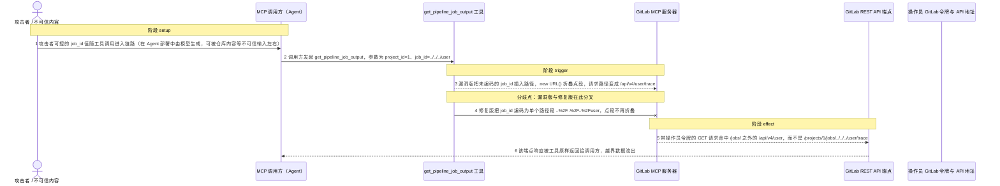
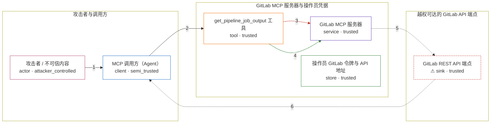

# gitlab-mcp / CVE-2026-61462

状态：草稿，未完成环境和复现。这个目录由模板生成，不构成漏洞确认。

图解的唯一来源是 `diagram.toml`：编辑后运行 `python3 -m runner diagram gitlab-mcp/CVE-2026-61462` 重新生成下方的图解区块。图解必须覆盖漏洞涉及的每个主体，并标出漏洞版/修复版的分歧步骤。

<!-- diagram:begin (generated from diagram.toml by `python3 -m runner diagram`; edit diagram.toml, not this block) -->
## 漏洞图解 — gitlab-mcp / CVE-2026-61462 漏洞图解

get_pipeline_job_output 把 job_id 原样插值进 GitLab REST 路径，只对 project_id 做了编码，因此 job_id 可以携带 ../ 点段。WHATWG URL 会折叠这些点段，把请求从 /projects/<id>/jobs/<job_id>/trace 改写到 /jobs/ 之外的任意 /api/v4 路径，而这次请求仍带着操作员令牌。修复提交把 job_id 编码成单个路径段，点段不再折叠。

### 涉及主体

| 主体 | 类型 | 信任级别 | 在漏洞里的作用 | 来源 |
| --- | --- | --- | --- | --- |
| 攻击者 / 不可信内容 (`attacker`) | `actor` | `attacker_controlled` | 在仓库内容、CI 日志等不可信材料里植入文本，诱导模型把越界的 job_id 写进工具调用参数。它能控制的是参数值，不是 MCP 服务器、操作员凭据或 GitLab 主机。 | — |
| MCP 调用方（Agent） (`caller`) | `client` | `semi_trusted` | 把模型生成的工具调用参数原样转发给 GitLab MCP 服务器，不对 job_id 做路径语义校验，于是不可信内容进入了受信流程。 | — |
| get_pipeline_job_output 工具 (`job_tool`) | `tool` | `trusted` | 工具实现：用 ${api}/projects/{project_id}/jobs/{job_id}/trace 拼接 GitLab REST 路径。project_id 经过编码，job_id 在漏洞版被原样插入路径段。 | zereight/gitlab-mcp index.ts:7292-7330 (v2.1.31) |
| GitLab MCP 服务器 (`mcp_server`) | `service` | `trusted` | 受影响的上游组件：实例化 WHATWG URL 并发起带操作员凭据的请求。点段折叠发生在 new URL() 里，请求路径因此越出 /jobs/ 前缀。 | zereight/gitlab-mcp index.ts:7299-7301 (v2.1.31) |
| 操作员 GitLab 令牌与 API 地址 (`operator_credentials`) | `store` | `trusted` | 服务器环境里的 GITLAB_API_URL 与访问令牌，决定请求的 host 与凭据。攻击者无法改写它们，但越界请求会带着这份权限一起发出，所以影响范围被限制在令牌权限内。 | — |
| ⚠ GitLab REST API 端点 (`gitlab_api`) | `sink` | `trusted` | 漏洞效果落点：请求被改写到 /jobs/ 之外、由操作员令牌授权的任意 GET 端点（如 /api/v4/user）。复现时由无害的本地 HTTP 端点承载，不代表真实 GitLab 实例或真实数据。 | — |

**信任边界**

- **攻击者与调用方** (`agent_side`)：成员 `attacker`、`caller`。攻击面只有模型生成的工具参数 job_id；攻击者不能直接读写 MCP 服务器、操作员凭据或 GitLab 主机。
- **GitLab MCP 服务器与操作员凭据** (`product`)：成员 `job_tool`、`mcp_server`、`operator_credentials`。这个边界本应把请求限制在 /projects/<id>/jobs/<job_id>/trace。job_id 未被编码，点段折叠让请求越出这个前缀，边界失效。
- **越权可达的 GitLab API 端点** (`gitlab_side`)：成员 `gitlab_api`。端点响应只在操作员令牌的权限范围内可见；漏洞把这份权限用在了非预期的端点上。

标 ⚠ 的主体是本仓库合成的替身或无害效果载体，不代表真实外部目标。

### 触发过程

### 主体与信任边界

箭头上的数字是上面的步骤编号；方框只标主体和信任级别，具体动作见「触发过程」。

**分歧点**：第 3 步（`vulnerable_only`）漏洞版把未编码的 job_id 插入路径，new URL() 折叠点段，请求路径变成 /api/v4/user/trace。
**分歧点**：第 4 步（`patched_only`）修复版把 job_id 编码为单个路径段 ..%2F..%2F..%2Fuser，点段不再折叠。
<!-- diagram:end -->

## 公告与机制

TODO：官方公告、漏洞根因、Agent 信任边界、受影响范围和修复来源。

## 前提

TODO：认证要求、用户交互、已有批准、工具权限、攻击者能控制的内容。

## 版本与启动

TODO：补全 metadata、Dockerfile/镜像 digest 和 Compose，再写出精确启动命令。

Compose 中 `vulnerable` 与 `patched` profiles 分开使用；未指定 profile 不启动服务。镜像变量未配置时 Compose 会明确报错。此模板不暴露宿主端口，也不挂载主机数据。

## 机制复现

TODO：实现 `reproduce.py`，固定输入并执行真实漏洞路径，注明运行位置、参数和超时。

完成实现后使用 `python3 -m runner reproduce gitlab-mcp/CVE-2026-61462 --build --rounds 3`。
两脚本统一接受 `--context <context.json> --output <目录>`，详细字段见仓库 `docs/environment-contract.md`。
PoC 输出 `facts.json` 和效果文件；验证器只读证据，输出含 `target_ready` 及对应效果断言的 `verdict.json`。
镜像必须包含 Python 3 和 `/lab/` 下的脚本、fixtures；`runtime.mode` 选择 `oneshot` 或有 healthcheck 的 `service`。

## 端到端复现

TODO：实现 `end_to_end.py`；若不需要模型，明确写出不适用原因。真实模型的结果与机制复现分开统计。

## 验证与修复对照

TODO：实现 `verify.py`。记录漏洞版无害效果、修复版阻断和正常任务成功的证据，不能把服务启动失败当成阻断。

## 清理

默认运行器按每个测试的唯一 Compose project 清理容器、网络和 volume。
`--keep-on-failure` 保留失败项目，项目标识和 Compose 配置在结果目录中；仅清理该项目，不能使用全局 prune。

## 失败诊断

TODO：为本漏洞写出预期效果缺失、修复版仍有越界效果、正常任务失败及前提不满足时的具体排查路径。
启动失败、健康检查失败和超时都不能当作修复阻断。报告中应能定位到阶段、预期、实际和受控证据。

## 构建与输入

TODO：填写两版源码 archive、完整 commit，记录 `build.inputs` 中每个下载的 SHA-256；依赖安装必须支持禁网构建。
固定攻击和正常输入放入 `fixtures/` 并登记到 `fixtures/manifest.toml`。固定 seed、环境变量，说明无害效果与真实影响的关系。

## 隔离例外

默认无例外。确需例外时同时填写 `runtime.exceptions`、理由及最小范围，晋升由两位维护者审阅。

## 来源与许可

TODO：列出引用代码、fixtures 和镜像的来源及许可。
